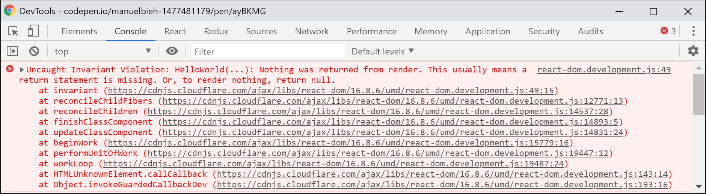

# React lernen und verstehen


# Vorwort

In diesem Buch geht es mir darum einen Einstieg zu ermöglichen, fortgeschrittene Themen aufzugreifen und dabei möglichst React Best-Practices zu vermitteln. Wenn ihr mit dem Buch nicht nur versteht wie etwas funktioniert sondern auch warum, dann habe ich mein Ziel erfüllt. Nun hat jeder Entwickler andere Vorstellungen davon welche Methoden die besten sind und wie man am einfachsten, effizientesten oder schönsten Code schreibt. Allerdings halte ich mich hier stark an die Empfehlungen von den Core-Entwicklern bei Facebook, die die ebenfalls von der Community gut angenommenen Empfehlungen von AirBnB und noch einiger anderer Größen aus der „React-Szene“. Alles gewürzt mit einer Prise eigener Erfahrung.

So gibt es bspw. mehrere Wege wie man seine Anwendung später publiziert, ob man es mit Tools wie **Browserify, Rollup** oder **Webpack** zu einem Bundle packt oder nicht. Ob man seine Komponenten als ES2015-Klassen schreibt oder `createClass` aus „ES5-Zeiten“ verwendet. Dort wo ich es für sinnvoll erachte, werde ich auf die diversen gängigen Methoden eingehen um nicht nur Wege vorzugeben sondern auch Alternativen aufzuzeigen.

Ich möchte hier jedoch primär möglichst auf die modernsten, aktuellsten und in den meisten Fällen auch einfachsten Methoden eingehen, weshalb ich für die meisten Code-Beispiele von einem Setup mit **Webpack**, **Babel** und **ES2015** \(und neuer\) ausgehen werde, das ich im weiteren Verlauf aber noch einmal sehr genau beschreiben werde. Wer zuvor nie mit ES2015+ in Berührung kam wird sicherlich einen Augenblick länger benötigen die Beispiele zu verstehen, ich werde mich indes bemühen alle Beispiele verständlich zu halten und auch auf ES2015+ noch genauer eingehen. JavaScript-Grundkenntnisse sollten jedoch bei der Lektüre vorhanden sein.

Dieses Buch deckt außerdem nur das Thema **Einstieg in React** ab und bietet keinen Einstieg in JavaScript. Grundsätzliche und an einigen wenigen Stellen sicherlich auch etwas tiefergehende Kenntnisse in JavaScript werden daher vorausgesetzt, wobei ich alles möglichst einsteigerfreundlich erkläre, auch wenn man bisher nur einigermaßen oberflächlich mit JavaScript in Kontakt war. Ich setze nicht voraus, dass jeder Leser fehlerfrei erklären kann wie ein JavaScript-Interpreter funktioniert, ich gehe aber sehr wohl davon aus, dass der Leser einigermaßen darüber Bescheid weiß, wie Scopes in JavaScript funktionieren, was ein Callback ist, wie `Promise.then()` und `Promise.catch()` funktionieren und wie das Prinzip asynchroner Programmierung mit JavaScript funktioniert.

**Aber keine Sorge:** das klingt komplizierter als es am Ende eigentlich ist. Jeder Leser der in der Vergangenheit bereits bspw. mit jQuery gearbeitet hat, sollte beim größten Teil dieses Buches keine Verständnisprobleme haben und meinen Erklärungen folgen können.

# Über den Autor

**Manuel Bieh,** seit 2012 als Freelancer im Bereich Frontend-/JavaScript-Entwicklung tätig.

Bevor ich mich dazu entschied als Freelancer zu arbeiten hatte ich ebenfalls bereits fast 10 Jahre Erfahrung als Web-Entwickler, meist mit dem Fokus auf Frontend-Entwicklung, in verschiedenen Unternehmen gesammelt. Lange Zeit habe ich mich eher als Generalist statt als Spezialist gesehen und so gab und gibt es wenige bekannte Frontend-Technologien mit denen ich während meiner beruflichen Laufbahn nicht schon mal zumindest kurz in Berührung gekommen wäre. Als Spezialist habe ich mich aber außer wenn es generell um JavaScript geht nirgendwo gesehen. Dies änderte sich dann schlagartig als mir ein befreundeter Entwickler in 2014 erstmals von React erzählte und ich dann durch Neugierde und ganz konkret durch ein Projekt für Zalando erstmals intensiver mit React in Kontakt kam.

Anfangs fremdelte ich noch etwas, so wie übrigens viele, die neu in React einsteigen, doch je länger und intensiver ich mich mit React auseinandersetzte, desto mehr schlug meine anfängliche Skepsis in Begeisterung um. Seitdem hat mich React so gepackt, dass seitdem meine Projekte allesamt so ausgewählt habe, dass dort React im Einsatz ist \(und dessen Einsatz auch sinnvoll ist!\). In dieser Zeit habe ich viel gelernt \(und lerne auch immer noch jeden Tag dazu\), habe dabei in kleinen Teams mit unter 5 und in recht großen Teams mit über 30 Leuten gearbeitet und dort mein React-Wissen eingebracht und selbst immer wieder neue Eindrücke und Wissen mitgenommen.

Die Komplexität von React ist dabei aber nicht zu unterschätzen. Und so ist es zwar möglich relativ schnell in ziemlich kurzer Zeit eine Anwendung mit React zu entwickeln. Wenn man aber Wert auf hohe Qualität legt gibt es dort viele Stellschrauben an denen man drehen kann um Code-Qualität, Performance und Wartbarkeit zu erhöhen, die teilweise auch Leuten nicht bekannt sind die schon viel und lange mit React entwickelt haben. Und so würde ich mich selbst nach mehrjähriger intensiver und täglicher Arbeit mit React sicher noch immer nicht als absoluten Experten bezeichnen. Aber ich denke, dass mit der Zeit dennoch genug Wissen zusammengekommen ist welches ich in Form dieses Buches weitergeben kann um euch den Einstieg zu erleichtern und auch noch den einen oder anderen Profi-Tipp an die Hand zu geben.

# Einführung

# Allgemeines

## Was ist React eigentlich und was ist es nicht?

Zitieren wir hier an erster Stelle mal die React-Dokumentation, denn die bringen es sehr prägnant auf den Punkt:

> \[React is\] a library for building user interfaces.

Auch wenn die Erklärung sehr kurz ist kann man aus ihr alle essentiellen Dinge ableiten die wichtig sind für die Arbeit mit React und um zu verstehen worum es sich dreht. React ist erst einmal nur eine Library, kein vollständiges Framework mit unzähligen Funktionen mit dem ihr ohne weitere Abhängigkeiten komplexe Web-Anwendungen entwickeln könnt. Und da kommen wir auch schon zum zweiten Teil des Satzes: for building user interfaces.

React ist also erst einmal lediglich eine **Library** die es euch einfach macht **Benutzerinterfaces** zu entwickeln. Keine Services oder Methoden um API-Calls zu machen, keine built-in Models oder ORM. Nur User Interfaces. Sozusagen nur der View-Layer eurer Anwendung. That’s it! In diesem Zusammenhang liest man gelegentlich, dass React das „V“ in **MVC** \(_Model-View-Controller_\) oder **MVVM** \(_Model-View-ViewModel_\) darstellt. Das trifft es in meinen Augen ganz gut.

React bietet einen **deklarativen** Weg um den **Zustand** \(_State_\) eines User Interfaces zu beschreiben. Vereinfacht gesagt bedeutet das, ihr beschreibt mit eurem Code im Grunde explizit wie euer User Interface aussehen soll, abhängig davon in welchem State eine Komponente sich befindet. Einfaches Beispiel zur Veranschaulichung dieses Prinzips: ist ein Benutzer eingeloggt, zeige das Dashboard, ist er es nicht, zeige das Login-Formular.

Die Logik selbst befindet sich dabei komplett im JavaScript-Teil der Anwendung \(dort, wo sie also immer hingehören sollte\) und nicht in den Templates selbst, wie das bei den allermeisten anderen Web-Frameworks die Regel ist. Klingt erst einmal kompliziert, wird aber im weiteren Verlauf immer deutlicher was damit eigentlich gemeint ist.

React arbeitet dabei komponentenbasiert, d.h. man entwickelt gekapselte funktionale Komponenten die beliebig zusammengestellt \(composed\) und wiederverwendet werden können. Erweiterung von Komponenten ist zwar möglich, jedoch sehr unüblich in der React-Welt. Hier wird auch von offizieller Seite das Composition Model propagiert, bei dem mehrere Komponenten zu einem „Gesamtbild“ zusammengefügt werden statt mit Inheritance, also Vererbung zu arbeiten.

Bedeutet das jetzt also, dass ich keine komplexen Web-Anwendungen mit React entwickeln kann? Nein. Absolut nicht. React besitzt ein sehr großes, sehr aktives und zum großen Teil auch sehr hochqualitatives Ecosystem an Libraries, die wiederum auf React basieren, es erweitern oder ergänzen und so zu einem mächtigen Werkzeug werden lassen, das sich hinter großen Frameworks wie Ember oder Angular nicht verstecken braucht. Im Gegenteil. Ist man erst einmal in die Welt des React-Ökosystems eingetaucht und hat sich einen Überblick verschafft, hat man ganz schnell eine Reihe an wirklich guten Tools und Libraries gefunden mit denen man professionelle, super individuelle und hochkomplexe Anwendungen entwickeln kann.

## Wann sollte ich React benutzen und wann nicht?

Insbesondere kurz nachdem React an Fahrt aufnahm wurde oft die Frage gestellt ob die Tage von jQuery nun gezählt sind, ob man nun alles mit React entwickeln kann oder gar soll oder wann der Einsatz von React sinnvoll oder vielleicht auch gar nicht sinnvoll ist.

React ist, wie wir bereits geklärt haben erst einmal eine Library für die Erstellung von User Interfaces. User Interfaces bedeuten immer Interaktion. Und Interaktion geht zwangsweise in den meisten Fällen einher mit State-Management. Ich drücke einen Knopf und ein Dropdown öffnet sich. Ich ändere also den Zustand von _geschlossen_ auf _offen_. Ich gebe Daten in ein Eingabefeld ein und bekomme angezeigt ob meine eingegebenen Daten valide sind. Sind sie es nicht, ändert sich der Zustand des Eingabefeldes von _gültig_ in _ungültig_. Und genau hier kommt React ins Spiel. Habe ich keine Interaktion oder „sich ändernde Daten“ auf meiner Seite weil ich z.B. eine reine statische Image-Seite für ein Unternehmen entwickle, brauche ich _wahrscheinlich_ kein React.

Falsch umgesetzt kann React hier sogar schaden, da auf einer Image-Website oftmals der Content im Vordergrund steht und sofern man seine React-Komponenten nicht bereits serverseitig vorrendert, können die meisten Suchmaschinen mit der Seite erst einmal wenig anfangen. React macht es uns aber glücklicherweise sehr einfach unsere Komponenten serverseitig zu rendern, von daher ist das noch ein Problem welches sich in der Regel leicht beheben lässt.

Habe ich hingegen sehr viel Interaktion und ein Interface das sich oft aktualisiert, wird der Einsatz von React mit ziemlich hoher Wahrscheinlichkeit sehr viel Zeit und Nerven sparen. Grundsätzlich gilt hier die Faustregel: je mehr Interaktion in einer Website oder Web-Anwendung stattfindet und je komplexer diese ist, desto mehr lohnt sich der Einsatz von React. Das griffigste Beispiel sind hier **Single Page Applications** \(_SPA_\), bei denen die Anwendung nur einmal im Browser aufgerufen und initialisiert wird und jegliche weitere Interaktion und Kommunikation mit dem Server über XHR \(den meisten besser bekannt als „AJAX-Requests“\) abläuft.

Ich habe es kürzlich selbst in einem Projekt erlebt, dass ich ein Anmeldeformular entwickeln musste, welches mir ziemlich simpel erschien und ich startete erst einmal ohne React. Im Laufe der Entwicklung stellte sich heraus, dass zum Zwecke besserer Usability immer mehr \(Hintergrund-\)Interaktion nötig wurde. So sollte bspw. nachträglich eine automatische Live-Validierung von Formulardaten eingebaut und der Anmeldeprozess in 2 Schritte unterteilt werden, so dass ich recht zügig dann doch auf React zurückgegriffen habe, weil mir das manuelle State-Management und die **imperative** Veränderung des User Interfaces einfach zu umständlich wurde.

Imperativ bedeutet in dem Fall, dass ich dem Browser sage was er machen soll, wohingegen ich bei _deklarativem_ Code, wie man ihn mit React schreibt, lediglich das gewünschte Endergebnis anhängig vom aktuellen Zustand beschreibe. Eines der Kernprinzipien von React. Um beim Beispiel von oben zu bleiben: statt zu sagen „ich bin nun eingeloggt, lieber Browser, bitte blende nun das Login-Formular aus und zeige mir das Dashboard“, definiere ich zwei Ansichten: So, lieber Browser, soll mein Interface aussehen wenn ich eingeloggt bin \(Dashboard-Ansicht\) und so, wenn ich es nicht bin \(Login-Ansicht\). Welche der Ansichten angezeigt wird entscheidet dann React anhand des Zustands der Komponente.

## Wo hat React seinen Ursprung?

React wurde ursprünglich von bzw. bei **Facebook** entwickelt und später dann, bereits 2013, unter der BSD Lizenz als Open Source der Öffentlichkeit zugänglich gemacht, die nach einigen Protesten in eine MIT-Lizenz geändert wurde. Und so basiert auch ein sehr großer Teil von Facebook auf React. Mittlerweile sollen sich dort sogar über **50.000** eigene Komponenten im Einsatz befinden. Was insofern schön ist, als dass Facebook dadurch natürlich ein großes Interesse an der permanenten Weiterentwicklung hat und man nicht befürchten muss, dass man seine Anwendung auf Basis einer Technologie entwickelt hat die plötzlich nicht mehr weiterentwickelt wird.

Die React Core-Entwickler leisten dabei sehr gute Arbeit darin, die Community frühzeitig in Entscheidungen mit einzubeziehen und mitdiskutieren zu lassen. Eigens dazu gibt es ein Github-Repository mit [React RFCs](https://github.com/reactjs/rfcs) \(„Request for Comments“\), mittels dessen geplante Änderungen frühzeitig zur Diskussion gestellt werden und mittels dessen dem React-Team auch eigene Vorschläge unterbreitet werden können. 

**Breaking Changes**, also Änderungen die nicht abwärtskompatibel sind, folgen einem festen _Deprecation Schema_ und so werden Methoden, Eigenschaften und Funktionen deren Entfernung geplant ist erst einmal für einige Zeit mit aussagekräftigen **Deprecation Warnings** versehen und sogar Tools bereitgestellt, mit denen sich alter Code weitestgehend automatisiert anpassen lässt \([React-Codemod](https://github.com/reactjs/react-codemod)\). React hält sich hier strikt an Semver-Konventionen. 

Dies bedeutet das nur neue Major-Releases \(`16.x.x` auf `17.x.x`\) Breaking Changes enthalten, Minor-Releases \(bspw. `16.2.x` auf `16.3.x`\) enthalten neue Features oder bekommen Deprecation Warnings, die den Entwickler auf kommende Major-Releases vorbereiten während Patch-Releases \(bspw.`16.3.0` auf `16.3.1`\) lediglich Bugfixes beinhalten. 

Vor dem Release von Major oder Minor Releases gibt es regelmäßig auch alpha, beta und rc \(Release Candidate\) Versionen, mit denen man vorab schon einen Blick auf kommende Features werfen kann. Diese sind aber jeweils mit Vorsicht zu genießen, da sich die Funktionsweise neuer Features bis zum endgültigen Release noch ändern könnten.


Dies ist sicher dem Umstand geschuldet, dass eben auch bei Facebook sehr viele React-Komponenten im Einsatz sind und man dort nicht einfach mal eben tiefgreifende Änderungen vornehmen kann ohne Probleme zu verursachen. Die Gedanken und Begründungen der Entwickler lassen sich dabei jederzeit ausführlich im Github Issue-Tracker verfolgen, alle wichtigen Änderungen werden dabei in sog.[ Umbrella-Tickets](https://github.com/facebook/react/issues?utf8=%E2%9C%93&q=is%3Aissue%20is%3Aopen%20umbrella) zusammengefasst.  


# Ab ins kalte Wasser

Nun hatten wir bereits das „Was“, das „Wann“ und das „Wo“. Kommen wir also zum „Wie“ und schreiben unsere erste kleine **React-Komponente**. Neben **React** selbst benötigen wir für die Ausgabe unserer App im Browser auch das Package **ReactDOM** um unsere Anwendung **mounten** zu können, also grob gesagt: im Browser nutzbar zu machen.


Ein sehr minimalistisches Setup um schnell mit React loslegen zu können, sieht wie folgt aus:

```markup
<!DOCTYPE html>
<html>
<head>
<meta charset="UTF-8" />
<title>Hallo React!</title>
</head>
<body>
<div id="app"></div>
<script crossorigin src="https://unpkg.com/react@16.8.4/umd/react.development.js"></script>
<script crossorigin src="https://unpkg.com/react-dom@16.8.4/umd/react-dom.development.js"></script>
<script>
// Platzhalter für unsere erste Komponente
</script>
</body>
</html>
```

Wir erstellen also das Grundgerüst für ein gewöhnliches HTML-Dokument und laden **React** und **ReactDOM** in der jeweils aktuellsten Stable-Version vom unpkg-CDN die uns dann jeweils als globale Variable im `window` Objekt unter `window.React` und `window.ReactDOM` zur Verfügung stehen. Ansonsten sehen wir hier vorerst nur eine leere Seite mit einem \(noch inhaltlosen\) `<div id="app">`. Dieses div nutzen wir gleich als sogenannte **Mount-Node**, um dort unsere erste React-Komponente anzuzeigen.


Sind mehrere React-Komponenten im Spiel redet man üblicherweise von einer **App**, **WebApp** oder **Single Page App**. Die Grenzen ab wann eine Komponente als App bezeichnet wird sind dabei aber fließend. Einige Entwickler reden auch schon bei einer einzigen Komponente von einer App. 
Eine feste Definition gibt es dafür nicht.


Starten wir also klassischerweise mit dem üblichen „Hello World“ Beispiel und setzen das Script an die Stelle an der sich oben der Platzhalter befindet:

```javascript
<script>
class HelloWorld extends React.Component {
  render() {
    return React.createElement('div', {id: 'hello-world'}, 'Hello World');
  }
}
ReactDOM.render(
  React.createElement(HelloWorld), 
  document.getElementById('app')
);
</script>
```

Und damit haben wir bereits die erste einfache React-Komponente implementiert! Setzen wir diesen Code nun an die Stelle unseres Platzhalters aus dem vorangegangenen Code-Snippet. Sehen wir im Browser die folgende Ausgabe:


Sieht für’s Erste einmal gar nicht so kompliziert aus, oder? Gehen wir den Code einmal Schritt für Schritt durch. Die relevanten Stellen im Code habe ich fett hervorgehoben.

```jsx
class HelloWorld 
```


Hier geben wir dem Kind seinen Namen. Unsere Komponente hat in dem Fall den Namen **HelloWorld**. Bei der Namensgebung sind der Fantasie grundsätzlich keine Grenzen gesetzt, doch Achtung: React-Komponenten müssen stets mit einem Großbuchstaben beginnen! So wäre helloWorld also kein gültiger Name für eine Komponente, HELLOWORLD hingegen schon \(wenn auch sehr unüblich\). 

Die gängige Art der Benennung von Komponenten folgt der **UpperCamelCase**-Form. Auch längere, selbsterklärende Namen sind nicht unüblich. So wäre also ein Name wie **UserNotificationView** für eine Komponente keineswegs exotisch.

```jsx
extends React.Component
```

Hier erweitern wir schließlich die React interne Klasse `React.Component` wodurch unsere Klasse erst einmal zu einer Komponente wird die wir in React nutzen können. Neben der `React.Component` gibt es außerdem auch die `React.PureComponent` als Komponenten-Klasse, sowie eine zweite Form, die sogenannte _Stateless Functional Component_. Diese ist lediglich eine JavaScript-Funktion, die einem bestimmten Muster folgt. Beide werden im weiteren Verlauf noch ausführlich beleuchtet und sind an dieser Stelle zum Grundverständnis erst einmal weniger wichtig.

```jsx
render()
```

Unsere Komponente besteht lediglich aus dem einzigen zwingenden Bestandteil einer Komponente, nämlich der `render()`-Methode. Mittels dieser wird React mitgeteilt wie die entsprechende Komponente dargestellt \(sprich: „gerendert“\) werden soll. Eine Komponente hat zwingend einen `return`-Wert. Dieser kann entweder ein explizites `null` sein, um bewusst nichts anzuzeigen \(jedoch nicht `undefined`!\), ein React-Element oder ab Version 16 auch ein Array. 

Im Falle eines Arrays darf dieser Strings, Numbers, React-Elemente oder ebenfalls `null` als Werte enthalten. Die `render()`-Methode dient also dazu **deklarativ** den Zustand unseres Interfaces zu beschreiben. All das, was wir aus ihr per `return` zurückgeben, zeigt uns React beim Render als Ausgabe im Browser an.

Auch wenn man in der Gestaltung seiner JavaScript-Klassen natürlich vollkommen frei ist und dies daher nicht zwingend notwendig ist, so wird die `render()`-Methode der Übersicht halber in der Regel meist als letzte Methode einer Komponente definiert. So wird es z.B. in den Code-Guidelines von AirBnB, dessen Entwickler in der React-Szene sehr aktiv sind, aber auch von vielen anderen bekannten Entwicklern vorgegeben oder zumindest empfohlen. Aus eigener Erfahrung kann ich sagen, dass es die tägliche Arbeit mit React deutlich erleichtert sich an diese Empfehlung zu halten**.**




```jsx
React.createElement()
```

Wie erwähnt gibt die `render()`-Methode einer React-**Komponente** in den meisten Fällen ein React-**Element** zurück. React-Elemente sind sozusagen die kleinsten aber dennoch gleichzeitig auch die wesentlichen Bausteine in einer React-Anwendung und beschreiben, was der Benutzer letztendlich auf seinem Bildschirm sieht. Neben `React.cloneElement()` und `React.isValidElement()` ist `React.createElement()` zudem eine von lediglich 3 Top-Level API-Methoden \(sieht man von mittlerweile veralteten \(_deprecated_\) Methoden einmal ab\).

Die Methode erwartet 1-n Parameter:

1. „Typ“, das können HTML-Elemente als String sein, also bspw. `'div'`, `'span'` oder `'p'` aber auch andere React-Komponenten
2. sog. „Props“, das sind im grundlegenden Sinn schreibgeschützte \(_readonly_\) „Eigenschafts-Objekte“ einer Komponente. Abgeleitet vom engl. _Properties_ eben.
3. sowie beliebig viele Child-Elemente, die selbst wieder React-Elemente, Arrays, Funktionen oder auch einfacher Text sein können. Eine Komponente muss aber nicht zwingend auch Child-Elemente besitzen.

Letztendlich ist ein React-Element unter der Haube nichts weiter als ein unveränderliches \(_immutable_\) JavaScript-Objekt zur Beschreibung von Eigenschaften, die React mitteilen wie etwas \(und was\) dargestellt werden soll. React erstellt nach dieser Beschreibung den sog. **Virtual DOM**. Dieser stellt eine Repräsentation des HTML-Baums in Form eines JavaScript-Objekts dar. Dieser Virtual DOM wird anschließend von React dazu verwendet, um möglichst nur die Teile einer Anwendung zu aktualisieren, in denen auch tatsächlich eine Änderung vorgenommen wurde wenn der Benutzer mit der Anwendung interagiert, Daten verändert oder Events auslöst.

Dadurch, dass React nicht einfach bei jeder State-Änderung die komplette Anwendung neu in den DOM schreibt, was aus Performance-Sicht sehr kostspielig wäre, sondern mittels eines **Reconciliation** \(zu deutsch etwa _„Abgleich“_\) genannten Prozesses zuvor vergleicht was geändert wurde, somit die Schreibvorgänge auf ein Minimum reduziert, wird ein zum Teil enormer Geschwindigkeitsvorteil erreicht gegenüber anderen Frameworks und Libraries die viele DOM-Operationen vornehmen.

Bei der täglichen Arbeit wird man `React.createElement()` jedoch für gewöhnlich niemals in dieser Form aufrufen, da uns **JSX**, eine von Facebook entwickelte Syntax-Erweiterung für JavaScript, diese Arbeit abnehmen und massiv erleichtern wird. Dennoch halte ich es für wichtig von ihrer Existenz zu wissen um zu verstehen wie JSX im Hintergrund arbeitet um so mögliche Fehlerquellen ausschließen zu können.

JSX sieht auf den ersten Blick aus wie HTML bzw. XML/XHTML, jedoch mit deutlich erweitertem Funktionsumfang und der Möglichkeit JavaScript-Ausdrücke darin zu verwenden. JSX ist eine Abstraktion um die Art, wie man React-Elemente erstellt, für den Entwickler **deutlich** zu vereinfachen. So würde unser obiges Beispiel:

```jsx
React.createElement('div', {id: 'hello-world'}, 'Hello World');
```

würde in JSX ganz einfach wie folgt geschrieben werden:

```jsx
<div id="hello-world">Hello World</div>
```

Was für viele Einsteiger in React erst einmal sehr befremdlich wirkt, ich habe in diesem Zusammenhang mal den schönen Begriff **JSX-Schock** gelesen, stellt sich aber nach etwas Rumspielerei jedoch sehr schnell als unglaublich praktisch heraus und ist meines Erachtens einer der wesentlichen Gründe warum React letztendlich so viel an Beliebtheit in so kurzer Zeit gewonnen hat.


Zurück zum Wesentlichen: unsere Komponente bekommt hier also über den `return`-Wert der `render()`-Methode mitgeteilt, dass sie ein Element vom typ `div` mit der id `hello-world` und dem Child-Element \(in dem Fall ein Textknoten\) mit dem Inhalt `Hallo Welt` darstellen soll.

```jsx
ReactDOM.render(Element, Container)
```

Zu guter Letzt kommt mit `ReactDOM` die zweite Library ins Spiel. **ReactDOM** ist zuständig für das Zusammenspiel von React mit dem DOM \(_Document Object Model_\), also oberflächlich ausgedrückt: dem **Web-Browser**. Wie auch schon React selbst besitzt ReactDOM nur sehr wenige Top-Level API-Methoden. Wir konzentrieren uns vorerst mal auf die `render()`-Methode, die sozusagen das Herzstück von ReactDOM im Browser ist.

Trotz der Namensgleichheit hat diese **erst einmal nicht direkt** etwas mit der Methode innerhalb von React-Komponenten zu tun sondern dient lediglich dazu ein React-Element in eine angegebene **„Root-Node“** zu rendern, also stumpf ausgedrückt: anzuzeigen. In unserem Fall wird hier unsere `HelloWorld`-Komponente in das `<div id="app">` gerendert. Die Root-Node wird dabei **nicht ersetzt**, sondern die Komponente wird **innerhalb des Containers** eingesetzt.

**ReactDOM** sorgt also dafür, **dass** wir die angegebene Komponente überhaupt erst einmal im Browser sehen können. **Was** wir dort genau sehen haben wir zuvor in der `render()`-Methode der Komponente über das angegebene React-Element als `return`-Wert beschrieben. Beim Aufruf von `ReactDOM.render()` wird dabei das als ersten Parameter angegebene **React-Element** in den als zweiten Parameter angegebenen **Container** gerendert.


Beim ersten Aufruf der `ReactDOM.render()` Funktion wird sämtlicher möglicherweise vorhandene Inhalt des Ziel-Containers durch den von React ermittelten, darzustellenden Inhalt ersetzt. Bei jedem weiteren Aufruf verwendet React einen internen Vergleichs-Algorithmus für bestmögliche Effizienz, um nicht die komplette Anwendung vollständig neu zu rendern! 


In der Praxis ist das allerdings weniger von Relevanz, da die `ReactDOM.render()` Funktion bei der Erstellung von Single Page Apps üblicherweise nur einmalig ausgeführt wird, für gewöhnlich beim Laden einer Seite. React verändert dabei auch niemals den Ziel-Container selbst, sondern lediglich dessen Inhalt. Besitzt das Container-Element also eigene Attribute wie  Klassen, IDs oder data-Attribute bleiben diese auch nach dem Aufruf von `ReactDOM.render()` erhalten.


Damit ist das generelle Funktionsprinzip von React erst einmal erklärt, unsere erste Komponente ist implementiert und im Browser zu sehen!

# Tools und Setup

## Tools

Um störungsfrei und komfortabel mit React arbeiten zu können sollten einige Bedingungen erfüllt sein. Nicht alles davon ist **zwingend** notwendig, es erleichtert das Entwicklerleben jedoch ungemein, weswegen ich dennoch **dringend** dazu rate und auch bei allen folgenden Beispielen davon ausgehen werde, dass ihr diese Tools installiert habt:

### Node.js und npm

Node werden die meisten möglicherweise als „serverseitiges JavaScript“ kennen, das ist allerdings nicht die ganze Wahrheit. In erster Linie ist **Node** einmal eine **JavaScript-Laufzeitumgebung**, die sich eben hervorragend für Netzwerkanwendungen eignet, also klassische Webserver. Darüber hinaus bringt **Node** auch ein Tool zur Paketverwaltung mit, nämlich **npm**, mit dem sich spielend einfach neue JavaScript-Libraries auf dem eigenen Rechner installieren lassen. Außerdem lassen sich auch eigene Kommandozeilen-Scripts damit schreiben und ausführen, was sich später noch als sehr praktisch erweisen wird.

Statt Node direkt zu installieren, empfehle ich [**nvm**](https://github.com/creationix/nvm) \(Node Version Manager\) für Mac und Linux bzw. [**nvm-windows**](https://github.com/coreybutler/nvm-windows) für Windows. Nvm hat den Vorteil, dass es einerseits keine Admin-Rechte benötigt um Packages global zu installieren und man andererseits mit einem simplen Befehl auf der Kommandozeile \(`nvm install [version]`\) die auf dem System installierte Version aktualisieren kann. Für einer Liste aller verfügbaren Version kannst du ganz einfach `nvm ls-remote` \(Mac/Linux\) bzw. `nvm list available` \(Windows\) benutzen. Ich empfehle im weiteren Verlaufe dieses Buch die aktuelle LTS \(Long Term Support\) Version zu benutzen. LTS Versionen sind stabile Versionen die auch längere Zeit Updates erhalten.

### Yarn

Während **Node** mit **npm** bereits einen guten und soliden Package-Manager mitbringt, geht **yarn** noch ein Stück weiter, bietet besseres caching, dadurch auch bessere Performance, einfachere Kommandos und kommt darüber hinaus, wie React, ebenfalls aus dem Hause Facebook und wurde dort entwickelt u.a. um die Arbeit mit React noch etwas angenehmer zu gestalten. Während alles, was hier im weiteren Verlauf des Buches beschrieben wird, auch mit **npm** ausgeführt werden kann, würde ich dennoch empfehlen **Yarn** zu installieren, da dies gerade in React-Kreisen mehr und mehr an Gewicht gewinnt, insbesondere wegen seiner Einfachheit und seiner verbesserten Performance ggü. **npm**. Sind **Node** und **npm** erst einmal installiert, lässt sich **yarn** als globales Package über **npm** installieren:

```bash
npm install --global yarn
```

oder einfach kurz:

```bash
npm i -g yarn
```

Wir haben gerade außerdem unser erstes Package installiert. Easy! Das Commandline-Flag `--global` \(bzw. `-g`\) sorgt dabei dafür, dass die `yarn` Executable global installiert wird und von überall auf eurem Gerät auf der Kommandozeile ausgeführt werden kann.

### Babel

Babel ist ein Tool, das für gewöhnlich lediglich als Dependency \(Abhängigkeit\) und für gewöhnlich als npm-Paket in React basierten Projekten zum Einsatz kommt und an dieser Stelle nicht explizit installiert werden muss. Babel erlaubt es nicht oder _noch_-nicht standardkonformen oder noch nicht von allen gängigen Browsern unterstützten JavaScript-Code in interpretierbaren und ausführbaren Code zu _transpilieren_.


**Transpilieren** \(engl. _transpiling_\) nennt man einen Prozess, bei dem der Sourcecode von einer Sprache in ein entsprechendes funktional identisches Gegenstück einer anderen Sprache umgewandelt wird. In unserem Fall eben von JSX oder ES2015+ in valides, ausführbares und vom Browser unterstütztes JavaScript.


Babel besteht aus einem Core-Modul \(`@babel/core`\) das lediglich einige APIs bereitstellt, die dann von **Plugins** für das entsprechende Transpiling verwendet werden. Diese Plugins werden oft zu sog. **Presets** zusammengefasst, die dann wiederum mehrere Plugins gleichzeitig installieren. Die in React basierten Projekten üblichsten Presets sind `@babel/preset-react` \(um JSX zu lesen und zu übersetzen\) und `@babel/preset-env`, welches abhängig von einer Ziel-Umgebung modernes JavaScript so umschreibt, dass es eben auch ältere Browser verstehen.

Das @-Zeichen vor dem Namen bedeutet dabei, dass es sich um eine Organisation innerhalb der npm Registry \(dem npm-Paketverzeichnis\) handelt und kann als eine Art Namespace betrachtet werden. Im Fall von Babel findet man dort die offiziellen Pakete die von den Babel-Maintainern dort veröffentlich werden. Bevor Babel in der Version 7 erschien gab es diese Organisation noch nicht und die Pakete wurden mit einem Bindestrich im Namen getrennt. So hieß `@babel/preset-react` eben `babel-preset-react`, `@babel/core` war `babel-core` usw. Also nicht verwirren lassen, sollte euch in einem Projekt mal `babel-core` statt `@babel/core` begegnen. In diesem Fall handelt es sich also einfach um Babel 6 \(oder eine ältere Version\). Allerdings kommt es gelegentlich vor, dass Entwickler deren Plugins oder Presets nicht offizieller Teil von Babel sind, diese ebenfalls mit `babel-` prefixen während die Pakete dennoch mit Babel 7 arbeiten. Hier hilft in der Regel nur ein Blick in die Readme des jeweiligen Pakets.

Die Presets, die ich bei der Arbeit mit React verwende \(und gleichzeitig auch empfehle\) sind:

* `@babel/preset-env`
* `@babel/preset-react`
* `@babel/plugin-proposal-object-rest-spread` 
* `@babel/plugin-proposal-class-properties` 
* `@babel/plugin-syntax-dynamic-import` 

Wer mit Flow oder TypeScript als statischen Type Checkern arbeiten möchte benötigt darüber hinaus noch `@babel/preset-flow` für Flow bzw. `@babel/preset-typescript` für TypeScript. 

Installiert werden alle erwähnten Pakete via `yarn add --dev [paket]` bzw `npm install --save-dev [paket]`. 

### Webpack

Webpack ist ebenfalls eins der zentralen Tools im React-Ecosystem ohne das ein effizentes Arbeiten mit React kaum möglich oder zumindest deutlich umständlicher wäre. Hier handelt es sich um einen sog. **Module-Bundler**, der Modul basierte Entwicklung, wie sie manch einer vielleicht bereits aus NodeJS kennen mag, in den Browser bringt. Dadurch wird es ermöglicht Anwendungscode übersichtlich in einzelnen Files zu verteilen, die jeweils ihre Abhängigkeiten über `import` oder `require()` in ihren eigenen **Module-Scope** laden und damit innerhalb des Moduls verfügbar machen. Am Ende fällt dann nur noch eine einzelne JavaScript-Datei heraus \(auf Wunsch auch mehrere\), so dass nicht mehr jede einzelne unserer Komponenten, und das können schnell mal über 100 werden, einzeln über `<script src="..."></script>` im HTML eingebunden werden muss.

Wow. Klingt unfassbar kompliziert, passiert aber nach einigen wenigen Beispielen nahezu intuitiv von ganz allein und hat man sich erst einmal daran gewöhnt, wird man sich fragen wie man jemals ohne Module-Bundler arbeiten konnte.

Neben dem Module-Bundling selbst kann **Webpack** auch beigebracht werden Dateien mit JSX durch Babel in JavaScript zu transpilieren, Bilder, Stylesheets oder andere Assets in einen build-Ordner zu kopieren der später auf einen Server deployed wird und viele andere Dinge. Wie eine solche Konfiguration aussehen kann beleuchten wir später noch einmal genau, weshalb das Webpack Kommandozeilen-Tool auch an dieser Stelle noch nicht installiert werden muss.

### ESLint

ESLint ist ein sehr praktisches Tool zur statischen Code-Analyse. Es soll in erster Linie dazu dienen um Fehler im Programmcode zu erkennen, kann aber auch dazu genutzt werden um bspw. konsistente Regeln beim Codestil durchzusetzen oder dem Entwickler Hinweise für Optimierungsmöglichkeiten während des Entwickelns zu geben. ESLint bezeichnet sich selbst als „pluggable linting utility“, verspricht also besonderen Wert auf Erweiterbarkeit zu legen. Und so gibt es in der Tat allerhand nützliche Plugins für diverse Tools, Laufzeitumgebungen und Frameworks.

Im professionellen Umfeld aber auch in den meisten Open Source Projekten ist eine ESLint-Konfiguration mittlerweile üblich und nicht mehr wegzudenken. In React-Projekten haben sich insbesondere die ESLint-Plugins `eslint-plugin-react`, `eslint-plugin-babel` und `eslint-plugin-react-hooks` als solide Basis erwiesen.

Bei der Einrichtung entsprechender IDE-Plugins erscheinen dann deutlich sichtbare Warnungen an den Stellen, wo mit dem Code augenscheinlich etwas nicht gemäß den definierten Regeln abläuft:


### IDE-/Editor-Plugins

Alle bekannten Editoren und IDEs wie bspw. Webstorm, Atom, Visual Studio Code oder Sublime \(aber auch so ziemlich jeder andere moderne Editor oder IDE\) bietet Plugins oder inzwischen sogar bereits nativ integrierte Funktionen für die bessere Unterstützung für **React** und **JSX**. Hier rate ich dringend zur Installation dieser Plugins, da diese in der Regel für deutlich besseres Syntax-Highlighting sorgen, teilweise Code-Vervollständigung und andere Nettigkeiten bieten. 

In Atom ist das etwa [language-babel](https://atom.io/packages/language-babel), in VS Code gibt es hier u.a. [Babel ES6/ES7](https://marketplace.visualstudio.com/items?itemName=dzannotti.vscode-babel-coloring) und in Sublime lohnt sich in Blick auf [babel-sublime](https://github.com/babel/babel-sublime). Nutzt ihr Webstorm, habt ihr seit Version 10 native Unterstützung für React Syntax-Highlighting. Auch Plugins für das eben erwähnte ESLint sind überaus sinnvoll. Dazu am Besten im Plugin-Manager eurer IDE oder eures Editors einfach nach ESLint suchen und das Plugin mit den meisten Installationen auswählen. Dies ist für gewöhnlich jeweils das offizielle ESLint-Plugin.

### Browser-Plugins

Für den Browser empfehle ich dringend jeweils die React-Devtools für [Chrome](https://chrome.google.com/webstore/detail/react-developer-tools/fmkadmapgofadopljbjfkapdkoienihi) und [Firefox](https://addons.mozilla.org/de/firefox/addon/react-devtools/) zu installieren, für den späteren Verlauf außerdem die Redux-Devtools für beide Browser \([Chrome](https://chrome.google.com/webstore/detail/redux-devtools/lmhkpmbekcpmknklioeibfkpmmfibljd), [Firefox](https://addons.mozilla.org/de/firefox/addon/remotedev/?)\). Die Devtools fügen sich nahtlos als neuer Tab in die bestehenden Browser-Devtools ein und bieten einen enormen Mehrwert beim Debugging von React-Komponenten.


So lässt sich bspw. der State direkt im Browser manipulieren und die Auswirkungen live beobachten. Ich würde soweit gehen und behaupten, dass ein effizientes Debugging ohne die Devtools-Erweiterungen kaum oder sogar gar nicht möglich ist.

## Zero Config Setup

Manch einer hat in der Vergangenheit darüber gescherzt, dass man gut und gerne Tage damit verbringen kann ein Setup aufzusetzen bevor man die erste Zeile Code schreibt. Und in der Tat: ein ordentliches Setup ist wichtig, bestimmt es doch ein Stück weit auch die Qualität und Wartbarkeit der Anwendung, die man auf Basis seines Setups entwickelt.

Hier hat die große React-Community aber bereits sehr gute Vorarbeit geleistet. Und so listet die Seite JavaScriptStuff aktuell **189 Projekte** in der Rubrik [**React Starter Projects**](https://www.javascriptstuff.com/react-starter-projects/). Auch Facebook selbst, bzw. konkret **Dan Abramov**, Core-Entwickler bei Facebook und Autor von **Redux**, ist dort mit **Create-React-App** \(„CRA“\) vertreten. Das Projekt ist mit über 45.000 Stars auf Github mittlerweile so etwas wie der de-facto Standard wenn es um React Starter Projekte geht und beschreibt sich auf Github selbst mit:

> Create React apps with no build configuration

Und in der Tat, **Create React App** macht es gerade Einsteigern \(aber nicht nur diesen\) sehr einfach ein sehr robustes und gutes Setup mit nur einem Befehl auf der Kommandozeile zu erzeugen:

```bash
yarn create react-app projektname
```

Wer stattdessen npm bevorzugt, muss momentan noch zwei Befehle ausführen:

```bash
npm install -g create-react-app
```

… um die **Create React App** Executable global zu installieren und anschließend

```bash
create-react-app projektname
```

Und schon wird im Ordner „_projektname_“ ein vollständiges React-Setup mit einigen kleinen Beispiel-Komponenten erzeugt. Ich würde empfehlen dies jetzt direkt mal zu tun, denn die ersten Code-Beispiele werden zu Beginn allesamt auf einem gewöhnlichen CRA-Setup basieren und können so recht einfach ausprobiert werden.


Der Projektname muss den [Kriterien für die `name`-Eigenschaft](https://docs.npmjs.com/files/package.json#name) des `package.json`-Formats von **npm** haben. Dies bedeutet, neben einigen anderen Kriterien, er darf **nur Kleinbuchstaben** beinhalten, **keine Leerzeichen** und darf aus **maximal 214 Zeichen** bestehen. Die vollständigen Kriterien finden sich in der **npm-**Dokumentation


Später werde ich euch dann zeigen wie ihr die `eject`-Funktion benutzt um eigene Änderungen an der Konfiguration vornehmen zu können. \[TODO: in die tat umsetzen\]. Aber für den Beginn \(und auch noch recht weit darüber hinaus\) reicht erst einmal das Basis-Setup, da dieses bereits sehr umfangreich ist und viele Themen abdeckt, so dass wir uns weniger mit dem Setup beschäftigen müssen und direkt in den Code eintauchen können.

Nachdem CRA das Basis-Setup erstellt und seine Paket-Abhängigkeiten \(_Dependencies_\) installiert hat gibt es uns noch eine kurze Anleitung wie wir mit CRA an unserem ersten React-Projekt arbeiten können.

```bash
$ create-react-app foobar

Creating a new React app in /home/manuel/my-react-app.

Installing packages. This might take a couple of minutes.
Installing react, react-dom, and react-scripts...

Success! Created foobar at /home/manuel/my-react-app
Inside that directory, you can run several commands:

  yarn start
    Starts the development server.

  yarn build
    Bundles the app into static files for production.

  yarn test
    Starts the test runner.

  yarn eject
    Removes this tool and copies build dependencies, configuration files
    and scripts into the app directory. If you do this, you can’t go back!

We suggest that you begin by typing:

  cd my-react-app
  yarn start

Happy hacking!
```

### yarn start

Hiermit starten wir einen Entwicklungs-Server über den wir unsere neu erstellte App im Browser aufrufen können. Dieser kümmert sich auch darum alle Dateien im Ordner zu beobachten und unsere App mit all seinen Abhängigkeiten neu zu „kompilieren“ sobald wir eine Änderung an einem der Files vornehmen.

### yarn build

Erstellt einen Build unserer App, die wir dann bspw. auf einen öffentlichen Server deployen können. Dieser Build ist gegenüber dem Development-Build \(`yarn start`\) auf Performance optimiert, weswegen das Ausführen von `yarn build` für gewöhnlich deutlich länger dauert als `yarn start`.

### yarn test

Führt Tests aus. Als Test-Framework bringt CRA das ebenfalls von Facebook entwickelte **Jest** mit. Jest bringt hier aus meiner Sicht einen sehr entschiedenen Vorteil mit gegenüber anderen Testing-Frameworks, nämlich das sog. **Snapshot-Testing** bei dem sozusagen eine Art _Abbild_ des aktuellen Zustands einer Komponente erstellt wird, der den Status Quo darstellt und mit dem zukünftige Test-Zustände verglichen werden. So fallen Änderungen, gewünschte wie ungewünschte, sofort ins Auge.

### yarn eject

Mit `yarn eject` können wir uns von Create-React-App „verabschieden“. Dabei werden alle build-Scripts, Dependencies und Config-Files in das aktuelle Projektverzeichnis kopiert und wir sind fortan selbst verantwortlich das alles korrekt läuft. Dadurch haben wir mehr Verantwortung, aber eben auch deutlich mehr Freiheiten, da wir von nun an eigene Änderungen an der Standard-Konfiguration von CRA vornehmen können. Wann und ob dieser Schritt überhaupt jemals nötig wird ist völlig abhängig vom Projekt. Ich selbst habe bereits in Projekten über Monate mit dem CRA Standard-Setup gearbeitet, in anderen Projekten hat es sich bereits nach wenigen Tagen oder Wochen ergeben, dass Änderungen am Setup vorgenommen werden müssen, so dass ein Eject recht frühzeitig vorgenommen wurde.

# Die Grundlagen

# Exkurs ES2015+

## Das „neue“ JavaScript

**ES2015** ist kurz gesagt eine modernisierte, aktuelle Version von JavaScript mit vielen neuen Funktionen und Syntax-Erleichterungen. **ES2015** ist der Nachfolger von **ECMAScript** in der Version 5 \(**ES5**\), hieß daher ursprünglich auch einmal **ES6** und wird auch in einigen Blogs und Artikeln immer noch so bezeichnet. Stößt du also beim Lesen von Artikeln zu React auf den Begriff **ES6** ist damit **ES2015** gemeint. Ich schreibe hier meist von **ES2015+** und meine damit Änderungen die seit 2015 in JavaScript eingeflossen sind. Dazu gehören ES2016 \(ES7\), ES2017 \(ES8\) und ES2018 \(ES9\).


Das **ES** in **ES2015** und **ES6** steht für **ECMAScript**. Die ECMA International ist die Organisation, die hinter der Standardisierung der **ECMA-262** Spezifikation steht, auf der JavaScript basiert. Seit 2015 werden jährlich neue Versionen der Spezifikation veröffentlicht die aus historischen Gründen erst eine fortlaufende Versionsnummer beginnend ab Version 1 hatten, dann jedoch für mehr Klarheit die Jahreszahl ihrer Veröffentlichung angenommen haben. So wird **ES6** heute offiziell als **ES2015** bezeichnet, **ES7** als **ES2016**, usw.


Wer mit React arbeitet nutzt in vermutlich 99% der Fälle auch **Babel** als **Transpiler** um sein **JSX** entsprechend in `createElement()`-Aufrufe zu transpilieren. Doch **Babel** transpiliert nicht nur **JSX** in ausführbares JavaScript, sondern hieß ursprünglich mal **6to5** und hat genau das gemacht: mit **ES6**-Syntax geschriebenes JavaScript in **ES5** transpiliert, so dass neuere, zukünftige Features und Syntax-Erweiterungen auch in älteren Browsern ohne Unterstützung für „das neue“ JavaScript genutzt werden konnten.

Auf die meiner Meinung nach wichtigsten und nützlichsten neuen Funktionen und Möglichkeiten in **ES2015** und den folgenden Versionen möchte ich in diesem Kapitel eingehen. Dabei werde ich mich auf die neuen Funktionen beschränken, mit denen man bei der Arbeit mit React häufiger zu tun haben wird und die euch Entwicklern das Leben am meisten vereinfachen.

**Wenn du bereits Erfahrung mit ES2015 und den nachfolgenden Versionen hast kannst du dieses Kapitel überspringen!**

## Variablen-Deklarationen mit let und const

Gab es bisher nur `var` um eine Variable zu deklarieren in JavaScript, kommen in ES2015 zwei neue Schlüsselwörter dazu mit denen Variablen deklariert werden können: `let` und `const`. Eine Variablendeklaration mit `var` wird dadurch in fast allen Fällen überflüssig, meist sind `let` oder `const` die sauberere Wahl. Doch wo ist der Unterschied?

Anders als `var` existieren mit `let` oder `const` deklarierte Variablen **nur innerhalb des Scopes in dem sie deklariert wurden!** Ein solcher Scope kann eine Funktion sein wie sie bisher auch schon bei `var` einen neuen Scope erstellt hat aber auch Schleifen oder gar `if` Statements!

**Grobe Merkregel:** überall dort wo man eine öffnende geschweifte Klammer findet, wird auch ein neuer Scope geöffnet. Konsequenterweise schließt die schließende Klammer diesen Scope wieder. Dadurch sind Variablen deutlich eingeschränkter und gekapselter, was für gewöhnlich eine gute Sache ist.

Möchte man den Wert einer Variable nochmal überschreiben, beispielsweise in einer Schleife, ist die Variable dafür mit `let` zu deklarieren. Möchte man die Referenz der Variable unveränderbar halten, sollte `const` benutzt werden.

Doch Vorsicht: anders als bei anderen Sprachen bedeutet `const` nicht, dass der komplette Inhalt der Variable konstant bleibt. Bei Objekten oder Arrays kann deren Inhalt auch bei mit `const` deklarierten Variablen noch verändert werden. Es kann lediglich das Referenzobjekt auf welche die Variable zeigt nicht mehr verändert werden.

### Der Unterschied zwischen `let`/`const` und `var`

Erst einmal zur Demonstration ein kurzes Beispiel wie sich die Variablendeklaration von `let` und `const` von denen mit `var` unterscheiden und was es bedeutet, dass erstere nur in dem Scope sichtbar sind, in dem sie definiert wurden:

```javascript
for (var i = 0; i < 10; i++) { }
console.log(i);
```

**Ausgabe:**


10


Nun einmal dasselbe Beispiel mit `let`

```javascript
for (let j = 0; j < 10; j++) { }
console.log(j);
```

**Ausgabe:**


Uncaught ReferenceError: `j` is not defined


Während auf die Variable `var i`, einmal definiert, auch außerhalb der `for`-Schleife zugegriffen werden kann, existiert die Variable `let j` nur innerhalb des Scopes in dem sie definiert wurde. Und das ist in diesem Fall innerhalb die `for`-Schleife, die einen neuen Scope erzeugt.

Dies ist ein kleiner Baustein der uns später dabei helfen wird unsere Komponenten gekapselt und ohne ungewünschte Seiteneffekte zu erstellen.

#### Unterschiede zwischen `let` und `const`

Folgender Code ist valide und funktioniert, solange die Variable mittels `let` \(oder `var`\) deklariert wurde:

```javascript
let myNumber = 1234;
myNumber = 5678;
console.log(myNumber);
```

**Ausgabe:**


5678


Der gleiche Code nochmal, nun allerdings mit `const`:

```javascript
const myNumber = 1234;
myNumber = 5678;
console.log(myNumber);
```

**Ausgabe:**


Uncaught TypeError: Assignment to constant variable.


Wir versuchen hier also eine durch `const` deklarierte Variable direkt zu überschreiben und werden dabei vom JavaScript-Interpreter zurecht in die Schranken gewiesen. Doch was, wenn wir stattdessen nur eine Eigenschaft _innerhalb_ eines mittels `const` deklarierten Objekts verändern wollen?

```javascript
const myObject = {
  a: 1
};
myObject.b = 2;
console.log(myObject);
```

**Ausgabe:**


`{a: 1, b: 2}`


In diesem Fall gibt es keinerlei Probleme, da wir nicht die Referenz verändern, auf die die `myObject` Variable verweisen soll, sondern das Objekt, auf das verwiesen wird. Dies funktioniert ebenso mit Arrays, die verändert werden können, solange nicht der Wert der Variable selbst geändert wird!

**Erlaubt:**

```javascript
const myArray = [];
myArray.push(1);
myArray.push(2);
console.log(myArray);
```

**Ausgabe:**


`[1, 2]`


**Nicht erlaubt, da wir die Variable direkt überschreiben würden:**

```text
const myArray = [];
myArray = Array.concat(1, 2);
```


Uncaught TypeError: Assignment to constant variable.


Möchten wir `myArray` also überschreibbar halten, müssen wir stattdessen `let` verwenden oder uns damit begnügen dass zwar der Inhalt des mittels `const` deklarierten Arrays veränderbar ist, nicht jedoch die Variable selbst.

## Arrow Functions

**Arrow Functions** sind eine weitere **deutliche** Vereinfachung die uns ES2015 gebracht hat. Bisher funktionierte eine Funktionsdeklaration so: man schrieb das Keyword `function`, optional gefolgt von einem Funktionsnamen, Klammern, in der die Funktionsargumente beschrieben wurden, sowie dem **Function Body**, also dem eigentlichen Inhalt der Funktion:

```javascript
function(arg1, arg2) {}
```

**Arrow Functions** vereinfachen uns das ungemein, indem sie erst einmal das `function` Keyword überflüssig machen:

```javascript
(arg1, arg2) => {}
```

Haben wir zudem nur einen Parameter, sind sogar die Klammern bei den Argumenten optional. Aus unserer Funktion

```javascript
function(arg) {}
```

Würde also die folgende **Arrow Function** werden:

```javascript
arg => {}
```

Jap, das ist eine gültige Funktion in ES2015!

Und es wird noch wilder. Soll unsere Funktion lediglich einen Ausdruck zurückzugeben als `return`-Wert, sind auch noch die Klammern optional. Vergleichen wir einmal eine Funktion die eine Zahl als einziges Argument entgegennimmt, diese verdoppelt und als `return`-Wert wieder aus der Funktion zurück gibt. Einmal in ES5:

```javascript
function double(number) {
  return number * 2;
}
```

… und als ES2015 **Arrow Function**:

```javascript
const double = number => number * 2;
```

In beiden Fällen liefert uns die eben deklarierte Funktion beim Aufruf von bspw. `double(5)` als Ergebnis `10` zurück!

Aber es gibt noch einen weiteren gewichtigen Vorteil, der bei der Arbeit mit React sehr nützlich sein wird: Arrow Functions haben keinen eigenen Constructor, können also nicht als Instanz in der Form `new MyArrowFunction()` erstellt werden, und binden auch kein eigenes `this` sondern erben `this` aus ihrem **Parent Scope**. Insbesondere Letzteres wird noch sehr hilfreich werden.

Auch das klingt fürchterlich kompliziert, lässt sich aber anhand eines einfachen Beispiels auch recht schnell erklären. Nehmen wir an wir definieren einen Button der die aktuelle Zeit in ein `div` schreiben soll, sobald ich ihn anklicke. Eine typische Funktion in ES5 könnte wie folgt aussehen:

```javascript
function TimeButton() {
  var button = document.getElementById('btn');
  var self = this;
  this.showTime = function() {
    document.getElementById('time').innerHTML = new Date();
  }
  button.addEventListener('click', function() {
    self.showTime();
  });
}
```

Da die als **Event Listener** angegebene Funktion keinen Zugriff auf ihren **Parent Scope**, also den **TimeButton** hat, speichern wir hier hilfsweise `this` in der Variable `self`. Kein unübliches Muster in ES5. Alternativ könnte man auch den Scope der Funktion explizit an `this` binden und dem **Event Listener** beibringen in welchem Scope sein Code ausgeführt werden soll:

```javascript
function TimeButton() {
  var button = document.getElementById('btn');
  this.showTime = function() {
    document.getElementById('time').innerHTML = new Date();
  }
  button.addEventListener('click', function() {
    this.showTime();
  }.bind(this));
}
```

Hier spart man sich zumindest die zusätzliche Variable `self`. Auch das ist möglich, aber nicht besonders elegant.

An dieser Stelle kommt nun die **Arrow Function** ins Spiel, die, wie eben erwähnt, `this` aus ihrem **Parent Scope** erhält, also in diesem Fall aus unserer `TimeButton`-Instanz:

```javascript
function TimeButton() {
  var button = document.getElementById('btn');
  this.showTime = function() {
    document.getElementById('time').innerHTML = new Date();
  }
  button.addEventListener('click', () {
    this.showTime();
  });
}
```

Und schon haben wir im **Event Listener** Zugriff auf `this` des überliegenden Scopes!

Keine `var self = this` Akrobatik mehr und auch kein `.bind(this)`. Wir können innerhalb des Event Listeners so arbeiten als befänden wir uns noch immer im `TimeButton` Scope! Das ist später insbesondere bei der Arbeit mit umfangreichen React-Komponenten mit vielen eigenen Class Properties und Methods hilfreich, da es Verwirrungen vorbeugt und nicht immer wieder einen neuen Scope erzeugt.

## Neue Methoden bei Strings, Arrays und Objekten

Mit ES2015 erhielten auch eine ganze Reihe neue statische und prototype-Methoden Einzug in JavaScript. Auch wenn die meisten davon nicht direkt relevant sind für die Arbeit mit React, erleichtern sie die Arbeit aber gelegentlich doch ungemein, weshalb ich hier ganz kurz auf die wichtigsten eingehen möchte.

### String-Methoden

Hat man in der Vergangenheit auf `indexOf()` oder reguläre Ausdrücke gesetzt um zu prüfen ob ein String einen bestimmten Wert enthält, mit einem bestimmten Wert anfängt oder aufhört, bekommt der String Datentyp nun seine eigenen Methoden dafür.

Dies sind:

```javascript
string.includes(value);
string.startsWith(value);
string.endsWith(value);
```

Zurückgegeben wird jeweils ein Boolean, also `true` oder `false.` Möchte ich wissen ob mein String `Beispiel`ein `eis` enthält, prüfe ich ganz einfach auf

```javascript
'Beispiel'.includes('eis')
```

Analog verhält es sich mit `startsWith`:

```javascript
'Beispiel'.startsWith('Bei')
```

… wie auch mit `endsWith`:

```javascript
'Beispiel'.endsWith('spiel')
```

Die Methode arbeitet dabei case-sensitive, also unterscheidet zwischen Groß- und Kleinschreibung.

Zwei weitere hilfreiche Methoden die mit ES2015 Einzug in JavaScript erhalten haben sind `String.prototype.padStart()` und `String.prototype.padEnd()`. Diese Methoden könnt ihr nutzen um einen String auf eine gewisse Länge zu bringen indem ihr am Anfang \(`.padStart()`\) oder am Ende \(`.padEnd()`\) Zeichen hinzufügt bis die angegebene Länge erreicht ist. Dabei gibt der erste Parameter die gewünschte Länge an, der optionale zweite Parameter das Zeichen mit dem ihr den String bis zu dieser Stelle auffüllen wollt. Gebt ihr keinen zweiten Parameter an, wird standardmäßig ein Leerzeichen benutzt.

Hilfreich ist das bspw. wenn ihr Zahlen auffüllen wollt, so dass diese immer einheitlich dreistellig sind:

```javascript
  '7'.padStart(3, '0'); // 007
 '72'.padStart(3, '0'); // 072
'132'.padStart(3, '0'); // 132
```

`String.prototype.padEnd()` funktioniert nach dem gleichen Muster, mit dem Unterschied, dass es euren String am Ende auffüllt, nicht am Anfang.

### Arrays

Bei den Array-Methoden gibt es sowohl neue statische Methoden als auch Methoden auf dem Array-Prototype. Was bedeutet dies? Prototype-Methoden arbeiten „mit dem Array“ als solches, also mit einer bestehenden **Array-Instanz**, statische Methoden sind im weiteren Sinne Helper-Methoden, die gewisse Dinge tun, die „mit Arrays zu tun haben“.

#### Statische Array-Methoden

Fangen wir mit den statischen Methoden an:

```javascript
Array.of(3); // [3]
Array.of(1, 2, 3); // [1, 2 ,3]
Array.from('Example'); // ['E', 'x', 'a', 'm', 'p', 'l', 'e']
```

`Array.of()` erstellt eine neue Array-Instanz aus einer beliebigen Anzahl an Parametern, unabhängig von deren Typen. `Array.from()` erstellt ebenfalls eine Array-Instanz, allerdings aus einem „Array-ähnlichen“ iterierbaren Objekt. Das wohl griffigste Beispiel für ein solches Objekt ist eine `HTMLCollection` oder eine `NodeList`. Solche erhält man bspw. bei der Verwendung von DOM-Methoden wie `getElementsByClassName()` oder dem moderneren `querySelectorAll()`. Diese besitzen selbst keine Methoden wie `.map()` oder `.filter()`. Möchte man über eine solche also iterieren, muss man sie erst einmal in einen Array konvertieren. Dies geht mit ES2015 nun ganz einfach durch die Verwendung von `Array.from()`.

```javascript
const links = Array.from(document.querySelectorAll('a'));
Array.isArray(links); // true
```

#### Methoden auf dem Array-Prototypen

Die Methoden auf dem Array-Prototypen können **direkt auf eine Array-Instanz** angewendet werden. Die gängigsten während der Arbeit mit React und insbesondere später mit Redux sind:

```javascript
Array.find(function);
Array.findIndex(function);
Array.includes(value);
```

Die `Array.find()`-Methode dient, wie der Name es erahnen lässt dazu, das **erste** element eines Arrays zu finden, das bestimmte Kriterien erfüllt, die mittels der als ersten Parameter übergebenen Funktion geprüft werden.

```javascript
const numbers = [1,2,5,9,13,24,27,39,50];
const biggerThan10 = numbers.find((number) => number > 10); // 13

const users = [
  {id: 1, name: 'Manuel'}, 
  {id: 2, name: 'Bianca'}, 
  {id: 3, name: 'Steve'}
];
const userWithId2 = users.find((user) => user.id === 2); // { id: 2, name: 'Bianca'}
```

Die `Array.findIndex()`-Methode folgt der gleichen Signatur, liefert aber anders als die `Array.find()`-Methode nicht das gefundene Element selbst zurück, sondern nur dessen Index im Array. In den obigen Beispielen wären dies also `3` sowie `1`.

Die in ES2016 neu dazu gekommene Methode `Array.includes()` prüft ob ein Wert innerhalb eines Array existiert und gibt uns **endlich** einen Boolean zurück. Wer selbiges in der Vergangenheit mal mit `Array.indexOf()` realisiert hat wird sich erinnern wie umständlich es war. Nun also ein simples `Array.includes()`:

```javascript
[1,2,3,4,5].includes(4); // true
[1,2,3,4,5].includes(6); // false
```

Aufgepasst: die Methode ist case-sensitive. `['a', 'b'].includes('A')` gibt also `false` zurück.

### Objekte

#### Statische Objekt-Methoden

Natürlich haben auch Objekte eine Reihe neuer Methoden und anderer schöner Möglichkeiten spendiert bekommen. Die wichtigsten im Überblick:

```javascript
Object.assign(target, source[, source[,...]]);
Object.entries(Object)
Object.keys(Object)
Object.values(Object)
Object.freeze(Object)
```

Wieder der Reihe nach. Die wohl nützlichste ist aus meiner Sicht `Object.assign()`. Damit ist es möglich die Eigenschaften eines Objekts oder auch mehrerer Objekte zu einem bestehenden Objekt hinzuzufügen \(sozusagen ein Merge\). Die Methode gibt dabei das Ergebnis als Objekt zurück. Allerdings findet dabei auch eine Mutation des **Ziel-Objekts** statt, weswegen die Methode mit Bedacht benutzt werden sollte. Beispiele sagen mehr also Worte, bitteschön:

```javascript
const user = { id: 1, name: 'Manuel' };
const modifiedUser = Object.assign(user, { role: 'Admin' });
console.log(user); 
// -> { id: 1, name: 'Manuel', role: 'Admin' }
console.log(modifiedUser); 
// -> { id: 1, name: 'Manuel', role: 'Admin' }
console.log(user === modifiedUser); 
// -> true
```

Hier fügen wir also die Eigenschaft `role` aus dem Objekt im zweiten Parameter der `Object.assign()`-Methode zum bestehenden **Ziel-Objekt** hinzu.

Da React dem Prinzip von **Pure Functions** folgt, das sind Funktionen die in sich geschlossen sind und ihre Eingabeparameter nicht modifizieren, sollten deartige Mutationen möglichst vermieden werden. Dies können wir umgehen indem wir als ersten Parameter einfach ein Object-Literal übergeben:

```javascript
const user = { id: 1, name: 'Manuel' };
const modifiedUser = Object.assign({}, user, { role: 'Admin' });
console.log(user); 
// -> { id: 1, name: 'Manuel' }
console.log(modifiedUser); 
// -> { id: 1, name: 'Manuel', role: 'Admin' }
console.log(user === modifiedUser); 
// -> false
```

Durch die Verwendung eines neu erstellten Objekts als Ziel-Objekt bekommen wir hier eben auch als Rückgabewert ein anderes Objekt als im ersten Beispiel. In einigen Fällen kann es gewünscht sein das **Ziel-Objekt** zu mutieren statt ein neues Objekt zu erstellen, während der Arbeit mit React ist dies jedoch in den deutlich überwiegenden Fällen nicht so.

Die Methode verarbeitet dabei auch beliebig viele Objekte als Parameter. Gibt es gleichnamige Eigenschaften in einem Objekt, haben spätere Eigenschaften Vorrang:

```javascript
const user = { id: 1, name: 'Manuel' };
const modifiedUser = Object.assign(
  {},
  user,
  { role: 'Admin' },
  { name: 'Nicht Manuel', job: 'Developer' }
);
console.log(modifiedUser); 
// -> { id: 1, name: 'Nicht Manuel', role: 'Admin', job: 'Developer' }
```

Die drei statischen Objekt-Methoden `Object.entries()`, `Object.keys()` und `Object.values()` funktionieren im Grunde sehr ähnlich, sie liefern zu einem übergebenen Objekt die Eigenschaften \(`keys`\), die Werte \(`values`\) oder die Einträge \(`entries`\) ala **Array** zurück, wobei die **Entries** ein verschachteltes Array sind in der Form `[[key, value], [key2, values2], …]`.

Angewendet auf unser obiges Beispiel hat dies also folgende Return-Values zum Ergebnis:

```javascript
Object.keys({ id: 1, name: 'Manuel'}); 
// -> ['id', 'name']
Object.values({ id: 1, name: 'Manuel'}); 
// -> [1, 'Manuel']
Object.entries({id: 1, name: 'Manuel'}); 
// -> [['id', 1], ['name', 'Manuel']]
```

Zuletzt schauen wir uns `Object.freeze()` an. Auch diese Methode ist ziemlich selbsterklärend und tut genau was der Name vermuten lässt: sie friert ein Objekt ein, untersagt es dem Entwickler also neue Eigenschaften hinzuzfügen oder alte Eigenschaften zu löschen oder auch nur zu verändern. Auch dies ist im Umgang mit den Objekten, die in React in den meisten Fällen unveränderlich sind \(oder zumindest sein sollten\) unglaublich praktisch.

```javascript
const user = Object.freeze({ id: 1, name: 'Manuel' });
user.id = 2;
delete user.name;
user.role = 'Admin';
console.log(user);
// -> { id: 1, name: 'Manuel' }
```

Ein mittels `Object.freeze()` erstelltes Objekt bietet auch guten Schutz vor versehentlicher Mutation mittels der oben beschriebenen, ebenfalls neuen `Object.assign()`-Methode. Wird versucht ein mittels `Object.freeze()` erstelltes Objekt per `Object.assign()` zu modifizieren, führt dies unweigerlich zu seinem `TypeError`.

#### Syntax-Erweiterungen und Vereinfachungen

Die letzte Änderungen an der funktionsweise von Objekten sind keine Methode sondern Syntax-Erweiterungen.

Die erste sind die **Computed Properties** \(also etwa _berechnete Eigenschaften_\). Dahinter verbirbt sich die Möglichkeit Ausdrücke \(bzw. deren Werte\) als Objekt-Eigenschaften zu verwenden. Wollte man bspw. früher eine Eigenschaft in einem Objekt setzen, lief das meist so, dass man das Objekt erstellte \(bspw. als **Object-Literal** `{}` oder per `Object.create()`\), dieses einer Variablen zuwies und anschließend die neue Eigenschaft zum Objekt hinzufügte:

```javascript
const nationality = 'german';
const user = {
  name: 'Manuel',
};
user[nationality] = true;
console.log(user);
// -> { name: 'Manuel', german: true };
```

**ES2015** erlaubt uns nun, Ausdrücke direkt als Objekt-Eigenschaft zu nutzen, indem wir sie in eckige Klammern `[]` setzen. Dadurch sparen wir uns den Umweg nachträglich noch Eigenschaften zum Bereits erstellten Objekt hinzuzufügen:

```javascript
const nationality = 'german';
const user = {
  name: 'Manuel',
  [nationality]: true,
};
console.log(user);
// -> { name: 'Manuel', german: true };
```

Das Beispiel ist aus Gründen der einfacheren Verständlichkeit ein simples, doch die Verwendungsmöglichkeiten werden später mitunter noch deutlich komplexer und schaffen uns viele Möglichkeiten um sauberen und gut verständlichen Code zu schreiben, insbesondere wenn es um **JSX** geht.

Die letzte nennenswerte Neuerung bei Objekten sind die sogenannten **Shorthand Property Names**. Diese ersparen uns eine Menge unnötige Schreibarbeit. Nicht erst seit React kennt man es, dass man auf Code wie den folgenden stößt:

```javascript
const name = 'Manuel';
const job = 'Developer';
const role = 'Author';

const user = {
  name: name,
  job: job,
  role: role,
};
```

Ziemlich viele unnötige Dopplungen wenn man sich das mal genau anschaut, oder? Genau diese nimmt uns die **Shorthand Property Name Syntax** in **ES2015** endlich ab. Und so reicht es nur noch die Variable zu schreiben wenn diese den Namen der entsprechenden Objekt-Eigenschaft trägt. Im obigen Fall also:

```javascript
const name = 'Manuel';
const job = 'Developer';
const role = 'Author';

const user = {
  name, job, role
};
```

Jep. Seit **ES2015** führen beide Schreibweisen tatsächlich zum identischen Objekt! Dabei kann die Shorthand Syntax auch problemlos mit der herkömmlichen Syntax kombiniert werden:

```javascript
const name = 'Manuel';
const job = 'Developer';

const user = {
  name,
  job,
  role: 'Author'
};
```

## Classes

Mit **ES2015** fanden auch **Klassen** Einzug in JavaScript. **Klassen** kennt man eher aus objektorientierten Sprachen wie Java, in JavaScript gab es sie so explizit bisher allerdings noch nicht. Zwar war es auch schon vorher möglich durch die Verwendung von Funktionsinstanzen objektorientiert zu arbeiten und durch die `prototype`-Eigenschaft einer Funktion eigene Methoden und Eigenschaften zu definieren, dies war verglichen mit echten objektorientierten Sprachen jedoch sehr mühsam und schreiblastig.

Dies ändert sich mit **ES2015**, wo es nun erstmals auch Klassen gibt, die mittels `class` Keyword definiert werden. Das ist für uns insofern interessant, da React, obwohl es viele Prinzipien der funktionalen Programmierung \(**Functional Programming**\) verfolgt, gleichzeitig auch in einem wesentlichen Punkt auf ES2015 Klassen setzt, nämlich bei der Erstellung von Komponenten, in diesem Fall speziell von **Class Components**. Auch vor der Einführung von ES2015 Klassen war es natürlich möglich Komponenten in React zu definieren, dazu gab es eine eigene `createClass()`-Methode. Diese ist aber mittlerweile nicht mehr Teil des React Cores und sollte möglichst auch nicht mehr verwendet werden.

Eine Klasse besteht aus einem Namen, kann \(optional\) einen **Constructor** haben der bei der Erstellung einer Klassen-Instanz aufgerufen wird und beliebig viele Klassen-Methoden besitzen.

```javascript
class Customer {
  constructor(firstName, lastName) {
    this.firstName = firstName;
    this.lastName = lastName;
  }

  getFullName() {
    return this.firstName + ' ' + this.lastName;
  }
}

const firstCustomer = new Customer('Max', 'Mustermann');
console.log(firstCustomer.getFullName());
```

**Ausgabe:**


Max Mustermann


Auch das Erweitern bestehender Klassen mittels `extends` ist dabei möglich:

```javascript
class Customer extends Person {}
```

Oder eben:

```javascript
class MyComponent extends React.Component {}
```

Auch eine `super()`-Funktion kennt die neu eingeführte **ES2015**-Klasse, um damit den **Constructor** ihrer Elternklasse aufzurufen. Im Falle von React ist dies immer notwendig wenn ich in meiner eigenen Klasse eine `constructor`-Methode definiere. Diese muss dann dann `super()` aufrufen und ihre `props` an den Constructor der `React.Component` Klasse weiterzugeben:

```javascript
class MyComponent extends React.Component {
  constructor(props) {
    super(props);
  }
}
```

Tätet ihr das nicht, wäre `this.props` innerhalb eurer Komponente `undefined` und ihr könntet nicht auf die Props eurer Komponente zugreifen. Grundsätzlich sollte die Verwendung eines Constructors aber in den allermeisten Fällen nicht nötig sein, denn React stellt eigene sog. **Lifecycle-Methoden** bereit, die der Verwendung des Constructors vorzuziehen sind.

## Rest und Spread Operators und Destrukturierung

Eine weitere deutliche Vereinfachung ist die Einführung der der sog. Rest und Spread Operators für Objekte und Arrays. Streng genommen handelt es sich dabei bei der Verwendung in Kombination mit Objekten noch gar nicht um ES2015 Features, da diese sich noch in der Diskussion befinden und noch gar nicht endgültig in die ECMAScript Spezifikation aufgenommen wurden. Dies ändert sich erst mit ES2018. Eingeführt wurden Rest und Spread in ES2015 erstmals für Arrays. Durch die Verwendung von Babel ist die Nutzung auch mit Objekten aber heute bereits möglich und für gewöhnlich wird davon in React basierten Projekten auch rege Gebrauch gemacht.

Aber was ist das jetzt überhaupt? Fangen wir mit dem Spread Operator an.

### Spread Operator

Der Spread Operator sorgt dafür Werte sozusagen „auszupacken“. Wollte man in ES5 mehrere Argumente aus einem Array an eine Funktion übergeben, geschah das bisher meist über `Function.prototype.apply()`:

```javascript
function sumAll(number1, number2, number3) {
  return number1, number2, number3
}
var myArray = [1, 2, 3];
sumAll.apply(null, myArray);
```

**Ausgabe:**


6


Mit dem Spread Operator, der aus drei Punkten \(...\) besteht, kann ich diese Argumente nun auspacken oder eben „spreaden“:

```javascript
function sumAll(number1, number2, number3) {
  return number1, number2, number3
}
var myArray = [1, 2, 3];
sumAll(...myArray);
```

**Ausgabe:**


6


Ich muss also nicht mehr den Umweg über `apply()` gehen. Aber nicht nur bei Funktionsargumenten ist das hilfreich. Ich kann ihn auch nutzen um bspw. auf einfache Art und Weise zwei Arrays zu einem einzigen zu kombinieren:

```javascript
const greenFruits = ['kiwi', 'apple', 'pear'];
const redFruits = ['strawberry', 'cherry', 'raspberry'];
const allFruits = [...greenFruits, ...redFruits];
```

**Ergebnis:**


`['kiwi', 'apple', 'pear', 'strawberry', 'cherry', 'raspberry']`


Dabei wird ein neues Array erstellt, welches alle Werte sowohl aus dem `greenFruits` als auch aus dem `redFruits` Array enthält. Doch nicht nur das: dabei wird auch ein gänzlich neues Array erstellt und nicht bloß eine Referenz der beiden alten. Dies wird im weiteren Verlauf wenn wir an die **readonly**-Anforderung unserer Props noch sehr nützlich sein. Und so kann man den Spread Operator auch verwenden um eine einfache Kopie eines Arrays zu erstellen:

```javascript
const users = ['Manuel', 'Chris', 'Ben'];
const selectedUsers = [...users];
```

`selectedUsers` ist in diesem Fall eine Kopie unseres `users` Arrays mit all seinen Werten. Verändern wir nun das Users Array, hat dies auf unser `selectedUsers` Array keinerlei Auswirkungen.

Bei Objekten verhält sich der Spread Operator sehr ähnlich. Hier werden statt der einzelnen Werte alle Eigenschaften eines Objekts die „enumerable“ \(aufzählbar\) sind, also ganz grob gesagt bei der Verwendung in einer `for(… in …)` Schleife angezeigt werden würden.

Hier eignet sich der Spread Operator hervorragend um neue Objekte zu erstellen:

```javascript
const globalSettings = { language: 'en-US', timezone: 'Berlin/Germany' };
const userSettings = { mutedUsers: ['Manuel'] };
const allSettings = {...globalSettings, ...userSettings};
console.log(allSettings);
```

**Ausgabe:**

```javascript
{
  language: 'en-US',
  timezone: 'Berlin/Germany',
  mutedUsers: ['Manuel'],
}
```

Die Eigenschaften beider Objekte finden sich dabei im neu erstellten, kombinierten `allSettings` Objekt wieder. Dabei ist der **Spread Operator** hier nicht auf zwei Objekte beschränkt sondern kann beliebige weitere Objekte zu einem einzelnen neuen Objekt kombinieren. Auch die Kombination mit einzelnen Eigenschaften ist möglich:

```javascript
const settings = {
  ...userSettings,
  showWarnings: true,
}
```

Befinden sich in beiden Objekten Eigenschaften mit dem gleichen Namen, hat das letztgenannte Objekt Vorrang:

```javascript
const globalSettings = { language: 'en-US', timezone: 'Berlin/Germany' };
const userSettings = { language: 'de-DE' };
const allSettings = {...globalSettings, ...userSettings};
console.log(allSettings);
```

**Ausgabe:**

```text
{
  language: 'de-DE',
  timezone: 'Berlin/Germany',
}
```

Das zuletzt genannte `userSettings` Objekt überschreibt hier die gleichnamige Eigenschaft `language`, die sich auch im `globalSettings` Objekt befindet. Der Spread Operator funktioniert hier ganz ähnlich wie die in ES2015 neu eingeführte Objekt-Methode `Object.assign()`. Auch diese wird in ES2015+ basierten Anwendungen gelegentlich genutzt.

Allerdings gibt es hier den nennenswerten Unterschied, dass sie ein bestehendes Objekt mutiert und nicht per se ein neues Objekt generiert, wie das die Object Spread Variante tut. Und Mutation ist bezogen auf React-Komponenten und ihre Props eben das, was wir ja nicht wollen. Dennoch der Vollständigkeit halber ein kurzes Beispiel.

#### Objekte kombinieren mittels Object.assign\(\)

`Object.assign()` nimmt beliebig viele Objekte entgegen und kombiniert diese zu einem einzigen Objekt:

```javascript
const a = { a: 1 };
const b = { b: 2 };
const c = { c: 3 };
console.log(Object.assign(a, b, c));
```

**Ausgabe:**

```javascript
{a: 1, b: 2, c: 3}
```

Die Funktion gibt uns also ein neues Objekt zurück, in dem alle 3 übergebenen Objekte zu einem einzigen kombiniert wurden. Aber ist das wirklich ein neues Objekt? **Nein!** Lassen wir uns doch anschließend mal `a`, `b` und `c` in der Console ausgeben:

```javascript
console.log(a);
console.log(b);
console.log(c);
```

**Ausgabe:**

```javascript
{a: 1, b: 2, c: 3}
{b: 2}
{c: 3}
```

Wir stellen also fest: `Object.assign()` hat uns nicht wirklich ein komplett neues Objekt aus den 3 übergebenen Objekten erstellt sondern lediglich die Eigenschaften des zweiten und dritten Objekts zum ersten übergebenen Objekt hinzugefügt. Und das ist, im Bezug auf **Pure Functions** und **Immutable Objects**, äußerst schlecht und in jedem Fall zu vermeiden!

Hier gibt es aber einen einfachen Trick um Objekte mittels `Object.assign()` zu kombinieren und dabei gleichzeitig ein neues Objekt zu erstellen. Dazu übergebt ihr der Funktion als erstes Argument ein leeres Object-Literal `{}`:

```text
Object.assign({}, a, b, c);
```

… und schon werden dem neu erstellten `{}` Objekt die Eigenschaften unserer Objekte `a`, `b` und `c` übertragen, die bestehenden Objekte `a`, `b` und `c` bleiben dabei unangetastet!

### Destructuring Assignment / destrukturierende Zuweisung

Bevor ich zum **Rest Operator** komme, der logisch sehr eng mit dem **Spread Operator** in Verbindung steht und meist mit diesem in einem Atemzug genannt wird, möchte ich auf das **Destructuring Assignment** \(kurz: **Destructuring**\) oder eben die **destrukturierende Zuweisung** \(kurz: **Destrukturierung**\), wie der schöne Begriff auf Deutsch heißt, eingehen. Ich werde hier wie so oft beim englischen Begriff bleiben, da ich den deutschen Begriff selbst in deutschsprachigen Texten selten bisher gelesen habe.

Mittels **Destructuring** ist es möglich einzelne Elemente aus Objekten oder Arrays zu extrahieren und Variablen zuzuweisen. Eine weitere **deutliche** Syntax-Erweiterung die uns ES2015 hier beschert hat.

#### Destructuring von Arrays

Stellen wir uns vor wir möchten aus einem geordneten Array mit den Olympia-Teilnehmern im 100m Lauf jeweils den Gewinner der Gold-, Silber- und Bronzemedaille in eine eigene Variable schreiben. Auf herkömmlichen \(also ES5\) Weg funktionierte das bisher folgendermaßen:

```javascript
const athletes = [
  'Usain Bolt',
  'Andre De Grasse ',
  'Christophe Lemaitre ',
  'Adam Gemili',
  'Churandy Martina',
  'LaShawn Merritt',
  'Alonso Edward',
  'Ramil Guliyev',
];

const gold = athletes[0];
const silver = athletes[1];
const bronze = athletes[2];
```

Dank **Destructuring** können wir dies auf ein einzelnes Statement verkürzen:

```javascript
const [gold, silver, bronze] = athletes;
```

Die Werte der Array-Elemente `0`, `1` und `2` befinden sich dann der Reihe nach in den Variablen `gold`, `silver` und `bronze`, wie auch im ersten Beispiel, jedoch mit deutlich weniger Schreibarbeit!

Dies funktioniert überall wo wir mit einem Array auf der rechten Seite \(also hinter dem `=` Zeichen\) einer Zuweisung arbeiten, also auch wenn wir diesen als `return`-Wert aus einer Funktion erhalten:

```javascript
const getAllAthletes = () => {
  return [
    'Usain Bolt',
    'Andre De Grasse ',
    'Christophe Lemaitre ',
    'Adam Gemili',
    'Churandy Martina',
    'LaShawn Merritt',
    'Alonso Edward',
    'Ramil Guliyev',
  ] 
}

const [gold, silver, bronze] = getAllAthletes();
```

Die Arrow Function hier gibt uns ein Array mit allen Athleten zurück, dementsprechend können wir hier direkt beim Aufruf bereits das Destructuring nutzen und müssen den `return`-Wert bspw. nicht erst eigens in einer temporären Variable speichern.

Möchten wir auf diese Weise einzelne Elemente des Arrays auslassen, ist das buchstäblich durch Auslassen des entsprechenden Wertes möglich:

```javascript
const [, silber, bronze] = athletes;
```

Hier würden wir auf das Deklarieren einer `gold` Variable verzichten und nur die Gewinner der Silber- und Bronze-Medaille in entsprechenden Variablen speichern.

Doch nicht nur bei der offensichtlichen Variablenzuweisung mittels `let` oder `const` kann **Array Destructuring** verwendet werden. Auch bei weniger offensichtlichen Zuweisungen, wie bei der Übergabe von Funktionsargumenten in Form eines Arrays.

```javascript
const logWinners = (athletes) => {
  const gold = athletes[0];
  const silver = athletes[1];
  const bronze = athletes[2];
  console.log(
    'Winners of Gold, Silver and Bronze are', 
    gold, 
    silver, 
    bronze
  );
}
```

Das geht einfacher:

```javascript
const logWinners = ([gold, silver, bronze]) => {
  console.log(
    'Winners of Gold, Silver and Bronze are', 
    gold, 
    silver, 
    bronze
  );
}
```

Hier reichen wir das Array in unsere `logWinners()` Funktion herein und statt für jeden Medaillengewinner eine Variable pro Zeile zu deklarieren, nutzen wir auch in diesem Fall ganz einfach wieder die Destructuring Methode von oben.

#### Destructuring von Objekten

Das Prinzip des **Destructurings** ist nicht allein auf Arrays beschränkt. Auch Objekte können auf diese Art Variablen zugeordnet werden, die standardmäßig mit dem Namen einer Eigenschaft übereinstimmen.

Die Schreibweise ist dabei ähnlich zu der bei Arrays, mit dem Unterschied das wir die Werte nicht anhand ihrer Position im Objekt zuweisen sondern anhand ihres Eigenschafts-Namens. Außerdem setzen wir die Zuweisung in die für Objekte typischen geschweiften Klammern, statt in eckige Klammern.

```javascript
const user = {
  firstName: 'Manuel',
  lastName: 'Bieh',
  job: 'JavaScript Developer',
  image: 'manuel.jpg',
};
const { firstName } = user;
```

Die Variable `firstName` enthält nun den Wert aus `user.firstName`!

Das Object Destructuring ist eins der wohl meist verwendeten Features, das man in den meisten React-Komponenten findet. Es erlaubt uns einzelne Props in Variablen zu schreiben und an entsprechenden Stellen im JSX auf unkomplizierte Weise zu verwenden.

Nehmen wir an dieser Stelle einmal die folgende Stateless Functional Component als Beispiel:

```javascript
const UserPersona = (props) => {
  return (
    <div>
      
      {props.firstName} {props.lastName}<br />
      <strong>{props.job}</strong>
    </div>
  );
};
```

Die ständige Wiederholung von `props` vor jeder Eigenschaft erschwert die Lesbarkeit der Komponente unnötig. Hier können wir uns Object Destructuring zu Nutze machen um einmalig eine Variable für jede Eigenschaft unserer `props` zu deklarieren.

```javascript
const UserPersona = (props) => {
  const { firstName, lastName, image, job } = props;
  return (
    <div>
      
      {firstName} {lastName}<br />
      <strong>{job}</strong>
    </div>
  );
};
```

Damit wirkt unsere Komponente schon deutlich aufgeräumter uns lesbarer. Doch es geht noch einfacher. Wie auch bei Arrays ist es auch möglich Objekte direkt bei der Übergabe als Funktionsargument zu destrukturieren. Statt des `props` Arguments nutzen wir dafür das **Destructuring Assignment** direkt:

```javascript
const UserPersona = ({ firstName, lastName, image, job }) => (
  <div>
    
    {firstName} {lastName}<br />
    <strong>{job}</strong>
  </div>
);
```

Als Bonus nutzen wir hier sogar die direkte Rückgabe aus der Funktion ohne geschweifte Klammern und explizites `return` Statement aus dem Kapitel über Arrow Functions, da wir ja nun mit unserem auf 5 Zeilen reduzierten **JSX** einen Ausdruck haben, den wir direkt aus der **Arrow Function** zurückgeben können.

Während der Arbeit mit React trifft man ständig auf derartige Syntax in **SFCs**, auch bei **Class Components** findet man sehr häufig zu Beginn der `render()`-Methode einer Komponente ein ähnliches Destructuring Assignment in der Form:

```javascript
render() {
  const { firstName, lastName, image, job } = this.props;
  // weiterer Code
}
```

Auch wenn das euch natürlich hinterher freigestellt ist ob ihr das so macht oder innerhalb der Funktion einfach weiterhin direkt auf `this.props.firstName` zugreift. Dieses Muster hat sich aber mittlerweile zu einer Art Best Practice entwickelt und wurde in den meisten Projekten so gehandhabt, da es den Code am Ende in den meisten Fällen lesbarer werden lässt und auch leichter verständlich ist.

**Umbenennung von Eigenschaften beim Destructuring**

Manchmal ist es notwendig Eigenschaften umzubenennen, entweder weil es bereits Variablen mit dem selben Namen gibt oder die Eigenschaften kein gültiger Variablenname wäre. All das ist denkbar und möglich. Und ES2015 bietet uns auch eine Lösung dafür.

```javascript
const passenger = {
  name: 'Manuel Bieh',
  class: 'economy',
}
```

Das obige `passenger` Objekt enthält die Eigenschaft class, die als Name für eine Eigenschaft gültig ist, als Name für eine Variable jedoch nicht. Ein direktes Destructuring wäre hier also nicht möglich und würde zu einem Fehler führen:

```javascript
const { name, class } = passenger;
```


Uncaught SyntaxError: Unexpected token }


Um hier den Namen der Variable umzubenennen muss der Eigenschaft der neue Namen getrennt durch einen Doppelpunkt `:` übergeben werden. Ein korrektes **Destructuring Assignment** wäre also in diesem Fall in etwa folgendes:

```javascript
const { name, class: ticketClass } = passenger;
```

Hier schreiben wir den Wert der `class` Eigenschaft in eine Variable `ticketClass`, was anders als `class` ein gültiger Name für eine Variable ist. Der Name des Passagiers landet dabei ganz gewöhnlich in einer Variable mit dem Namen `name`.

**Standardwerte beim Destructuring vergeben**

Auch die Vergabe von Standardwerten beim **Destructuring** ist möglich! Ist im Objekt welches destrukturiert wird eine Eigenschaft nicht definiert, wird stattdessen der Default verwendet. Ähnlich wie bei der Umbenennung wird dabei die jeweilige Eigenschaft wie gehabt vorangestellt, jedoch gefolgt von einem Gleich-Zeichen und dem entsprechenden Standardwert:

```javascript
const { name = 'Unknown passenger' } = passenger;
```

Der Wert von `name` wäre nun `Unknown passenger` wenn im `passenger` Objekt keine Eigenschaft `name` existiert oder deren Wert `undefined` ist. Existiert diese hingegen, ist aber leer \(also bspw. ein leerer String oder `null`\) wird der Standardwert **nicht** an dessen Stelle verwendet!

**Kombination von Umbenennung und Standardwerten**

Jetzt wird es verrückt, denn auch das ist möglich. Die Umbenennung von Eigenschaften in Variablennamen bei gleichzeitiger Verwendung von Standardwerten. Die Syntax dafür ist allerdings etwas, wo man bei der ersten Begegnung sicherlich einen Moment länger hinschauen muss. Wir bleiben wieder bei unserem `passenger` Objekt aus den Beispielen zuvor. Anforderung ist nun die Zuweisung der `name` Eigenschaft zu einer Variable mit dem Namen `passengerName`, die den Wert `Unknown Passenger` tragen soll, wenn kein Name vorhanden ist. Außerdem möchten wir weiterhin `class` in `ticketClass` umbenennen und den Passagier gleichzeitig in `Economy` einordnen, sollte es im entsprechenden Objekt keine `class` Eigenschaft geben.

```javascript
const {
  name: passengerName = 'Unknown passenger',
  class: ticketClass = 'economy',
} = passenger;
```

Hier besitzen die Variablen `passengerName` und `ticketClass` die werte `Unknown passenger` und `economy` wenn diese nicht im destrukturierten Objekt existieren. Doch Vorsicht: das Objekt selbst darf nicht null sein, andernfalls bekommen wir vom JavaScript Interpreter einen unschönen Fehler geworfen:

```javascript
const {
  name: passengerName = 'Unknown passenger',
  class: ticketClass = 'economy',
} = null;
```


Uncaught TypeError: Cannot destructure property \`name\` of 'undefined' or 'null'.


Hier gibt es einen unsauberen aber doch oft praktischen Trick um sicherzustellen, dass das Objekt selbst nicht `null` oder `undefined` ist. Dazu machen wir uns den **Logical OR Operator** zu nutze und verwenden ein leeres Objekt als Fallback, falls unser eigentliches Objekt eben `null` oder `undefined` ist:

```javascript
const {
  name: passengerName = 'Unknown passenger',
  class: ticketClass = 'economy',
} = passenger || {};
```

Mit dem angehängten `|| {}` sagen wir: ist das `passenger` Objekt **falsy**, nutze stattdessen ein leeres Objekt. Die vermutlich „sauberere“ Variante wäre es vorab zu prüfen ob `passenger` auch wirklich ein Objekt ist und das Destructuring nur dann auszuführen. Die Variante mit dem **Logical OR** Fallback ist allerdings schön kurz und dürfte in vielen Fällen ausreichen.

**Destructuring** kann übrigens auch problemlos mit dem **Spread Operator** zusammen verwendet werden:

```javascript
const globalSettings = { language: 'en-US' };
const userSettings = { timezone: 'Berlin/Germany' };
const { language, timezone } = { ...globalSettings, ...userSettings };
```

Hier wird zuerst der **Spread Operator** aufgelöst, also ein Objekt mit allen Eigenschaften aus den beiden Objekten `globalSettings` und `userSettings` erzeugt und anschließend per **Destructuring Assignment** entsprechenden Variablen zugewiesen.

### Rest Operator

Der Rest Operator dient dazu, um sich um die verbliebenen Elemente aus einem **Destructuring** und in **Funktionsargumenten** zu kümmern. Daher der Name: der Operator kümmert sich um den verbliebenen **„Rest“**. Wie auch schon der **Spread Operator** wird auch der **Rest Operator** mit drei Punkten `…` eingeleitet, jedoch nicht auf der **rechten** Seite einer Zuweisung, sondern auf der **linken**. Anders als beim Spread Operator kann es pro Ausdruck jedoch nur jeweils **einen** Rest Operator geben!

Schauen wir uns zuerst einmal den **Rest Operator** bei Funktionsargumenten an. Sagen wir, wir möchten nun eine Funktion schreiben, die beliebig viele Argumente empfängt. Hier möchten wir natürlich auch auf all diese Argumente zugreifen können, egal ob das 2, 5 oder 25 sind. In ES5 Standardfunktionen gibt es das Keyword `arguments`mittels dessen auf ein Array aller übergebenen Funktionsargumente zugegriffen werden kann innerhalb der Funktion:

```javascript
function Example() {
  console.log(arguments);
}
Example(1, 2, 3, 4, 5);
```

**Ausgabe:**


`Arguments(5) [1, 2, 3, 4, 5, callee: ƒ]`


**Arrow Functions** bieten diese Möglichkeit nicht mehr und werfen stattdessen einen Fehler:

```javascript
const Example = () => {
  console.log(arguments);
}
Example(1, 2, 3, 4, 5);
```

**Ausgabe:**


Uncaught ReferenceError: arguments is not defined


Hier kommt nun erstmals der **Rest Operator** ins Spiel. Dieser schreibt uns sämtliche übergebene Funktionsargumente die wir nicht bereits in benannte Variablen geschrieben haben in eine weitere Variable mit einem beliebigen Namen:

```javascript
const Example = (...rest) => {
  console.log(rest);
}
Example(1, 2, 3, 4, 5);
```

**Ausgabe:**


`[1, 2, 3, 4, 5]`


Dies funktioniert nicht nur als einzelnes Funktionsargument sondern auch wenn wir vorher bereits benannte Parameter definiert haben. Hier kümmert sich der **Rest Operator** dann buchstäblich um den letzten verbliebenen **Rest:**

```javascript
const Example = (first, second, third, ...rest) => {
  console.log('first:', first);
  console.log('second:', second);
  console.log('third:', third);
  console.log('rest:', rest);
}
Example(1, 2, 3, 4, 5);
```

**Ausgabe:**


`first: 1    
second: 2    
third: 3    
rest: [4, 5]`


Der **Rest Operator** sammelt hier also die restlichen, verbliebenen Elemente aus einem **Destructuring** ein und speichert diese in einer Variable mit dem Namen, der hinter den drei Punkten angegeben wird. Dieser muss dabei nicht wie im obigen Beispiel `rest` heißen sondern kann jeden gültigen JavaScript-Variablennamen annehmen.

Das funktioniert aber nicht nur bei Funktionen sondern ebenso bei **Array Destructuring**:

```javascript
const athletes = [
  'Usain Bolt',
  'Andre De Grasse',
  'Christophe Lemaitre',
  'Adam Gemili',
  'Churandy Martina',
  'LaShawn Merritt',
  'Alonso Edward',
  'Ramil Guliyev',
];
const [gold, silver, bronze, ...competitors] = athletes;
console.log(gold);
console.log(silver);
console.log(bronze);
console.log(competitors);
```

**Ausgabe:**


```javascript
'Usain Bolt'
'Andre De Grasse'    
'Christophe Lemaitre'`  
[  
'Adam Gemili',
'Churandy Martina',
'LaShawn Merritt',
'Alonso Edward',
'Ramil Guliyev'  
]
```


… wie auch beim **Object Destructuring:**

```javascript
const user = {
  firstName: 'Manuel',
  lastName: 'Bieh',
  job: 'JavaScript Developer',
  hair: 'Brown',
}
const { firstName, lastName, ...other } = user;
console.log(firstName);
console.log(lastName);
console.log(other);
```

**Ausgabe:**


`Manuel`  
`Bieh`  
`{ job: 'JavaScript Developer', hair: 'Brown' }`


All die Werte, die dabei nicht explizit in eine Variable geschrieben wurden während eines **Destructuring Assignments** können dann in der als **Rest** deklarierten Variable abgerufen werden.

## Template Strings

**Template Strings** in ES2015 sind eine „dritte Schreibweise“ für Strings in JavaScript. Bisher konnten Strings entweder in einfache Anführungszeichen \(`'Beispiel'`\) oder in doppelte Anführungszeichen \(`"Beispiel"`\) gesetzt werden. Nun kommt auch die Möglichkeit hinzu, diese in Backticks \(`Beispiel`\) zu setzen.

**Template Strings** können in zwei Varianten auftreten. Als gewöhnliche **Template Strings**, die JavaScript Ausdrücke enthalten können, sowie in erweiterter Form als sog. **Tagged Template Strings**.

**Tagged Template Strings** sind eine deutlich mächtigere Form von **Template Strings**. Mit ihnen kann die Ausgabe von **Template Strings** mittels einer speziellen Funktion modifiziert werden. Das ist bei der gewöhnlichen Arbeit mit React erst einmal weniger wichtig. Später im Kapitel über **CSS in React** werde ich ihre Funktionsweise nochmal etwas genauer am Beispiel von **Styled Components** erklären. **Styled Components** sind eine Möglichkeit um Komponenten in React designen und basieren ganz grundlegend auf **Tagged Template Strings**.

Wollte man sie mit JavaScript-Ausdrücken oder Werten mischen, griff man in ES5 meist zu einfacher **String Concatenation:**

```javascript
var age = 7;
var text = 'Meine Tochter ist ' + age + ' Jahre alt';
```

```javascript
var firstName = 'Manuel';
var lastName = 'Bieh';
var fullName = firstName + ' ' + lastName;
```

Mit **Template Strings** wurde nun eine Variante von String eingeführt, die selbst wiederum **JavaScript-Ausdrücke** enthalten kann. Diese werden dazu innerhalb eines **Template Strings** in eine Zeichenkette in der Form `${ }` gesetzt. Um bei den obigen Beispielen zu bleiben:

```javascript
const age = 7;
const text = `Meine Tochter ist ${age} Jahre alt`;
```

```javascript
const firstName = 'Manuel';
const lastName = 'Bieh';
const fullName = `${firstName} ${lastName}`;
```

Dabei können innerhalb der geschweiften Klammern sämtliche JavaScript Ausdrücke verwendet werden. Also auch Funktionsaufrufe:

```javascript
console.log(`Das heutige Datum ist ${new Date().toISOString()}`);
console.log(`${firstName.toUpperCase()} ${lastName.toUpperCase()}`);
```

## Promises und async/await

Promises \(dt. _Versprechen_\) sind kein grundsätzlich neues Konzept in JavaScript, in ES2015 haben sie aber erstmals Einzug in den Standard erhalten und können nativ ohne eine andere Library \(z.B. q, Bluebird, rsvp.js, …\) verwendet werden. Ganz grob erlauben Promises es, die asynchrone Entwicklung durch Callbacks zu _linearisieren_. Ein Promise bekommt eine **Executor-Funktion** übergeben, die ihrerseits die zwei Argumente `resolve` und `reject` übergeben bekommen, und kann einen von insgesamt drei verschiedenen Zuständen annehmen: als Initialwert ist dieser Zustand `pending` und je nachdem ob eine Operation erfolgreich oder fehlerhaft war, die Executor-Funktion also das erste \(`resolve`\) oder das zweite \(`reject`\) Argument ausgeführt hat, wechselt dieser Zustand zu `fulfilled` oder `rejected`. Auf die beiden Endzustände kann dann mittels der Methoden `.then()` und `.catch()` reagiert werden. Wird `resolve` aufgerufen, wird der ´then\(\)`-Teil ausgeführt, wird`reject`aufgerufen, werden **sämtliche**`then\(\)`Aufrufe übersprungen und der`catch\(\)\` Teil wird stattdessen ausgeführt.

Eine Executor-Funktion **muss** dabei zwangsweise eine der beiden übergebenen Methoden ausführen, andernfalls bleibt das Promise dauerhaft _unfulfilled_, was zu fehlerhaften Verhalten und in bestimmten Fällen sogar zu Memory Leaks innerhalb einer Anwendung führen kann.

Um den Unterschied zwischen Promises und Callbacks einmal zu demonstrieren werfen wir einen Blick auf das folgende fiktive Beispiel:

```javascript
const errorHandler = (err) => {
  console.error('An error occured:', err.message);
};

getUser(id, (user) => {
    user.getFriends((friends) => {
        friends[0].getSettings((settings) => {
            if (settings.notifications === true) {
                email.send('You are my first friend!', (status) => {
                    if (status === 200) {
                        alert('User has been notified via email!');
                    }
                }, errorHandler);
            }
        }, errorHandler);
    }, errorHandler)
}, errorHandler)
```

Wir rufen über die asynchrone `getUser()`-Funktion einen User zu einer entsprechenden `id` ab. Von diesem User besorgen wir uns mittels der asynchronen `getFriends()`-Methode eine Liste aller seiner Freunde. Vom ersten Freund \(`friends[0]`\) rufen wir mittels der asynchronen `getSettings()`-Methode die Benutzereinstellungen ab. Erlaubt der Benutzer E-Mail-Benachrichtigungen, schicken wir ihm eine E-Mail und reagieren, ebenfalls wieder asynchron, auf den Response des Mailservers.

Dabei ist das Beispiel noch ein relativ simples, es gibt keinerlei explizite Fehlerbehandlung und es gibt auch keine nennenswerten Ausnahmefälle. Dennoch ist der Code im Beispiel bereits **6 Ebenen** tief verschachtelt. Das Arbeiten mit Callbacks kann daher schnell unübersichtlich werden, insbesondere wenn innerhalb einer Callback-Funktion weitere Callback-Funktionen ausgeführt werden, wie in unserem Beispiel. So kommt es schnell zu der oft auch als **Pyradmid of Doom** bezeichneten Verschachtelung von Callbacks.

Nun schreiben wir das Beispiel einmal um und gehen davon aus, unsere fiktiven API-Methoden geben jeweils ein Promise zurück:

```javascript
const errorHandler = (err) => {
  console.error('An error occured:', err.message);
};

getUser(id)
.then((user) => user.getFriends())
.then((friends) => friends[0].getSettings())
.then((settings) => {
    if (settings.notifications === true) {
        return email.send('You are my first friend!');
    }
})
.then((status) => {
    if (status === 200) {
        alert('User has been notified via email');
    }
})
.catch(errorHandler);
```

Wir reagieren hier nach jedem Schritt mittels `then()` auf das zurückgegebene Promise, erreichen das gleiche Resultat wie vorher bei der Callback-Version, haben aber an der tiefsten Stelle lediglich eine Verschachtelung die 2 Ebenen tief ist.

Dabei ist es relativ simpel bestehenden, Callback basierenden Code in Promises umzuschreiben. Das möchte ich kurz anhand der Geolocation API und konkret deren `getCurrentPosition()`-Methode demonstrieren. Wer es nicht kennt: die Methode existiert auf dem `navigator.geolocation` Objekt, öffnet eine Benachrichtigung im Browser und fragt den Benutzer um Erlabnis ihn orten zu dürfen. Sie erwartet zwei Callbacks als Argument: das erste, der Success-Callback, bekommt ein Objekt mit der Position des Benutzers übergeben, falls dieser der Ortung zustimmt. Der zweite, der Error-Callback, bekommt ein Fehler-Objekt übergeben, falls der Benutzer einer Ortung entweder nicht zugestimmt hat oder eine Ortung aus anderen Gründen nicht möglich ist.

```javascript
navigator.geolocation.getCurrentPosition((position) => {
  console.log(`User position is at ${position.coords.latitude}, ${position.coords.longitude}`);
}, () => {
  console.log('Unable to locate user');
});
```

Und so wird der Callback in ein Promise umgewandelt:

```javascript
const getCurrentPositionPromise = () => {
  return new Promise((resolve, reject) => {
    navigator.geolocation.getCurrentPosition(resolve, reject);
  });
};
```

Jap. Das war es wirklich schon. Nun können wir statt mittels der Callback-Syntax über folgenden Aufruf auf die Position des Benutzers zugreifen:

```javascript
getCurrentPositionPromise()
.then((position) => {
  console.log(`User position is at ${position.coords.latitude}, ${position.coords.longitude}`);
})
.catch(() => {
  console.log('Unable to locate user');
});
```

Einige neuere JavaScript APIs im Browser sind bereits diesem Ansatz folgend implementiert worden. Wer mehr über Promises und deren Funktionsweise erfahren möchte, dem empfehle ich [den entsprechenden Artikel bei den MDN Web Docs](https://developer.mozilla.org/de/docs/Web/JavaScript/Reference/Global_Objects/Promise) zu lesen. Die Erklärung zu Promises sollte nur einleitend sein um auf ein deutlich spannenderes neues Feature vorzubereiten, nämlich:

### Asynchrone Funktionen mit `async` und `await`

Asynchrone Funktionen mit den Schlüsselwörtern `async` und `await` kann vielleicht ein Bisschen als die „nächste Evolutionsstufe“ in der asynchronen Entwicklung nach Callbacks und Promises gesehen werden. Sie haben Einzug in die JavaScript-Spezifikation in ES2016 erhalten. Unter der Haube nutzen sie zwar noch immer Promises, machen diese aber weitgehend unsichtbar. Sie erlauben es uns asynchronen Code so zu schreiben, dass er nahezu wie synchroner Code aussieht. Keine Callbacks mehr und auch kein `then()` oder `catch()` mehr.

Dazu wird einem asynchronen Funktionsaufruf das Schlüsselwort `await` vorangestellt. Um `await` nutzen zu können, muss die umgebende Funktion das zweite Schlüsselwort `async` vorangestellt werden, um dem JavaScript-Interpreter mitzuteilen, dass es sich um eine solche asynchrone Funktion handelt. Bei der Nutzung von `await` ohne eine Funktion als `async` zu markieren kommt es zu einer Exception.

Werfen wir also nochmal einen Blick auf das Beispiel unseres Users, der eine E-Mail an seinen ersten Freund schicken möchte. Diesmal mit asynchronen Funktionen:

```javascript
(async () => {
  try {
    const user = await getUser(id);
    const friends = await user.getFriends();
    const settings = await friends[0].getSettings();
    if (settings.notifications === true) {
      const status = await email.send('You are my first friend!');
      if (status === 200) {
          alert('User has been notified via email');
      }
    }
  } catch (err) {
    console.error('An error occured:', err.message);
  }
})();
```

Asynchrone Funktionen mit `async` und `await` sind für mich persönlich eine der nennenswertesten Veränderungen von JavaScript in den vergangenen Jahren, da sie das Arbeiten mit asynchronen Daten fast zum Kinderspiel werden lassen, verglichen mit komplexen und unübersichtlichen Callbacks. Und auch Promises, die bereits eine große Erleichterung ggü. herkömmlichen Callbacks waren, wirken im direkten Vergleich mit asynchronen Funktionen schon beinahe komplex.

## import-Syntax und Javascript-Module

Module in JavaScript sind so eine Sache. Offiziell gab es sie bisher nicht, aber es gab immer wieder Versuche, Module in JavaScript einzuführen. Wer schon etwas länger dabei ist wird vielleicht noch **AMD** \(Asynchronous Module Definition\) kennen, wer mal mit Node.js gearbeitet hat, dem sollten außerdem CommonJS-Module \(d.h. `module.exports` und `require('./myModule')`\) ein Begriff sein. Lange gab es dann ausführliche Diskussionen darüber, auf welchen Modul-Standard man sich einigt, wie die Syntax aussieht und wie letztendlich die Implementierung auf Interpreter-Seite aussieht. Die Wahl fiel auf Modulen, die mittels `import` und `export` Keywords untereinander kommunizieren.

Babel ist dann vorangegangen und hat eine Lösung implementiert, die auf dem damaligen Stand der offiziellen Spezifikation basierte. Diese Umsetzung wurde dann zwischendurch mal geändert, weil es Updates am entsprechenden Standard gab, dann kam noch Webpack und implementierte einen eigenen Mechanismus zum Auflösen und Laden von JavaScript-Modulen, der sich am nun verabschiedeten Standard orientiert. Ebenso wie TypeScript.

Mittlerweile ist man sich nach gerade einmal **10** Jahren bei der Spezifikation einig und die Umsetzung auf Seiten der JavaScript-Engines ist im vollen Gange. Klingt kompliziert, ist es zwischendrin auch mal gewesen, inzwischen gibt es aber Konsens und für uns Entwickler herrscht allmählich Klarheit. Aber dennoch gibt es auch noch immer einige Fallstricke, durch die wir auch in Zukunft auf Webpack, Babel oder TypeScript setzen müssen \(oder eher: sollten\), um komfortabel mit Modulen zu arbeiten. Dazu später mehr.

Soviel zur Historie. Also wie funktionieren jetzt Imports und was sind Module überhaupt?

### Module in JavaScript

Das Ziel von Modulen ist es, Scopes in JavaScript auf einer **per Modul-Ebene zu kapseln**. Ein Modul in diesem Sinne ist tatsächlich ein einzelnes **File**. Sofern man sie nicht explizit durch das Erstellen eines neuen Scopes begrenzt, z.B. indem man es in eine **IIFE** \(Immediately Invoked Function Expression\) einschließt, ist jede Funktion, jede Variable, die in JavaScript definiert wird erst einmal global verfügbar. Module wirken dem entgegen, indem sämtlicher Code erst einmal nur **innerhalb des Moduls** verfügbar ist. Dadurch vermeidet man Komplikationen, bspw. wenn zwei Libraries die gleiche Variable nutzen, außerdem schafft man auf einfache Art wiederverwendbaren Code, ohne auf der anderen Seite Angst haben zu müssen, dass dieser an anderer Stelle bereits existierende Variablen oder Funktionen ungewollt überschreibt.

Module können die in ihnen definierten Funktionen, Klassen oder Variablen **exportieren**, andere Module können diese Exports dann bei Bedarf importieren. Für den Export von Funktionen und Variablen gibt es ein `export`-Keyword, um diese Exports dann später an anderer Stelle zu importieren gibt es, ihr denkt es euch, das entsprechende `import`-Keyword. Exports können zwei Formen annehmen, nämlich zum Einen die eines **Named Exports** \(dt. **benannte Exporte**\) und auf der anderen Seite den, des **Default Export** \(dt. **Standard Export**\).

#### Named Exports

Nehmen wir an wir haben ein Modul `calc.mjs`, das allerhand Funktionen für uns bereitstellt, um Berechnungen verschiedener Art auszuführen. Das Modul könnte bspw. den folgenden Inhalt haben:

```javascript
export const double = (number) => number * 2;
export const square = (number) => number * number;
export const divideBy = (number, divisor) => number / divisor;
export const divideBy5 = (number) => divideBy(number, 5);
```

Wir kündigen hier also einen **Export** an, definieren direkt danach eine Variable der wir eine Arrow Function zuweisen, die einen Parameter bekommt \(oder zwei\) und direkt das Ergebnis der Berechnung zurückgibt. Alternativ geht das auch in zwei separaten Schritten:

```javascript
const double = (number) => number * 2;
export double;
```

An anderer Stelle innerhalb unserer Anwendung können wir diese Funktionen nun mittels `import`-Keyword **importieren**. Dazu nutzen wir `import` gefolgt von den Exports, die wir importieren wollen, in geschweiften Klammern, gefolgt von `from` und dem Pfad zum Modul.

```javascript
import { double, square, divideBy5 } from './calc.mjs';

const value = 5;
console.log(double(value));     // 10
console.log(square(value));     // 25
console.log(divideBy5(value));  // 1
```

Ein File kann dabei theoretisch **unbegrenzt viele benannte Exports** haben, sie müssen sich jedoch in ihrem Namen unterscheiden und ein bereits exportierter Name **darf nicht ein weiteres Mal exportiert werden.**

#### Default Export

Zusätzlich zu den \(Plural\) sog. **Named Exports** aus dem obigen Beispiel gibt es noch den \(Singular\) `Default Export`. Eine spezielle Form eines Exports, der innerhalb eines jeden Moduls nur **ein einziges Mal** vorkommen darf und der mit dem Keyword `default` gekennzeichnet wird. Wird eine Variable oder eine Funktion als `default` gekennzeichnet ist es möglich, diesen Export auch ohne geschweifte Klammern zu importieren. Der **Default Export** kann z.B. dazu dienen, um mehrere benannte Exporte zu bündeln, um diese anschließend nicht einzeln importieren zu müssen.

```javascript
export const double = (number) => number * 2;
export const square = (number) => number * number;
export const divideBy = (number, divisor) => number / divisor;
export const divideBy5 = (number) => divideBy(number, 5);

export default {
   double, square, divideBy, divideBy5
}
```

Unsere Anwendung müsste dann stattdessen lediglich das Modul selbst importieren, also dessen **Default Export** und einer Variable zuweisen:

```javascript
import Calc from './calc.mjs';

console.log(Calc.double(value));    // 10
console.log(Calc.square(value));    // 25
console.log(Calc.divideBy5(value)); // 1
```

Grundsätzlich ist es in vielen Fällen sinnvoll, dass ein Modul auch einen Default Export hat. Insbesondere bei Komponenten basierten Libraries wie React oder auch Vue.js ist es üblich nur einen Export pro Modul zu haben, dieser sollte dann der **Default Export** sein. Auch wenn dies syntaktisch nicht zwingend notwendig wäre, ist dies inzwischen de-facto Standard bei der Arbeit mit React.

```javascript
export default class MyComponent extends React.Component {
  // ...
}
```

### Fallstricke: Browser vs. Node.js

Wer aufmerksam war und gut aufgepasst hat, dem wird vielleicht aufgefallen sein, dass wir oben aus einem File mit dem Namen `calc.mjs` importieren, nicht `calc.js` \(`.mjs` statt `.js`\). Dies ist die Konvention, auf die man sich im langwierigen, oben beschriebenen Standardisierungsprozess geeinigt hat bei der Verwendung von JavaScript-Modulen in Node.js.

Wollt ihr also universelles JavaScript schreiben, also JavaScript das sowohl serverseitig mit Node.js ausgeführt werden kann, als auch clientseitig im Browser funktioniert, und wollt ihr das tun ohne einen Compiler-Zwischenschritt durch bspw. Babel, Webpack oder TypeScript einzulegen, **müsst** ihr zwangsweise die `.mjs`-Endung für eure Files verwenden.

Das Laden von Modulen funktioniert in Node.js also etwas anders als im Browser. Während es dem Browser egal ist welche Datei-Endung ein Modul hat \(solange der Server den Content-Type `text/javascript` mitsendet\), benötigt Node.js zwangsweise die `.mjs` Datei-Endung um JavaScript-Module als solche zu identifizieren.

Um JavaScript-Module im Browser zu nutzen, muss das `type`-Attribut auf dem `<script></script>`-Element den Wert `module` erhalten. Also:

```markup
<script src="./myApp.mjs" type="module"></script>
```

Browser die den `type="module"` unterstützen, unterstützen auch gleichzeitig das `nomodule`-Attribut zur Auslieferung von Fallbacks für Browser ohne Module-Unterstützung und ignorieren dieses.

```markup
<script src="./myApp.mjs" type="module"></script>
<script src="./myApp.bundle.js" nomodule></script>
```

Ein Browser mit Module-Support würde hier die `myApp.mjs` laden, während alle anderen stattdessen ein gebundletes \(bspw. durch Webpack\) `myApp.bundle.js` laden würden.

Doch das ist noch nicht alles, denn Node.js besitzt einen sehr eigenen Mechanismus zum Finden und Laden von Dateien. So werden bspw. Module die keinen relativen Pfad haben, also nicht mit `./` oder `../` beginnen, z.B. in `node_modules` oder `node_libraries` gesucht. Außerdem lädt Node.js standardmäßig eine darin befindliche index.js wenn Node.js einen Ordner mit dem angegebenen Namen findet.

```javascript
import MyModule from 'myModule';
```

Node.js würde also nach diesem Import u.a. im Ordner `./node_modules/myModule` suchen, dort eine `index.js` laden oder alternativ im `main`-Feld der `package.json` nach dem korrekten File suchen. Der Browser kann hingegen nicht nach belieben verschiedene Pfade ausprobieren um das richtige File zu finden, da dies jedesmal einen teuren Netzwerkrequest und möglicherweise viele 404 Responses verusachen würde.

Hinzu kommt, dass **Import Specifier**, das ist der Part hinter dem `from`, also das Modul aus dem ihr importieren wollt, im Browser geschützt sind und aus einer gültigen URL oder einem relativen Pfad bestehen müssen.

Imports wie der folgende, sind damit im Browser momentan gar nicht möglich:

```javascript
import React from 'react';
```

Abhilfe schaffen sollen hier später einmal die **Package Name Maps**, ein Proposal, also ein Vorschlag, für kommende ECMAScript Versionen, das aber momentan noch ganz am Anfang der Diskussion steht. Darum kommen wir wie eingangs erwähnt in absehbarer Zeit nicht drum herum auch weiterhin einen Module Bundler wie Webpack zu benutzen, um komfortabel mit ES-Modules arbeiten zu können wenn wir JavaScript-Module gleichzeitig sowohl serverseitig als auch clientseitig nutzen wollen.

## Fazit

ES2015 und die nachfolgenden Versionen bieten eine Menge nützliche neue Funktionen die es bisher in JavaScript nicht gab. Viele davon sind bei der Arbeit mit React nahezu nicht wegzudenken. Zu den wichtigsten Neuerungen gehören die hier beschriebenen:

* Variablendeklarationen mit `let` und `const`
* **Arrow Functions**, um Funktionen zu erstellen die kein eigenes `this` binden
* **Klassen**. Machen vieles einfacher und sind die Basis von **React Class Components**
* Die **Rest und Spread Operatoren**, die das Lesen und Schreiben von Daten in Arrays und Objekten deutlich vereinfachen
* **Template Strings**, um die Arbeit mit JavaScript-Ausdrücken in Strings einfacher zu machen
* **Promises** und **Asynchrone Funktionen** mittels `async`/`await` um die Arbeit mit asynchronen Daten deutlich zu vereinfachen
* **Import** und **Export** für die Kapselung von wiederverwendbarem JavaScript auf Module-Ebene

# JSX – eine Einführung

## JSX als wichtiger Bestandteil in der React-Entwicklung

Bevor wir tiefer in die Entwicklung von Komponenten einsteigen möchte ich zuerst einmal auf **JSX** eingehen, da JSX einen wesentlichen Teil bei der Arbeit mit React darstellt. Wie eingangs schon erwähnt stellt JSX einen ganz grundlegenden Teil der meisten React-Komponenten dar und ist aus meiner Sicht einer der Gründe, warum React so schnell und positiv von so vielen Entwicklern angenommen wurde. Mittlerweile bieten auch andere Frameworks wie Vue.js die Möglichkeit JSX zur Komponenten getriebenen Entwicklung einzusetzen.


JSX sieht auf den ersten Blick erst einmal gar nicht sehr viel anders aus als HTML, oder eher noch XML, da in JSX, eben wie auch in XML und XHTML jedes geöffnete Element ein schließendes Element \(`</div>`\) besitzen oder selbstschließend \(``\) sein muss. Mit dem grundlegenden Unterschied, dass JSX auf **JavaScript-Ausdrücke** zurückgreifen kann und dadurch sehr mächtig wird. 


Unter der Haube werden in JSX verwendete Elemente in einem späteren Build-Prozess in verschachtelte `React.createElement()`-Aufrufe umgewandelt. Wir erinnern uns zurück an die Einleitung. Dort hatte ich bereits kurz erwähnt das React eine Baumstruktur an Elementen erzeugt, die selbst aus verschachtelten `React.createElement()`-Aufrufen besteht.

Klingt jetzt alles fürchterlich kompliziert, ist aber ganz einfach. Wirklich. Ein Beispiel: sehen wir uns einmal das folgende kurze HTML-Snippet an:

```jsx
<div id="app">
  <p>Ein Paragraph in JSX</p>
  <p>Ein weiterer Paragraph</p>
</div>
```

Wird dieses HTML so in dieser Form in **JSX** verwendet, werden diese Elemente werden später durch Babel in das folgende ausführbare JavaScript transpiliert:

```javascript
React.createElement(
  "div",
  { id: "app" },
  React.createElement(
    "p",
    null,
    "Ein Paragraph in JSX"
  ),
  React.createElement(
    "p",
    null,
    "Ein weiterer Paragraph"
  )
);
```

Das erste Funktionsargument für `createElement()` ist dabei jeweils der Tag-Name eines DOM-Elements als String-Repräsentation oder ein anderes JSX-Element, dann allerdings als Funktionsreferenz.

Das zweite Argument repräsentiert die **Props** eines Elements, also in etwa vergleichbar mit HTML-Attributen, wobei die Props in React deutlich flexibler sind und anders als herkömmliche HTML-Attribute nicht auf Strings beschränkt sind, sondern auch Arrays, Objekte oder gar andere React-Komponenten als Wert enthalten können.

Alle weiteren Argumente stellen die Kind-Elemente \(_„children“_\) des Elements dar. Im obigen Beispiel hat unser `div` zwei Paragraphen \(`<p>`\) als Kind-Elemente, welche selbst keine eigenen Props haben \(`null`\) und lediglich einen Text-String \(`Ein Paragraph in JSX` bzw `Ein weiterer Paragraph`\) als Kind-Element besitzt. 

Wem das jetzt zu kompliziert klingt den kann ich beruhigen: das geht in der Praxis hinterher wie von selbst von der Hand. Fast so, als würde man HTML-Markup schreiben. Dennoch halte ich es für wichtig die Hintergründe zumindest einmal gelesen zu haben um spätere Beispiele besser nachvollziehen zu können.

## Ausdrücke in JavaScript

Was bedeutet dies nun für unsere JavaScript-Ausdrücke, auf die wir ja nun auch in JSX zurückgreifen können? 


Zuerst einmal ist ein Ausdruck in JavaScript, kurz gesagt, ein Stück Code, der am Ende einen „Wert“ erzeugt bzw ein „Ergebnis“ zur Folge hat. Vereinfacht gesagt: alles was man bei der Variablenzuweisung auf die **rechte** Seite des Gleich-Zeichens \(=\) schreiben kann.

```javascript
1 + 5
```


… ist ein solcher Ausdruck, dessen Wert `6` beträgt. 

```javascript
'Hal'+'lo'
```


… ist ein anderer Ausdruck der die zwei Strings `Hal` und `lo` per **String Concatenation** zu einem Wert `Hallo` zusammenfügt. 


Stattdessen könnten wir aber auch einfach gleich schreiben:

```javascript
6
'Hallo'
[1,2,3,4]
{a: 1, b: 2, c: 3}
true
null
```

… da **JavaScript-Datentypen** allesamt auch als Ausdruck verwendet werden können.


Die ES2015 **Template String Syntax**, die Backticks \(`````\) benutzt, ist ebenfalls ein Ausdruck. Klar, sind sie doch letztlich nichts anderes als ein String:

```javascript
`Hallo ${name}`
```


Was hingegen **kein** Ausdruck ist, ist:

```javascript
if (active && visibility === 'visible') { … } 
```


… da ich zum Beispiel auch nicht schreiben könnte:


```javascript
const isVisible = if (active && visibility === 'visible') { … }
```


Das würde mir jeder JavaScript-Interpreter wegen ungültiger Syntax um die Ohren hauen.

Lasse ich das `if` hier hingegen allerdings weg habe ich einen **Logical AND Operator**, der wiederum ein Ausdruck ist und einen Wert zum Ergebnis hat \(in diesem Fall `true` oder `false`\):

```javascript
const isVisible = active && visibility === 'visible'
```


Ebenso ist der Ternary-Operator \( ? : \) ein Ausdruck:

```javascript
Bedingung ? wahr : unwahr
```


Ausdrücke sind aber nicht auf boolsche Werte, Nummern, Strings beschränkt sondern können auch Objekte, Arrays, Funktionsaufrufe und sogar Arrow-Functions sein, die ebenfalls neu in ES2015 eingeführt werden und uns hier nicht das letzte mal begegnet sein werden. 


Beispiel für eine Arrow-Function:

```javascript
(number) => {
  return number * 2;
}
```

All das wird später noch wichtig werden. Um dem ganzen jetzt endgültig die Krone aufzusetzen können Ausdrücke selbst wiederum wieder JSX beinhalten und so kann man das Spiel endlos weiterführen. Uff.

Da das später noch wichtig wird, hier nochmal einige Beispiele für JSX, das gültige Ausdrücke beinhaltet:

#### Simple Mathematik

```jsx
<span>5 + 1 = {5 + 1}</span>
```

#### Ternary Operator

```jsx
(
  <span>
    Heute ist {new Date().getDay() === 1 ? 'Montag' : 'nicht Montag'}
  </span>
)
```

#### Ternary Operator als Wert einer Prop

```jsx
<div className={user.isAdmin ? 'is-admin' : null}>…</div>
```

#### Array.map\(\) mit JSX als Rückgabewert das wiederum einen Ausdruck enthält

```jsx
(
  <ul>
    {['Tim', 'Struppi'].map((name) => <li>{name})</li>)}
  </ul>
)
```

#### Zahlenwerte in Props

```jsx
<input type="range" min={0} max={100} />
```

All dies sind erste Beispiele wie Ausdrücke dafür verwendet werden können um aus JSX mehr als nur simples HTML zu machen.

## **Was man außerdem wissen sollte**

Wer die Beispiele aufmerksam studiert hat, dem werden je nach JavaScript-Kenntnissen vielleicht einige Dinge aufgefallen sein. Zuerst einmal tauchen in den Beispielen scheinbar willkürlich Klammern auf. Dies hat den Hintergrund, dass JSX stets in Klammern, also „`(`“ und „`)`“ geschrieben werden muss wenn sich das JSX sich über mehr als eine Zeile erstreckt \(also doch nicht willkürlich.\)

Prinzipiell schadet es nicht sein komplettes JSX immer in Klammern zu schreiben, auch wenn es sich nur um eine einzige Zeile handelt, Viele Leute bevorzugen das sogar aus Gründen der Einheitlichkeit, wirklich zwingend notwendig ist das aber nur bei mehrzeiligem JSX.

Möchten wir statt eines **Strings** einen **Ausdruck** innerhalb der Props nutzen wie im Beispiel _„Ternary Operator als Wert einer Prop“_, so nutzen wir dafür statt einfacher oder doppelter Attribut-Anführungszeichens auch hier die geschweiften Klammern um React mitzuteilen: hier drin befindet sich ein Ausdruck.


Bei Objekten als Wert müssen jeweils **zwei** öffnende und schließende Klammern geschrieben werden. Die äußeren Klammern leiten den Ausdruck ein \(bzw. beenden diesen\) und die inneren sind die, des eigentlichen Objekts:

`<User data={{ name: 'Manuel', location: 'Berlin' }} />`

Das gilt in ähnlicher Form auch für Array-Literals, natürlich mit dem Unterschied, dass die inneren Klammern die eckigen sind, die das Array-Literal kennzeichnen:

`<List items={[1, 2, 3, 4, 5]} />`


Weiter könnte manch einem aufgefallen sein, dass im gleichen Beispiel die Prop `className` verwendet wird. Wer jemals mit der DOM Element im Browser gearbeitet hat dem wird vielleicht im Gedächtnis geblieben sein, dass mittels `Element.className` auf das `class`-Attribute eines Elements zugegriffen werden kann. Ganz genau so ist das auch in React, das sich an den Eigenschaften der DOM `Element` Klasse bedient.

Möchte man gewisse HTML-Attribute in JSX setzen, ist dafür also die JavaScript-Entsprechung zu verwenden. `class` ist ein geschütztes Keyword in JavaScript um eine Klasse zu kennzeichnen, also verwenden wir an dieser Stelle stattdessen `className`. Gleiches gilt für `for`, was in JavaScript als Keyword benutzt wird um Schleifen einzuleiten, in HTML aber hingegen um `<label>` Elementen mitzuteilen, welches Eingabefeld sie beschreiben. Statt `for` schreiben wir in JSX also angelehnt an das DOM [HTMLLabelElement Interface](https://developer.mozilla.org/en-US/docs/Web/API/HTMLLabelElement/htmlFor) `htmlFor`:

```jsx
<fieldset>
  <input type="text" id="name" />
  <label htmlFor="name">Name</label>
</fieldset>
```

Dieses Muster zieht sich konsequent durch alle bekannten HTML-Attribute. Möchtest du ein HTML-Attribut in JSX setzen, musst du dafür die Schreibweise der entsprechenden JavaScript DOM Element-Eigenschaft verwenden. So wird aus `tabindex` eben `tabIndex`, `readonly` wird zu `readOnly`, `maxlength` wird zu `maxLength`, usw.

Aber: Keine Angst! Im Development-Modus gibt React eine entsprechende Warnung in der Browser Console aus, so dass es dir selten passieren sollte, dass du entsprechenden fehlerhaften Code nicht bemerkst:


Warning: Invalid DOM property `class`. Did you mean `className`?


Wer es genau wissen will, hier die vollständige Liste unterstützter HTML-Attribute wie sie in der offiziellen React-Doku steht \(festhalten, wird lang\):

> `accept acceptCharset accessKey action allowFullScreen alt async autoComplete autoFocus autoPlay capture cellPadding cellSpacing challenge charSet checked cite classID className colSpan cols content contentEditable contextMenu controls controlsList coords crossOrigin data dateTime default defer dir disabled download draggable encType form formAction formEncType formMethod formNoValidate formTarget frameBorder headers height hidden high href hrefLang htmlFor httpEquiv icon id inputMode integrity is keyParams keyType kind label lang list loop low manifest marginHeight marginWidth max maxLength media mediaGroup method min minLength multiple muted name noValidate nonce open optimum pattern placeholder poster preload profile radioGroup readOnly rel required reversed role rowSpan rows sandbox scope scoped scrolling seamless selected shape size sizes span spellCheck src srcDoc srcLang srcSet start step style summary tabIndex target title type useMap value width wmode wrap`

Das gleiche gilt übrigens auch für SVG-Elemente, die man ebenfalls innerhalb von JSX verwenden kann, da SVG valides XML ist! Die Liste der unterstützten SVG-Attribute ist aber gut und gerne 3 mal so lang und längst nicht so relevant im Alltag, weswegen ich dich in diesem Fall aber nun wirklich an die entsprechende Stelle in der offiziellen Doku verweisen muss: [https://reactjs.org/docs/dom-elements.html\#all-supported-html-attributes](https://reactjs.org/docs/dom-elements.html#all-supported-html-attributes)

## Sonderfall Inline-Styles

Natürlich gibt es auch Sonderfälle. Das style-Attribut ist ein solcher. Während Inline-Styles in HTML mit den originalen CSS-Eigenschaftsnamen und als String geschrieben werden, benutzt React, du ahnst es: JavaScript-Eigenschaften und außerdem ein Objekt statt eines einfachen Strings.

Schreibst du in herkömmlichem HTML:

```markup
<div style="margin-left: 12px; border-color: red; padding: 8px"></div>
```

Sieht das Gegenstück in JSX so aus:

```jsx
<div style={{ marginLeft: '12px', borderColor: 'red', padding: '8px'}}></div>
```

Ein weiterer Sonderfall sind Events. Da diese sehr umfangreich sind, widmen wir uns dem Thema später in einem eigenen Kapitel nochmal.

## Kommentare in JSX

Auch Kommentare sind möglich in JSX, funktionieren aber nicht wie in HTML in der Form:

```markup
<!-- Dies ist ein Beispiel für einen Kommentar -->
```

… sondern werden ebenfalls wie Ausdrücke in geschweifte Klammern gefasst, und dann in Form eines JavaScript Mehrzeilenkommentars geschrieben:

```jsx
{/* So sieht ein Kommentar in JSX aus */}
```

Derartige Kommentare können sich natürlich auch über mehrere Zeilen erstrecken. Einzeilige JavaScript Kommentare die mit einem doppelten Slash \(`//`\) eingeleitet werden sind hingegen nicht möglich in JSX. Hier muss also auch bei einem kurzen einzeiligen Kommentar die `/* */` Syntax für mehrzeilige Kommentare verwendet werden.

Damit solltest du auch schon ausreichend Kenntnisse über JSX erlangt haben, um die nachfolgenden Beispiele und Beschreibungen mit weiteren Verlauf immer besser verstehen und nachvollziehen zu können

## Fazit


* Mehrzeiliges JSX muss stets in Klammern gesetzt werden
* JSX kann JavaScript-Ausdrücke verarbeiten. Diese müssen in geschweifte Klammern gesetzt werden und können dann auch in Props verwendet werden.
* Um Attribute für HTML-Elemente zu setzen muss die Schreibweise des DOM Element Interface benutzt werden \(`htmlFor` statt `for`, `className` statt `class`\)
* CSS Inline-Styles werden als JavaScript Object geschrieben
* Kommentare werden ebenfalls in geschweifte Klammern gesetzt und verwenden Multiline-Comment Syntax: `{/* */}`


# Rendering von Elementen

In einigen der vorherigen Kapitel habe ich sie wie selbstverständlich bereits einige Male erwähnt, doch was genau sind **React Elemente** eigentlich?

**React Elemente** sind der kleinstmögliche Baustein in einer **React Anwendung**. Anhand der **Elemente** beschreibt ihr, was der Benutzer später auf dem Bildschirm zu sehen bekommt. Trotz ihres gleichen Namens unterscheiden sie sich von DOM-Elementen in einem wesentlichen Punkt: sie sind lediglich ein einfaches Objekt und damit auch günstig \(im Sinne der Performance\) zu erstellen. Die bloße Erstellung eines **React Elements** mittels `React.createElement()` löst noch keine DOM Operation aus!


React **Elemente** werden oftmals mit React **Komponenten** durcheinander geworfen oder im Sprachgebrauch analog verwendet. Das ist aber nicht korrekt! **Elemente** sind das, aus was **Komponenten** letztendlich bestehen. **Komponenten** werden im nächsten Kapitel noch ausführlich behandelt, bevor es damit weitergeht, solltest du jedoch zuerst dieses Kapitel über **Elemente** gelesen haben.


Wir wissen bereits wie wir mittels **JSX** ein **React Element** erstellen und das **JSX** nur eine Vereinfachung ist, um uns viel Schreibarbeit und ständige `React.createElement()`-Aufrufe zu ersparen. Doch wie rendern wir ein erstelltes Element nun, also mit anderen Worten, zeigen wir es im Browser an?

Hier bedienen wir uns an `ReactDOM`, genauer gesagt dessen eigener `render()`-Methode. Um ein React Element zu rendern benötigen wir grundsätzlich eine **Root-** oder **Mount-Node**. Dies ist eine DOM-Node die sozusagen als Platzhalter dient und die React mitteilt, wohin ein Element gerendert werden soll. Theoretisch kannst du problemlos mehrere Root-Nodes in deinem HTML-Dokument haben. React kontrolliert diese alle unabhängig voneinander. Statt also nur einer großen React-Anwendung kannst du also auch auch viele kleine \(oder auch große\) Anwendungen in einem einzigen HTML-Dokument unterbringen. Üblich ist es aber normalerweise nur **eine Root-Node** für deine React-Anwendung zu haben.

Kommen wir also zum Wesentlichen: um ein React **Element** zu rendern übergibst du dieses als erstes Argument der `ReactDOM.render()`-Methode, zusammen mit der **Root-Node** als zweitem Argument, also der DOM-Node, in das dein **Element** gerendert werden soll.

Stellen wir uns einmal vor du hast ein `div` mit der ID `root`in deinem HTML-Dokument, das als **Root-Node** dienen soll:

```markup
<!DOCTYPE html>
<html>
  <head>
    <title></title>
  </head>
  <body>
    <div id="root"></div>
  </body>
</html>
```

 Der entsprechende Aufruf ist dann der folgende:

```jsx
var myFirstElement = <div>Mein erstes React Element</div>;
ReactDOM.render(myFirstElement, document.getElementById('root'));
```

Führst du diesen Code nun im Browser aus, siehst du **innerhalb** des `root`-divs nun dein `<div>Mein erstes React Element</div>`.

**React Elemente** sind dabei **immutable**, also unveränderlich. Dies bedeutet, ist ein Element einmal erstellt, repräsentiert es immer einen bestimmten Zustand \(„State“\) im User Interface. Die offizielle React Dokumentation spricht hier metaphorisch von einem Einzelbild in einem Film. Möchten wir unser User Interface aktualisieren, müssen wir dazu ein neues **React Element** mit den veränderten Daten erstellen. Keine Angst, das klingt umständlicher als es ist und passiert später einmal ganz intuitiv.

React selbst ist dabei so klug, dass es durch einen Vergleichsalgorithmus nur die Teile einer Anwendung aktualisiert, die sich auch tatsächlich verändert haben. Dabei werden **React Elemente** und ihre Kind-Elemente mit ihren Vorgängerversionen vergleichen und lösen nur eine DOM-Operation aus wenn eine Änderung vorliegt. Dies führt dazu, dass React Anwendungen, richtig gemacht, sehr gute Rendering-Performance aufweisen, da DOM-Operationen in der Regel sehr kostspielig \(also Performance lastig\) sind, durch React und seinen **Reconciliation** genannten Prozess aber auf ein Minimum verringert werden. Dabei werden nicht immer grundsätzlich ganze DOM-Elemente neu erzeugt anhand der Beschreibung eines **React-Elements**, sondern es werden auch nur einzelne Attribute aktualisiert, sollte sich nur ein solches geändert haben.

Schauen wir uns das mal in der Praxis an:

```javascript
function showTime() {
  var time = new Date().toLocaleTimeString();
  var timeElement = (
    <div>
      <p>Es ist jetzt {time} Uhr</p>
    </div>
  );
  ReactDOM.render(timeElement, document.getElementById('root'));
}
setInterval(showTime, 1000);
```

Wieder erstellen wir ein **React-Element**, diesmal soll es uns beim Aufruf von `ReactDOM.render()` die aktuelle Zeit ausgeben. Da wir stets die genaue Uhrzeit wissen wollen, stecken wir das Element und den `ReactDOM.render()` Aufruf in eine Funktion, die per `setInterval` alle 1000 ms aufgerufen wird.

Ein Blick in die **Chrome Devtools** offenbart: bei jedem `ReactDOM.render()`-Aufruf wird stets nur die Uhrzeit selbst aktualisiert, die restlichen Elemente, wie die DOM-Nodes oder auch nicht betroffene Teil des angezeigten Textes bleiben unangetastet:


Und hier lernen wir zugleich auch eins der grundlegenden React Prinzipien in der Praxis kennen: das **deklarative** Vorgehen zur Erstellung von User Interfaces. Statt unserer Mini-App **imperativ** zu sagen, dass sie bitte sekündlich die Uhrzeit aktualisieren soll, definieren wir stattdessen **deklarativ** im **React-Element**, dass wir an einer gewissen Stelle jeweils stets bei jedem Re-Rendering die aktuelle Uhrzeit sehen möchten.

Eine ähnliche Funktionalität ohne React implementiert hätte stattdessen wohl in etwa so ausgesehen:

```javascript
function changeTime() {
  var time = new Date().toLocaleTimeString();
  var target = document.getElementById('root');
  target.textContent = 'Es ist jetzt ' + time  ' Uhr';
}
setInterval(changeTime, 1000);
```

Der Vorteil beim deklarativen Vorgehen ist, dass wir nur noch **Zustände beschreiben** und sagen wie etwas angezeigt werden soll und nicht selber jeden Schritt festlegen wie wir diesen Zielzustand erreichen wollen. Das macht insbesondere bei komplexeren Anwendungen viele Dinge einfacher, übersichtlicher und ist dadurch zugleich deutlich weniger fehleranfälliger.


In der Praxis ist es eher üblich, dass `ReactDOM.render()` nur ein einziges Mal, meist beim Öffnen einer Seite aufgerufen wird. Der wiederholte Aufruf der `render()`-Methode dient hier nur zur Veranschaulichung wie **ReactDOM** und React **Elemente** zusammenspielen. 

Das Re-Rendering übernehmen meist **stateful Components** \(also Komponenten, die einen eigenen Zustand speichern\). Mit Komponenten geht es im nächsten Kapitel weiter!


# Komponenten in React

## Die zwei Erscheinungsformen von React Components

Eine erste einfache **HelloWorld**-Komponente haben wir schon beim [Sprung ins kalte Wasser](../einfuehrung/ab-ins-kalte-wasser.md) implementiert. Jedoch war dies natürlich bewusst eine sehr simple Komponente, die nicht gerade sehr praxisnah war und auch längst nicht alles beinhaltet hat was uns React bietet. Aber sie diente als gute erste Veranschaulichung, um die grundsätzliche Funktionsweise von von **React** und **React-Komponenten** kennenzulernen.

Das Prinzip von **Komponenten** ist einfach erklärt: eine **Komponente** erlaubt es komplexe User Interfaces in einzelne kleine Stücke zu unterteilen. Diese sind im Idealfall wiederverwendbar, isoliert und in sich geschlossen. Sie verarbeiten beliebigen Input von außen in Form von sogenannter **Props** \(engl. für „Properties“, also Eigenschaften\) und beschreiben letztendlich anhand ihrer `render()`-Funktion was auf dem Bildschirm erscheint.

Komponenten können grob in zwei verschiedenen Varianten auftreten: in Form einer einfachen Funktion \(engl. **Function Component**\), sowie **Class Components**, die eine gewöhnliche ES2015-Klasse repräsentieren.
 Bis zur Einführung der React **Hooks** war es in **Function Components** nicht möglich einen lokalen State zu verwalten, weswegen man in diesem Buch hin und wieder möglicherweise noch auf den Begriff **Stateless Functional Component** stößen könnte. \(Ich arbeite bereits daran alle betreffenden Stellen entsprechend umzuschreiben ;\)\)

### Function Components

Die deutlich einfachste Art um in React eine Komponente zu definieren ist sicherlich die **Function Component**, die, wie der Name es bereits andeutet, tatsächlich lediglich eine gewöhnliche JavaScript-Funktion ist:

```jsx
function Hello(props) {
  return <div>Hello {props.name}</div>
}
```

Diese Funktion erfüllt alle Kriterien einer gültigen **React-Komponente**: sie hat als `return`-Wert ein explizites `null` \(`undefined` ist dagegen **nicht** gültig!\) oder ein gültiges `React.Element` \(hier in Form von **JSX**\) und sie empfängt ein `props`-Objekt als erstes und Funktionsargument, wobei sogar dieses optional ist und ebenfalls `null` sein kann.

###  Class Components

Die zweite Möglichkeit wie eine **React-Komponente** erstellt werden kann habe ich im Eingangsbeispiel schon kurz gezeigt: **Class Components**. Diese bestehen aus einer ES2015-Klasse, die von der `React.Component` oder `React.PureComponent`\(dazu später mehr\) Klasse ableitet und hat mindestens eine Methode mit dem Namen `render()`:

```jsx
class Hello extends React.Component {
  render() {
    return <div>Hello {this.props.name}</div>
  }
}
```

Wichtiger Unterschied hier: während eine **Function Component** ihre **Props** als Funktionsargumente übergeben bekommt, bekommt die `render()`-Methode einer **Klassen-Komponente** selbst keinerlei Argumente übergeben, sondern es kann einzig über die Instanz-Eigenschaft `this.props` auf die **Props** zugegriffen!

Die beiden obigen Komponenten resultieren hier in einer komplett identischen Ausgabe!


Ein Kriterium das beide Arten von Komponenten gemeinsam haben ist, dass der `displayName`, also der Name einer gültigen Komponente stets mit einem **Großbuchstaben** anfängt. Der Rest des Namens kann aus Großbuchstaben oder Kleinbuchstaben bestehen, wichtig ist lediglich, dass der erste Buchstabe stets ein Großbuchstabe ist! 

Beginnt der Name einer Komponente mit einem Kleinbuchstaben, behandelt React diese stattdessen als reines DOM-Element. `section` würde React also als DOM-Element interpretieren, während eine eigene Komponente durchaus den Namen `Section` haben kann und wegen ihres Großbuchstabens am Anfang von React korrekt vom `section` DOM-Element unterschieden werden würde.


Wie wir innerhalb der **Komponenten** jeweils mit dem **State** arbeiten, diesen modifizieren und uns zu eigen machen ist sehr komplex, weswegen dem Thema ein eigenes Kapitel gewidmet ist. Dieses folgt direkt im Anschluss an dieses hier und ich würde empfehlen erst dieses Kapitel zu beenden um die Funktionsweise von Komponenten zu verstehen, bevor wir hier tiefer einsteigen.

### Sonderfall PureComponent

Eine Sonderform der **Class Component** stellt die **Pure Component** dar. Diese erbt von `React.PureComponent` und funktioniert vom Grundsatz her wie die gewöhnliche Class Component, die von `React.Component` abgeleitet wird. Mit dem Unterschied, dass React diese Art der Komponente nur dann neu rendert wenn sich ihre **Props** oder ihr **State** im Vergleich zur vorherigen Render-Phase geändert haben.

Die Klasse führt dazu einen oberflächlichen \(_„shallow“_\) Vergleich durch, schaut also lediglich ob die Referenzen noch identisch zum vorherigen Rendering sind und **nicht**, ob sich die Werte selbst geändert haben. Dies bedeutet, dass eine PureComponent ggf. auch dann neu rendert wenn die Werte zwar identisch sind, sich die Referenzen jedoch geändert haben, etwa weil eine neue Arrow-Function erzeugt wurde.

Am besten lässt sich dies an einem kurzen Beispiel erklären:

```jsx
const logFunction = (message) => console.log(message);

class App extends React.Component {
  render() {
    return <MyComponent logger={changeHandler} />;
  }
}
```

Hier definieren wir eine Funktion `logFunction` außerhalb der Klasse. Die fiktive `MyComponent`-Komponente bekommt als `logger`-Prop hier die **Referenz** zur `logFunction` übergeben. Die **Identität** der Referenz bleibt hier bei jedem erneuten Rendering bestehen und eine PureComponent würde nicht erneut gerendert sofern sich ihr eigener State nicht geändert hat, da die Props hier in der Rendering-Phase die selben sind wie in der vorherigen.

Im folgenden Beispiel hingegen, würde auch die PureComponent neu gerendert:

```jsx
class App extends React.Component {
  render() {
    return <MyComponent logger={(message) => console.log(message)} />;
  }
}
```

Zwar übergeben wir auch hier stets eine immer gleiche Funktion an die `MyComponent`, allerdings erzeugen wir für den Interpreter bei jedem neuen Rendering auch eine neue Funktion. Dadurch geht der Bezug zur alten Funktion verloren und die _Shallow-Comparison_, also der oberflächliche Vergleich zwischen den vorherigen und den neuen Props schlägt fehl, ist also unterschiedlich und löst damit ein Rerendering aus.

Dies gilt gleichermaßen auch für Objekte und Arrays:

```jsx
<MyComponent
  logConfig={{ logLevel: 'info' }}
  logEntries={['Nachricht 1', 'Nachricht 2']} />  
```

Hier würde ein Rendering ausgelöst, weil auch das `logConfig`-Objekt bzw. das `logEntries`-Array bei jedem erneuten Rendering an Ort und Stelle neu erzeugt werden würde.

### „Pure“ Function Components

**Class Components** leiten von den Klassen `Component` oder `PureComponent` ab und wir bestimmen durch die Auswahl von welcher Klassen wir ableiten, ob die Komponente mit jeder Änderung einer sich in der Hierarchie höher befindlichen Komponente neu gerendert werden soll. Diese Möglichkeit haben wir bei einfachen Funktionen nicht. Seit **React 16.6.0** bietet React jedoch durch die neue Wrapper-Funktion `React.memo()` auch in **Function Components** die Möglichkeit der Rerendering-Optimierung. Dazu wird diese einfach um die entsprechende Funktion gelegt:

```jsx
const MyComponent = React.memo((props) => {
  return <p>Ich werde nur neu gerendert wenn sich meine Props ändern</p>;
});
```

Die **Function Component** verhält sich dann so wie eine vergleichbare **Class Component**, die von der `React.PureComponent` Klasse abgeleitet wird.

Wer neugierig geworden ist, kann sich für das einfachere Verständnis auch mit der folgenden Demo etwas austoben:

```jsx
import React from "react";
import ReactDOM from "react-dom";

class ClassComponent extends React.Component {
  render() {
    return <p>Class Component: {new Date().toISOString()}</p>;
  }
}

class PureClassComponent extends React.PureComponent {
  render() {
    return <p>Pure Class Component: {new Date().toISOString()}</p>;
  }
}

const FunctionComponent = () => {
  return <p>Function Component: {new Date().toISOString()}</p>;
};

const MemoizedFunctionComponent = React.memo(() => {
  return <p>Memoized Function Component: {new Date().toISOString()}</p>;
});

class App extends React.Component {
  state = {
    lastRender: new Date().toISOString(),
  };

  componentDidMount() {
    this.interval = setInterval(() => {
      this.setState({ lastRender: new Date().toISOString() });
    }, 200);
  }

  componentWillUnmount() {
    clearInterval(this.interval);
  }

  render() {
    return (
      <div>
        <p>App: {this.state.lastRender}</p>
        <ClassComponent />
        <PureClassComponent />
        <FunctionComponent />
        <MemoizedFunctionComponent />
      </div>
    );
  }
}

ReactDOM.render(<App />, document.getElementById("root"));
```

Hier löst die `App`-Komponente alle 0,2 Sekunden automatisch ein Rerendering aus, ohne das dabei jedoch **Props** an ihre Kind-Komponenten übergeben werden. Preisfrage: welche beiden Komponenten werden dabei jeweils mit neu gerendert und welche beiden nicht?

## Component Composition – mehrere Komponenten in einer

Bisher haben unsere Beispiel-Komponenten jeweils nur DOM-Elemente ausgegeben. **React-Komponenten** können aber auch andere React-Komponenten beinhalten. Wichtig hierbei ist nur, dass die Komponente sich im selben Scope befindet, also entweder direkt im gleichen Scope definiert wurde oder bei der Verwendung von CommonJS- oder ES-Modules ins aktuelle File importiert wurden mittels `require()` oder `import`. 

**Ein Beispiel:**

```jsx
function Hello(props) {
  return <div>Hallo {props.name}</div>;
}

function MyApp() {
  return (
    <div>
      <Hello name="Manuel" />
      <Hello name="Tom" />
    </div>
  );
}

ReactDOM.render(
  <MyApp />, 
  document.getElementById('app')
);

```

Die Komponente `<MyApp>` gibt hier ein `<div>` zurück, das zweimal die Hello-Komponente aus dem vorherigen Beispiel benutzt um Manuel und Tom zu begrüßen. Das Resultat:

```jsx
<div>
  <div>Hallo Manuel</div>
  <div>Hallo Tom</div>
</div>
```

Wichtig: eine Komponente darf stets nur ein einzelnes Root-Element zurückgeben! Dies kann sein:

* ein einzelnes React-Element:

```jsx
<Hello name="Manuel />
```

* Auch in verschachtelter Form, solange es nur ein einzelnes Element auf äußerer Ebene gibt:

```jsx
<Parent><Child /></Parent>
```

* ein DOM-Element \(auch dieses darf wiederum verschachtelt sein und andere Elemente beinhalten\):

```jsx
<div>…</div>
```

* … oder selbstschließend:

```jsx

```

* Oder auch

```javascript
null
```

… jedoch **nicht** `undefined`!

Seit **React 16.0.0** dürfen das außerdem auch sein:

* ein Array welches wiederum gültige return-Werte \(s.o.\) beinhaltet:

```jsx
[
  <div key="1">Hallo</div>, 
  <Hello key="2" name="Manuel" />
]
```

* ein simpler String:

```javascript
'Hallo Welt'
```

* oder ein sogenanntes „Fragment“ – eine Art spezielle „Komponente“, das selbst nicht im gerenderten Output auftaucht und als Container dienen kann, falls man andererseits gegen die Regel verstoßen würde nur ein Root-Element aus der Funktion zurückzugeben oder invalides HTML erzeugen würde:

```jsx
<React.Fragment>
  <li>1</li>
  <li>2</li>
  <li>3</li>
</React.Fragment>
```

Beim Transpiling mit Babel ab Version 7 kann außerdem die Fragment-Kurzform benutzt werden die aus einem leeren öffnenden und schließenden Element besteht:

```jsx
<>
  <li>1</li>
  <li>2</li>
  <li>3</li>
</>
```

Komponenten können dabei beliebig zusammengesetzt \(_„composed“_\) werden. So bietet es sich oftmals an große und komplexe Komponenten in einzelne, kleinere und übersichtlichere Komponenten zu unterteilen um diese leichter verständlich und optimalerweise sogar auch wiederverwendbar zu machen. Dies ist oftmals ein lebender Prozess bei dem man ab einem gewissen Punkt bemerkt, dass eine Unterteilung in mehrere einzelne Komponenten möglicherweise sinnvoll wäre.

## Komponenten aufteilen – Übersicht bewahren

Werfen wir doch mal einen Blick auf eine beispielhafte Kopfleiste, die ein Logo, eine Navigation und eine Suchleiste enthält. Kein ganz unübliches Muster also schaut man sich Web-Anwendungen an:

```jsx
function Header() {
  return (
    <header>
      <div className="logo">
        
      </div>
      <ul className="navigation">
        <li><a href="/">Homepage</a></li>
        <li><a href="/team">Team</a></li>
        <li><a href="/services">Services</a></li>
        <li><a href="/contact">Contact</a></li>
      </ul>
      <div className="searchbar">
          <form method="post" action="/search">
            <p>
              <label htmlFor="q">Suche:</label>
              <input type="text" id="q" name="q" />
            </p>
            <input type="submit" value="Suchen" />
          </form>
      </div>
    </header>
  );
}
```

Wir wissen bereits, dass Komponenten in React problemlos auch andere Komponenten beinhalten können und das diese Komponenten-basierte Arbeitsweise auch der Idee und dem Mindset von React entspricht. Was bietet sich hier also an? Richtig: wir teilen unsere doch bereits relativ große, unübersichtliche Komponente in mehrere kleinere Häppchen auf, die jeweils alle nur einen einzigen, ganz bestimmten Zweck erfüllen.

Da wäre das Logo, das wir sicherlich an anderer Stelle nochmal verwenden können. Die Navigation kann möglicherweise neben dem Header auch nochmal in einer Sitemap eingesetzt werden. Auch die Suchleiste soll vielleicht irgendwann mal nicht mehr nur im Header zum Einsatz kommen, sondern vielleicht auch auf der Suchergebnisseite selbst.

In Komponenten gesprochen, landen wir dann bei folgendem Endresultat:

```jsx
function Logo() {
  return (
    <div className="logo">
      
    </div>
  );
}

function Navigation() {
  return (
    <ul className="navigation">
      <li><a href="/">Homepage</a></li>
      <li><a href="/team">Team</a></li>
      <li><a href="/services">Services</a></li>
      <li><a href="/contact">Contact</a></li>
    </ul>
  );
}

function Searchbar() {
  return (
    <div className="searchbar">
      <form method="post" action="/search">
        <p>
          <label htmlFor="q">Suche:</label>
          <input type="text" id="q" name="q" />
        </p>
        <input type="submit" value="Suchen" />
      </form>
    </div>
  );
}

function Header() {
  return (
    <header>
      <Logo />
      <Navigation />
      <Searchbar />
    </header>
  );
}
```

Auch wenn der Code jetzt erstmal länger geworden ist haben wir uns dadurch dennoch einige große Vorteile geschaffen.

### Leichtere Kollaboration

Alle Komponenten können \(und sollten!\) in einem eigenen File gespeichert werden, was die Arbeit im Team immens erleichtert. So könnte jedes Team-Mitglied oder auch einzelne Teams innerhalb eines großen Projekt-Teams für eine oder mehrere Komponenten hauptverantwortlich sein \(„Ownership übernehmen“\) und Änderungen in diesen vornehmen, während das Risiko die Änderungen eines Kollegen zu überschreiben oder später Git Merge-Konflikte auflösen zu müssen immens sinkt. Teams werden zu _Konsumenten_ von Komponenten anderer Teams, die anhand eventuell verfügbarer Props ein simples Interface für ihre Komponente bereitstellen.

### Single Responsibility Prinzip

Wir haben nun außerdem „sprechende“ Komponenten, von denen jede eine klar definierte Aufgabe hat, die direkt anhand ihres Namens ersichtlich wird. Das Logo zeigt mir überall wo es verwendet wird dasselbe Logo an. Möchte ich später eine Änderung an der Suchleiste vornehmen, suche ich gezielt nach der Searchbar.js und ändere diese entsprechend meinen neuen Anforderungen. Die Header-Komponente dient als übergeordnete Komponente die selbst dafür verantwortlich ist, alle ihre Bestandteile zu beinhalten und diese überall hin mitzubringen, wo sie eingesetzt wird. 

### Wiederverwendbarkeit

Und nicht zuletzt haben wir ganz nebenbei noch Wiederverwendbarkeit geschaffen. Möchte ich wie erwähnt das Logo nicht nur im Header sondern auch im Footer verwenden hält mich natürlich nichts davon ab, dieselbe Komponente auch in meiner Footer-Komponente zu verwenden. Habe ich verschiedene Seitenbereiche mit unterschiedlichen Layouts, die jedoch alle denselben Header darstellen, kann ich dazu meine schlanke und übersichtliche Header-Komponente überall dort verwenden, wo ich ich ihn benötige.  Der Konsument einer Komponente muss dazu nicht einmal wissen aus welchen einzelnen Komponenten sie besteht. Es reicht, lediglich die gewünschte Komponente zu importieren da diese sich selbst um ihre Abhängigkeiten kümmert.

## Props – die „Datenempfänger“ einer Komponente

Nun habe ich bereits soviel über **Props** geschrieben. Höchste Zeit also einmal das Geheimnis zu lüften und genauer darauf einzugehen. Was sind also „Props“?

Durch die **Props** nehmen Komponenten beliebige Arten von Daten entgegen und können innerhalb der **Komponente** auf diese Daten zugreifen. Denken wir an unsere **funktionale Komponente** zurück, erinnern wir uns vielleicht, dass in diesem Fall die **Props** tatsächlich als ganz gewöhnliches Argument an die Funktion übergeben wurden. Ähnlich ist das Prinzip bei einer **Class Component**, mit dem Unterschied, dass die **Props** über den Constructor der Klasse in die Komponente hereingereicht werden und über `this.props` innerhalb der Klassen-Instanz verfügbar sind, statt über ein Funktionsargument, wie das bei funktionalen Komponenten der Fall ist.

Wichtig dabei ist: wann immer eine Komponente von außen neue **Props** hereingereicht bekommt, löst dies ein Re-Rendering der Komponente aus! Dieses Verhalten kann mittels der `shouldComponentUpdate()` **Lifecycle-Methode** explizit unterbunden werden, doch dazu gibt es im nachfolgenden Kapitel mehr. Wichtig ist erst einmal der allgemeine Grundsatz: empfängt eine **Komponente** von außen neue **Props**, veranlasst dies React dazu eine **Komponente** mitsamt ihrer Kind-Komponenten neu zu rendern.

### Props sind readonly innerhalb einer Komponente

Unabhängig davon wie die Props in welcher Art von Komponente auch immer landen, eines ist ihnen gemeinsam: sie sind innerhalb der Komponente **immer readonly**, dürfen \(und können\) also nur gelesen, nicht aber modifiziert werden! Der Profi spricht hier auch von **Immutability** oder **Immutable Objects**. Um mit veränderlichen Daten zu arbeiten kommt später der React **State** ins Spiel. Aber eins nach dem anderen.

Modifiziert eine Funktion ihren Input nicht und hat auch keine Abhängigkeit nach außen, so spricht man in der funktionalen Programmierung von einer puren Funktion \(engl.: **Pure Function**\) und die Idee dahinter ist recht simpel: so soll sichergestellt werden, dass eine Funktion in sich geschlossen ist, daher davon unbeeindruckt bleibt wenn sich außerhalb der Funktion etwas ändert, die Funktion bekommt alle benötigten Parameter hereingereicht, ist frei von Seiteneffekten \(engl.: **Side Effects**\) und erzielt somit bei gleichen Eingabewerten auch immer die exakt identische Ausgabe. **Gleicher Input, gleicher Output!**

Mit anderen Worten: egal welche Variablen außerhalb der Funktion ihren Wert ändern, egal wie oft andere Funktionen anderswo aufgerufen werden: bekommt eine Pure Function die gleichen Parameter wie zuvor, gibt sie mir auch das gleiche Ergebnis wie zuvor zurück. Immer und ausnahmslos.

Warum ist das wichtig? Nun, React verfolgt bei seinen Komponenten das Prinzip von **Pure Functions**. Erhält eine Komponente die gleichen Props von außen hineingereicht, ist der initiale Output auch immer identisch.

### Pure Functions im Detail

Da das Prinzip von **Pure Functions** ein grundlegendes ist bei der Arbeit mit React möchte ich diese Anhand einiger Beispiele etwas näher beleuchten. Hier geht es überwiegend um Theorie, die sich sicherlich komplizierter anhört als das später bei der praktischen Arbeit mit React der Fall sein wird. Dennoch möchte ich diese zum besseren Verständnis nicht unerwähnt lassen.

#### Beispiel für eine simple Pure Function

```javascript
function pureDouble(number) {
  return number * 2; 
}
```

Unsere erste simple Funktion bekommt eine Nummer übergeben, verdoppelt diese und gibt das Ergebnis zurück. Egal ob ich die Funktion 1, 10 oder 250 mal aufrufe: übergebe ich der Funktion bspw. eine `5` als Wert, erhalte ich eine `10` zurück. Immer und ausnahmslos. Same input, same output.

#### Beispiel für eine Impure Function

```javascript
function impureCalculation(number) {
  return number + window.outerWidth;
}
```

Die zweite Funktion ist nicht mehr pure, weil sie nicht zuverlässig immer den gleichen Output liefert, selbst wenn ihr Input identisch ist. Momentan ist mein Browser-Fenster 1920 Pixel breit. Rufe ich die Funktion mit `10` als Argument auf, erhalte ich `1930` zurück \(`10 + 1920`\). Verkleinere ich nun das Fenster auf 1280 Pixel und rufe die Funktion erneut, mit exakt der gleichen `10` als Argument auf bekomme ich dennoch ein anderes Ergebnis \(`1290`\) als beim ersten Mal. Es handelt sich also nicht um eine Pure Function.

Eine Möglichkeit diese Funktion „pure“ zu machen wäre, ihr meine Fensterbreite als weiteres Funktionsargument zu übergeben:

```javascript
function pureCalculation(number, outerWidth) {
  return number + outerWidth;
}
```

So liefert die Funktion beim Aufruf von pureCalculation\(10, window.outerWidth\) zwar immer noch ein Ergebnis was von meiner Fensterbreite abhängt, die Funktion ist dennoch „pure“ da sie beim gleichen Input weiterhin den gleichen Output liefert. Einfacher kann man das nachvollziehen wenn man die Funktion mal auf ihre wesentlichen Eigenschaften reduziert:

```javascript
function pureSum(number1, number2) {
  return number1 + number2;
};
```

**Gleicher Input, Gleicher Output.**

#### Weiteres Beispiel für eine Impure Function

Stellen wir uns einmal vor wir möchten eine Funktion implementieren die als Input ein Objekt empfängt mit Parametern zu einem Auto.

```javascript
var car = {speed: 0, seats: 5};
function accelerate(car) {
  car.speed += 1;
  return car;
}
```

Das obige Beispiel ist ebenfalls eine Funktion die nicht „pure“ ist, da sie ihren Eingabewert modifiziert und somit beim zweiten Aufruf bereits ein anderes Ergebnis als Ausgabewert hat als noch beim ersten Aufruf:

```javascript
console.log(accelerate(car)) 
> {speed: 1, seats: 5}

console.log(accelerate(car)) 
> {speed: 2, seats: 5}
```

Wie sorgen wir also nun dafür, dass auch unser letztes Beispiel „pure“ wird? Indem wir den Eingabewert nicht mehr modifizieren und stattdessen jedes Mal ein neues Objekt erzeugen, basierend auf dem Eingabewert, und dieses neue Objekt aus der Funktion zurückgebend,

```javascript
var car = {speed: 0};
function accelerate(car) {
  return {
    speed: car.speed + 1,
  }
}
```

Neues Ergebnis:

```text
console.log(accelerate(car)) 
> {speed: 1}

console.log(accelerate(car)) 
> {speed: 1}
```

**Gleicher Input: gleicher Output:** wir sind „pure“!

Ihr wundert euch jetzt vielleicht warum ich euch das erzähle und hier mit langweiliger Theorie nerve, wo ihr doch eigentlich nur React lernen wollt \(jedenfalls würde ich mir das an dieser Stelle denken, wenn ich mir vorstelle dieses Buch auch aus diesem Grund zu lesen\).

React ist eine sehr liberale Library, die dem Entwickler sehr viele Freiheiten lässt. Aber eine Sache ist oberstes Gebot und da kennt React auch wirklich keinen Spaß: **Komponenten müssen sich im Hinblick auf ihre Props wie „Pure Functions“ verhalten und bei gleichen Props stets die gleiche Ausgabe erzeugen!**

Haltet ihr euch da nicht dran, kann es bei der Arbeit mit React zu sehr eigenartigen Effekten kommen, zu unerwünschten und nicht nachvollziehbaren Ergebnissen führen und euch das Leben beim Bugfixing zur Hölle machen. Und genau aus diesem Grund lernt ihr ja React: weil ihr ein einfaches aber dennoch zugleich unglaublich mächtiges Tool haben wollt, mit denen ihr nach etwas Einarbeitung in unglaublich schneller Zeit wirklich professionelle User Interfaces entwickeln könnt, ohne euch dabei selbst in den Wahnsinn zu treiben. All das bietet euch React, solange ihr euch an diese Regel haltet.

Das hat für uns aber gleichzeitig den sehr angenehmen Nebeneffekt, dass sich Komponenten in der Regel auch sehr einfach testen lassen.

So und was bedeutet jetzt genau das _„readonly innerhalb einer Komponente“_? Das ist mit unserem neuen Wissen über „Pure Functions“ recht schnell erklärt: egal wie ich in der Komponente auf die Props zugreife, ob direkt über das `props`-Argument einer SFC \(_„Stateless Functional Component“_\), über den `constructor()` in einer Class-Component oder an beliebiger anderer Stelle innerhalb einer Class-Component mittels `this.props`: ich kann und darf \(und will!\) den Wert der hereingereichten Props nicht ändern.

Anders sieht das natürlich **außerhalb** aus. Hier kann ich den Wert problemlos ändern \(vorausgesetzt natürlich, wir befinden uns nicht wiederum in einer Komponente, welche die Prop die wir modifizieren wollen selbst nur hereingereicht bekommen hat\).

#### Was nicht möglich ist

```jsx
function Example(props) {
  props.number = props.number + 1;
  props.fullName = [props.firstName, props.lastName].join(' ');
  return (
    <div>({props.number}) {props.fullName} </div>
  );
}

ReactDOM.render(
  <Example number={5} firstName="Manuel" lastName="Bieh" />,
  document.getElementById('app')
);
```

**Ausgabe:**


 TypeError: Cannot add property number, object is not extensible


Hier versuche ich direkt die `number` und `fullName` Props innerhalb meiner Example-Komponente zu ändern, was natürlich nicht funktionieren kann, da wir ja gelernt haben, dass Props grundsätzlich readonly sind.

#### Was allerdings möglich ist

Manchmal möchte ich aber eben doch einen neuen Wert von einer hereingereichten Prop ableiten. Das ist auch gar kein Problem, React 17 bietet dafür sogar noch eine umfassende Funktion `getDerivedStateFromProps()`, auf die ich im entsprechenden Kapital nochmal gesondert und sehr detailliert eingehen werde.

Möchte ich aber eben nur mal eben einen Wert anzeigen der sich von der Prop ableitet, die ich als Komponente hereingereicht bekomme, geht das indem nur die Ausgabe auf Basis der Prop anpasse ohne zu probieren den Wert zurück zu schreiben.

```jsx
var React = require('react');
var ReactDOM = require('react-dom');

function Example(props) {
  return (
    <div>({props.number + 1}) {[props.firstName, props.lastName].join(' ')}</div>
  );
}

ReactDOM.render(
  <Example number={5} firstName="Manuel" lastName="Bieh" />,
  document.getElementById('app')
);
```

**Ausgabe:**

```jsx
<div>(6) Manuel Bieh</div>
```

In diesem Fall modifiziere ich also lediglich die Ausgabe basierend auf den `props`, nicht jedoch das `props`-Objekt selbst. Das ist überhaupt kein Problem.

#### Was ebenfalls möglich ist

Jetzt bleibt noch abschließend zu klären wie Props denn nun außerhalb einer Komponente geändert werden können, denn bisher war immer nur die Rede davon, dass Props nur innerhalb einer Komponente nicht verändert werden dürfen.

Auch das lässt sich am Besten anhand eines konkreten, allerdings noch recht abstrakten Beispiels erklären:

```jsx
var React = require('react');
var ReactDOM = require('react-dom');

var renderCounter = 0;
setInterval(function () {
  renderCounter++;
  renderApp();
}, 2000);

const App = (props) => {
  return <div>{props.renderCounter}</div>
};

function renderApp() {
  ReactDOM.render(
    <App renderCounter={renderCounter} />,
    document.getElementById('app')
  );
}

renderApp();
```

Was passiert hier? Zunächst einmal setzen wir eine Variable `renderCounter` auf den Anfangswert `0`. Diese Variable zählt für uns gleich mit wie oft wir unsere `App`-Komponente rendern oder genauer gesagt, wie oft wir im Endeffekt die `ReactDOM.render()` Funktion aufrufen, die dann entsprechend bei jedem Aufruf dafür sorgt, dass die `App`-Komponente erneut gerendert wird.

Anschließend starten wir einen Intervall, der die besagte Funktion regelmäßig alle 2000 Millisekunden ausführt. Dabei führt der Intervall nicht nur im 2 Sekunden-Takt die Funktion aus, sondern zählt auch gleichzeitig unsere `renderCounter` Variable um 1 hoch. Was hier jetzt passiert ist ganz spannend: wir modifizieren die `renderCounter` Prop unserer App **„von außen“**.

Die Komponente selbst bleibt dabei komplett „pure“. Wird sie aufgerufen mit:

```jsx
<App renderCounter={5} />
```

gibt sie uns als Ergebnis zurück:

```markup
<div>5</div>
```

Und zwar egal wie oft die Komponente inzwischen tatsächlich gerendert wurde. Gleicher Input, gleicher Output.

Innerhalb unserer Komponente sind und bleiben wir weiterhin „pure“. Wir modifizieren den Eingabewert nicht und wir haben in der Komponente auch keinerlei direkten Abhängigkeiten nach außen, die unser Render-Ergebnis beeinflussen könnten. Der Wert wird lediglich außerhalb unserer Komponente geändert und neu in die Komponente **hereingegeben**, was uns aber an dieser Stelle auch gar nicht weiter interessieren braucht, da es für uns lediglich wichtig ist, dass unsere Komponente mit gleichen Props auch weiterhin das gleiche Ergebnis liefert. Und das ist hier zweifellos gegeben. Wer die Props außerhalb unserer Komponente modifiziert, wie oft und in welcher Form ist uns ganz gleich, solange wir das nicht selber innerhalb unserer Komponente tun. Okay, Prinzip verstanden?

#### Props sind ein abstrahiertes Funktionsargument

Da Props, reduziert man sie auf das Wesentliche, nichts anderes als ein Funktionsargument sind, können sie auch in dessen diversen Formen auftreten. Alles, was auch Functions oder Constructors in JavaScript als Argument akzeptieren, kann auch als Wert für eine Prop verwendet werden. Vom simplen String, über Objekte, Funktionen oder gar andere React-Elemente \(die ja, wie wir bereits wissen, hinter den Kulissen auch nichts anderes als ein Funktionsaufruf sind\) kann das nahezu alles sein, solange es eben ein valider Ausdruck ist.

```jsx
<MyComponent
  counter={3}
  text="example"
  showStatus={true}
  config={{ uppercase: true }}
  biggerNumber={Math.max(27, 35)}
  arbitraryNumbers={[1, 4, 28, 347, 1538]}
  dateObject={Date}
  dateInstance={new Date()}
  icon={
    <svg x="0px" y="0px" width="32px" height="32px">
      <circle fill="#CC3300" cx="16" cy="16" r="16" />
    </svg>
  }
  callMe={() => {
    console.log('Somebody called me');
  }}
/>
```

Auch wenn die meisten Props hier inhaltlich wenig Sinn ergeben und nur zur Veranschaulichung dienen, so sind sie dennoch syntaktisch korrektes JSX, demonstrieren wie mächtig sie sind und in welchen verschiedenen Formen sie auftreten können.

### Props sind nicht auf eine Verschachtelungsebene beschränkt

Eine Komponente die Props empfängt kann diese problemlos auch an Kind-Komponenten weiterreichen. Dies kann einerseits hilfreich sein wenn man große Komponenten in mehrere kleinere Komponenten unterteilt und gewisse Props an Kind-Komponenten weitergegeben werden müssen, kann aber bei komplexen Anwendungen teilweise dazu führen dass es schwer erkenntlich wird wo der genaue Ursprung einer Prop ist und wo ich anfangen muss zu suchen, wenn ich den Wert einer Prop ändern möchte.

```jsx
function User(props) {
  return (
    <div>
      <h1>{props.name}</h1>
      <UserImage image={props.image} />
      <ListOfPosts items={props.posts} />
    </div>
  )
}

ReactDOM.render(
  <User name={user.name} image={user.image} posts={user.posts} />,
  document.getElementById('app')
);
```

### Die wichtigsten Punkte im Überblick


Komponenten müssen sich hinsichtlich ihrer Props als „Pure Functions“ verhalten und bei gleichen Props stets die gleiche Ausgabe erzeugen.

* Props sind innerhalb einer Komponente grundsätzlich als **readonly** zu betrachten
* Komponenten können eine **beliebige Menge an Props** übergeben bekommen.
* In JSX übergibt man Props in ähnlicher Form wie in HTML Attribute
* Anders als in HTML, sind in JSX diverse Arten von Werten erlaubt. Werte die nicht vom Typ String sind, werden dabei in **geschweifte Klammern** gefasst
* Props können **sämtliche JavaScript-Ausdrücke** \(„Expressions“\) als Wert entgegennehmen
* Empfangene Props können beliebig viele Ebenen tief im Komponenten-Baum an Kind-Elemente weitergegeben werden



# State und Lifecycle-Methods

Kommen wir zu dem, was die Arbeit mit React erstmal wirklich effizient macht: **State**, **stateful Components** und die sogenannten **Lifecycle-Methods**.

Wie im Kapitel über Komponenten bereits angesprochen können **stateful Components** einen eigenen  Zustand, den **State**, halten, verwalten und verändern. Dabei gilt der Grundsatz: **ändert sich der State einer Komponente, löst dies immer auch ein Re-Rendering der Komponente aus!** Dieses Verhalten kann in **Class Components** auch explizit unterbunden werden, was in einigen Fällen sinnvoll ist. Aber der Grundsatz bleibt unverändert: eine State-Änderung löst ein Re-Rendering einer Komponente und ihrer Kind-Komponenten aus.

Das ist insofern hilfreich, als dass wir nicht mehr manuell `ReactDOM.render()` aufrufen müssen wann immer wir meinen dass sich etwas an unserem Interface geändert hat, sondern die Komponenten dies stattdessen selbst entscheiden können.

Neben dem State an sich gibt es auch eine handvoll sogenannter **Lifecycle-Methoden**. Dies sind Methoden die **optional** in einer **Class Component** definiert werden können und von React bei bestimmten Anlässen aufgerufen werden. Beispielsweise wenn eine Komponente erstmals gemountet wird, die Komponente neue Props empfangen oder sich der State innerhalb der Komponente geändert hat.

## Eine erste stateful Component

Der **State** innerhalb einer Komponente ist verfügbar über die Instanz-Eigenschaft `this.state` und ist somit innerhalb einer **Komponente** gekapselt. Weder Eltern- noch Kind-Komponenten können ohne weiteres auf den State einer anderen Komponente zugreifen.

Um in einer Komponente einen initialen Zustand zu definieren gibt es zwei einfache Wege, einen dritten, von der Funktionalität her etwas erweiterten Weg lernen wir später noch mit der **Lifecycle-Methode** `getDerivedStateFromProps()` kennen.

**Initialen State** kann man definieren, indem man im Constructor die Instanz-Eigenschaft `this.state` setzt:

```javascript
class MyComponent extends React.Component {
  constructor(props) {
    this.state = {
      counter: props.counter,
    };
  }
}
```

… oder indem man den State als **ES2017** **Class Property** definiert, was deutlich kürzer ist, jedoch momentan noch das **Babel-Plugin** `@babel/plugin-proposal-class-properties` \(vor Babel 7: `babel-plugin-transform-class-properties`\) benötigt:

```javascript
class MyComponent extends React.Component {
  state = {
    counter: this.props.counter,
  };
}
```

**Create-React-App** unterstützt die **Class Property Syntax** standardmäßig und da viele React-Projekte heute vollständig oder zumindest zu gewissen Teilen auf dem CRA-Setup oder Varianten davon basieren, kommt diese Syntax heute in den meisten Projekten zum Einsatz und kann genutzt werden. Sollte dies mal in einem Projekt nicht der Fall zu sein, empfehle ich dringend die Installation und Nutzung des Babel-Plugins, da es wirklich viele unnötige Zeilen Code bei der täglichen Arbeit mit React einspart, während es gleichzeitig in nur wenigen Minuten eingerichtet ist.

Ist der **State** erst einmal definiert, können wir innerhalb der **Class Component** mittels `this.state` **lesend** auf ihn zugreifen. **Lesend** ist hier ein entscheidendes Stichwort. Denn auch wenn es prinzipiell möglich ist den State direkt über `this.state` zu verändern sollte dies aus verschiedenen Gründen vermieden werden.

## Den State verändern mit this.setState\(\)

Um State zu verändern stellt React eine eigene Methode innerhalb einer **Class Component** bereit: 

```javascript
 this.setState(updatedState)
```

Wann immer der State innerhalb einer Komponente verändert werden soll, sollte dafür `this.setState()` verwendet werden. Der Aufruf von `this.setState()` führt dann dazu, dass React entsprechende **Lifecycle-Methoden** \(wie bspw. `componentDidUpdate()`\) ausführt und eine Komponente **neu rendert!** Würden wir den State stattdessen direkt verändern, also bspw. `this.state.counter = 1;` schreiben, hätte dies vorerst keinerlei Auswirkungen auf unsere Komponente und alles würde aussehen wie bisher, da der Render-Prozess **nicht** ausgelöst werden würde!

Die Methode ist von der Funktionsweise her allerdings etwas komplexer als es auf den ersten Moment aussehen mag. Und so wird nicht einfach nur der alte State durch den neuen State ersetzt und ein Re-Rendering ausgelöst. Es passieren auch noch allerhand andere Dinge. Der Reihe nach.

Zuerst einmal kann die Funktion **zwei verschiedene Arten von Argumenten** entgegennehmen. Das ist einerseits ein **Objekt** mit neuen oder aktualisierten State-Eigenschaften, sowie andererseits eine **Updater-Funktion,** die wiederum ein Objekt zurückgibt oder `null`, falls nichts geändert werden soll. Bestehende gleichnamige Eigenschaften innerhalb des State-Objekts werden dabei **überschrieben**, alle anderen bleiben **unangetastet!** Möchten wir eine Eigenschaft im State zurücksetzen, müssen wie diese dazu also explizit auf `null` oder `undefined` setzen. Der übergebene State wird also immer mit dem bestehenden State **zusammengefügt**, niemals **ersetzt!**

Nehmen wir nochmal unseren oben definierten State mit einer `counter` Eigenschaft, deren initialer Wert für dieses Beispiel erst einmal `0` ist. Nun verändern wir den State und möchten diesem zusätzlich eine `date` Eigenschaft mit dem aktuellen Datum hinzufügen. Übergeben als Objekt wäre unser Aufruf:

```javascript
this.setState({
  date: new Date(),
});
```

Nutzen wir stattdessen eine **Updater-Funktion**, wäre unser Aufruf:

```javascript
this.setState(() => {
  return {
    date: new Date(),
  };
});
```

Oder kurz:

```javascript
this.setState(() => ({
  date: new Date(),
});
```

Unsere Komponente hat anschließend den neuen State:

```javascript
{
  counter: 0,
  date: new Date(),
}
```

Um sicherzustellen stets auf den aktuellen State zuzugreifen, sollte eine **Updater-Funktion** verwendet werden, die den jeweils aktuellen State als ersten Parameter übergeben bekommt. Ein beliebter Fehler der vielen Entwicklern bei der Arbeit mit React schon passiert ist, ist es direkt nach einem `setState()`-Aufruf auf `this.state` zuzugreifen und sich zu wundern, dass der State noch immer der alte ist.


React „sammelt“ schnell aufeinanderfolgende `setState()`-Aufrufe und **führt diese nicht unmittelbar aus**, um unnötig häufiges und überflüssiges Re-Rendering von Komponenten zu vermeiden. Schnell aufeinanderfolgende `setState()`-Aufrufe werden später in gesammelter Form als **Batch-Prozess** ausgeführt. Das ist wichtig zu wissen, da wir nicht unmittelbar nach einem `setState()`-Aufruf mittels `this.state` auf den neu gesetzten State zugreifen können.


Stellen wir uns eine Situation vor in der unser `counter`-State dreimal in schneller Abfolge erhöht werden soll. Intuitiv würde man nun vermutlich folgenden Code schreiben:

```javascript
this.setState({ counter: this.state.counter + 1 });
this.setState({ counter: this.state.counter + 1 });
this.setState({ counter: this.state.counter + 1 });
```

Was denkst du, wie ist der neue State wenn der initiale State `0` war? `3`? Falsch. Er ist `1`! Hier kommt der angesprochene **Batching-Mechanismus** von React zum Zug. Um ein sich zu schnell aktualisierendes User Interface zu vermeiden, wartet React hier erst einmal ab. Am Ende kann man den obigen Code simpel ausgedrückt **vom Funktionsprinzip her** in etwa gleichsetzen mit:

```javascript
this.state = Object.assign(
  this.state, 
  { counter: this.state.counter + 1 },
  { counter: this.state.counter + 1 },
  { counter: this.state.counter + 1 },
);
```

Die `counter`-Property überschreibt sich hier während eines Batch-Updates also immer wieder selbst, nimmt aber stets `this.state.counter` als Basiswert für die Erhöhung um 1. Nachdem alle State-Updates ausgeführt wurden, ruft React dann erneut die `render()`-Methode der Komponente auf. 

Bei der Verwendung einer **Updater-Funktion** wird dieser Funktion dabei der jeweils aktuellste State als Parameter übergeben und wir haben Zugriff auf den zum Zeitpunkt des Funktionsaufrufs gültigen State: 

```javascript
this.setState((state) => ({ counter: state.counter + 1 });
this.setState((state) => ({ counter: state.counter + 1 });
this.setState((state) => ({ counter: state.counter + 1 });
```

In diesem Fall nutzen wir eine solche **Updater-Funktion** und aktualisieren jeweils den aktuellsten Wert. Der Wert von `this.state.counter` wäre hier also wie erwartet `3`, da wir über den übergebenen `state`-Parameter mit jedem Aufruf auf den aktuellen State zugreifen. Grundsätzlich ist es allerdings zu empfehlen sich die benötigten Werte erst einmal zu erzeugen und anschließend gesammelt in einem einzigen `setState()`-Aufruf zu übergeben. So ist sichergestellt, dass es keine unnötigen zwischenzeitlichen `render()`-Aufrufe mit im nächsten Moment direkt wieder veraltetem State gibt.

Sollte es doch einmal nötig werden unmittelbar nach einem `setState()`-Aufruf auf den eben neu gesetzten State zuzugreifen bietet React die Möglichkeit als optionalen zweiten Parameter eine Callback-Funktion zu übergeben. Diese wird aufgerufen **nachdem** der State aktualisiert wurde, so dass in dieser mittels `this.state` sicher auf den dann neu gesetzten State zugegriffen werden kann.

```javascript
this.setState({ time: new Date().toLocaleTimeString() }, () => {
  console.log('Neue Zeit:', this.state.time);
});
```

## Lifecycle-Methoden

**Stateful Class Components** bieten gegenüber ihren vereinfachten Kollegen, den **Stateless Functional Components** noch einen weiteren wichtigen Mehrwert: die sogenannten Lifecycle-Methoden \(gelegentlich auch als Lifecycle-Hooks bezeichnet\). Diese können als Methode einer Class Component implementiert werden und werden zu unterschiedlichen Zeitpunkten während eines Komponenten-Lebenszyklus \(daher der Name\) ausgeführt. 

Der Lifecycle einer Methode beginnt in dem Moment, in der diese **instanziiert** wird, also innerhalb einer `render()`-Methode einer Eltern-Komponente tatsächlich Teil des zurückgegebenen Element-Baumes ist und endet, wenn die Komponente aus dem Baum der zu rendernden Elemente entfernt wird. Währenddessen gibt es noch Lifecycle-Methoden die auf Updates und auf Fehler reagieren. Oder eben darauf, dass sie nun entfernt \(„unmounted“\) werden.

### Überblick über die Lifecycle-Methoden

Im folgenden die Liste der Lifecycle-Methoden in der Reihenfolge wann und in welcher Phase diese durch React aufgerufen werden, sofern diese in einer Komponente definiert wurden:

#### Mount-Phase

Die folgenden Methoden werden **einmalig** aufgerufen wenn die Komponente erstmals gerendert werden, also, vereinfacht gesagt, erstmals zum DOM hinzugefügt werden:

* `constructor(props)`
* `static getDerivedStateFromProps(nextProps, prevState)`
* `componentWillMount(nextProps, nextState)` \(deprecated in React 17\)
* `render()`
* `componentDidMount()`

#### Update-Phase

Die folgenden Methoden werden aufgerufen wenn Komponenten entweder durch die Hereingabe neuer Props von außen oder durch die Veränderung des eigenen States ein Update erhalten oder oder explizit die von React bereitgestellte `forceUpdate()`-Methode aufgerufen wird:

* `componentWillReceiveProps(nextProps)` \(deprecated in React 17\)
* `static getDerivedStateFromProps(nextProps, prevState)`
* `shouldComponentUpdate(nextProps, nextState)`
* `componentWillUpdate(nextProps, nextState)` \(deprecated in React 17\)
* `render()`
* `getSnapshotBeforeUpdate(prevProps, prevState)`
* `componentDidUpdate(prevProps, prevState, snapshot)`

#### Unmount-Phase

Hier gibt es nur eine Methode, diese wird aufgerufen sobald die Komponente aus dem DOM entfernt wird. Dies ist nützlich um bspw. Event-Listener oder `setTimeout()`/`setInterval()`-Aufrufe, die beim Mounting der Komponente hinzugefügt wurden, wieder zu entfernen:

* `componentWillUnmount()`

#### Fehlerbehandlung

Zuletzt gibt es noch eine Methode die in React 16 neu hinzukam und immer dann aufgerufen wird wenn während des Renderings, in einer der Lifecycle-Methoden oder im Constructor einer **Kind-Komponente** ein Fehler geworfen wird:

* `componentDidCatch()`

Komponenten die eine `componentDidCatch()`-Methode implementieren werden auch als **Error Boundary** bezeichnet und dienen dazu eine Alternative zum fehlerhaften Elementenbaum darzustellen. Dies kann eine High Level Komponente sein \(bezogen auf die Komponenten-Hierarchie\), die grundsätzliche eine Fehler-Seite anzeigt und den Nutzer auffordert die Anwendung neu zu laden sollte ein Fehler auftreten, dies kann aber auch eine Low Level Komponente sein die nur einen kurzen Fehlertext neben einem Button ausgibt, sollte die Aktion die der Button ausgelöst hat einen Fehler geworfen haben.

### Lifecycle-Methoden in der Praxis

Werfen wir einmal einen Blick darauf wie sich die **Lifecycle-Methoden** in einer einfachen Komponente verhalten. Zu diesem Zweck implementieren wir beispielhalber eine Komponente die sekündlich ihren eigenen State verändert und jeweils die aktuelle Zeit ausgibt. Dazu wird beim **Mounting** der Komponente, also in der `componentDidMount()`-Methode, ein Interval gestartet, welches den State der Komponente aktualisiert, wodurch ein Rerendering ausgelöst und wieder die aktuelle Zeit angezeigt wird:

```jsx
import React from 'react';
import ReactDOM from 'react-dom';

class Clock extends React.Component {
  state = {
    date: new Date(),
  };
  
  componentDidMount() {
    this.intervalId = setInterval(() => {
      this.setState(() => ({
        date: new Date(),
      }));
    }, 1000);
  }
  
  componentWillUnmount() {
    clearTimeout(this.intervalId);
  }
  
  render() {
    return (
      <div>{this.state.date.toLocaleTimeString()}</div>
    );
  }
}

ReactDOM.render(<Clock />, document.getElementById('root'));
```

Hier sehen wir die Lifecycle-Methoden `componentDidMount()` und `componentWillUnmount()` im Einsatz. Wir definieren einen default **State** mit einer Eigenschaft `date`, die eine Instanz des Date-Objekts hält. Beim **Mounting** der Komponente \(`componentDidMount()`\) wird dann via `setInterval()` der Intervall gestartet und dessen Intervall ID in der Instanz-Eigenschaft `this.intervalId` gespeichert. Da der Intervall sekündlich die `setState()`-Methode aufruft, verursacht die Komponente auch regelmäßig ein Re-Rendering, d.h. die `render()`-Methode wird erneut aufgerufen und zeigt wieder die aktuelle Zeit an.

Da die Intervall-Funktion grundsätzlich unabhängig von der React-Komponente ist und abgesehen davon, dass sie die `setState()`-Methode der Komponente aufruft, keinerlei Verbindung zu ihr hat, kümmert sich React auch nicht automatisch darum, dass der Intervall-Aufruf der Funktion gestoppt wird wenn wir die Komponente nicht mehr weiter benötigen. Dafür müssen wir selber sorgen und genau zu diesem Zweck hält React für uns die nächste Lifecycle-Methode bereit: `componentWillUnmount()`.

Diese Methode wird unmittelbar bevor React die Komponente aus dem DOM entfernt aufgerufen und kann dazu benutzt werden um bspw. noch laufende XHRs abzubrechen, Event Listener zu entfernen oder eben einen laufenden Funktionsintervall zu beenden. Genau das tun wir hier: bevor die Komponente entfernt wird, rufen wir `clearTimeout()` auf und übergeben der Funktion die Intervall ID, die wir zuvor in der entsprechenden Instanz-Eigenschaft gespeichert haben.

Sollten wir dies einmal vergessen werden wir im Development-Modus von React aber spätestens beim Aufruf von `this.setState()` in einer bereits entfernten Komponente mit einer Warnung erinnert:


**Warning:** Can't call setState \(or forceUpdate\) on an unmounted component. This is a no-op, but it indicates a memory leak in your application. To fix, cancel all subscriptions and asynchronous tasks in the componentWillUnmount method.  
    in Clock


Anders als in einigen vorherigen Beispielen rufen wir hier die `ReactDOM.render()`-Methode nur ein einziges mal auf. Die Komponente kümmert sich ab dann „um sich selbst“ und löst einen Render-Vorgang aus, sobald sich ihr **State** aktualisiert hat. Dies ist die übliche Vorgehensweise bei der Entwicklung von Anwendungen die auf React basieren. Ein einziger `ReactDOM.render()`-Aufruf und ab dort verwaltet sich die App sozusagen von alleine, erlaubt Interaktion mit dem Benutzer, reagiert auf Zustandsänderungen und rendert regelmäßig das Interface neu.

### Das Zusammenspiel von State und Props

Wir haben jetzt Beispiele gesehen für Komponenten, die Props verarbeiten und für Komponenten, die **stateful** sind, also ihren eigenen State verwalten. Doch es gibt noch eine ganze Menge mehr zu entdecken. Erst die Kombination mehrerer verschiedener Komponenten macht React erst zu dem mächtigen Werkzeug, das es ist. Eine Komponente kann dabei einen eigenen **State** haben und diesen gleichzeitig an Kind-Komponenten über deren **Props** weitergeben. So ist nicht nur die strikte Trennung von Business-Logik und Darstellung/Layout möglich sondern es erlaubt uns auch wunderbar Aufgaben basierte Komponenten zu entwickeln, die jeweils nur einen kleinen Teil der Applikation abbilden.

Bei der Trennung von Business- und Layout-Komponenten ist im React Jargon meist die Rede von **Smart** \(Business-Logik\) und **Dumb** \(Layout\) Components. **Smart Components** sollten dabei möglichst wenig bis gar nicht mit der Darstellung des User Interfaces betraut werden, während **Dumb Components** frei von jeglicher Business-Logik oder Seiteneffekten sein sollten, sich also tatsächlich auf die reine Darstellung von statischen Werten konzentrieren.

Schauen wir uns also das Zusammenspiel mehrerer Komponenten in einem weiteren Beispiel an:

```jsx
const ShowDate = ({ date }) => (
  <div>Heute ist {date}</div>
);

const ShowTime = ({ time }) => (
  <div>Es ist {time} Uhr</div>
);

class DateTime extends React.Component {
  state = {
    date: new Date(),
  };

  componentDidMount() {
    this.intervalId = setInterval(() => {
      this.setState(() => ({
        date: new Date(),
      }));
    });
  }

  componentWillUnmount() {
    clearInterval(this.intervalId);
  }

  render() {
    return (
      <div>
        <ShowDate date={this.state.date.toLocaleDateString()} />
        <ShowTime time={this.state.date.toLocaleTimeString()} />
      </div>
    )
  }
}

ReactDOM.render(<DateTime />, document.getElementById('root'));
```

Zugegeben: das Beispiel ist sehr konstruiert, demonstriert aber leicht verständlich das Zusammenspiel mehrerer Komponenten. Die `DateTime` Komponente ist in diesem Sinne unsere **Logik-Komponente**: sie kümmert sich darum die Zeit zu "besorgen" und zu aktualisieren, überlässt dann aber den **Darstellungs-Komponenten** deren Ausgabe, indem sie das Datum \(`ShowDate`\) bzw. die Zeit \(`ShowTime`\) über die Props übergeben bekommt.

Die Darstellungs-Komponenten selbst sind dabei als simple Stateless Functional Components implementiert, da diese selbst keinen eigenen State besitzen und daher kurz und knackig als SFC implementiert werden können.

### Die Rolle der Lifecycle-Methoden im Zusammenspiel der Komponenten

Eingangs habe ich neben den bisher in den Beispielen verwendeten `componentDidMount()` und `componentWillMount()` noch einige weitere **Lifecycle-Methoden** erwähnt. Auch diese werden, sofern in einer Class Component implementiert, zu den verschiedenen Anlässen von React berücksichtigt.

Zu diesem Zweck wollen wir einmal eine Übungskomponente erstellen, welche die verschiedenen **Lifecycle-Methoden** als Debug-Nachricht in der Browser-Konsole ausgibt. Genau genommen sind es zwei Komponenten, von denen eine als Eltern-Komponente, die andere als Kind-Komponente dient, die von ihrer Eltern-Komponente Props hineingereicht bekommt \(und in diesem Fall einfach ignoriert\).

```jsx
import React from 'react';
import ReactDOM from 'react-dom';

const log = (method, component) => {
  console.log(`[${component}]`, method);
};

class ParentComponent extends React.Component {
  state = {};

  constructor(props) {
    super(props);
    log('constructor', 'parent');
  }

  static getDerivedStateFromProps() {
    log('getDerivedStateFromProps', 'parent');
    return null;
  }

  componentDidMount() {
    log('componentDidMount', 'parent');
    this.intervalId = setTimeout(() => {
      log('state update', 'parent');
      this.setState(() => ({
        time: new Date().toLocaleTimeString(),
      }));
    }, 2000);
  }

  shouldComponentUpdate() {
    log('shouldComponentUpdate', 'parent');
    return true;
  }

  getSnapshotBeforeUpdate() {
    log('getSnapshotBeforeUpdate', 'parent');
    return null;
  }

  componentDidUpdate() {
    log('componentDidUpdate', 'parent')
  }

  componentWillUnmount() {
    log('componentWillUnmount', 'parent');
    clearInterval(this.intervalId);
  }

  render() {
    log('render', 'parent');
    return <ChildComponent time={this.state.time} />;
  }
}

class ChildComponent extends React.Component {
  state = {};

  constructor(props) {
    super(props);
    log('constructor', 'child');
  }

  static getDerivedStateFromProps() {
    log('getDerivedStateFromProps', 'child');
    return null;
  }

  componentDidMount() {
    log('componentDidMount', 'child');
  }

  shouldComponentUpdate() {
    log('shouldComponentUpdate', 'child');
    return true;
  }

  getSnapshotBeforeUpdate() {
    log('getSnapshotBeforeUpdate', 'child');
    return null;
  }

  componentDidUpdate() {
    log('componentDidUpdate', 'child');
  }

  componentWillUnmount() {
    log('componentWillUnmount', 'child');
  }

  render() {
    log('render', 'child');
    return <div>{this.props.time}</div>;
  }
}

ReactDOM.render(<ParentComponent />, document.getElementById('root'));
```

Diese beiden Komponenten führen zuverlässig zur folgenden Ausgabe:

```text
[parent] constructor
[parent] getDerivedStateFromProps
[parent] render
[child] constructor
[child] getDerivedStateFromProps
[child] render
[child] componentDidMount
[parent] componentDidMount
[parent] state update
[parent] shouldComponentUpdate
[parent] render
[child] getDerivedStateFromProps
[child] shouldComponentUpdate
[child] render
[child] getSnapshotBeforeUpdate
[parent] getSnapshotBeforeUpdate
[child] componentDidUpdate
[parent] componentDidUpdate
[parent] componentWillUnmount
[child] componentWillUnmount
```

Oh wow. Hier passiert also eine ganze Menge. Gehen wir also Zeile für Zeile durch und starten mit der Mount-Phase.

#### `constructor(props)`

Als Erstes wird stets der `constructor` der `ParentComponent`-Komponente aufgerufen. React geht hier von „außen nach innen“ vor. Also Komponenten, die weiter oben in der Komponenten-Hierarchie stehen, werden zuerst instanziiert und anschließend deren `render()`-Methode aufgerufen. Dies ist notwendig, da React ansonsten nicht wüsste welche Kind-Komponenten überhaupt verarbeitet und berücksichtigt werden sollen, da React nur solche Kind-Komponenten berücksichtigt, die auch tatsächlich von der `render()`-Methode ihrer jeweiligen Eltern-Komponente zurückgegeben werden.

Der Constructor bekommt als Parameter die Props der Komponente übergeben und sollte diese über `super(props)` an seine Elternklasse \(in der Regel ist das die `React.Component` oder `React.PureComponent` Klasse\) weitergeben, da `this.props` ansonsten im Constuctor `undefined` ist, was zu unerwünschtem Verhalten und Bugs führen kann.

In vielen Fällen ist der Constructor heute gar nicht mehr notwendig wenn mit dem Babel-Plugin „Class Properties“ gearbeitet wird und sowohl State als auch Instanz-Methoden als Klassen-Eigenschaft implementiert werden. Ist dies nicht der Fall, ist der Constructor der Ort, um einen initialen State zu setzen \(bspw. `this.state = { }`\) und Instanz-Methoden mittels `.bind()` an die jeweilige Klassen-Instanz zu binden \(bspw. `this.handleClick = this.handleClick.bind(this)`\). Letzteres ist notwendig, da Instanz-Methoden bei der Verwendung als Event-Listener innerhalb von JSX sonst ihren Bezug zur Komponente verlieren würden und `this` nicht auf die Instanz der Komponente verweisen würde.

#### `static getDerivedStateFromProps(nextProps, prevState)`

Auf den Constructor folgt die statische `getDerivedStateFromProps()`-Methode. Da dies eine **statische** Methode ist \(und als solche wie auch in unserem Beispiel oben mit dem Keyword `static` ausgezeichnet werden muss\) hat sie keinerlei Zugriff auf die Instanz der Komponente mittels `this`. Die Methode dient dazu, um, basierend auf den in die Komponente hineingereichten Props und ggf. dem letzten State, den **nächsten State** der Komponente zu berechnen. Dieser wird als Objekt aus der Methode zurückgegeben. Sind keine Änderungen am State notwendig, soll `null` zurückgegeben werden. Dabei ist das Verhalten identisch zu `this.setState()`, und es wird nur der Teil des States aktualisiert, der sich auch im zurückgegebenen Objekt befindet. Diese Eigenschaften werden mit dem **letzten State** zu einem **neuen State** zusammengeführt.

Die Methode ist innerhalb der Community kontrovers diskutiert worden, da sie die nun als **deprecated** gekennzeichnete **Lifecycle-Methode** `componentWillReceiveProps()` ablöst, jedoch anders als diese, keinen Zugriff auf die Instanz der Komponente erlaubt. Die React-Entwickler haben diesen Schritt damit begründet dass diese beim überarbeiteten asynchronen Rendering von Komponenten zu unerwünschten Verhalten führen kann und haben die Methode \(ebenso wie `componentWillMount()` und `componentWillUpdate()`\) als „unsicher“ erkärt. Mit dem Begriff ist dabei explizit nicht die Sicherheit \(im Sinne von Sicherheitslücken\) gemeint sondern lediglich die Tatsache, dass Komponenten, die diese Lifecycle-Methoden verwenden in React 17 Bugs und anderen unerwünschten Effekte hervorrufen können.

Die `getDerivedStateFromProps()`-Methode sollte außerdem frei von Side Effects bleiben \(also bspw. keine XHRequests veranlassen\) sondern lediglich den neuen State der Komponenten-Instanz auf Basis der jeweiligen aktuellen Props berechnen bzw. **ableiten** \(= derive\). Anders als der Constructor wird die Methode nicht nur beim Mounting, also dem „Einhängen“ in den DOM, der Komponente aufgerufen sondern auch wenn die Komponente erneut Props empfängt. Diese müssen sich dabei nicht zwangsweise geändert haben.

#### `render()`

Ist die Instanz einer Komponente erstellt und ihr State abgeleitet, ruft React bereits die `render()`-Methode auf. Die `render()`-Methode beschreibt unser User Interface und somit auch, welche Kind-Komponenten gerendert werden sollen. In unserem obigen Beispiel haben wir nur eine Kind-Komponente: die `ChildComponent` Komponente.

Und so geht hier das Spiel erneut los: `constructor()`, `getDerivedStateFromProps()` und anschließend wird auch die `render()`-Methode der Kind-Komponente aufgerufen. Also das exakt selbe Verhalten wie auch schon bei der `ParentComponent` Komponente. Die Kind-Komponente aus dem Beispiel hat hier keine weiteren eigenen Kind-Komponenten. Hätte sie diese, würden auch hier die obigen Lifecycle-Methoden ausgeführt werden, bis React bei diesem Ast irgendwann auf eine Komponente trifft, die keinerlei eigenen React-Komponenten mehr zurückgibt, sondern DOM-Elemente wie `div`, `p`, `section`, `span`, etc. \(natürlich auch Kombinationen dieser\) oder `null` oder eben ein Array der wiederum ebenfalls keine Komponenten enthält.

#### `componentDidMount()`

Ist eine solche Komponente erreicht, ist die `componentDidMount()`-Methode an der Reihe. Diese Methode wird aufgerufen sobald eine Komponente und all ihre Kind-Komponenten gerendert wurden. Ab diesem Moment kann auf die DOM-Node der Komponente zugegriffen werden falls notwendig. Die Methode ist außerdem der richtige Ort um bspw. Timeouts oder Intervalle zu starten oder Netzwerk-Requests bspw. via XHR/Fetch zu veranlassen. 

Die Methode wird „von innen nach außen“ aufgerufen. Also erst sind die Kind-Komponenten an der Reihe sobald diese gerendert wurden, dann kommen die Eltern-Komponenten dran. So können wir in der obigen Log-Ausgabe auch gut sehen, dass dort erst einmal die `componentDidMount()`-Methode der `ChildComponent` aufgerufen wird, erst danach die der `ParentComponent`.

In unserem Beispiel starten wir in der `ParentComponent` einmalig einen `setTimeout()` Aufruf, der nach 2000 Millisekunden den State der Komponente ändert, um diejenigen Lifecycle-Methods zu demonstrieren, die beim Update einer Komponente aufgerufen werden. Die Mount-Phase ist damit abgeschlossen und alle weiteren Änderungen am State der gemounteten Komponenten führen dazu, dass React die Lifecycle-Methods aus der Update-Phase aufruft. Dies ist hier eben nach 2000 Millisekunden der Fall, wenn die ParentComponent ihren eigenen State mittels `this.setState()` modifiziert.

#### `shouldComponentUpdate(nextProps, nextState)`

Findet ein Update einer Komponente statt, das ist immer der Fall wenn die Komponente ihren State verändert oder von außen Props hereingereicht bekommt, wird `shouldComponentUpdate()` aufgerufen. Doch Vorsicht, hier gibt es einen Unterschied je nachdem ob sich die Props geändert haben oder der State: bekommt eine Komponente neue Props von außen, wird zuvor `getDerivedStateFromProps()` aufgerufen.

Die `shouldComponentUpdate()`-Methode dient als „Hilfe“ mit der React mitgeteilt werden kann ob ein kostspieliges Re-Rendering überhaupt nötig ist. Die Methode bekommt die **nächsten Props** und den **nächsten State** als Parameter übergeben und kann auf deren Basis eine Entscheidung treffen ob ein Rendering ausgeführt werden soll. Die Methode muss dabei entweder `true` zurückgeben, damit wird ein Re-Rendering ausgelöst wird oder `false`, wodurch der Aufruf von sowohl `componentDidUpdate()` , `getSnapshotBeforeUpdate()` als auch `render()` in dieser Komponente unterbunden wird. 

In komplexen Anwendungen ist es oftmals der Fall, dass der Update-Zyklus nur ausgelöst wird weil sich in einem anderen Teil der Anwendung, in einer Eltern-Komponente etwas geändert hat, diese Änderung aber für Kind-Komponenten irrelevant ist. Die `shouldComponentUpdate()`-Methode ist dann sehr hilfreich wenn es um die Optimierung der Rendering-Performance geht, da so unnötige Re-Renderings verhindert werden.

Würden wir in unserer obigen `ParentComponent` aus der `shouldComponentUpdate()`-Methode prinzipiell `false` zurückgeben wäre unsere Log-Ausgabe um einiges kürzer: die Zeilen 14-18 würden fehlen. Die Komponente würde nicht neu gerendert werden, ein Aufruf der render\(\)-Methode fände nicht statt, damit würde auch die `ChildComponent` nicht neu gerendert werden und folglich auch deren Update-Hooks nicht aufgerufen werden.

Im Code-Beispiel geben wir aber `true` zurück. Dadurch wird folglich auch die `render()`-Methode der `ParentComponent` aufgerufen. Diese rendert wiederum erneut die `ChildComponent` die den aktualisierten **State** der `ParentComponent` in ihren **Props** übergeben bekommt und schon befinden wir uns im Update-Zyklus der `ChildComponent`.

Hier wird wie schon beim Mount-Zyklus `getDerivedStateFromProps()` aufgerufen um einen neuen State basierend auf den neuen Props abzuleiten. Anschließend wird auch hier `shouldComponentUpdate()` aufgerufen. Hier könnten wir bspw. prüfen ob sich die für diese Komponente relevanten Props überhaupt geändert haben und könnten dann im Fall, dass sie das nicht getan haben, ein Re-Rendering der Komponente sparen, indem wir ganz einfach `false` zurückgeben. Tun wir nicht, also folgt als nächstes der obligatorische Aufruf der `render()`-Funktion. Direkt darauf folgend wird nun die nächste Lifecycle-Methode aufgerufen.

#### `getSnapshotBeforeUpdate(prevProps, prevState)`

Diese Methode ist noch recht neu und wurde in React 16.3 zusammen mit `getDerivedStateFromProps()` neu eingeführt, um den Anforderungen für das neue asynchrone Rendering in React gerecht zu werden. Sie bekommt die **letzten Props** und den **letzten State** übergeben und hat letztmals Zugriff auf den aktuellen Zustand des HTML Dokuments, genauer gesagt dem DOM, bevor React die möglichen Änderungen aus dem letzten `render()`-Aufruf anwendet.

Dies kann nützlich sein wenn man sich bspw. die aktuelle Scrollposition in einer langen Tabelle oder Liste merken möchte um bei einem Update der Liste wieder zur entsprechenden Zeile springen zu können. Die Methode kann hier einen beliebigen Wert oder `null` zurückgeben. Das, was `getSnapshotBeforeUpdate()` zurückgibt, wird dann als dritter Parameter an die nächste Lifecycle-Methode, `componentDidUpdate()` übergeben.

Aus meiner Erfahrung wird diese Methode nur sehr selten verwendet, wahrscheinlich am seltensten von allen Lifecycle-Methoden, da bei der Arbeit mit React auch nur sehr selten direkt auf DOM-Elemente zugegriffen werden muss. Viele Dinge bei denen man bei einer imperativen Vorgehensweise auf die DOM API zurückgegriffen hätte, lassen sich hier direkt im abstrakten Virtual DOM, also über JSX lösen.

#### `componentDidUpdate(prevProps, prevState, snapshot)`

Als letzte Methode aus dem Update-Zyklus ist dann `componentDidUpdate()` an der Reihe. Diese wird aufgerufen nachdem `getDerivedStateFromProps()` den neuen State abgeleitet hat, nachdem `shouldComponentUpdate()`, sofern implementiert, `true` zurückgegeben hat und nachdem `getSnapshotBeforeUpdate()` einen Snapshot des letzten Stands des DOM erstellt hat.

Die Methode bekommt als Parameter die **letzten Props** und den **letzten State** übergeben, d.h. die jeweiligen Props und den jeweiligen State bevor die Komponente aktualisiert wurde, und, sollte die Komponente eine `getSnapshotBeforeUpdate()`-Methode besitzen, deren Rückgabewert als dritten Parameter.

Ähnlich wie bereits `componentDidMount()` wird auch `componentDidUpdate()` „von innen nach außen“ aufgelöst, also werden erst die `componentDidMount()`-Methoden der Kind-Komponente\(n\) aufgerufen, danach die der Eltern-Komponente\(n\). Diese Methode ist der ideale Ort um Side Effects auszulösen, also bspw. XHRs zu starten, wenn sich gewisse Eigenschaften der Komponente geändert haben. Dies lässt sich durch einen simplem Vergleich der aktuellen Props mit den als Parameter übergebenen letzten Props bzw. dem aktuellen State mit den letzten State festgestellt werden kann.

Auch ist es in dieser Komponente sicher auf den **aktuellen DOM** zuzugreifen, sollte dies doch einmal notwendig sein. Zu dem Zeitpunkt an dem diese Methode aufgerufen wird, hat React die notwendigen Änderungen, die sich aus dem möglicherweise geänderten JSX aus der `render()`-Methode ergeben, bereits durchgeführt und in den DOM übertragen.

Und damit ist neben dem **Mount-Zyklus** auch der **Update-Zyklus** abgeschlossen. Während der Mount-Zyklus **immer nur einmal** durchlaufen wird, nämlich dann wenn eine Komponente **erstmals** gerendert wird, kann der Update-Zyklus, solange die Komponente gemountet ist, beliebig häufig angestoßen werden und wird immer durchlaufen, sobald eine Komponente ihren State ändert oder neue Props bezieht.

#### `componentWillUnmount()`

Zugegeben, im obigen Log habe ich etwas geschummelt, denn die `componentWillUnmount()`-Methode wird immer dann \(und nur dann\) ausgeführt wenn eine Komponente komplett aus dem DOM entfernt wird. Das wird sie im dazugehörigen Code-Beispiel allerdings nie. Eine Komponente gilt dann als unmounted, wenn sie über den Aufruf von `ReactDOM.unmountComponentAtNode()` explizit entfernt wird \(das gilt insbesondere für Mount-Nodes\) oder wenn sie implizit nicht mehr aus der render\(\)-Methode einer Eltern-Komponente zurückgegeben wird.

Immer dann wird die `componentWillUnmount()`-Methode einer Komponente aufgerufen. Natürlich wie bei allen Methoden, abgesehen von `render()`, nur dann wenn sie auch implementiert wurde. Diese Lifecycle-Methode ist essentiell wenn es um das „Aufräumen“ geht. Hier können und **sollten** all die Funktionen aufgerufen werden die benötigt sind, damit die Komponente keine „Spuren hinterlässt“. Das können noch ausstehende Timeouts \(`setTimeout`\) oder fortlaufende Intervalle \(`setInterval`\) sein aber auch DOM-Modifikationen die außerhalb des eigenen Komponenten-JSX vorgenommen wurden, noch laufende Netzwerkverbindungen bzw. XHR/Fetch-Aufrufe oder auch eigene Event Listener, die mittels der DOM API Methode `Element.addEventListener()` hinzugefügt wurden.

Event Listener. Gutes Stichwort. Darum kümmern wir uns im nächsten Kapitel, denn in den meisten Fällen ist der Einsatz von `addEventListener()` in React nicht mehr nötig, da React ein eigenes Event-System mitbringt um für bessere Übersicht zu sorgen.

### Diagramm der Lifecycle-Methoden


# Event-Handling

Ein wesentlicher Teil bei der Entwicklung von Anwendungen mit einem komplexen User Interfaces ist natürlich die Interaktion zwischen Benutzer und dem Interface an sich. Insbesondere in Form von **Events**. 

Ich drücke einen Knopf und es passiert etwas. Ich schreibe einen Text in ein Feld und es passiert etwas. Ich wähle ein Element aus einer Liste und es passiert etwas. In einfachem JavaScript stellt uns der Browser dafür die Methoden `addEventListener()` und `removeEventListener()` bereit. Auf diese beiden Event-Methoden kann in React in den meisten Fällen nahezu komplett verzichtet werden, da React ein eigenes System zum Definieren von Benutzerinteraktion gleich mitbringt. Und zwar, nicht erschrecken: über **Inline-Events**. 

Diese **Inline-Events** haben rein äußerlich sehr große Ähnlichkeit zu den HTML Event-Attributen \(also bspw. `<button onclick="myFunction" />`\) und doch ist ihre Funktionsweise grundlegend anders.

Da wurde uns Web-Entwicklern über Jahre immer wieder beigebracht, dass man seine Event-Listener sauber von seinem Markup trennen sollte, **Separation of Concerns**, dann kommt React daher und macht wieder einfach alles anders. 

Und das ist in diesem Fall auch gut so, denn durch die Verwendung eines eigenen Systems zur Verwaltung von Events, nimmt uns React hier wieder eine ganze Menge Arbeit ab und ermöglicht es uns außerdem sehr leicht im Komponenten-Kontext zu bleiben, indem wir alle Event-Handler als **Klassen-Methoden** implementieren können und so sowohl Darstellungslogik als auch Verhaltenslogik in einer einzigen Komponente kapseln können. Kein mühsames und unübersichtliches hin- und herspringen zwischen Controllern und Views!

### Unterschiede zur nativen Event API

Events in React und JSX werden wie erwähnt sehr ähnlich definiert wie HTML Event-Attribute. Doch es gibt einige Unterschiede. So werden Events in React in **CamelCase**-Form definiert, statt in **Lowercase**. Somit wird aus `onclick` in React `onClick`, aus `onmouseover` wird `onMouseOver`, `ontouchstart` wird zu `onTouchStart` usw.

Der dem Event-Handler übergebene erste Parameter ist auch kein Objekt vom Typ `Event`, sondern ein sogenannter `SyntheticEvent`, ein React eigener Wrapper um das native Event-Objekt. Dieser Wrapper ist Teil des React Event Systems und dient als eine Art Normalisierungsschicht, um Cross-Browser-Kompatibilität zu gewährleisten. Dabei hält diese sich, anders als so mancher Browser, strikt an die [Event-Spezifikation des W3C](https://www.w3.org/TR/DOM-Level-3-Events/). 

Ein weiterer Unterschied zur nativen Browser-Event API ist der, dass explizit `preventDefault()` aufgerufen werden muss um das Standardverhalten des Browsers bei einem Event zu unterdrücken statt lediglich `false` aus dem Event-Handler zurückzugeben.

Und nicht zuletzt, ist der im Event-Attribut \(bzw. Event-**Prop** in JSX\) angegebene Wert eine **Referenz zu einer Funktion** statt wie in HTML ein String. Folglich benötigen wir hier die geschweiften Klammern um JSX mitzuteilen, dass es sich um einen JavaScript-Ausdruck handelt. 

Wie das aussieht? So:

```jsx
<button onClick={validateInput}>Validate</button>
```

Wohingegen ein vergleichbarer Event in HTML wie folgt aussähe:

```markup
<button onclick="validateInput">Validate</button>
```

Dieses Vorgehen, das auf den ersten Blick auf einige vielleicht erst einmal etwas eigenartig anmuten könnte bringt aber einige großartige Vorteile mit sich. Und so bekommen wir, wie eingangs bereits angesprochen, Cross-Browser-Kompatibilität „for free“. React registriert dabei im Hintergrund die Events sauber mittels `addEventListener()` und entfernt diese auch automatisch wieder für uns, sobald die Komponente entfernt \(_unmounted_\) wird. Praktisch!

### Scopes in Event-Handlern

Bei der Verwendung von ES2015-Klassen in React ist für gewöhnlich so, dass Event-Handler als Methoden der Klassen-Komponente implementiert werden. Hierbei muss jedoch beachtet werden, dass **Klassen-Methoden nicht automatisch an die Instanz gebunden werden**. Klingt kompliziert, bedeutet aber lediglich, dass `this` in eurem Event-Handler grundsätzlich erstmal `undefined` ist. 

Hierzu ein kurzes Beispiel:

```jsx
class Counter extends React.Component {
  state = {
    counter: 0,
  };

  increase() {
    this.setState((state) => ({
        counter: state.counter + 1,
    }));
  }

  render() {
    return (
      <div>
        <p>{this.state.counter}</p>
        <button onClick={this.increase}>+1</button>
      </div>
    )
  }
}
```

Hier definieren wir also einen `onClick`-Event um den Zähler jeweils um `1` zu erhöhen, sobald der Benutzer auf den Button `+1` klickt. Beim Klick auf den Button sieht unser Benutzer aber stattdessen:


**TypeError**
  
Cannot read property 'setState' of undefined


Und warum? **Scoping!** Da wir uns beim Klick auf den Button im Event-Handler `increase()` außerhalb der Komponenten-Instanz bewegen, können wir eben auch nicht auf `this.setState()` zugreifen. Dies ist kein fehlerhaftes Verhalten von React sondern das Standardverhalten von ES2015-Klassen. Um dieses Problem zu lösen gibt es nun verschiedene Möglichkeiten.

#### Method-Binding in der render\(\)-Methode

Die trivialste Methode ist das Binden der Methode innerhalb der `render()`-Methode. Dazu fügen wir ein `.bind(this)` an die Referenz zur Klassen-Methode:

```jsx
<button onClick={this.increase.bind(this)}>+1</button>
```

Die Methode wird nun **im Scope der Komponenten-Instanz** aufgerufen und unser Counter zählt problemlos hoch. Dieses Muster sieht man relativ häufig, da es einfach implementiert ist, hat jedoch einen grundlegenden Nachteil. Denn es wird bei jedem Aufruf der Methode „on-the-fly“ eine neue Funktion erzeugt, die nicht mehr mit der vorherigen identisch ist. Ein simpler Check in einer `shouldComponentUpdate()`-Methode, der auf Gleichheit von `this.props.increase === prevProps.increase` prüft, würde somit stets `false` ergeben und ggf. ein Re-Rendering einer Komponente veranlassen, auch wenn sich die Funktion an sich nicht geändert hat. Dies ist ein potentielles **Performance-Bottleneck** und sollte daher möglichst vermieden werden!

#### Method-Binding im Constructor

Eine andere, sauberere Möglichkeit eine Methode an eine Klassen-Instanz zu binden ist, dies im Constructor bei der Instanziierung einer Klasse zu tun. 

```jsx
class Counter extends React.Component {
  constructor(props) {
    super(props);
    this.state = {
      counter: 0,
    };
    this.increase = this.increase.bind(this);
  }
  // […]
}
```

Auf diesem Weg wird die Methode nur **einmal** an die Instanz gebunden. Ein eventueller Check auf Gleichheit von Methoden würde also `true` ergeben und unnötige Re-Renderings könnten bei der Verwendung sinnvoller `shouldComponentUpdate()`-Checks vermieden werden. Allerdings bringt dieser Weg auch eine ganze Menge Overhead mit sich. Vorausgesetzt wir nutzen nicht ohnehin bereits einen Constructor, müssen wir diesen nun implementieren. Dazu sollten wir die `super(props);` Methode aufrufen um die **Props** der Komponente an die `React.Component` Eltern-Klasse zu übergeben. Letztendlich schreiben wir noch zweimal den Namen der Methode die wir binden wollen indem wir sie sozusagen mit der an `this` gebundenen Version von sich selbst überschreiben.

Das ist dennoch schon mal besser als die erste Methode, auch wenn es mehr Schreibarbeit ist, da wir uns potentielle Performance-Bottlenecks ersparen. Aber es gibt noch eine weitere, einfache Möglichkeit um mit minimalem Mehraufwand eine Methode an eine Instanz zu binden.

#### Benutzung von Class Properties

**Achtung:** dieser Weg setzt die Verwendung des Babel-Plugins `@babel/plugin-proposal-class-properties` voraus. Da dies jedoch wie bereits in der Einleitung beschrieben in den meisten React-Setups zum Standard gehört, gehe ich also davon aus, dass **Class Properties** genutzt werden können. ist dies nicht der Fall, sollten Event-Handler-Methoden immer im Constructor gebunden werden!

Aber wie binden wir jetzt unsere Methode indem wir **Class Properties** nutzen? Streng genommen: indem wir schummeln! Statt eine echte Klassen-Methode zu implementieren wie im Eingangsbeispiel, definieren wir eine **Public Class Property** die als Wert eine per **Arrow Function** an die jeweilige Klasse gebundene Function zugewiesen bekommt. Das sieht dann wie folgt aus:

```jsx
class Counter extends React.Component {
  state = {
    counter: 0,
  };
  increase = () => {
    this.setState((state) => ({
      counter: state.counter + 1,
    }));
  }
}
```

Der entscheidende Faktor liegt hier in der ersten Zeile. Statt:

```jsx
increase() { … }
```

Schreiben wir:

```jsx
increase = () => { … }
```

**Problem gelöst!** 

Der Unterschied liegt hier wie erwähnt darin, dass wir im ersten Beispiel eine **echte Klassen-Methode** implementieren und im zweiten Fall stattdessen einer gleichnamigen Eigenschaft dieser Klasse eine **Arrow Function als Wert** zuweisen. Da diese kein eigenes `this` bindet, greifen wir in dieser auf das `this` der Klassen-Instanz zu.

### Events außerhalb des Komponenten-Kontexts

Die Verwendung von React schließt auch die Implementierung von nativen Browser-Events nicht aus. Allerdings sollte nach Möglichkeit immer das React eigene Event-System verwendet werden, da dieses Cross-Browser-Kompatibilität mitbringt, nach dem W3C Standard für Browser-Events arbeitet und zahlreiche Optimierungen vornimmt.

Gelegentlich ist es jedoch notwendig Events außerhalb des Komponenten-Kontexts zu definieren. Ein Klassisches Beispiel sind `window.onresize` oder `window.onscroll` Events. Hier bietet React keine Möglichkeit von Haus aus um globale Events außerhalb des Komponenten spezifischen JSX zu definieren. Hier ist dann die `componentDidMount()`-Methode der richtige Ort um diese zu definieren. Dabei sollte allerdings auch stets darauf geachtet werden, dass Events die mittels `addEventListener()` definiert werden **immer auch entfernt werden!** 

Der richtige Ort **dafür** ist dann die `componentWillUnmount()`-Methode. Werden eigene definierte globale Events nicht entfernt, werden diese mit jedem Mounting einer Komponente **erneut** hinzugefügt und auch erneut **mehrmals** aufgerufen, was letztendlich ebenfalls zu **Performance-Bottlenecks** und sogar zu **Memory-Leaks** führen kann.

### Arbeiten mit dem `SyntheticEvent` Objekt

**React übergibt Event-Handlern kein natives Event-Objekt** sondern ein eigenes Objekt vom Typ `SyntheticEvent`. Dies dient insbesondere dazu, Cross-Browser-Kompatibles Verhalten zu gewährleisten. React hält den originalen Event aber in der Objekt-Eigenschaft `nativeEvent` bereit. Sollte also jemals der Bedarf bestehen auf den Original-Event zuzugreifen \(ist mir bisher noch nie passiert\): ihr findet ihn in der `e.nativeEvent` Eigenschaft.

Das `SyntheticEvent`-Objekt hat aber noch eine weitere Besonderheit im Vergleich mit dem nativen Event-Objekt, denn es ist **kurzlebig**. Aus Performance-Gründen wird das Objekt **nullified** nach dem Aufruf des Event-Callbacks, also kurz gesagt: es wird zurückgesetzt auf den Ausgangszustand. Ein Zugriff auf Eigenschaften des Event-Objekts außerhalb des originalen Event-Handlers ist daher nicht ohne Weiteres möglich.

Was bedeutet das? Nun, folgendes Beispiel:

```jsx
class TextRepeater extends React.Component {
  state = {};

  handleChange = (e) => {
    this.setState((state) => ({
      value: e.target.value,
    }));
  }

  render() {
    return (
      <div>
        <input type="text" onChange={this.handleChange} />
        <p>{this.state.value}</p>
      </div>
    )
  }
}
```

Wir registrieren einen `onChange`-Event, der bei einer Änderung im Textfeld den eingegebenen Wert in einem Paragraphen unter dem Textfeld wieder ausgibt. Um im Event-Handler auf den eingegebenen Wert zuzugreifen, das kennt ihr möglicherweise bereits aus nativem JavaScript oder von jQuery-Events, Stelle das `Event`-Objekt die Eigenschaft `target` bereit. Damit bekommen wir das Element, auf dem der Event stattgefunden hat, in unserem Beispiel also das Textfeld. Dieses wiederum besitzt eine `value` Eigenschaft mittels der wir dann auf den aktuellen Wert des Textfelds zugreifen, um diesen in unseren State zu schreiben.

Hier haben wir aber nun mit einem Fallstrick zu tun: der `this.setState()`-Aufruf nutzt eine **Updater-Funktion**, also einen Callback. Dieser findet außerhalb des eigentlichen Event-Handler Scopes statt. Das bedeutet der `SyntheticEvent` wurde zu diesem Zeitpunkt bereits wieder zurückgesetzt und `e.target` existiert zum Zeitpunkt des Aufrufs der Updater-Funktion schon gar nicht mehr:


**TypeError**
  
Cannot read property 'value' of null


Die einfachste Lösung wäre hier statt der Updater-Funktion ein Object-Literal zu verwenden: 

```jsx
handleChange = (e) => {
  this.setState({
    value: e.target.value,
  });
}
```

Damit wäre unser Problem in dem Fall zwar gelöst, das hilft uns aber trotzdem nicht sonderlich weiter. Denn auf das gleiche Problem stoßen wir auch, wenn wir auf Eigenschaften des `SyntheticEvent`-Objekts bspw. in einem `setTimeout()`-Callback zugreifen wollen. Wir müssen uns also etwas anderes einfallen lassen.

#### Werte in Variablen schreiben

In den meisten Fällen sollte es ausreichen wenn einzelne Werte, auf die später im Callback zugegriffen werden, soll in eine Variable geschrieben werden. Im Callback wird dann nicht mehr auf den `SyntheticEvent` zugegriffen sondern lediglich auf die Variable, die einen Wert aus dem `SyntheticEvent` zugewiesen bekommen hat.

```jsx
handleChange = (e) => {
  const value = e.target.value;
  this.setState(() => ({
    value: value,
  }));
}
```

Klappt. Bonuspunkte für Eleganz gibt es bei der Verwendung von **Object Destructuring** und dem **Object Property Shorthand**:

```jsx
handleChange = (e) => {
  const { value } = e.target;
  this.setState(() => ({ value }));
}
```

#### Persistieren von `SyntheticEvents` mittels `e.persist()`

Theoretisch möglich, in der Praxis aus meiner Erfahrung eher irrelevant: das `SyntheticEvent`-Objekt stellt eine eigene Methode `persist()` bereit, mit der eine Referenz zum entsprechenden Event beibehalten \(also persistiert\) werden kann. Ein möglicher Anwendungsfall wäre hier, das gesamte `SyntheticEvent`-Objekt an eine Callback-Funktion **außerhalb** des Event-Handlers weiterzugeben. 

Sollte das jedoch notwendig sein, lohnt es sich aber womöglich darüber nachzudenken ob der Code der externen Callback-Funktion nicht besser im Event-Handler selbst besser aufgehoben wäre. Unsere Beispielfunktion von oben sieht in diesem Fall so aus:

```jsx
handleChange = (e) => {
  e.persist();
  this.setState(() => ({
    value: e.target.value,
  }));
}
```

Zuerst rufen wir besagte `e.persist()`-Methode auf. Anschließend können wir auch in der **Updater-Funktion** sorglos auf `e.target` und dessen `value`-Eigenschaft zugreifen. 

### Fazit


* Zum Definieren von Events möglichst **immer** die Event-Props im JSX verwenden: `onChange`, `onMouseOver`, `onTouchStart`, `onKeyDown`, `onAnimationStart` usw. auch wenn es anfangs gewöhnungsbedürftig wirken sollte.
* Event-Handler müssen explizit an die Klassen-Instanz gebunden werden wenn auf andere Klassen-Methoden wie bspw. `this.setState()` zugegriffen wird. Der eleganteste Weg hierfür sind **Public Class Properties** und **Arrow Functions.**
* Eigene Events über die `addEventListener()`-API zu definieren sollte möglichst vermieden werden. Lässt es sich einmal nicht vermeiden, unbedingt daran denken diese Events beim Unmounting der Komponente mittels `removeEventListener()` zu entfernen!
* `SyntheticEvent`-Objekte werden „nullified“. Vorsicht bei der Verwendung in Callback-Funktionen außerhalb des jeweiligen Event-Handlers! Hier ist es gut möglich, dass das Event-Objekt beim Aufruf des Callbacks mittlerweile nicht mehr existiert.
* Mittels `event.persist()` kann erzwungen werden, dass das das Event-Objekt nicht durch React auf `null` gesetzt wird.


# Formulare

Formulare besitzen in React eine kleine Sonderstellung und funktionieren etwas anders als andere DOM-Elemente, da Formulare eine Art **eigenen State** besitzen, der erst einmal nichts mit dem React-State gemein hat. 

Der State von Textfeldern besteht bspw. aus dem eingegebenen Wert, der State von Checkboxen oder Radio-Buttons resultiert aus der Tatsache ob diese ausgewählt sind oder nicht, Auswahllisten \(`<select></select>`\) halten als State den ausgewählten Wert bzw. bei Mehrfachauswahl die ausgewählten Werte. React ändert an diesem Verhalten grundsätzlich erstmal nichts. Wer möchte, kann das so beibehalten und muss sich um nichts weiter kümmern. 

Im React-Jargon ist dann die Rede von **Uncontrolled Components**, also **unkontrollierten Komponenten**. Unkontrolliert deshalb, weil React sich nicht um das State-Management dieser Komponenten kümmert. Das State-Handling ist entweder vollständig unabhängig von React oder funktioniert nur aus Richtung der DOM Formular-Elemente hin zum React State, jedoch **nicht in die entgegengesetzte Richtung**. Von einem Update am React-State bekommt ein Formular-Element also nichts mit und zeigt weiter den gleichen Wert \(oder Status bei Checkboxen, Selects und Radiobuttons\) wie zuvor.

Demgegenüber stehen die **Controlled Components**, also **kontrollierte Komponenten**. Hier aktualisiert ein Update am React-State den Wert \(oder Status\) des Formular-Elements und ebenso aktualisiert ein Update am jeweiligen Formular-Element den React-State. **Controlled Components** sind etwas aufwändiger in der Implementierung, sind zugleich jedoch auch die „sicherere“ Variante, da wir nicht Gefahr laufen, dass beide States voneinander abweichen.

## Uncontrolled Components / unkontrollierte Komponenten

**Unkontrollierte Komponenten** können dabei im Wesentlichen in zwei verschiedenen Formen auftreten. Bei der ersten Variante werden einfach nur Formular-Elemente gerendert, die beim Abschicken bspw. rein serverseitig verarbeitet werden und in keiner Weise mit React interagieren. Ein komplett statisches Formular wenn man so will. React kümmert sich dabei **nicht von alleine** um die Anbindung an den React-State sondern **lässt dem Entwickler hier sämtliche Freiheiten**!

Bei der zweiten Variante werden Änderungen an einem Formular-Element **in den React-State** geschrieben um bspw. im Hintergrund eine Validierung der Daten vorzunehmen oder die eingegebenen Daten an anderer Stelle auszugeben. Eine Änderung am React-State an anderer Stelle der Anwendung hat dabei keinerlei direkten Einfluss auf die Formularfelder. 

Ein Beispiel für eine solche unkontrollierte Komponente: 

```jsx
class Uncontrolled extends React.Component {
  state = {
    username: '',
    isValid: false,
  };

  changeUsername = e => {
    const { value } = e.target;
    this.setState(() => ({
      username: value,
      isValid: value.length > 3,
    }));
  };

  submitForm = e => {
    e.preventDefault();
    alert(`Hallo ${this.state.username}`);
  };

  render() {
    return (
      <form method="post" onSubmit={this.submitForm}>
        <p>Dein Benutzername: {this.state.username}</p>
        <p>
          <input 
            type="text" 
            name="username" 
            onChange={this.changeUsername} />
          <input type="submit" disabled={!this.state.isValid} />
        </p>
      </form>
    );
  }
}
```

Hier sehen wir ein einfaches Textfeld in das der Benutzer einen gewünschten Benutzernamen eintragen kann. Die `Uncontrolled` Komponente wird mittels `onChange`-Event von jeder Änderung in Kenntnis gesetzt und kann den Benutzernamen weiterverarbeiten. Da React hier nur **passiv** agiert, also bei einer Änderung am Textfeld über den neuen Wert in Kenntnis gesetzt wird, bewegen wir uns immer noch im Bereich der **Uncontrolled Components**.

Dies ist in einigen Fällen  ausreichend, insbesondere wenn die Formulare noch nicht all zu komplex sind. Allerdings ist der React-State hier vom DOM State **entkoppelt** bzw. funktioniert nur **in eine Richtung**. Der React State wird aktualisiert sobald der `onChange`-Event des Textfelds ausgelöst wird. Allerdings bedeutet dies, dass nicht gleichzeitig auch unser Textfeld aktualisiert wird wenn der Wert im React State an anderer Stelle verändert wurde, bspw. weil der Response eines asynchronen Requests nach einiger Zeit eintrifft.

Ein Formularfeld gilt als **kontrolliert**, sobald ein `value`-Attribut gesetzt wird. Ab diesem Moment erwartet React, dass wir uns als Entwickler selbst darum kümmern den React-State mit dem Formularfeld zu synchronisieren. Möchten wir allerdings nur einmalig einen initialen Wert setzen ohne gleich die ganze Komponente zu einer **Controlled Component** zu machen, haben wir die Möglichkeit statt des `value`-Attributs das React eigene `defaultValue`-Attribut zu setzen \(`defaultChecked` bei Checkboxen und Radiobuttons\). Das Element bleibt dann weiterhin **unkontrolliert**, zeigt aber dennoch einen vorausgefüllten Wert \(bzw. Status\) an.

## Controlled Components / kontrollierte Komponenten

Um sowohl State-Updates in Formularfeldern zu abzubilden als auch auf der anderen Seite benutzerseitige Änderungen an Formularfeldern in den React-State zu übertragen, benötigen wir eine **Controlled Component**. Hier überlassen wir das State-Handling eines Formular-Elements vollständig React. Dies bedeutet, dass wir das `value`-Attribut mit einem Wert befüllen den wir aus dem React-State beziehen und gleichzeitig auch einen geänderten Wert wieder zurück in den React-State überführen.

Das Ziel bei diesem Ansatz ist es, den React-State \(oder einen anderen State-Container wie z.B. Redux\) als **Single Source of Truth** zu betrachten, also als die _einzige Quelle der Wahrheit_. Relevant ist der Wert der im von React verwalteten State steht, das jeweilige Eingabefeld reflektiert dann zu jedem Zeitpunkt den Wert aus diesem State.

Schauen wir uns auch hierzu mal ein Beispiel an:

```jsx
class Controlled extends React.Component {
  state = {
      username: '',
      isValid: false,
  };

  changeUsername = (e) => {
    const { value } = e.target;
    this.setState(() => ({
      username: value,
      isValid: value.length > 3
    }));
  };

  submitForm = (e) => {
    e.preventDefault();
    alert(`Hallo ${this.state.username}`);
  };

  render() {
    return (
      <form method="post" onSubmit={this.submitForm}>
        <p>{username}</p>
        <p>
          <input
            type="text"
            name="username"
            onChange={this.changeUsername}
            value={this.state.username}/>
          <input type="submit" disabled={!this.state.isValid} />
        </p>
      </form>
    );
  }
}
```

Auf den ersten Blick unterscheidet sich die `Controlled` Komponente gar nicht sonderlich von der `Uncontrolled` Komponente im Absatz oben. Und tatsächlich ist der entscheidende Faktor der die unkontrollierte Komponente zu einer kontrollierten werden lässt einzig und allein das `value`-Attribut des `<input />`-Elements. Ist ein solches vorhanden **kontrolliert** React das Formular-Element und erwartet, dass sich Änderungen am Eingabefeld entsprechend im State widerspiegeln. Wichtig ist außerdem der `onChange`-Handler, um den Wert bei einer Änderung jeweils in den React-State zu übertragen. Ein gern gemachter Fehler wenn das erste Mal mit Formularen in React gearbeitet wird ist, entsprechende Eingabefelder nicht mit dem React-State zu synchronisieren indem der neue Wert in den State geschrieben wird. Das Eingabefeld verändert sich dann nicht und zeigt weiterhin den alten Wert aus `this.state` an.

Hier gibt es noch einige weitere Dinge zu beachten. So darf der Wert des `value`-Attributes immer nur ein **String** sein, niemals `undefined` oder `null`.


Eine Ausnahme sind hier `select`-Elemente die ein `multiple`-Attribut besitzen. Hier **muss** das `value`-Attribut ein **Array** sein. 

Moment mal, denkt ihr euch jetzt vielleicht. Welches `value`-Attribut beim `<select>`? Optionen selektiere ich doch, indem ich das `selected`-Attribut bei der jeweiligen `<option>` setze! Und ja, das ist korrekt in HTML, in React funktioniert das ein klein wenig anders. Hier wird der kontrollierte Wert ebenfalls über das `value`-Attribut gesetzt. Dasselbe gilt übrigens auch für das `<textarea>`-Element, dessen Initialwert für gewöhnlich durch seinen `textContent` bestimmt wird. Nicht so in React. 

React vereinheitlicht hier den Mechanismus zum ändern von Werten etwas und erfordert für die drei Elemente `input` \(alle Typen mit Ausnahme `checkbox` und `radio`\), `textarea` und `select` ein `value`-Attribut! Bei einfachen Werten muss dies **immer ein String** sein, bei einer Auswahlliste mit dem `multiple`-Attribut wie eben erwähnt ein **Array bestehend aus Strings**!

Darüber hinaus muss eine Änderung eines Formular-Elements **immer auch zurück in den React-State übertragen werden**. Dies kann mitunter etwas mühsam werden, insbesondere bei Checkboxen und Radiobuttons, bei denen nicht lediglich ein Wert geändert wird sondern der Status \(`checked`\) zu einem Wert.

Im folgenden möchte ich eine vollständig kontrollierte Komponente zeigen, die alle Grundtypen von Formular-Elementen die HTML beinhaltet \(andere `input`-Elemente vom vom Typ `email`, `date`, `range`, etc. funktionieren identisch wie Eingabefelder vom Typ `text`\).

```jsx
class FullyControlledComponent extends React.Component {
  state = {
    text: "",
    textarea: "",
    checkbox: false,
    singleSelect: "",
    multipleSelect: [],
  };

  changeValue = ({ target: { name, value } }) => {
    this.setState(() => ({
      [name]: value,
    }));
  };

  changeCheckbox = ({ target: { name, checked } }) => {
    this.setState(() => ({
      [name]: checked,
    }));
  };

  changeSelect = ({ target: { name, value, selectedOptions, multiple } }) => {
    if (multiple) {
      value = Array.from(selectedOptions).map((option) => option.value);
    }

    this.setState(() => ({
      [name]: value,
    }));
  };

  render() {
    return (
      <form>
        <input
          type="text"
          name="text"
          value={this.state.text}
          onChange={this.changeValue}
        />

        <textarea
          name="textarea"
          value={this.state.textarea}
          onChange={this.changeValue}
        />

        <input
          type="checkbox"
          name="checkbox"
          checked={this.state.checkbox}
          onChange={this.changeCheckbox}
        />

        <input
          type="radio"
          name="radio"
          value="1"
          checked={this.state.radio === "1"}
          onChange={this.changeValue}
        />
        <input
          type="radio"
          name="radio"
          value="2"
          checked={this.state.radio === "2"}
          onChange={this.changeValue}
        />

        <select
          name="singleSelect"
          value={this.state.singleSelect}
          onChange={this.changeValue}
        >
          <option value="">Bitte auswählen</option>
          <option value="1">One</option>
          <option value="2">Two</option>
        </select>

        <select
          name="multipleSelect"
          value={this.state.multipleSelect}
          onChange={this.changeSelect}
          multiple
        >
          <option value="1">One</option>
          <option value="2">Two</option>
        </select>

        <pre>{JSON.stringify(this.state, null, 2)}</pre>
      </form>
    );
  }
}
```

Kern des Formulars sind erst einmal die drei Event-Handler Methoden für die verschiedenen Formular-Element Typen: `changeValue`, `changeCheckbox` und `changeSelect`.

Sie werden jeweils beim onChange-Event der jeweiligen Formular-Elemente aufgerufen und bekommen ein Objekt vom Typ `SyntheticEvent` übergeben. Aus dessen `target`-Eigenschaft picken wir uns mittels **ES2015 Object Destructuring** wiederum einzelne Eigenschaften heraus um damit anschließend den State entsprechend zu aktualisieren.

Bei Elementen vom Typ `<input type="text" />`, `<input type="radio" />` und `<textarea />` sind das `name`und `value`, bei `<input type="checkbox" />` interessiert uns der `name` und die `checked`-Eigenschaft, bei `select`-Elementen interessiert uns in jedem Fall auch der `name` und dann, abhängig davon ob es eine einfache Auswahlliste ist oder eine Auswahlliste mit Mehrfachauswahl, wieder der `value`oder die `selectedOptions`. Ob wir eine es mit einer einfachen oder mehrfachen Auswahlliste zu tun haben finden wir mittels der `multiple`-Eigenschaft heraus, die wir uns ebenfalls aus der `e.target`-Eigenschaft herauspicken.

### Veränderung von Werten

Wird ein Wert verändert, wie es bei Text-Eingabe oder Radiobuttons der Fall ist, setzen wir eine gleichnamige State-Eigenschaft auf den jeweiligen Wert, den der Benutzer eingegeben hat und mit dem er den `onChange`-Event getriggert hat. Da wir uns in einer kontrollierten Komponente befinden, funktioniert nun folgendes:

1. Der Benutzer ändert mittels Texteingabe den Wert
2. Ein `onChange`-Event wird ausgelöst und im Event-Handler verarbeitet
3. Der Event-Handler setzt die State-Eigenschaft auf den neuen Wert
4. React re-rendert das User Interface und setzt die `value`-Eigenschaft des Eingabefelds auf den neuen Wert aus `this.state`.
5. Der Benutzer sieht seinen neu eingegebenen Wert. 

Für den Benutzer ist dies erstmal **Business as Usual**. Er bemerkt nicht, dass das Formular anders funktioniert als er das aus dem Browser kennt. Und doch hat sich hier React um die Logik im Hintergrund gekümmert und einen neuen „Frame“ im User Interface gezeichnet.

### Veränderung von Zuständen bei Checkboxen und Radiobuttons

Checkboxen \(`<input type="checkbox" />`\) funktionieren hier vom Ablauf im Hintergrund genauso, allerdings mit dem Unterschied das ihr Wert grundsätzlich gleich bleibt. Bei Checkboxen ändert sich statt des Werts der Zustand ihrer `checked`-Eigenschaft von `true` auf `false` oder andersherum. Sie gelten daher dann als kontrolliert, wenn ihre `checked`-Eigenschaft durch React gesteuert wird. Der `onChange`-Event bei Checkboxen teilt uns mittels `e.target.checked`  mit, ob die eben geänderte Checkbox nun aktiviert \(`true`\) oder nicht aktiviert \(`false`\) ist. Diesen Status geben wir unverändert an den React-State weiter, React kümmert sich dann im Re-Rendering darum, dass der neue Status der Checkbox angezeigt wird.

Radiobuttons sind eine Art Hybrid-Element. Sie gelten wie Checkboxen ebenfalls als kontrolliert wenn ihr `checked`-Attribut durch React verwaltet wird. Allerdings gibt es für gewöhnlich mehrere Radiobuttons mit dem selben Namen, allerdings mit unterschiedlichen Werten in einem Dokument. Hier würde es also keinen Sinn machen den Wert zu einem Namen auf `true` oder `false` zu setzen, da uns der tatsächliche Wert des ausgewählten Radiobuttons interessiert. Hier schreiben wir also wie bei Text-Elementen den Wert des Radiobuttons in den State und prüfen dann beim Rendering des jeweiligen Radiobuttons selbst, ob der ausgewählte Wert aus dem State dem eigenen Wert entspricht: `checked={this.state.radio === "1"}`. Also in diesem Beispiel: setze `checked` auf `true` wenn der Wert eines Radiobuttons mit dem Namen `radio` gleich `1` ist.

### Veränderung des Status bei einfachen oder mehrfachen Auswahllisten

Fangen wir mit dem einfachen Fall an: einfache `<select>`-Auswahllisten ändern ebenfalls wie Textfelder ihren Wert, lösen damit ein Re-Rendering aus und zeigen den ausgewählten Wert im neu gezeichneten User Interface an. Eine Ausnahme stellen hier mehrfache Auswahllisten dar.

Mehrfache Auswahllisten erwarten anders als Textfelder oder einfache Auswahllisten keinen String als Wert, sondern ein **Array aus Strings**. Diesen müssen wir uns allerdings selbst zusammenbasteln, da `e.target.value` bei Mehrfach-Auswahllisten nur einen einzigen Wert enthält, selbst bei der Auswahl mehrerer Optionen. Hier hilft uns `e.target.selectedOptions` weiter. Diese Eigenschaft ist ein Objekt vom Typ `HTMLCollection`, mit den `<option>`-Elementen die momentan ausgewählt sind. Dieses Objekt können wir mit der statischen Array-Methode `Array.from()` aus ES2015 ziemlich einfach in ein Array umwandeln. Indem wir mittels `Array.map()` über dieses iterieren, können wir außerdem ein neues Array erzeugen, das alle für uns relevanten Werte enthält: 

```jsx
Array.from(selectedOptions).map((option) => option.value);
```

Das so erzeugte, neue Array schreiben wir dann als neuen Wert in unseren State. Zuvor schauen wir jedoch erst einmal mittels `e.target.multiple` ob es sich überhaupt um ein `<select>` mit Mehrfachauswahl handelt, da nur dieses ein Array als `value` erwartet.

Alternativ wäre es natürlich auch möglich einfachen Auswahllisten die `changeValue`-Methode als Event-Handler zu übergeben und nur Mehrfach-Auswahllisten die `changeSelect`-Methode. Dann könnten wir uns in selbiger den Check sparen ob es sich um ein `multiple` Select handelt. Es auf die obigen Weise zu lösen hat aber den Vorteil, dass später der Typ von mehrfach auf einfach geändert werden könnte ohne dass man zusätzlich noch den Event-Handler ändern muss. Aber das bleibt am Ende natürlich euch selbst überlassen.

### Besonderheiten bei kontrollierten Komponenten

Ich habe in den obigen Beispielen jeweils das `name`-Attribut der jeweiligen Elemente als Schlüssel benutzt um deren Wert im State zu speichern. Das ist insbesondere dann praktisch wenn man mit serverseitigem React arbeitet und bspw. Formulare auf Basis eines Datenbankschemas automatisch generiert und wieder verarbeitet. Voraussetzung für eine funktionierende kontrollierte Komponente ist das aber nicht. Es wird theoretisch weder ein `name`-Attribut benötigt noch muss schlussendlich der Name der State-Eigenschaft mit dem `name`-Attribut übereinstimmen. 

Ihr könnt die gespeicherten Werte auch verschachteln, was sich anbietet wenn ihr in einer Komponente mehrere Formulare haben solltet \(**Achtung:** React Antipattern!\). Darüber hinaus muss nicht einmal zwingend der React-State verwendet werden um **Controlled Components** abzubilden. Im Gegenteil, in der Praxis wird stattdessen oftmals auch auf einen externen State-Container wie **Redux**, **Unstated** oder **MobX** zurückgegriffen. 

## Fazit


Formulare in React können in \(von React\) kontrollierter oder unkontrollierter Form auftreten.

**Unkontrollierte Komponenten** reichen für simple Formulare oftmals aus, allerdings empfiehlt es sich, Formular-Komponenten von React kontrollieren zu lassen um eine **Single Source of Truth** zu haben. Dazu muss das `value` bzw. `checked`-Attribut von React verwaltet werden. Auf Entwicklerseite muss dann manuell auf Änderungen reagiert werden.

Anders als in herkömmlichem HTML erwartet React den Wert von Textareas, Selects und Inputfeldern mit Texteingabe im `value`-Attribut.



# Listen, Fragments und Conditional Rendering

Bis hier her habt ihr schon eine ganze Menge über React erfahren. Ihr wisst wofür die **Props** sind, was der **State** ist und wie er sich von den **Props** unterscheidet, ihr wisst wie eine React-Komponente implementiert wird, was der Unterschied einer React-**Komponente** und einem React-**Element** ist und wie ihr mit **JSX** einen Elementenbaum beschreibt, der später in eurer Anwendung gerendert wird. **Lifecycle-Methoden** helfen euch auf Änderungen eurer Daten zu reagieren. Damit habt ihr auch schon alles beisammen um eine simple React-Anwendung zu entwickeln. 

Allerdings gibt es noch einige Details, die in den vorherigen Kapiteln bisher gar keine Erwähnung fanden oder ohne weitere Erklärung in Beispielen benutzt wurden, die aber, gerade wenn eure Anwendung anfängt komplexer zu werden zunehmend relevanter werden.

Im Speziellen betrifft das die Arbeit mit **Listen**, also Arrays mit Daten, sogenannte **Refs**, damit sind Referenzen zu DOM-Repräsentationen von React-Elementen gemeint, **Fragments**, eine spezielle Art Komponente, die keine Spuren im gerenderten Output hinterlässt und **Conditional Rendering**, also Unterscheidungsmöglichkeiten, wann ihr was rendert, basierend auf **Props** und **State**.

Die Themen haben eins gemeinsam: sie sind zu wichtig um sie nicht im Grundlagenteil dieses Buchs zu erwähnen aber gleichzeitig zu kurz um ihnen jeweils ein komplettes eigenes Kapitel zu widmen.

## Listen

Mit Listen sind hier tatsächlich stumpfe JavaScript-Arrays gemeint, also einfache **Daten**, durch die iteriert werden kann. Sie sind bei der Arbeit nicht nur mit React alltäglich und keine Anwendung kommt ohne sie aus. **ES2015+** bietet uns mit `Array.map()`, `Array.filter()` oder `Array.find()` schöne deklarative Methoden, die wir als Ausdrücke in JSX innerhalb von geschweiften Klammern `{}` nutzen können.

Welche Rolle Ausdrücke in JSX spielen und wie wir Ausdrücke in JSX nutzen können, habe ich bereits im Kapitel über JSX angesprochen. Kurz aufgefrischt: Arrays können als Ausdruck in JavaScript genutzt werden und somit auch in JSX. Das heißt sie können in geschweiften Klammern stehen und werden dann von beim Transpiling von JSX als Child-Node behandelt.

Das ist aber noch nicht alles, denn `Array.map()` kann bspw. modifizierte Items zurückgeben, die selbst wiederum JSX beinhalten. Das ist insofern praktisch, als dass es uns weitere Flexibilität verschafft und es uns ermöglicht Datensammlungen in React-Elemente zu verwandeln.

Nehmen wir als Beispiel an, wir wollen eine Liste aus Cryptocurrencies anzeigen. Unser Array mit den entsprechenden Daten hat die folgende Form:

```jsx
const cryptos = [
    {
        id: 1,
        name: 'Bitcoin',
        symbol: 'BTC',
        quotes: { EUR: { price: 7179.92084586 } }
    },
    {
        id: 2,
        name: 'Ethereum',
        symbol: 'ETH',
        quotes: { EUR: { price: 595.218568203 } }
    },
    {
        id: 3,
        name: 'Litecoin',
        symbol: 'LTC',
        quotes: { EUR: { price: 117.690716234 } }
    }
];
```

Dargestellt werden sollen die Daten erst einmal als einfache ungeordnete Liste in simplen HTML. Die entsprechende Komponente könnte dann zum Beispiel so aussehen:

```jsx
const CryptoList = ({ currencies }) => (
  <ul>
    {currencies.map((currency) => (
      <li>
        <h1>{currency.name} ({currency.symbol})</h1>
        <p>{currency.quotes.EUR.price.toFixed(2)} €</p>
      </li>
    ))}
  </ul>
);
```

Und würde dann etwa so benutzt werden:

```jsx
<CryptoList currencies={cryptos} />
```

Heraus kommt eine Liste mit den entsprechenden Kryptowährungen und ihrem jeweiligen Preis. Allerdings bekommen wir auch direkt eine Warnung von React an den Kopf geworfen:


React erwartet bei allen Arrays und von einem Iterator zurückgegebenen Werten eine `key`-Prop. Diese dient dazu dem Reconciler \(also dem React-Vergleichsalgorithmus\) eine Möglichkeit zu geben, um Listen-Elemente zu identifizieren und letztendlich vergleichen zu können. Der Reconciler erkennt dadurch welche Array-Elemente hinzugefügt, entfernt oder modifiziert wurden. Die `key`-Prop nimmt dabei die Funktion einer eindeutigen ID ein und muss **innerhalb dieses Arrays einmalig** sein. In der Praxis wird hier typischerweise die ID eines Datensatzes verwendet. 

In unserem Fall haben wir eine solche ID vorliegen, das oberste Element das aus der `map()`-Methode zurückgegeben wird würde also korrekt so aussehen:

```jsx
const CryptoList = ({ currencies }) => (
    <ul>
        {currencies.map((currency) => (
            <li key={currency.id}>
                <h1>{currency.name} ({currency.symbol})</h1>
                <p>{currency.quotes.EUR.price.toFixed(2)} €</p>
            </li>
        ))}
    </ul>
);
```

Der Key muss dabei nur **innerhalb eines Arrays/Iterators inmitten seiner Geschwister-Elemente einmalig sein, nicht innerhalb der Komponente!** Dies bedeutet, dass wir die gleiche `CryptoList`-Komponente mit den gleichen Keys an anderer Stelle, auch in der gleichen Komponente, problemlos noch ein zweites Mal verwenden könnten. Nur eben nicht innerhalb dieses einen Loops. 

Sind zu einer Liste aus Datensätzen keine eindeutigen Schlüssel vorhanden, kann als letzter Ausweg der **Index** des Array-Elements verwendet werden. Davon wird jedoch **ausdrücklich abgeraten**, da dies zu Problemen bei der Performance sowie zu unvorhersehbarem Verhalten beim Rendering des User Interfaces führen kann.

Wichtig ist außerdem, dass die `key`-Prop immer **direkt in der von der Iterator-Funktion** zurückgegebenen **Toplevel-Komponente** oder dem **Array-Element** vorhanden sein muss, nicht in der von dieser Komponente zurückgegebenen JSX. 

Um besser zu veranschaulichen was das genau bedeutet, machen wir aus unserem obigen Listen-Element eine eigene kleine `CryptoListItem`-Komponente:

```jsx
const CryptoListItem = ({ name, symbol, quotes }) => (
  <li>
    <h1>{name} ({symbol})</h1>
    <p>{quotes.EUR.price.toFixed(2)} €</p>
  </li>
);
```

Was fällt auf? Richtig: die `key`-Prop die wir zuvor hinzugefügt haben ist nun nicht mehr da. Unser `map()`-Aufruf würde sich dafür wie folgt verändern:

```jsx
const CryptoList = ({ currencies }) => (
  <ul>
    {currencies.map((currency) => (
      <CryptoListItem
        key={currency.id}
        name={currency.name}
        symbol={currency.symbol}
        quotes={currency.quotes}
      />
    ))}
  </ul>
);
```

Obwohl es das `<li></li>`-Element ist welches letztendlich gerendert wird, muss dennoch die `<CryptoListItem />`-Komponente die `key`-Prop bekommen, da sie es ist, die von `Array.map()` an der entsprechenden Stelle im JSX zurückgegeben wird. 

Offtopic: die `CryptoList`-Komponente könnte durch Verwendung der **Object-Spread Syntax** weiter vereinfacht werden:

```jsx
const CryptoList = ({ currencies }) => (
  <ul>
    {currencies.map((currency) => <CryptoListItem key={currency.id} {...currency} />)}
  </ul>
);
```

Auf diese Art werden alle Eigenschaften des `currency`-Objekts entsprechend als gleichnamige Props an die `CryptoListItem`-Komponente übertragen.

Bei der direkten Arbeit mit Arrays, ohne einen Iterator wie `Array.map()` sähe das analog dazu so aus:

```jsx
const MyList = () => (
  <ul>
  {[
    <li key="1">One</li>,
    <li key="2">Two</li>,
    <li key="3">Three</li>
  ]}
  </ul>
);
```

## Fragments

Fragments sind eine Art Spezial-Komponente und dienen hilfsweise dazu gültiges JSX zu erzeugen ohne dabei sichtbare Spuren in der gerenderten Ausgabe zu hinterlassen. Gültiges JSX in dem Sinne, als das die `render()`-Methode immer nur ein Element auf oberster Ebene zurückgeben darf. Also etwa:

```jsx
render() {
  return (
    <ul>
      <li>Bullet Point 1</li>
      <li>Bullet Point 2</li>
      <li>Bullet Point 3</li>
    </ul>
  );
}
```

Aber eben nicht so etwas wie:

```jsx
render() {
  return (
    <li>Bullet Point 1</li>
    <li>Bullet Point 2</li>
    <li>Bullet Point 3</li>
  );
}
```

Hier geben wir aus der `render()`-Methode direkt und ohne umschließendes Eltern-Element mehrere `li`-Elemente zurück, was zu einer Fehlermeldung führt. Manchmal ist dies aber notwendig, bspw. wenn sich das umschließende Element in einer Eltern-Komponente befinden soll, die Kind-Elemente aber durch eine eigene Komponente erzeugt werden soll. 

Innerhalb einiger Elemente \(`table`, `ul`, `ol`, `dl`, …\) ist es aber nicht erlaubt bspw. ein `div`-Element als Zwischenebene zu verwenden, um die Regel zu erfüllen stets nur ein einzelnes Root-Element aus einer Komponente zurückzugeben. In diesem Fall kommt das Fragment ins Spiel und würde angewendet auf das obige Beispiel folgende Änderung bedeuten um valides JSX zu erzeugen:

```jsx
render() {
  return (
    <React.Fragment>
      <li>Bullet Point 1</li>
      <li>Bullet Point 2</li>
      <li>Bullet Point 3</li>
    </React.Fragment>
  );
}
```

Dabei gilt auch hier die Regel, dass iterativ, also durch eine Schleife, erzeugte Ausgabe eine key-Prop besitzen muss. Mit der Fragment Helper-Komponente ist dies möglich. Schauen wir uns ein weiteres, etwas umfassenderes und praxisnäheres Beispiel an:

```jsx
import React from 'react';
import ReactDOM from 'react-dom';

const TicketMeta = ({ metaData }) => (
  <dl>
    {Object.entries(metaData).map(([property, value]) => (
      <React.Fragment key={property}>
        <dt>{property}</dt>
        <dd>{value}</dd>
      </React.Fragment>
    ))}
  </dl>
);

ReactDOM.render(
  <TicketMeta
    metaData={{
      createdAt: '2018-06-09',
      author: 'Manuel Bieh',
      category: 'General',
    }}
  />,
  document.getElementById('root')
);
```

Die so erzeugte Ausgabe wäre die folgende:

```markup
<dl>
  <dt>createdAt</dt>
  <dd>2018-06-09</dd>
  <dt>author</dt>
  <dd>Manuel Bieh</dd>
  <dt>category</dt>
  <dd>General</dd>
</dl>
```

Hier wäre es beispielsweise nicht möglich ein `div` oder `span` oder ein sonstiges Element um `<dt><dt>` und `<dd></dd>` zu wrappen. Dies würde zu folgender Ausgabe führen:

```markup
<dl>
  <div>
    <dt>createdAt</dt>
    <dd>2018-06-09</dd>
  </div>
  <div>
    <dt>author</dt>
    <dd>Manuel Bieh</dd>
  </div>
  <div>
    <dt>category</dt>
    <dd>General</dd>
  </div>
</dl>
```

… und wäre damit ungültiges HTML, da ein `dl`-Element nur `dt` und `dd` als Kind-Element erlaubt. Das Fragment hilft uns hier also gültiges JSX zu erzeugen, ohne dabei gleichzeitig das HTML ungültig werden zu lassen. Dies war in React bis zur Einführung von Fragments in Version 16.3. ein Problem was dazu führte, dass Komponenten unnötig kompliziert implementiert werden mussten um weder gegen JSX- noch gegen HTML-Regeln zu verstoßen.

_\[**TODO**: sprachlich eine Katastrophe. Vielleicht nochmal den einen oder anderen Satz glatt ziehen und Beispiele und Erklärungen zur Short Syntax &lt;&gt;&lt;/&gt; einfügen\]_

## Conditional Rendering

**Conditional Rendering**, also das Rendering von Komponenten auf Basis verschiedener Bedingungen ist ein zentrales Konzept in React. Da React-Komponenten unter der Haube lediglich eine Komposition aus JavaScript-Funktionen, -Objekten und -Klassen sind, funktionieren und verhalten sich Bedingungen hier exakt wie auch in herkömmlichem JavaScript.

Eine React-Komponente rendert **Zustände** eines **User Interfaces** basierend auf ihren **Props** und ihrem **aktuellen State**, optimalerweise **frei von Seiten-Effekten.** Um also korrekt auf diese verschiedenen Parameter reagieren zu können machen wir uns Rendering-Funktionen zu nutze, die an verschiedene Bedingungen geknüpft sind. Ist mein Parameter A, rendere dies, ist mein Parameter B, rendere das. Habe ich eine Liste mit Daten, zeige mir die Daten in einer HTML-Liste an. Habe ich keinerlei Daten, zeige mir stattdessen einen Platzhalter an.

Was einfach klingt, ist es im Grunde genommen auch. Aber man sollte die richtigen Wege kennen, insbesondere in JSX. Die `render()`-Funktion von Komponenten, also sowohl von **Class Components** als auch **Stateless Functional Components** kann grundsätzlich ein **React-Element** \(natürlich auch in Form von JSX\), einen **String**, eine **Nummer**, `null`, für den Fall, dass nichts gerendert werden soll oder ein **Array** aus den zuvor genannten Typen zurückgeben.

Darüber hinaus gibt es einige Möglichkeiten die `render()`-Methoden in den Komponenten übersichtlich zu halten. Diese Möglichkeiten werde ich euch hier vorstellen.

### if/else

Die wohl einfachste und wahrscheinlich auch gängigste Form des **Conditional Renderings** ist ein klassisches `if`/`else`-Konstrukt. 

```jsx
const NotificationList = ({ items }) => {
  if (items.length) {
    return (
      <ul>
        {items.map((notification) => (
          <li>{notification.title}</li>
        ))}
      </ul>
    );
  }
  return <p>Keine neuen Benachrichtigungen</p>
};
```

Einfacher Anwendungsfall. Wir haben eine Komponente `NotificationList`, die eine Liste an Items in Form einer Prop entgegen nimmt. Enthält diese Liste Einträge, werden diese als simple ungeordnete Liste ausgegeben. Ist die Liste hingegen leer, lassen wir unsere Komponente stattdessen eben einen Hinweis ausgeben, dass keine neuen Benachrichtigungen vorhanden sind.

Ein weiteres Beispiel mit einem komplexeren Fall. Wir haben einen Wert und möchten diesen editierbar machen. Unsere Komponente kennt zwei verschiedene Modi: `edit` und `view`. Je nachdem ob wir uns **View-Mode** oder im **Edit-Mode** befinden, möchten wir nur den Text anzeigen oder ein vorausgefülltes Textfeld mit dem jeweiligen letzten aktuellen Wert.

```jsx
import React from 'react';
import { render } from 'react-dom';

class EditableText extends React.Component {
  state = {
    value: null,
  };

  static getDerivedStateFromProps(nextProps, prevState) {
    if (prevState.value === null) {
      return {
        value: nextProps.initialValue || '',
      };
    }
    return null;
  }

  handleChange = (e) => {
    const { value } = e.target;
    this.setState(() => ({
      value,
    }));
  }

  setMode = (mode) => () => {
    this.setState(() => ({
      mode,
    }));
  }

  render() {
    if (this.state.mode === 'edit') {
      return (
        <div>
          <input 
            type="text" 
            value={this.state.value} 
            onChange={this.handleChange} />
          <br />
          <button onClick={this.setMode('view')}>Done</button>
        </div>
      );
    }

    return (
      <div>
        {this.state.value}
        <br />
        <button onClick={this.setMode('edit')}>Edit</button>
      </div>
    )
  }
}

render(
  <EditableText initialValue='Example' />, 
  document.getElementById('root')
);

```

Der für dieses Kapitel relevante Teil spielt sich innerhalb der `render()`-Methode der Komponente ab. Wir prüfen hier auf den Wert der State-Eigenschaft `mode`, ist dieser `edit`,  geben wir direkt das Eingabefeld zurück \(„early return“\). Ist dieses nicht `edit`, gehen wir davon aus, dass der „Standardfall“ eintritt, der in diesem Falle der Ansichtsmodus \(`view`\) wäre. Der `else`-Teil der Condition ist hier also gar nicht nötig und würde lediglich unnötig Komplexität hinzufügen. Gerendert wird jeweils der Text, einmal editierbar als `value` eines `input`-Felds, einmal lediglich als Textknoten und dazu jeweils ein Button, um die State-Eigenschaft `mode` der Komponente zwischen `view` und `edit` hin und her zu wechseln.

Derartige `if`, `if`/`else` oder `if`/`else if`/`else`-Konstrukte sind in verschiedenen Varianten, auf die ich hier gleich noch eingehen werde, eine häufige Form wenn es darum geht eine Ausgabe auf Basis von **State** und **Props** innerhalb einer Komponente zu erzeugen.

### null

Nein, die Überschrift ist kein Fehler. `null` zurückzugeben ist wohl der einfachste Fall für **Conditional Rendering.** Gibt die `render()`-Methode einer Komponente `null` zurück, wird diese nicht gerendert und erscheint daher auch nicht im DOM. Dies kann manchmal sinnvoll sein, bspw. wenn eine Fehler-Komponente nur dann angezeigt werden soll wenn auch ein Fehler aufgetreten ist.

```jsx
render() {
  if (!this.state.error) {
    return null;
  }

  return (
    <div className="error-message">{this.state.error.message}</div>
  );
}
```

Hier wird geprüft ob im State der Komponente eine error-Eigenschaft gesetzt ist. Ist dies nicht der Fall, wird `null` zurückgegeben und somit auch nichts gerendert. Existiert die Eigenschaft hingegen, wird die entsprechende Fehlermeldung in einem `div` ausgegeben, wozu wir wieder auf das Conditional Rendering mit einem einfachen `if` zurückgreifen.

### Ternary Operator

Dies waren Beispiele für Bedingungen die relativ grundlegende Unterschiede in ihren Komponenten ausgeben. Oftmals möchte man allerdings nur kleine Unterschiede ausgeben, etwa eine CSS-Klasse hinzufügen wenn ein bestimmter State gesetzt ist. Hier hilft uns der Ternary Operator weiter. Kurze Auffrischung: der **Ternary Operator** ist ein Ausdruck und hat die Form `Bedingung ? Erfüllt : Nicht Erfüllt`. Also etwa: `isLoggedIn ? 'Logout' : 'Login';` 

Und damit hätten wir auch schon unser erstes Beispiel für die Verwendung des **Ternary Operators** innerhalb von JSX. Er kann sowohl innerhalb von Props verwendet werden als auch einfach um, je nach Bedingung, verschiedene Elemente zu rendern. Ein konkreter Anwendungsfall für das eben genannte Beispiel wäre die Ausgabe von Text in Abhängigkeit zu einer Bedingung:

```jsx
render() {
  const { isLoggedIn } = this.props;
  return (
    <button type="submit">{ isLoggedIn ? 'Logout' : 'Login' }</button>
  );
}
```

In diesem Fall würden wir stets einen Button ausgeben, dieser hätte aber abhängig von seiner `isLoggedIn`-Prop entweder die Beschriftung **Logout** oder **Login**. 

Genau in der gleichen Form kann der **Ternary Operator** in Props verwendet werden. Nehmen wir an wir wollen ein Liste mit Benutzern ausgeben, von denen einige deaktiviert wurden. In diesem Fall möchten wir eine Klasse setzen um diese mittels CSS markieren zu können. Ein entsprechendes Markup könnte dann bspw. so aussehen:

```jsx
render() {
  const { user } = this.props;
  return (
    <div className={user.isDisabled ? 'is-disabled' : 'is-active'}>{user.name}</div>
  );
}
```

Deaktivierte Benutzer würden hier mit einer Klasse `is-disabled` gekennzeichnet, aktive Benutzer hingegen mit einer Klasse `is-active`. 

Auch komplexeres JSX lässt sich mittels **Ternary Operator** abbilden. Dazu muss lediglich die allgemein gültige Regel befolgt werden, dass sich über mehrere Zeilen erstreckendes JSX in Klammern gefasst werden muss:

```jsx
render() {
  const { country } = this.props;
  return (
    <div>
      <p>State:</p>
      {country === 'de' ? (
        <select name="state">
          <option value="bw">Baden-Württemberg</option>
          <option value="by">Bayern</option>
          <option value="be">Berlin</option>
          <option value="bb">Brandenburg</option>
          […]
        </select>
      ) : (
        <input type="text" name="state" />
      )}
    </div>
  );
}
```

In diesem Fall rendern wir also eine Select-Liste mit allen deutschen Bundesländern wenn das zuvor ausgewählte Land **Deutschland** \(`de`\) ist, in allen anderen Fällen zeigen wir dem Benutzer nur ein Textfeld an, in das dieser sein entsprechendes Bundesland frei eintragen kann. Hier sollte jedoch immer abgewogen werden ob dies sinnvoll ist, denn der **Ternary Operator** kann insbesondere in komplexerem JSX schnell unübersichtlich werden.

### Logical AND \(`&&`\) und Logical OR \(`||`\)

Der **Logical Operator** hat auf den ersten Blick Ähnlichkeit zum **Ternary Operator**, jedoch mit dem Unterschied dass er noch kürzer und prägnanter ist. Anders als beim **Ternary Operator** wird hier kein „zweiter Fall“ benötigt, also ein Wert der verwendet wird, falls die Bedingung nicht erfüllt ist. Ist die Bedingung in einem **Logical AND Operator** nicht erfüllt, ist der Ausdruck `undefined` und verursacht somit keinerlei sichtbare Ausgabe im User Interface:

```jsx
render() {
  const { isMenuVisible } = this.props;
  return (
    <header>
      { isMenuVisible && <Menu /> }
    </header>
  );
}
```

In diesem Fall würde eine Komponente prüfen ob der Wert der `isMenuVisible`-Prop `true` ist **und** dann eine `Menu`-Komponente anzeigen. Ist der Wert `false`, gibt der Ausdruck `undefined` zurück und die Komponente rendert dementsprechend keine Ausgabe an dieser Stelle. 

In Verbindung mit dem **Logical OR Operator** kann hier ein Fall wie beim **Ternary Operator** herbeigeführt werden:

```jsx
render() {
  const { isLoggedIn } = this.props;
  return (
    <button type="submit">{ isLoggedIn && 'Logout' || 'Login' }</button>
  );
}
```

Die Beschriftung des Buttons ist in diesem Fall **Logout**, wenn die `isLoggedIn` **Prop** `true` ist, der Benutzer also eingeloggt ist oder **Login** wenn der Benutzer nicht eingeloggt ist.

### Eigene `render()`-Methoden

Eine Möglichkeit um die Übersicht bei **Conditional Rendering** zu erhöhen ist, bestimmte Teile aus der `render()`-Methode in eigene `renderXY()`-Methoden zu verfrachten. Die `render()`-Methode stellt so gesehen den Kern einer Komponente dar, ist sie doch dafür verantwortlich zu entscheiden, was ein Benutzer später auf seinem Bildschirm sieht. Sie sollte also nicht zu komplex werden, nicht unnötig viel Logik enthalten und lesbar sein.

Nicht unüblich ist es daher sehr komplexe und lange `render()`-Methoden in kleine übersichtliche Häppchen zu unterteilen und als eigene Klassenmethoden zu implementieren. Dies führt bei sinnvoller Benamung der jeweiligen Methoden meist zur Erhöhung und zu besserer Verständlichkeit des Codes. Meist werden die einzelnen `render()`-Methoden noch mit `if`-Blöcken kombiniert:

```jsx
class Countdown extends React.Component {
  renderTimeLeft() {
    // […]
  }
  
  renderTimePassed() {
    // […]
  }
  
  render() {
    const { currentDate, eventDate } = this.props;
    if (currentDate < eventDate) {
      // currentDate is before eventDate so render countdown
      return this.renderTimeLeft();
    }
    // time is over so render how much time has passed since then
    return this.renderTimePassed();
  }
}
```

Dies **kann** bei kluger Verwendung die Lesbarkeit einer `render()`-Methode erhöhen, führt aber unweigerlich auch dazu, dass sich die Komplexität einer Komponente \(im etwas geringeren Maß\) erhöht. Viele Leute – ich zähle mich dazu – raten daher eher dazu Teile des Codes wiederum in eigene gekapselte **Stateless Functional Components** auszulagern statt `renderXY()`-Methoden zu verwenden.


Sobald die Überlegung ansteht eine weitere `render()`-Methode innerhalb einer Komponente zu implementieren sollte darüber nachgedacht werden, stattdessen eine eigene, separate **Stateless Functional Component** zu erstellen.


### Eigene Komponenten bei komplexen Conditions

Statt weiterer `render()`-Methoden innerhalb einer Komponente können wie eben bereits angesprochen auch eigene, neue, bevorzugterweise **Stateless Functional Components** erstellt werden. Diese bekommen dann entsprechende **Props** aus ihrer Eltern-Komponente hereingereicht und kümmern sich dann als eigenständige, unabhängige, wiederverwendbare und testbare Komponente um die Anzeige der ihnen übergebenen Daten. 

An erster Stelle sollte die Überlegung stehen wie einfach sich die Daten aus der ursprünglichen Eltern-Komponente in die neue\(n\) Kind-Komponente\(n\) übertragen lassen und vor allem welche Daten überhaupt in eine neue Komponente ausgelagert werden sollten. Dabei sollte beachtet werden dass die neuen Komponenten selbst wiederum nicht wieder zuviel Logik oder gar State enthalten sollten.

Dieses Vorgehen bietet sich vor allem dann an wenn immer wiederkehrende Elemente in einer Komponente verwendet wird oder eine `render()`-Methode eben zu groß und unübersichtlich wird. 

Stellen wir uns ein Formular vor, das aus zumeist sehr ähnlichen Textfeldern besteht. Jedes Textfeld befindet sich in einem eigenen Paragraphen, hat ein Label und natürlich auch ein `type`-Attribute. Zum Label gehört außerdem auch eine id, die ebenfalls angegeben werden muss für jedes Feld:

```jsx
render() {
  return (
    <form>
      <p>
        <label for="email">
          Email
        </label>
        <br />
        <input type="email" name="email" id="email" />
      </p>
      <p>
        <label for="password">
          Password
        </label>
        <br />
        <input type="password" name="password" id="password" />
      </p>
      <input type="submit" value="Send" />
    </form>
  );
}
```

In diesem Fall haben wir lediglich zwei Formularfelder. Oft ist es aber bereits in durchschnittlich komplexen Anwendungen so, dass es deutlich größere Formulare mit deutlich mehr Feldern gibt. Doch bereits in diesem Fall kann es sinnvoll sein die sich wiederholenden Felder in eigene Komponenten auszulagern, da wir uns viel Schreibarbeit ersparen können.

Wir erstellen also zunächst eine `TextField`-Komponente und lagern das sich wiederholende JSX aus unserer Formular-Komponente dorthin aus:

```jsx
const TextField = ({ id, label, ...HTMLInputAttributes }) => (
  <p>
    <label for={id}>
      {label}
    </label>
    <br />
    <input {...HTMLInputAttributes} id={id} />
  </p>
);

export default TextField;
```

Unsere neue Komponente empfängt eine `id`, die wir benötigen, um das Label mit dem Eingabefeld zu verknüpfen und ein Label als solches. Mittels **Object Rest/Spread** fügen wir dem `input`-Element dann außerdem alle weiteren Props, die der Komponente übergeben werden, als Attribut hinzu.

Unsere Komponente von oben sieht dann wie folgt aus:

```jsx
render() {
  return (
    <form>
      <TextField name="email" label="Email" id="email" type="email" />
      <TextField name="password" label="Password" id="password" type="password" />
      <input type="submit" value="Send" />
    </form>
  );
}
```

Aus einem langen und potentiell sehr unübersichtlichen Markup haben wir also eine übersichtliche, prägnante `render()`-Methode gemacht die auf oberster Ebene aus wenigen Komponenten besteht. Möchten wir in Zukunft außerdem eine Änderung vornehmen die sich auf alle Textfelder auswirkt, bspw. eine neue Klasse hinzufügen, muss dies nur noch an einer einzigen Stelle geändert werden, in der neuen `TextField`-Komponente.

# Erweiterte Konzepte

# Higher Order Components

**Higher Order Components** \(meist abgekürzt: **HOC** oder **HOCs**\) waren und sind ein sehr zentrales Konzept bei der Arbeit mit React. Sie erlauben es Komponenten mit wiederverwendbarer Logik zu implementieren und sind angelehnt an **Higher Order Functions** aus der funktionalen Programmierung. Das Prinzip hinter derartigen Funktionen ist, dass sie eine Funktion als Parameter entgegennehmen und eine neue Funktion zurückgeben. Im Fall von React wird das Prinzip auf Komponenten angewandt. Daher der von den **Higher Order** _**Functions**_ abgeleitete Name **Higher Order** _**Component**_.

Zum leichteren Verständnis gleich ein erstes einfaches Beispiel:

```jsx
const withFormatting = (WrappedComponent) => {
    return class extends React.Component {
        bold = (string) => {
            return <strong>{string}</strong>
        }
        italic = (string) => {
            return <em>{string}</em>
        }
        render() {
            return <WrappedComponent bold={this.bold} italic={this.italic} />
        }
    }
};
```

Hier haben wir eine Funktion `withFormatting` definiert, die eine React-Komponente entgegen nimmt. Die Funktion gibt dabei eine neue React-Komponente zurück welche die _in die Funktion herein gegebene Komponente_ rendert und ihr dabei die Props `bold` und `italic` übergibt. Die hereingegebene Komponente kann nun auf diese Props zugreifen:

```jsx
const FormattedComponent = withFormatting(({ bold, italic }) => (
  <div>
    Dieser Text ist {bold('fett')} und {italic('kursiv')}.
  </div>
));
```

Typischerweise werden **Higher Order Components** benutzt um Logik darin zu kapseln. In diesem Zusammenhang ist auch oft die Rede von **Smart** und **Dumb Components** also: **schlaue** und **dumme** Komponenten. Die Smart Components \(zu denen Higher Order Components zählen\) sind dann dazu da um Business Logik abzubilden, mit APIs zu kommunizieren oder Verhaltenslogik zu verarbeiten. _Dumme_ Komponenten hingegen bekommen weitestgehend statische Props übergeben und beschränken den Logik-Teil auf reine Darstellungslogik. Also bspw. ob ein Benutzerbild oder, falls dieses nicht vorhanden ist, stattdessen ein Platzhalterbild angezeigt wird. In diesem Zusammenhang fällt auch oft der Begriff **Container Component** \(für _Smart_ Components\) und **Layout Components** \(für _Dumb_ Components\).

Doch wozu das überhaupt? Eine solche strikte Unterteilung in Business Logik und Darstellungslogik macht echte komponentenbasierte Entwicklung erst einmal möglich. Sie erlaubt es Layout Komponenten zu erstellen die keinerlei Kenntnis von etwaigen APIs haben und nur stumpf die Daten darstellen die ihnen übergeben werden, völlig egal woher diese kommen. Gleichzeitig erlaubt sie es auch den Business Logik Komponenten sich um die reine Business Logik zu kümmern, völlig gleichgültig wie die Daten letzten Endes dargestellt werden.

Stellen wir uns ein gängiges Beispiel aus der Interface Entwicklung einmal vor: die Umschaltung zwischen einer **Listen-** und einer **Karten-Ansicht**. Hier würde sich eine **Container-Komponente** darum kümmern die Daten zu beschaffen die relevant sind für den Benutzer. Sie würde die beschafften Daten dann an die frei konfigurierbare **Layout-Komponente** übergeben. Solange beide Komponenten sich an das vom Entwickler vorgebene Interface \(Stichwort **PropTypes**\) halten sind beide Komponenten beliebig austauschbar und können vollkommen unabhängig voneinander entwickelt und **getestet** werden!

Genug Theorie. Zeit für ein weiteres Beispiel. Wir wollen uns eine Liste mit den 10 größten Kryptowährungen laden und ihren momentanen Preis anzeigen. Dazu erstellen wir eine **Higher Order Component** die sich diese Daten über die frei zugängliche Coinmarketcap API beschafft und an eine Layout-Komponente übergibt.

```jsx
const withCryptoPrices = (WrappedComponent) => {
  return class extends React.Component {
    state = {
      isLoading: true,
      items: []
    };

    componentDidMount() {
      this.loadData();
    }

    loadData = async () => {
      this.setState(() => ({
        isLoading: true,
      }));

      try {
        const cryptoTicker = await fetch(
          'https://api.coinmarketcap.com/v2/ticker/?limit=10&convert=EUR'
        );
        const cryptoTickerResponse = await cryptoTicker.json();

        this.setState(() => ({
          isLoading: false,
          items: this.convertResponseToArray(cryptoTickerResponse)
        }));
      } catch (err) {
        this.setState(() => ({
          isLoading: false,
        }));
      }
    };

    convertResponseToArray = (response) => {
      return Object.entries(response.data).map(([id, item]) => item);
    };

    render() {
      const { isLoading, items } = this.state;
      return (
        <WrappedComponent
          isLoading={isLoading}
          items={items}
          loadData={this.loadData}
        />
      );
    }
  };
};
```

Voilà, fertig ist die **HOC** für die Abfrage der Crypto-Preise auf coinmarketcap.com. Doch die **Higher Order Component** allein reicht noch nicht. Wir benötigen nun auch noch eine Layout-Komponente, an die wir die Verantwortung delegieren die Daten entsprechend anzuzeigen. 

Hierzu erstellen wir eine möglichst generische `PriceTable`-Komponente, die selbst keinerlei Kenntnis davon hat ob sie nun die aktuellen Joghurtpreise aus dem örtlichen Supermarkt darstellt oder Preise von Kryptowährungen auf irgendeiner beliebigen Börse. Entsprechend nennen wir sie auch sehr generisch `PriceTable`:

```jsx
const PriceTable = ({ isLoading, items, loadData }) => {
  if (isLoading) {
    return <p>Loading prices. Please be patient.</p>;
  }

  if (!items || items.length === 0) {
    return (
      <p>
        No data available. <button onClick={loadData}>Try again</button>
      </p>
    );
  }

  return (
    <table>
      {items.map(item => (
        <tr key={item.id}>
          <td>
            {item.name} ({item.symbol})
          </td>
          <td>EUR {item.quotes.EUR.price}</td>
        </tr>
      ))}
      <tr>
        <td colSpan="2">
          <button onClick={loadData}>Refresh</button>
        </td>
      </tr>
    </table>
  );
};
```

Die Komponente kennt drei Props: `isLoading`, um ihr mitzuteilen, dass die Daten die sie einmal darstellen soll aktuell noch geladen werden, `items`, was ein Array aus „Artikeln“ mit Preisen repräsentiert und `loadData`, eine Funktion um erneut einen API-Request zu starten um die neuen Daten zu beziehen.

Beide Komponenten funktionieren vollkommen unabhängig voneinander. Die `PriceTable` kann nicht nur Crypto-Preise anzeigen, die `withCryptoPrices`-Komponente muss ihre Daten nicht zwangsweise in einer `PriceTable` darstellen. Wir haben hier also zwei vollständig gekapselte und wiederverwendbare Komponenten erstellt!

Doch wie bringen wir die beiden nun zusammen? Ganz einfach indem wir die `PriceTable`-Komponente als Parameter an die `withCryptoPrices`-Komponente übergeben. Aha! Und das sieht wie folgt aus:

```jsx
const CryptoPriceTable = withCryptoPrices(PriceTable);
```

Rendern wir nun eine Instanz der `CryptoPriceTable`, stößt die **Higher Order Component** beim `componentDidMount()` einen API-Request an und übergibt das Ergebnis dieses Requests an die ihr übergebene `PriceTable`-Komponente. Diese kümmert sich anschließend nur noch um die entsprechende Darstellung.

```jsx
ReactDOM.render(
  <CryptoPriceTable />, 
  document.getElementById("root")
);
```

Dadurch ergeben sich großartige Möglichkeiten für uns. Erst einmal sind beide Komponenten unabhängig voneinander testbar. Mehr dazu gibt es im entsprechenden Kapitel, wo wir uns nochmal gezielt anschauen wie einfach man insbesondere Layout-Komponenten mittels Snapshot-Tests testen kann.

Weiter haben wir nun eben die Möglichkeit auch andere Layout-Komponenten mit der `withCryptoPrices`-HOC zu „verbinden“. Um dieses mächtige Konzept einmal anhand eines Beispiels zu verdeutlichen, geben wir die Preise nun im CSV-Format aus. Unsere HOC bleibt dabei völlig unverändert. Unsere Layout-Komponente könnte wie folgt implementiert werden:

```jsx
const PriceCSV = ({ isLoading, items, loadData, separator=";" }) => {
  if (isLoading) {
    return <p>Loading prices. Please be patient.</p>;
  }

  if (!items || items.length === 0) {
    return (
      <p>
        No data available. <button onClick={loadData}>Try again</button>
      </p>
    );
  }
  
  return (
    <pre>
      {items.map(
        ({ name, symbol, quotes }) =>
          `${name}${separator}${symbol}${separator}${quotes.EUR.price}\n`
      )}
    </pre>
  );
}
```

Und damit haben wir auch schon unsere CSV-Layout-Komponente implementiert. Wieder schauen wir zuerst ob noch Daten geladen werden, anschließend schauen wir erneut ob `items` vorhanden sind. Hier könnte man anfangen darüber nachzudenken auch dies in einer weiteren HOC zu bündeln, denn HOCs lassen sich beliebig ineinander schachteln, sind es doch am Ende lediglich Funktionen die als Parameter an andere Funktionen weitergegeben werden.

Zuletzt rendern wir den tatsächlichen Output: wir iterieren durch die Liste der `items`, picken uns über die **Object Destructuring** Syntax die für uns relevanten Eigenschaften `name`, `symbol` und `quotes` heraus und umschließen die einzelnen Zeilen mit einem `pre`-Element um den Zeilenumbruch am Ende der Zeile korrekt darzustellen. 

Anders als bei der `PriceTable` haben wir hier allerdings noch eine weitere \(optionale\) Prop eingeführt: `separator` - um der Render-Komponente mitzuteilen welches Trennzeichen sie bei der Darstellung der Daten verwenden soll. Die Prop kann wie in JSX üblich bei der Verwendung der Komponente als simple Prop angegeben werden:

```jsx
const CryptoCSV = withCryptoPrices(PriceCSV);

ReactDOM.render(
  <CryptoCSV separator="," />, 
  document.getElementById("root")
);
```

Allerdings wird dafür eine Änderung an unserer ursprünglichen `withCryptoPrices`-HOC notwendig. Momentan werden lediglich die fest definierten Props `isLoading`, `items` und `loadData` an die Kind-Komponente \(`WrappedComponent`\)  übergeben:

```jsx
return (
  <WrappedComponent
    isLoading={isLoading}
    items={items}
    loadData={this.loadData}
  />
);
```

Damit die in `<CryptoCSV separator="," />` angegebene `separator`-Prop auch korrekt an die `PriceCSV`-Komponente übergeben wird, müssen wir unserer **HOC** mitteilen, dass sie auch alle weiteren Props an die `WrappedComponent` übergibt. Je nach Einsatzzweck können weitere erlaubte Props entweder explizit übergeben werden oder aber, es werden einfach **sämtliche** weiteren Props übergeben:

```jsx
return (
  <WrappedComponent
    {...this.props}
    isLoading={isLoading}
    items={items}
    loadData={this.loadData}
  />
);
```

Entscheidend ist hier Zeile 3: mittels `{...this.props}`. Über die Spread-Syntax leiten wir hier sämtliche Props an die Kind-Komponente weiter.


**Higher Order Components** sind ein schönes Mittel um Logik zu „zentralisieren“ und seine Anwendung somit übersichtlicher zu strukturieren. Logik kann dabei sehr unkompliziert aus den Komponenten entfernt werden, die nur für das Rendering, also die Darstellungslogik sorgen sollten. Obwohl sie ein sehr zentrales Konzept in React waren und noch immer sind, sind sie gleichzeitig ein sehr altes Konzept. 

Zwar werden **Higher Order Components** noch immer häufig verwendet und gegen ihre Verwendung ist nichts einzuwenden. Allerdings gibt es mittlerweile neuere Konzepte und seit den neuesten Updates vor allem neue Wege um eine ähnliche Funktionalität in vielen Fällen in noch übersichtlicher Form zu erreichen. Zwei davon sind **Functions as a Child** und die neue **Context API**, die in Version 16.3.0 ihren Weg in React gefunden hat. Diese werden in den folgenden Kapiteln beschrieben.


# Functions as a Child und Render Props

**Functions as a Child** \(kurz: _FaaC_\) und **Render Props** werden in der offiziellen React-Dokumentation jeweils separat beschrieben, wobei **Functions as Children** im Kapitel zu **Render Props** ebenfalls erwähnt werden. Da beide vom Prinzip her ziemlich identisch funktionieren, möchte ich die beiden Konzepte in einem Kapitel beschreiben. Doch erst einmal: worum geht es überhaupt?

Bei **Functions as a Child** \(in der offiziellen Doku auch als **Function as Children** bezeichnet\) und bei **Render Props** handelt es sich um Patterns die ähnlich wie **Higher Order Components** Business- oder Applikations-Logik in einer Art übergeordneten Komponente bündeln. Anders als bei **Higher Order Components** wird jedoch keine neue Komponente zurückgegeben, dieser dann entsprechende Daten als Props übergeben werden sondern es wird eine Funktion aufgerufen, die die entsprechenden Daten als Parameter übergeben bekommt. Beim **Function as Children-**Pattern ist diese Funktion ein Kind-Element der Komponente \(also: `this.props.children`\), beim **Render Props-**Pattern eine Prop die in den meisten Fällen den Namen `render` \(also: `this.props.render`\) hat, aber auch jeden anderen Namen haben könnte.

Wir wissen bereits, dass der Wert einer Prop in JSX jeder beliebige valide Ausdruck in JavaScript sein kann. Auch aufgerufene Funktionen können Ausdrücke zurückgeben und so können wir nicht nur Strings, Booleans, Arrays, Objekte, andere React Elements oder `null` als Wert für unsere Props verwenden sondern eben auch den return-Wert einer aufgerufenen Funktion. Wir haben auch gelernt, dass `children` in React nur eine Art Sonderform einer Prop sind und so haben die folgenden beiden Zeilen jeweils das gleiche Rendering-Ergebnis zur Folge:

```jsx
<MyComponent>Ich bin ein Child-Element</MyComponent>
<MyComponent children="Ich bin ein Child-Element" />
```

In der `MyComponent`-Komponente kann dann mittels `props.children` auf den _Ich bin ein Child-Element_ Text zugegriffen werden.

Dies können wir uns zu nutze machen und eben auch Funktionen übergeben die dann in der `render()`-Methode einer Komponente aufgerufen werden. Die Idee dahinter ist, dass auf diesem Weg beliebige Daten von einer Komponente in die nächste übergeben werden können. Ähnlich wie bei **Higher Order Components**, jedoch mit etwas mehr Flexibilität. So müssen wir z.B. nicht die ganze Komponente mit  einer **Higher Order Component** „verbinden“ sondern können dies einfach mittendrin im JSX unserer Komponente tun. Denken wir zurück an die `withFormatting` HOC aus dem vorherigen Kapitel. Eine entsprechende als **Function as a Child \(FaaC\)** Komponente implementiert könnte etwa so aussehen:

```jsx
const bold = (string) => {
  return <strong>{string}</strong>
}

const italic = (string) => {
  return <em>{string}</em>
}

const Formatter = (props) => {
  if (typeof props.children !== 'function') {
    console.warn('children prop must be a function!');
    return null;
  }

  return props.children({ bold, italic });
}
```

Wir definieren also wieder eine `bold` und eine `italic` Funktion, prüfen in der `Formatter`-Komponente ob die übergebene `children`-Prop eine Funktion ist und rufen diese Funktion auf. Weiter übergeben wir ihr als einzigen Parameter ein Objekt mit den Eigenschaften `bold` mit der `bold`-Funktion als Wert sowie `italic` mit der `italic`-Funktion als Wert. Gleichzeitig geben wir die aufgerufene Funktion aus der Komponente zurück.

Bei der Verwendung dieser **Function as Children**-Komponente wird dann eben eine Funktion im JSX als Kind-Element übergeben. Dies funktioniert wie folgt:

```jsx
<div>
  <p>Dieser Text hat keinerlei Kenntnis der Formatter-Funktionen</p>
  <Formatter>
  {({ bold }) => (
    <p>Dieser Text hingegen {bold('sehr wohl')}</p>
  )}
  </Formatter>
</div>
```

Der Nutzen dieses Ansatzes ist die besagte Flexibilität, da wir nun nicht mehr die ganze Komponente selbst mit einer Higher Order Funktion verbinden müssen nur um vielleicht an einer einzigen Stelle auf dessen wiederverwendbare Funktionalität zurückgreifen zu können. Anders als bei Higher Order Components ist es auf diese Art auf möglich Parameter direkt aus dem JSX an die Function as a Child Komponente zu übergeben und so mit dieser zu kommunizieren.

Schauen wir uns dazu noch einmal unser zweites Beispiel aus dem Kapitel über Higher Order Components an, die Preisliste der Kryptowährungen, und implementieren diese als Function as a Child:

```jsx
class CryptoPrices extends React.Component {
  state = {
    isLoading: true,
    items: []
  };

  componentDidMount() {
    this.loadData();
  }

  loadData = async () => {
    this.setState(() => ({
      isLoading: true
    }));

    const { limit } = this.props;

    try {
      const cryptoTicker = await fetch(
        `https://api.coinmarketcap.com/v2/ticker/?limit=${limit || 10}&convert=EUR`
      );
      const cryptoTickerResponse = await cryptoTicker.json();

      this.setState(() => ({
        isLoading: false,
        items: this.convertResponseToArray(cryptoTickerResponse)
      }));
    } catch (err) {
      this.setState(() => ({
        isLoading: false
      }));
    }
  };

  convertResponseToArray = (response) => {
    return Object.entries(response.data).map(([id, item]) => item);
  };

  render() {
    const { isLoading, items } = this.state;
    const { children } = this.props;

    if (typeof children !== "function") {
      return null;
    }

    return children({
      isLoading, 
      items, 
      loadData: this.loadData 
    });
  }
}
```

Auf den ersten Blick sieht die Komponente gar nicht mal so anders aus als die Higher Order Component aus dem vorherigen Kapitel. Doch wer genau hinschaut erkennt:

* Es wird keine weitere Komponente mehr erzeugt und zurückgegeben sondern es wird direkt mit der Komponente gearbeitet
* Die `loadData`-Methode greift auf this.props zu um daraus die `limit`-Prop abzulesen. Diese wird benutzt um sie als Parameter für den API Call zu verwenden.
* Die `render()`-Methode gibt nun keine in die Komponente herein gegebene Komponente mehr zurück sondern ruft stattdessen die `children`-Funktion aus, die sie aus ihren eigenen Props bekommt.
* Die `children`-Funktion hingegen bekommt den Lade-Status \(`isLoading`\), sowie letztendlich die items zurück.

Die Verwendung dieser Komponente ist dann ähnlich zu der aus dem ersten Beispiel mit dem kleinen Unterschied, dass wir der Komponente optional eine `limit` Prop übergeben können:

```jsx
<div>
  <h1>Current Crypto Currency Prices</h1>
  <CryptoPrices limit={5}>
    {({ isLoading, items }) =>
      isLoading ? (
        <p>Loading prices. Please be patient.</p>
      ) : (
        <ul>
          {items.map((item) => (
            <li>
              {item.name} ({item.symbol}): EUR {item.quotes.EUR.price}
            </li>
          ))}
        </ul>
      )
    }
  </CryptoPrices>
</div>
```

An dieser Stelle kommt ebenfalls auch wieder die `PriceTable`-Komponente ins Spiel. Diese erwartete genau die drei Props die wir aus der `CryptoPrices`-Komponente zurückgeben. Na, so ein Zufall! Schauen wir uns das doch einmal an, wie wir die beiden miteinander verbinden können:

```jsx
<CryptoPrices limit={5}>
  {({ isLoading, items, loadData }) => (
    <PriceTable isLoading={isLoading} items={items} loadData={loadData} />
  )}
</CryptoPrices>
```

Oder um es mittels der Spread-Syntax kurz zu machen:

```jsx
<CryptoPrices limit={5}>
  {(props) => <PriceTable {...props} />}
</CryptoPrices>
```

Auf diese Art und Weise haben wir eine sehr hohe Flexibilität gewährleistet, müssen Komponenten jedoch nicht starr über eine HOC mit der Logik verbinden, was uns einiges an „organisatorischem Aufwand“ erspart. 

Doch Vorsicht: Functions as a Child-Komponenten haben auch eine Einschränkung die Higher Order Components nicht haben. Nämlich können die Daten die wir aus einer FaaC-Komponente beziehen **nur innerhalb von JSX** verwendet werden! Möchten wir also relativ abstrakte Methoden über eine höher in der Komponenten-Hierarchie stehende Logik-Komponente bereitstellen ist dies mit einer FaaC-Komponente erst einmal nicht oder nur umständlich möglich!

### Render Props

Doch Moment mal, wie war das jetzt eigentlich mit den **Render Props** und was ist das jetzt genau und wie unterscheiden sich diese von **Function as Children**-Komponenten?

Vereinfacht gesagt: nur durch den Namen der Prop. Einige populäre Libraries aus der React-Welt hatten irgendwann damit angefangen `render` als Name für Props zu benutzen die Funktionen als Wert erwarten. Und so würde unsere CryptoPrices-Komponente wenn wir statt `children` eine `render`-Prop benutzen so aussehen:

```jsx
<CryptoPrices limit={5} render={(props) => <PriceTable {...props} />} />
```

Innerhalb der `CryptoPrices`-Komponente muss es dann natürlich heißen:

```jsx
render() {
  const { isLoading, items } = this.state;
  const { render } = this.props;

  if (typeof render !== "function") {
    return null;
  }

  // Achtung: dieses render() hat nichts mit der gleichnamigen Komponenten Methode
  // zu tun sondern kommt über this.props.render in die Komponente hinein!
  return render({
    isLoading, 
    items, 
    loadData: this.loadData 
  }); 
}
```

Ist also ein Stück weit auch Geschmackssache. Dabei seid ihr natürlich auf den Namen `render` nicht nicht festgelegt sondern könnt einfach jeder beliebigen Prop einfach eine Funktion übergeben und diese somit zu einer _„Render Prop“_ machen. 

Dabei ist es auch möglich beliebig viele solcher Props in einer Komponente zu haben. Wollt ihr beispielsweise eine Komponente implementieren die euch eine Tabelle ausgibt, die sowohl einen Tabellenkopf sowie auch einen Body besitzt, wobei beide jeweils Daten aus der Komponente beziehen ist auch dies kein Problem!

### Render Props und FaaCs in Verbindung mit Higher Order Components

Zum Abschluss noch ein kleiner Trick. Solltet ihr tatsächlich einmal eine **Higher Order Component** benötigen und ihr habt bereits eine **FaaC-** oder **Render Prop**-Komponente, könnt ihr diese auch zu einer HOC machen:

```jsx
function withCryptoPrices(WrappedComponent) {
  return class extends React.Component {
    render() {
      return (
        <CryptoPrices>
          {(cryptoPriceProps) => (
            <WrappedComponent {...this.props} {...cryptoPriceProps} />
          )}
        </CryptoPrices>
      );
    }
  };
}
```

In der Praxis wird dieser Fall erfahrungsgemäß eher selten eintreffen.


Das **Function as a Child**-Pattern und das nahezu identische **Render-Props**-Pattern wird verwendet um Business Logik von Darstellungs-Komponenten zu trennen. Sie sind eine sehr leichtgewichtige Alternative zu **Higher Order Components**, die so ziemlich den gleichen Anwendungsfall bedienen. 

Sie lassen sich anders als HOCs jedoch auch innerhalb einer `render()`-Methode von Komponenten verwenden und müssen nicht starr mit einer Komponente „verknüpft“ werden. Dies macht sie noch etwas flexibler in ihren Einsatzmöglichkeiten als **Higher Order Components** ohne dabei an Übersichtlichkeit einzubüßen.


# Context API

Die **Context API** wurde in React sehr lange Zeit eher stiefmütterlich behandelt und wurde erst einmal nur prototypisch implementiert und als experimentell bezeichnet ehe sie in React **16.3.** in grundlegend überarbeiteter Form offizieller Teil von React wurde. 

Sie wurde dafür konzipiert, um Daten innerhalb einer Komponenten-Hierarchie an sog. _Konsumenten_ zu verteilen ohne dabei Props an jede einzelne Komponente explizit übergeben zu müssen. Dies kann in einigen Fällen sehr mühsam sein wenn es sich um Daten handelt die von vielen Komponenten innerhalb des Baumes gemeinsam immer wieder verwendet werden. Dazu gehören bspw. Sprach-Einstellungen oder ein globales Style-Schema \(„Theme“\).

In solchen Fällen bietet sich die **Context API** an, die jeweils aus einem **Context** _**Provider**_ und beliebig vielen **Context** _**Consumern**_ besteht. Der **Provider** dient hier als eine Art zentrale Instanz für die jeweilige Datenstruktur, der **Consumer** kann dann die entsprechenden Daten _konsumieren_, die vom Provider bereitgestellt werden. Sozusagen eine „semi-globale“ Dateninstanz, die nur für einen bestimmten Baum innerhalb der Komponenten-Hierarchie gilt.

Die Datenstruktur kann dabei durchaus auch sehr komplex sein und ist nicht bspw. auch einfache Datentypen wie Strings oder Arrays beschränkt. Eine Anwendung kann dabei auch beliebig viele Contexts besitzen \(bspw. einen für die vom Benutzer eingestellte Sprache, einen für das Style-Schema, etc.\) und auch ein Provider selbst kann mit wechselnden Werten mehrfach verwendet werden. Aber eins nach dem anderen.

### API

Zur Erstellung eines neuen **Contexts** stellt React die Methode `createContext` bereit:

```jsx
const LanguageContext = React.createContext(defaultValue);
```

Mit lediglich dieser einen Zeile haben wir bereits einen neuen **Context** erstellt. Der **Context** besteht nun aus einer **Provider-** und eine **Consumer-**Komponente: `LanguageContext.Provider` sowie `LanguageContext.Consumer`.

Innerhalb unserer Anwendung kann der **Context** nun genutzt werden, indem ein bestimmter Baum von einem Provider umschlossen wird:



```jsx
import React from 'react';


const LanguageContext = React.createContext('de');

export default LanguageContext;
```



```jsx
import React from 'react';
import ReactDOM from 'react-dom';
import LanguageContext from './LanguageContext';

const App = () => {
  return (
    <LanguageContext.Provider value={'en'}>
      {/* innerhalb dieses Baums steht uns nun der Wert 'de' zur Verfügung */}
    </LanguageContext.Provider>
  );
}

ReactDOM.render(
  <App />, 
  document.getElementById('#root')
);
```

Möchten wir in einer Komponente nun auf den Wert des **Contexts** zugreifen, umschließen wir eine Komponente und machen uns das **Function as a Child** Prinzip das wir uns im vorherigen Kapitel angeschaut haben zu nutze:



```jsx
import React from 'react';
import LanguageContext from './LanguageContext';

const DisplaySelectedLanguage = () => {
  return (
    <LanguageContext.Consumer>
      {(value) => (<p>Die ausgewählte Sprache ist {value}</p>)}
    </LanguageContext.Consumer>
  );
}

export default DisplaySelectedLanguage;
```



Wir können nun an einer beliebigen Stelle innerhalb unserer Anwendung die `SelectedLanguage` Komponente verwenden und haben dort immer den jeweils vom Provider bereitgestellten Wert verfügbar. Ändert sich der Wert im **Provider** werden auch alle **Consumer-**Komponenten unterhalb des entsprechenden Providers mit dem aktualisierten Wert neu gerendert!

Ein vollständiges, wenn auch recht konstruiertes Beispiel kann dann wie folgt aussehen:

```jsx
import React from 'react';
import ReactDOM from 'react-dom';
import LanguageContext from './LanguageContext';
import DisplaySelectedLanguage from './DisplaySelectedLanguage';

const App = () => {
  return (
    <LanguageContext.Provider value="en">
      <header>Herzlich willkommen</header>
      <div className="content">
        <div className="sidebar"></div>
        <div className="mainContent">
          <DisplaySelectedLanguage />
        </div>
      </div>
      <footer>© 2019</footer>
    </LanguageContext.Provider>
  );
}

ReactDOM.render(
  <App />, 
  document.getElementById('#root')
);
```

Obwohl wir keinerlei **Props** an die `DisplaySelectedLanguage`-Komponente übergeben hat diese dennoch Kenntnis von der aktuell ausgewählten Sprache und zeigt korrekt an: 

```markup
<p>Die ausgewählte Sprache ist en</p>
```

Ändert sich der `value` einer Provider-Komponente werden alle Consumer-Komponenten die sich innerhalb dieses Providers befinden neu gerendert!

Erweitern wir das Beispiel können wir uns so eine relativ simple kleine Komponentenstruktur aufbauen, um bspw. Mehrsprachigkeit in einer Anwendung zu realisieren. 

Im folgenden Beispiel legen wir ein Objekt mit Übersetzungen an und geben ein relativ umfangreiches Objekt mit verschiedenen Datentypen \(bestehend aus einem Array, einem String, einer Funktion um die Sprache zu wechseln und einem Objekt mit den eigentlichen Übersetzungen\) in den Context herein:

```jsx
import React from "react";
import ReactDOM from "react-dom";

const translationStore = {
  de: {
    greeting: "Guten Tag!",
    headline: "Heute lernen wir, wie Context funktioniert.",
  },
  en: {
    greeting: "Good day!",
    headline: "Today we learn how context works.",
  },
};

const defaultLanguage = "de";

const defaultLanguageContextValue = {
  availableLanguages: Object.keys(translationStore),
  changeLanguage: () => {
    console.warn('Funktion changeLanguage() nicht implementiert!');
  },
  language: defaultLanguage,
  translations: translationStore[defaultLanguage],
};

const LanguageContext = React.createContext(defaultLanguageContextValue);

class Localized extends React.Component {
  changeLanguage = (newLanguage) => {
    this.setState((state) => ({
      translations: translationStore[newLanguage],
      language: newLanguage,
    }));
  };

  state = {
    ...defaultLanguageContextValue,
    changeLanguage: this.changeLanguage,
  };

  render() {
    return (
      <LanguageContext.Provider value={this.state}>
        {this.props.children}
      </LanguageContext.Provider>
    );
  }
}

const Greeting = () => (
  <LanguageContext.Consumer>
    {(contextValue) => contextValue.translations.greeting}
  </LanguageContext.Consumer>
);
const Headline = () => (
  <LanguageContext.Consumer>
      {(contextValue) => contextValue.translations.headline}
  </LanguageContext.Consumer>
);

const LanguageSelector = () => {
  return (
    <LanguageContext.Consumer>
      {(contextValue) => (
        <select
          onChange={(event) => {
            contextValue.changeLanguage(event.target.value);
          }}
        >
          {contextValue.availableLanguages.map((language) => (
            <option value={language}>{language}</option>
          ))}
        </select>
      )}
    </LanguageContext.Consumer>
  );
};

function App() {
  return (
    <Localized>
      <LanguageSelector />
      <p><Greeting /></p>
      <p><Headline /></p>
    </Localized>
  );
}

const rootElement = document.getElementById("root");
ReactDOM.render(<App />, rootElement);
```

Zuerst definieren wir ein Objekt `defaultLanguageContextValue` welches den Default-Wert unseres neuen Context-Objekts darstellt. Dieses besteht aus:

* einem Objekt `translationStore`, welches alle vorhandenen Übersetzungen beinhaltet. 
* einer Standardsprache Deutsch \(`de`\) , die in der `language` Eigenschaft gespeichert wird
* einem Array \(`availableLanguages`\) mit allen verfügbaren Sprachen aus dem `translationStore`-Objekt, den wir mittels `Object.keys()` dynamisch aus den Eigenschaften auf erster Ebene erzeugen \(in unserem Beispiel also `['de', 'en']`\).
* einer Platzhalterfunktion \(`changeLanguage()`\), die später in der `Localized`-Komponente durch eine echte Implementierung ersetzt wird. Dies dient dazu, dass wir bei inkorrekter Benutzung des Contexts nicht Gefahr laufen eine Funktion aufzurufen die noch gar nicht existiert. In diesem Fall würde die Warnung ausgegeben werden _„Funktion changeLanguage\(\) nicht implementiert!“_.

Die `changeLanguage()`-Funktion kann erst später in der Komponente selbst implementiert werden, da React ansonsten keine Möglichkeit hätte mit Bordmitteln den State \(also in diesem konkreten Fall die Sprache und die Übersetzungen\) zu ändern, da State für React nur **innerhalb einer Komponente** existiert. So könnten wir zwar die aktuelle Spracheinstellung bspw. in einer globalen Variable speichern, React würde die Komponente dann bei einer Änderung aber nicht neu rendern, da sich weder Props noch State geändert haben, dies aber eine Bedingung ist, um React den Seitenbaum neu rendern zu lassen.

Die `Localized`-Komponente dient nun als Wrapper-Komponente für unseren neu erstellten Context. In ihr speichern \(und ändern!\) wir die vom Benutzer ausgewählte Sprache, indem wir den State entsprechend setzen. Wir speichern dazu das `defaultLanguageContextValue` Objekt im State der Komponente und implementieren hier zusätzlich die `changeLanguage()`-Methode. Diese empfängt eine Sprache \(also `de` oder `en`\), modifiziert den State entsprechend und holt sich die Übersetzungen für die neu ausgewählte Sprache aus dem `translationStore` Objekt und schreibt diese als `translations` neu in den State. Wechselt der User bspw. die Sprache von Deutsch \(Voreinstellung\) zu Englisch, überschreibt die Funktion alle deutschen Übersetzungen im State mit den englischen Übersetzungen. Durch den Aufruf von `this.setState()` wird ein Re-Rendering ausgelöst und alle Context-Consumer innerhalb des Komponenten-Baums werden mit dem aktualisierten Wert, den wir in der render\(\)-Methode der Komponente an den Context-Provider übergeben, neu gerendert. 

Das ganze klingt jetzt erstmal kompliziert, ist in der Praxis aber tatsächlich gar nicht so schwierig. Ich möchte an dieser Stelle daher dringend dazu ermutigen das obige Beispiel einmal live auszuprobieren.

Übrigens gibt es in der obigen Komponente einen Fallstrick: für gewöhnlich wird der State in einer Klassen-Komponente als erstes definiert und erst danach alle anderen Eigenschaften und Methoden der Klasse. In diesem Fall sind wir jedoch von der Konvention abgewichen und haben die `changeLanguage()`-Methode zuerst implementiert. Dies hat den einfachen Grund, dass `this.changeLanguage` ansonsten noch gar nicht definiert, also `undefined` wäre. Um dies zu umgehen, definieren wir die Methode bevor wir die `state`-Eigenschaft der Klasse konstruieren.

Nun ist unser Code-Beispiel noch relativ komplex und komplexer als er tatsächlich sein müsste. Und so haben wir hier für die Headline und den Grußtext jeweils eine eigene Komponente erstellt nur um in dieser jeweils einen Context-Consumer zu verwenden, um in diesem wiederum Zugriff auf das Objekt mit unseren Übersetzungen zu haben. Hier lässt sich der Code gleich so optimieren, dass wir eine generische Komponente erstellen um mit dieser direkt auf bestimmte Übersetzungen aus dem `translations`-Objekt zugreifen zu können. Wir nennen diese Komponente Translated und als einzige Prop erhält sie die Eigenschaft auf die wir im `translations`-Objekt zugreifen wollen. In unserem konkreten Beispiel kann das also `greeting` oder `headline` sein.

```jsx
const Translated = ({ translationKey }) => (
  <LanguageContext.Consumer>
    {(contextValue) => contextValue.translations[translationKey]}
  </LanguageContext.Consumer>
)
```

Unsere App-Komponente sieht dann entsprechend so aus:

```jsx
function App() {
  return (
    <Localized>
      <LanguageSelector />
      <p><Translated translationKey="greeting" /></p>
      <p><Translated translationKey="headline" /></p>
    </Localized>
  );
}
```

Die `Headline` und `Greeting` Komponenten aus dem vorherigen Beispiel können wir uns dann einfach sparen.

**Achtung:** gerade bei Übersetzungen ist es nicht unüblich die Schlüssel für die Übersetzungen einfach kurz „key“ zu nennen und so hätte es durchaus einen gewissen Charme auch die Prop in der `Translated`-Komponente `key` zu nennen. So wäre das doch schön kurz und gut lesbar:

```jsx
<Translated key="greeting" />
```

Hier macht uns React aber einen Strich durch die Rechnung, da `key` ein reservierter Name in JSX ist und zur Identifizierung von Elementen dient wenn diese Elemente in einem Array verwendet werden. Die genauen Gründe dazu sind im Kapitel über „Listen, Refs, Fragments und Conditional Rendering“ in „Die Grundlagen“ nachzulesen, dort konkret im Abschnitt „Listen“.

### Verwendung mehrerer Contexts

Es ist kein Problem auch mehrere Context-Provider innerhalb einer Komponenten-Hierarchie zu haben. Das Verschachteln von mehreren Provider-Komponenten ist also kein Problem. Selbst Provider vom selben Context-Typen können ineinander verschachtelt werden. Dabei wird den Consumer-Komponenten stets der Context-Value des nächst höheren Providers übergeben:

```jsx
<MyContext.Provider value="1">
  <MyContext.Provider value="2">
    <MyContext.Consumer>
      {(value) => <p>Der Wert ist {value}</p>}
    </MyContext.Consumer>
  </MyContext.Provider>
</MyContext.Provider>
```

Das obige Beispiel wäre also problemlos möglich. Die Ausgabe wäre hier:

```markup
<p>Der Wert ist 2</p>
```

Die **Consumer-Komponente** bezieht ihre daten hier nach aus dem nächsthöheren **Context-Provider**, dieser hat im obigen Beispiel den Wert "2". 

Ergibt das Verschachteln von gleichen **Context-Providern** meist relativ wenig Sinn so ist es dennoch keine unübliche oder gar schlechte Praktik verschiedene **Context-Provider** ineinander zu verschachteln. So kann eine Anwendung sehr einfach aus einem Theme-Provider, einem Language-Provider und einem Account-Provider bestehen. Letzterer würde sich dann bspw. um das Daten-Handling des eingeloggten Benutzers kümmern, ggf. Access Tokens oder benutzerspezifische Einstellungen verwalten.

### Abkürzung: contextType

Bei der Verwendung von Klassen-Komponenten können wir uns eines Tricks bedienen und auf die Verwendung einer Consumer-Komponente verzichten die unseren Komponenten-Baum weiter aufbläht. 

Der `contextType` ist hier das Stichwort. Dieser kann einer Klassen-Komponente in Form einer gleichnamigen statischen Eigenschaft zugewiesen werden, anschließend kann dann innerhalb der Komponente mittels `this.context` auf den Wert des jeweiligen Contexts zugegriffen werden. Als Wert bekommt die `contextType`-Eigenschaft einen Context zugewiesen, der zuvor mittels `React.createContext()` erzeugt wurde.

Allerdings ist es nur möglich jeder Klasse lediglich **einen einzigen Context-Typen** zuzuweisen. Möchten wir auf den Wert zweier oder mehrerer Contexts müssen wir unser JSX wieder in Consumer-Komponenten wrappen. Bei der Verwendung der _Public Class Fields Syntax_ aus ES2015+ reicht es dazu eine statische Klassen-Eigenschaft `contextType` zu definieren und dieser einen Context zuzuweisen. 

Als Beispiel, angewendet auf die Translated-Komponente von weiter oben, sähe das dann etwa so aus:

```jsx
class Translated extends React.Component {
  static contextType = LanguageContext;
  render() {
    return this.context.translations[this.props.translationKey];
  }
}
```

Wir weisen der statischen `contextType`-Eigenschaft der Komponente \(die nun eine Klassen-Komponente und keine Function-Component mehr ist\) als Wert unseren `LanguageContext` zu und schon haben wir in `this.context` den Wert des Contexts zur Verfügung.

Ohne die Verwendung der Public Class Fields Syntax \(die ich einige Kapitel vorher allerdings dringend empfohlen habe, da sie uns das Leben an einigen Stellen einfacher macht\) sähe der gleiche Code dann folgendermaßen aus:

```jsx
class Translated extends React.Component {
  render() {
    return this.context.translations[this.props.translationKey];
  }
}
Translated.contextType = LanguageContext;
```

Wir würden den `contextType` also außerhalb der Komponente definieren und nicht mehr innerhalb. Im Grunde genommen ist das aber letztendlich Geschmackssache und hat sonst keine Implikationen oder Nachteile. Es ist allein eine andere Syntax-Variante, die erst in späteren ECMAScript-Versionen oder eben durch Transpiling mittels Babel möglich ist. Möglich gemacht wird sie durch das Babel-Plugin `@babel/plugin-proposal-class-properties`.

### Performance Fallstrick

React optimiert **Context** unter der Haube massiv um unnötiges Re-Rendering von Komponenten oder gar  ganzen Komponenten-Hierarchien bestmöglich zu vermeiden. Zu diesem Zweck wird bei jedem Rendering der alte Context-Wert des Providers mit dem neuen Wert verglichen und **Consumer-Komponenten** anschließend nur dann neu gerendert wenn sich der Wert ihres **Context-Providers** geändert hat.

Was in der Theorie ausnahmsweise mal relativ einfach klingt, bringt aber einen kleinen Stolperstein mit sich. Und zwar betrifft das Consumer-Provider, deren Value innerhalb der `render()`-Methode einer Komponente stets neu on-the-fly erzeugt werden. Daher empfiehlt es sich normalerweise den Context-Wert außerhalb der render\(\)-Methode zu erzeugen und eine _Referenz zum Wert_ statt eines _stets neu erzeugten Werts_ zu übergeben.

Um dies zu verdeutlichen hier vorab ein Negativ-Beispiel:

```jsx
class App extends React.Component {
  state = {
    color: 'red',
  };

  render() {
    <Provider value={{color: this.state.color}}>
      <MoreComponents />
    </Provider>
  }
}
```

In diesem Fall erzeugen wir bei jedem neuen Aufruf der render\(\)-Methode ein neues Objekt `{color: this.state.color}` welches wird als Wert für den Context-Provider benutzen. Da React lediglich überprüft ob die Referenz zum entsprechenden `value` im aktuellen `render()`-Aufruf der aus dem vorherigen `render()`-Aufruf entspricht, dies hier jedoch niemals der Fall ist, da ja ein neues Objekt an Ort und Stelle erzeugt wird, werden hier sämtliche Consumer-Komponenten neu gerendert.

Das obige Beispiel lässt sich jedoch sehr einfach so umschreiben, dass die Performance-Optimierungen von React hier greifen:

```jsx
class App extends React.Component {
  state = {
    color: 'red',
  };

  render() {
    <Provider value={this.state}>
      <MoreComponents />
    </Provider>
  }
}
```

Im zweiten Beispiel übergeben wir lediglich eine _Referenz_ zum `state`-Objekt der Komponente. Da diese auch beim Re-Rendering der Komponente erhalten bleibt, löst dieses Vorgehen kein Re-Rendering aus, solange sich der Inhalt des States der Komponente nicht ändert!

# Refs

**Refs** \(also **References/Referenzen**\) erlauben es in React direkt auf DOM-Elemente zuzugreifen, die während des Render-Prozesses erzeugt wurden. Auch wenn das in React in den meisten Fällen gar nicht notwendig ist, gibt es einige Situationen in denen man nicht drumherum kommt, direkt auf die DOM-Elemente zuzugreifen. Etwa wenn die Position oder die Größe eines Elements benötigt wird, um basierend darauf bspw. ein Tooltip einzublenden oder um ein Eingabefeld mittels `.focus()` nach dem Laden einer Komponente zu fokussieren.

Hier hat sich React im Laufe der Zeit weiterentwickelt und hat uns so historisch bedingt verschiedene Möglichkeiten geschaffen um solche **Refs** zu erstellen. Die **Refs**, egal in welcher Form, werden dabei stets über die `ref`-Prop eines DOM-Elements im **JSX** bzw. `createElement()`-Aufruf definiert.

Doch eine Warnung jedoch gleich noch vorweg: auch wenn React es erlaubt, durch die Verwendung von **Refs** direkt auf DOM-Elemente zuzugreifen, sollte dies nur getan werden, wenn der deklarative Weg, also das Neurendern von Komponenten mit geänderten Props und State, nicht weiterhilft. Sämtliche Manipulation von Attributen oder Attribut-Werten, das Hinzufügen oder Entfernen bspw. von Klassen oder Event-Listenern oder das Ändern von anderen Eigenschaften wie `aria-hidden` sollte **immer deklarativ** über die Props, den State, JSX und entsprechende Re-Renderings realisiert werden!

Dennoch gibt es einige wenige Fälle in denen die Verwendung einer Ref sinnvoll oder sogar notwendig ist. Dazu gehören:

* Das Setzen eines Focus auf input-Elemente \(`input.focus()`\) oder der Aufruf anderer Methoden wie `.play()` oder `.pause()` auf `video` und `audio` Elementen
* Das Auslösen imperativer Animationen
* Das Lesen von Eigenschaften eines Elements im DOM \(bspw. via `.getBoundingClientRect()`\)

### String Refs

Die simpelste und älteste Variante sind die sogenannten **String Refs**. Mittlerweile wird von der Nutzung eher abgeraten, da sie die Performance beeinträchtigen können und in Zukunft ggf. entfernt werden. Der Vollständigkeit halber möchte ich sie dennoch erwähnen, da sie noch Teil der offiziellen API sind und euch gelegentlich auch noch bei der Arbeit mit React begegnen werden, insbesondere wenn ihr mit Legacy-Code zu tun habt.

Um eine **String Ref** zu definieren, gebt ihr einem DOM-Element eine Prop mit dem Namen `ref` und weist dieser Prop einen **String** als Wert zu. Das enstprechende DOM-Element ist dann **innerhalb der Komponente** in der Instanz-Eigenschaft `this.ref` zugänglich.

```jsx
import React from 'react';
import ReactDOM from 'react-dom';

class ComponentWithStringRef extends React.Component {
  componentDidMount() {
    this.refs.username.focus();
  }
  
  render() {
    return (
      <input type="text" ref="username" name="username" />
    );
  }
}

ReactDOM.render(
  <ComponentWithStringRef />, 
  document.getElementById('app')
);
```

Im obigen Beispiel können wir im `componentDidMount()` Lifecycle-Hook über `this.refs.wrapper` auf das umgebende div und über `this.refs.username` auf das Eingabefeld zugreifen. Über `this.refs.username.focus()` lässt sich letzteres dann bspw. fokussieren.

### Callback Refs

Eine Alternative zu **String Refs** sind die sogenannten **Callback Refs**. Diese erlauben mehr Flexibilität, sind aber dafür natürlich auch etwas umständlicher zu implementieren, da ihr euch um deren Handling selbst kümmern müsst. Dafür ist es mit **Callback Refs** möglich diese an **Kind-Komponenten** weiterzugeben um auch auf DOM-Elemente innerhalb von diesen zugreifen zu können.

**Callback Refs** werden, wie der Name es vermuten lässt, in **Callback-Form** definiert und bekommen beim **Mounting** als einzigen Parameter das DOM-Element oder bei Anwendung auf eine React-Komponente deren Instanz übergeben, beim **Unmounting** wird der Callback erneut aufgerufen, dann allerdings mit `null` als Parameter. 

Was ihr dann damit macht, ist euch selbst überlassen. Ein gängiger Ansatz ist es jedoch, die Referenz zu diesem DOM-Element als Instanz-Eigenschaft zu speichern, um von innerhalb der Komponente überall darauf zugreifen zu können.

Angewendet auf das obige Beispiel sähe das dann so aus:

```jsx
import React from 'react';
import ReactDOM from 'react-dom';

class ComponentWithCallbackRef extends React.Component {
  usernameEl = null;

  componentDidMount() {
    this.usernameEl.focus();
  }

  setUsernameEl = (el) => {
    this.usernameEl = el;
  };
      
  render() {
    return (
      <input type="text" ref={this.setUsernameEl} name="username" />
    );
  }
}

ReactDOM.render(
  <ComponentWithCallbackRef />, 
  document.getElementById('app')
);
```

**Callback Refs** können auch in Kind-Komponenten benutzt und auf diese **Refs** dann von innerhalb der Eltern-Komponente zugegriffen werden. Dazu übergebt ihr die Callback-Funktion der Kind-Komponente in einer eigenen Prop, die nicht `ref` heißen darf, da dies ja ein reservierter Name ist:

```jsx
import React from 'react';
import ReactDOM from 'react-dom';

class UsernameInput extends React.Component {
  render() {
    return (
      <input type="text" name="username" ref={this.props.inputRef} />
    );
  }
}

class ComponentWithRefChild extends React.Component {  
  componentDidMount() {
    this.usernameEl.focus();
  }

  usernameEl = null;

  setUsernameRef = (el) => {
    this.usernameEl = el;
  }

  render() {
    return (
      <div>
        Username:
        <UsernameInput inputRef={this.setUsernameRef} />
      </div>
    );
  }
}

ReactDOM.render(
  <ComponentWithRefChild />, 
  document.getElementById('app')
);
```

Würdet ihr die Prop hier `ref` nennen, also `<UsernameInput ref={this.setUsernameRef} />` würdet ihr stattdessen eine Referenz zur `UsernameInput`-**Instanz** erhalten, statt zu deren Input-Element. Bei **Function Components** wäre `UsernameInput` sogar `null`, da SFCs nicht instanziiert werden!

Für die weiterleitung von Refs in Kind-Komponenten sollte nach Möglichkeit jedoch die `forwardRef()`-Methode verwendet werden. Diese wird am Ende dieses Kapitels beschrieben.

### Refs über createRef\(\)

Neu in React 16.3. eingeführt wurde die Top Level Methode `React.createRef()`. Sie ähnelt von der Art der Verwendung her ein wenig den **Callback Refs**, jedoch mit kleinen Unterschieden. So müsst ihr euch auch hier um das Handling selbst kümmern. Durch ihre Ähnlichkeit zu **Callback Refs**, ist es auch hier gängige Praxis die **Refs** einer **Instanz-Eigenschaft** zuzuweisen.

Statt jedoch jedesmal eine nahezu identische Methode in der Form `(el) => { this.property = el }` zu übergeben, erstellt ihr bei der Instanziierung der Komponente bereits die Referenz und übergebt diese dann an die `ref`-Prop des jeweiligen Elements.

```jsx
import React from 'react';
import ReactDOM from 'react-dom';

class ComponentWithCreatedRef extends React.Component {
  usernameEl = React.createRef();

  componentDidMount() {
    this.usernameEl.current.focus();
  }

  render() {
    return (
      <input type="text" name="username" ref={this.usernameEl} />
    );
  }
}

ReactDOM.render(
  <ComponentWithCreatedRef />, 
  document.getElementById('app')
);
```

Vom Prinzip her also sehr ähnlich zu den **Callback Refs**, allerdings mit einem weiteren entscheidenden Unterschied: auf die entsprechende Referenz greift ihr hier via `this.usernameEl.current` zu. 

Die Referenz zum Element wird hier also nicht in der Instanz-Eigenschaft gespeichert, der ihr die Ref zuordnet, sondern in deren `.current` Eigenschaft. Ansonsten ist ihr Verhalten soweit vergleichbar mit den Callback Refs. Ihr könnt diese ebenfalls an Kind-Komponenten über deren Props weitergeben und dann aus der Eltern-Komponente auf das jeweilige DOM-Element zugreifen.

Im direkten Vergleich hier noch einmal die **Callback Ref**:

```jsx
class MyComponent extends React.Component {
  usernameEl = null;
  
  render () {
    return (
      <input ref={(el) => { this.usernameEl = el; }} />
    )
  }
}
```

Zugriff auf das Element via:  `this.usernameEl` 

Und alternativ dazu die mittels **`React.createRef()`** erstellte Referenz:

```jsx
class MyComponent extends React.Component {
  usernameEl = React.createRef();
  
  render () {
    return (
      <input ref={this.usernameEl} />
    )
  }
}
```

Zugriff auf das Element via: `this.usernameEl.current`.

### Weiterleitung von Refs

Das sog. **Ref forwarding**, also die _Weiterleitung von Refs_ \(Referenzen zu einer Komponente oder einem DOM Element\) ermöglicht es eine Referenz durch eine Komponente hindurch zu einer Kind-Komponente zu übergeben. Dies ist in den aller meisten Fällen nicht notwendig, kann manchmal aber wichtig werden, insbesondere wenn man eine wiederverwendbare Komponenten-Bibliothek erstellt. 

Weitergeleitet wird eine Ref über die Methode `React.forwardRef()`. Sie bekommt dabei als Parameter eine Funktion übergeben an die sie wiederum Props, so wie die Ref übergibt.

Klingt wieder fürchterlich umständlich, werfen wir also einen Blick auf ein Code-Beispiel. Im folgenden implementieren wir zunächst eine eigene Input-Komponente ohne ForwardRef:

```jsx
import React from "react";
import ReactDOM from "react-dom";

const UsernameField = (props) => (
  <div className="myInput">
    <input ref={props.ref} {...props} />
  </div>
);

class App extends React.Component {
  usernameEl = React.createRef();

  componentDidMount() {
    console.log(this.usernameEl);
  }

  render() {
    return (
      <div className="App">
        <UsernameField ref={this.usernameEl} />
      </div>
    );
  }
}

ReactDOM.render(<App />, document.getElementById("root"));
```

Hier hätten wir in der `componentDidMount()` Lifecycle Methode keinen Zugriff auf unser Eingabefeld aus der `UsernameField`-Komponente. Stattdessen wäre die Instanz der Komponente selbst die **Ref**. Da `UsernameField` jedoch eine **Function Component** ist, existiert nicht mal eine Instanz der Komponente. Somit wäre die `console.log` Ausgabe an der Stelle: `{ current: null }` - unschön, wollen wir doch Zugriff auf das `input`-Element bekommen um es bspw. fokussieren zu können.

Dazu reicht es aus die `UsernameField`-Komponente von einem `React.forwardRef()`-Aufruf umschließen zu lassen. Im obigen Beispiel ändern wir die Komponente also wie folgt:

```jsx
const UsernameField = React.forwardRef((props, ref) => (
  <div className="myInput">
    <input ref={ref} {...props} />
  </div>
));
```

Hier teilen wir React mit, dass es die `ref`-Prop auf dem `UsernameField` in unserer `App`-Komponente bitte an die Komponente weiterleiten soll. Diese bekommt die **Ref** dann als zweiten Parameter der Funktion übergeben und kann diese an ein beliebiges Element im DOM oder auch an eine weitere Komponente weiterreichen. 

Wird die **Ref** an eine weitere Komponente tiefer im Baum weitergereicht sollte beachtet werden dass hier die selben Restriktionen gelten: die entsprechende Komponente muss entweder eine Klassen-Komponente sein - dann würde die Referenz auf die Instanz der Klasse zeigen - oder die Komponente muss ihrerseits wiederum eine Ref-Weiterleitung via `forwardRef()` machen.

#### Vorsicht bei Higher Order Components!

Bei der Implementierung von **Higher Order Components** ist Vorsicht geboten. Ist unklar ob in ihnen auf weitergeleitete Refs zugegriffen werden soll, müssen sie selbst von einem `forwardRef()`-Aufruf umschlossen werden.

Erweitern wir unser Beispiel von oben und nehmen an, wir wollen eine **HOC** erstellen um Formular-Elemente in einem bestimmten einheitlichen Stil anzuzeigen. Dazu erstellen wir die **HOC** `withInputStyles`. Diese kann und wird `input`-Elemente umschließen und in diesen soll es nicht ausgeschlossen sein, dass wir ihnen eine Ref zuweisen. 

Das ganze Verfahren ist etwas kompliziert und es fiel mir enorm schwer es in Worte zu fassen die leicht verständlich gewesen wären, weshalb ich hier stattdessen einmal mehr den mit Kommentaren versehenen Code sprechen lassen möchte. Sobald das Prinzip von **Higher Order Components** und **forwardRefs** klar ist, sollte das Beispiel ausreichend sein um die Implementierung zu verstehen. Und selbst wenn nicht ein kleiner Trost vorab: das ist ein Anwendungsfall der in der Praxis so selten sein sollte, dass man ihm in den seltensten Fällen in einer echten Anwendung benötigen wird. 

Der Vollständigkeit halber möchte ich ihn hier dennoch erwähnt haben. Hier also das Beispiel:

```jsx
import React from "react";
import ReactDOM from "react-dom";

const withInputStyles = (InputComponent) => {
  class WithInputStyles extends React.Component {
    render() {
      // Wir holen uns die weitergeleitete Ref aus den Props der Komponente
      const { forwardedRef, ...props } = this.props;
      
      // ... und setzen sie als Ref für die von der HOC umschlossenen 
      // Komponente ein:
      return (
        <InputComponent
          {...props}
          ref={forwardedRef}
          style={{ border: "2px solid black", padding: 8 }}
        />
      );
    }
  }
  
  // Wir geben einen ForwardRef aus der HOC zurück
  return React.forwardRef((props, ref) => (
    // Wir geben die Ref als temporäre Prop `forwardedRef` weiter
    <WithInputStyles {...props} forwardedRef={ref} />
  ));
};

// Hier leiten wir die Ref unserer Komponente an das input weiter mittels 
// eines gewöhnlichen React.forwardRef()-Aufrufs
const UsernameField = React.forwardRef((props, ref) => (
  <input ref={ref} {...props} />
));

// Hier verbinden wir die HOC mit unserer UsernameField-Komponente
const StyledUsername = withInputStyles(UsernameField);

class App extends React.Component {
  // Hier wird ganz gewöhnlich die Ref erstellt auf die wir später zugreifen
  usernameEl = React.createRef();

  componentDidMount() {
    this.usernameEl.current.focus();
  }

  render() {
    return (
      <div>
        <StyledUsername ref={this.usernameEl} />
      </div>
    );
  }
}
```


# Error Boundaries

Tritt innerhalb einer React-Anwendung ein Fehler auf und wird eine Exception geworfen führt dies unter Umständen dazu, dass die Anwendung nicht mehr angezeigt wird und der Benutzer nur noch einen weißen Bildschirm sieht. Um dieses unschöne Verhalten zu unterbinden wurden in React 16.0 die sog. **Error Boundaries** eingeführt.

Dabei handelt es sich um eine bestimmte Art von Komponente die diverse Fehler **innerhalb ihrer Kind-Hierarchie** abfangen und verarbeiten kann und im Falle eines Fehlers einen alternativen Seitenbaum rendern kann, um den Benutzer vor dem völligen Absturz und dem Anblick eines _weißen Screens_ zu bewahren. **Error Boundaries** agieren also stets als Eltern-Komponente eines Seitenbaums. Kommt es in einer Komponente innerhalb dieses Seitenbaums zu einem Fehler springt die Error Boundary ein und kümmert sich um das Handling des entsprechenden Fehlers. Man kann dieses Verhalten durchaus als eine besondere Art eines `try`/`catch` Blocks für Komponenten-Hierarchien verstehen.

Sie kümmern sich dabei um die Behandlung von Fehlern die aus einer der folgenden Situationen resultieren:

* Fehler in **Lifecycle-Methods**
* Fehler in der `render()`-Methode irgendwo **unterhalb** der Error Boundary
* Fehler im `constructor()` einer Komponente

Tritt in einer Lifecycle-Methode, einer `render()`-Methode oder im Constructor einer Komponente nun ein Fehler auf, wird dieser von der **Error Boundary** abgefangen. Diese kann dann mit einer Fallback-Darstellung reagieren, dem Benutzer zum Neustarten der Anwendung auffordern oder darüber informieren was falsch gelaufen ist. Ähnlich wie Context-Komponenten können auch Error Boundaries ineinander verschachtelt werden. Tritt dann ein Fehler auf, greift die Implementierung der nächst höheren Error Boundary Komponente.


**Achtung:** bei **Error Boundary**-Komponenten geht es primär um das Abfangen und die Behandlung von **User Interface spezifischen Fehlern** die das Rendering eines bestimmten Applikations-Status unmöglich machen. Zwar wäre es auch denkbar etwa Formular-Validierung mittels Error Boundaries zu implementieren, das würde aber dem angedachten Zweck widersprechen und ist daher nicht zu empfehlen! 


Es gibt auch Situationen in denen Error Boundaries nicht greifen. Dies ist der Fall:

* in Event-Handlern
* in asynchronem Code, wie bspw. `setTimeout()` oder `requestAnimationFrame()`
* bei serverseitig gerenderten Komponenten \(Server Side Rendering\)
* bei Fehlern, die in der **Error Boundary** selbst auftreten

In diesen Situationen greift eine **Error Boundary** _nicht_, da es entweder nicht möglich oder nicht nötig ist. Wirft bspw. ein Event-Handler einen Fehler betrifft das nicht direkt das Rendering und React kann weiterhin ein User Interface anzeigen. Es wird dann eben nur keine entsprechende Interaktion basierend auf dem stattgefundenen Event mehr ausgeführt.

### Eine Error Boundary implementieren

Für die Implementierung einer **Error Boundary** gibt es zwei einfache Regeln: 

1. nur Klassen-Komponenten können zu einer **Error Boundary** werden
2. eine Klasse muss entweder die statische Methode `getDerivedStateFromError()` oder die Klassen-Methode `componentDidCatch()` implementieren oder auch gleich beide Methoden

Eine **Error Boundary** ist also aus technischer Sicht lediglich eine Komponente die eine der beiden o.g. Methoden oder gleich beide implementiert. Ansonsten gelten für sie genau die gleichen Regeln wie für andere Klassen-Komponenten auch.

Sehen wir uns also eine einfache Implementierung einer **Error Boundary** einmal an:

```jsx
class ErrorBoundary extends React.Component {
  state = {
    hasError: false,
  };

  static getDerivedStateFromError(error) {
    return {
      hasError: true,
      error,
    };
  }

  componentDidCatch(error, info) {
    console.log(error, info);
  }

  render() {
    if (this.state.hasError) {
      return <h1>Ein Fehler ist aufgetreten.</h1>;
    }

    return this.props.children; 
  }
}
```

Wir definieren also zuerst einmal eine neue Komponente. Diese heißt hier `ErrorBoundary`, das ist jedoch kein vorgeschriebener Name der zwingend notwendig ist. Der Name einer **Error Boundary** Komponente kann hier grundsätzlich genauso frei gewählt werden wie bei jeder anderen Komponente auch, er muss lediglich den Regeln für Komponentennamen entsprechen. Also im Wesentlichen mit einem Großbuchstaben anfangen und ein gültiger JavaScript-Funktionsname sein. 

Ich empfehle dennoch der besseren Übersicht halber bereits im Namen der Komponente erkennbar zu machen, dass es sich um eine Komponente handelt, die insbesondere zur Fehlerbehandlung dient. Also bspw. Namen wie `AppErrorBoundary` oder `DataTableErrorFallback`. So wird auch dem neuen Kollegen im Projekt schnell klar welchen Zweck die entsprechende Komponente erfüllt.

Im obigen Beispiel initialisieren wir einen State in der Komponente mit der Eigenschaft `hasError` und dessen Standardwert `false`. Schließlich ist beim Initialisieren der Komponente normalerweise noch kein Fehler aufgetreten.

Als nächstes sehen wir die statische `getDerivedStateFromError()`-Methode. An dieser Stelle signalisieren wir React, dass wir es mit einer Komponente zu tun haben die als **Error Boundary** fungiert und die zum Einsatz kommt wenn unterhalb der Komponente \(also in den Kind-Elementen\) ein Fehler auftritt. Die Methode bekommt ein `error`-Objekt hereingereicht, das auch dem Objekt entspricht, den der `catch`-Block bei einem `try`/`catch` übergeben bekommt. 

Die Methode funktioniert sehr ähnlich wie auch die `getDerivedStateFromProps()`-Methode in den Lifecycles. Sie kann ein Objekt oder `null` zurückgeben und damit einen neuen State erzeugen oder eben alles beim Alten belassen, dazu muss sie lediglich `null` zurückgeben. Im Beispiel setzen wir die `hasError`-Eigenschaft auf `true` und speichern zusätzlich das `error`-Objekt im State. Da die Methode statisch ist kann sie jedoch nicht auf andere Methoden der Komponente zugreifen. 

Die `getDerivedStateFromError()`-Methode wird während der _Render_-Phase ausgeführt. Also während React den letzten Stand des Komponenten-Baums mit dem aktuellen vergleicht und bevor die neuen Änderungen letztlich in den DOM geschrieben \(_„commited“_\) werden.

Ebenfalls implementiert haben wir hier die `componentDidCatch()`-Methode. Diese bekommt als ersten Parameter das Error-Objekt übergeben, als zweiten Parameter eine React eigene Info. Diese enthält den _„Component Stack“_, also die Information darüber in welcher Komponente der Fehler aufgetreten ist und welche Kind-Komponenten und Kindes-Kind-Komponenten involviert waren, bildet also den Komponenten-Baum bis zur fehlerhaften Komponente ab. Soll ein externer Service zum loggen der Errors benutzt werden ist hier der richtige Ort dafür, denn das ist der beabsichtigte Zweck dieser Methode. Hier sollen Side Effects stattfinden. Die Methode wird erst in der _Commit_-Phase ausgefüht, also nachdem React die Änderungen am State im DOM abgebildet hat. 

Da `componentDidCatch()` keine statische Methode ist, wäre es hier zwar auch möglich den State der Komponente mittels `this.setState()` zu modifizieren, allerdings ist geplant dies in Zukunft zu unterbinden weshalb hier mit Bedacht vorgegangen werden sollte. Der bessere Weg ist in jedem Fall die statische `getDerivedStateFromError()`-Methode zu verwenden um einen neuen State nach Auftreten eines Fehlers zu erzeugen und auf den Fehler zu reagieren.

Zuletzt reagieren wir auf einen möglicherweise aufgetretenen Fehler in unserer render\(\)-Methode. Ist die `hasError`-Eigenschaft im State der Komponente `true` wissen wir, dass ein Fehler aufgetreten ist und geben eine Meldung `<h1>Ein Fehler ist aufgetreten</h1>` auf. Ist alles in Ordnung geben wir lediglich die Kind-Elemente der Komponente \(`this.props.children`\) zurück. Wie genau auf den Fehler reagiert wird bleibt dabei dem Entwickler überlassen. Denkbar wäre es bei schweren Fehlern den Benutzer zum Neuladen der Anwendung aufzufordern oder bei kleineren Fehlern nur einen Hinweis an Ort und Stelle anzuzeigen, dass eine Komponente momentan nicht angezeigt werden kann.

### Eine Error Boundary verwenden

Wir wissen nun wie wir eine **Error Boundary** implementieren: durch das Hinzufügen von `static getDerivedStateFromError()` oder `componentDidCatch()` in einer Komponente. **Error Boundaries** sollten dabei so unabhängig wie möglich sein und wenig bis gar keine eigene Logik implementieren oder gar zu eng an bestimmte Komponenten gekoppelt werden. Wie granular eine solche **Error Boundary** aber letztendlich ist liegt in der Entscheidung des Entwicklers. 

So ist es in komplexen Anwendungen durchaus sinnvoll verschiedene, auch ineinander verschachtelte, **Error Boundaries** zu haben die jeweils unterschiedliche Fehlerfälle abdecken. Eine, die sich um die komplette Anwendung legt und Fehler sämtliche Fehler abfängt, eine weitere für bestimmte Bereiche im Seitenbaum die vielleicht nur optional sind. Schauen wir uns auch das einmal anhand eines Beispiels an:

```jsx
import React from 'react';
import ReactDOM from 'react-dom';

const App = () => {
  return (
    <ErrorBoundary>
      <ApplicationLogic />
      <ServiceUnavailableBoundary>
        <WeatherWidget />
      </ServiceUnavailableBoundary>
    </ErrorBoundary>
  )
};

ReactDOM.render(<App />, document.querySelector('#root'));
```

Hier haben wir es mit zwei Error Boundary Komponenten zu tun: `ErrorBoundary` und `ServiceUnavailableBoundary`. Während die äußere `ErrorBoundary`-Komponente durchaus 1:1 das obige Beispiel repräsentieren könnte, also lediglich ein `<h1>Ein Fehler ist aufgetreten.</h1>` ausgibt sollte in der `ApplicationLogic`-Komponente ein fehler auftreten könnte die `ServiceUnavailableBoundary`-Komponente eine alternative Meldung ausgeben wie bspw _„Der angeforderte Dienst ist momentan nicht erreichbar. Bitte versuchen Sie es später wieder“_, wenn der Fehler in der \(fiktiven\) `WeatherWidget`-Komponente auftritt.

Tritt in der `WeatherWidget`-Komponente ein Fehler auf wird dieser dann von der `ServiceUnavailableBoundary` abgefangen und alles was in der `ApplicationLogic`-Komponente gerendert wird bleibt intakt! Würden wir das `WeatherWidget` nicht in seiner eigene **Error Boundary** einschließen, würde die äußere **Error Boundary** greifen und auch die `ApplicationLogic`-Komponente nicht mehr anzeigen!

Generell lässt sich sagen dass es empfehlenswert ist immer mindestens eine **Error Boundary** in seiner Anwendung zu haben die sich möglichst weit oben in der Komponenten-Hierarchie befindet und sämtliche unerwartete Fehler abfängt \(und möglichst logged!\) und ähnlich wie eine `500 Internal Server Error` Seite agiert. Nach Bedarf kann und sollte man dann weitere **Error Boundaries** hinzufügen und bestimmte Seitenbäume damit umschließen. Je nachdem wie groß die Gefahr eines Rendering-Fehlers in einem bestimmten Bereich eines Baums ist \(bspw. weil man mit unbekannten oder mit sich-ändernden Daten zu tun hat\) oder wie stark vernachlässigbar ein bestimmter Komponentenbaum ist.


Seit Version 16 werden Komponenten in denen ein schwerer Fehler auftritt, kurz gesagt in denen ein Error/Exception geworfen wird durch React komplett „unmounted“ und verschwinden aus dem Seitenbaum. Dies ist wichtig, damit bei einem unbehandelten Fehler das User Interface nicht plötzlich in einem unerwarteten und fehlerhaften Zustand bleibt. Dies ist bspw. in einer Online-Banking Anwendung kritisch, wenn Überweisungen dann an einen falschen Empfänger gehen oder ein falscher Betrag überwiesen wird.

Um derartige Fehler im Rendering von Komponenten vernünftig behandeln zu können wurden die **Error Boundaries** eingeführt. Durch sie können Benutzer auf den Fehlerhaften Zustand der Anwendung hingewiesen werden. Da Fehler in einer Anwendung nie ganz ausgeschlossen werden können \(Benutzer können hier sehr einfallsreich sein!\) ist die Verwendung von **Error Boundaries** sehr zu empfehlen!



# Portals

Mit **Portals** \(dt. _Portale_\) bietet React die Möglichkeit Komponenten in DOM Nodes zu rendern, die sich _außerhalb_ der Parent-Node der jeweiligen Komponenten-Hierarchie befinden, die aber dennoch Zugriff auf die aktuelle Komponenten-Umgebung haben. Ein möglicher \(aber bei weitem nicht ihr einziger\) Anwendungsfall hierfür sind u.a. Overlays, die in einem eigenen `<div>` außerhalb der tatsächlichen Anwendung gerendert werden.

Ein Portal befindet sich dabei weiter im Kontext der Komponente die das Portal erstellt, hat also Zugriff auf alle Daten die in der Eltern-Komponente zur Verfügung stehen, wie etwa die Props oder den State, befindet sich im HTML jedoch an einer ggf. völlig anderen Stelle als die restliche Anwendung. Dies ist wichtig wenn innerhalb des Portals bspw. auf Daten aus dem State der Eltern-Komponente oder wenn auf einen gemeinsamen Context wie bspw. Übersetzungen zugegriffen werden soll. 

### Ein Portal erstellen

Die Erstellung eines solchen Portals ist dabei denkbar einfach. So muss eine Komponente dazu lediglich die `createPortal()`-Methode aus ReactDOM aufrufen, ihr eine gültige Komponente als _ersten_ und eine \(existierende\) Ziel-Node als _zweiten_ Parameter übergeben.

Nehmen wir einmal folgendes HTML-Dokument an:

```markup
<!doctype html>
<html>
<head>
<title>Portale in React</title>
</head>
<body>
<div id="root"><!-- hier befindet sich unsere React App --></div>
<div id="portal"><!-- und hier landet gleich der Inhalt unseres Portals --></div>
</body>
</html>
```

Und dazu die folgende einfache React App:

```jsx
import React from 'react';
import ReactDOM from 'react-dom';

const App = () => {
  return (
    <div>
      <h1>Portale in React</h1>
    </div>
  )
}

ReactDOM.render(<App />, document.querySelector('#root'));
```

Da wir unsere `<App />` in das `div` mit der id `root` rendern, sähe der `<body>` unserer obigen App nun entsprechend wie folgt aus:

```markup
<body>
  <div id="root">
    <div>
      <h1>Portale in React</h1>
    </div>
  </div>
  <div id="portal"><!-- und hier landet gleich der Inhalt unseres Portals --></div>
</body>
```

Jede weitere Komponente bzw. jedes weitere HTML Element, das wir im JSX unserer App-Komponente verwenden würde entsprechend im root-div landen. Außer eben, es handelt sich um ein **Portal**. Eine solche Komponente würde dann so aussehen:

```jsx
import React from 'react';
import ReactDOM from 'react-dom';

const PortalExample = () => {
  return ReactDOM.createPortal(
    <div>Hallo aus dem Portal</div>,
    document.querySelector('#portal')
  );
}
```

Neben dem JSX das wir an der Stelle ausgeben möchten geben wir also noch den Ziel-Container an und verpacken beides zusammen hübsch in einem `ReactDOM.createPortal()`-Aufruf, den wir dann statt des reinen JSX aus der Komponente \(bzw. aus der `render()`-Methode bei Class Components\) zurückgeben. Ergänzen wir unsere Beispiel-App von oben, sähe die Benutzung wie folgt aus:

```jsx
import React from 'react';
import ReactDOM from 'react-dom';

const App = () => {
  return (
    <div>
      <h1>Portale in React</h1>
      <PortalExample />
    </div>
  )
}

ReactDOM.render(<App />, document.querySelector('#root'));
```

Der `<body>` unseres HTML-Dokuments ist dann folgender:

```markup
<body>
  <div id="root">
    <div>
      <h1>Portale in React</h1>
    </div>
  </div>
  <div id="portal">
    <div>Hallo aus dem Portal</div>
  </div>
</body>
```

Das Portal wird also in die `#portal` Node gerendert statt in die `#root` Node, in der sich die Komponente befindet. Dabei wird ein Portal immer dann gerendert wenn die Komponente _gemounted_ wird und folglich auch wieder aus dem DOM _entfernt_ wenn die Komponente, die das Portal enthält aus dem Komponenten-Baum entfernt wird.

### Ein Portal im Zusammenspiel mit seiner Eltern-Komponente

Um die Funktionsweise eines Portals noch einmal deutlicher zu demonstrieren entwickeln wir im nächsten Schritt – Überraschung – ein Modal-Portal. Als Ausgangsbasis nutzen wir hierbei das identische HTML wie auch schon in der Einleitung zuvor. Wir haben also zwei divs, in die wir einmal unsere Anwendung und einmal unser Portal rendern.

Das Portal öffnen wir diesmal jedoch erst, nachdem der Benutzer einen Button geklickt hat. Im Portal selbst befindet sich dann ein Button der das Fenster wieder schließt. Dabei setzen wir die State-Eigenschaft `modalIsOpen` in der Eltern-Komponente entsprechend auf `true` oder `false`. Die `ModalPortal`-Komponente rendern wir über ein `&&` Conditional in JSX, also nur dann, wenn der Wert von `this.state.modalIsOpen` auch tatsächlich `true` ist.

In dem Moment, in dem der Wert von `false` auf `true` wechselt, wird die `ModalPortal`-Komponente gemounted und das Modal-Popup wird mit einem leicht transparenten schwarzen Hintergrund in das `<div id="portal">` gerendert. Wechselt der Wert von `true` zurück auf `false` nehmen wir es in der App-Komponente aus der Komponenten-Hierarchie heraus und React sorgt dann automatisch dafür, dass sich die `ModalPortal`-Komponente mitsamt ihres Inhalts nicht mehr in der Seite befindet.

Und im Code ergibt das dann das folgende Bild:

```jsx
import React from "react";
import ReactDOM from "react-dom";

const ModalPortal = (props) => {
  return ReactDOM.createPortal(
    <div
      style={{
        background: "rgba(0,0,0,0.7)",
        height: "100vh",
        left: 0,
        position: "fixed",
        top: 0,
        width: "100vw",
      }}
    >
      <div style={{ background: "white", margin: 16, padding: 16 }}>
        {props.children}
      </div>
    </div>,
    document.getElementById("portal")
  );
};

class App extends React.Component {
  state = {
    modalIsOpen: false,
  };

  openModal = () => {
    this.setState({ modalIsOpen: true });
  };

  closeModal = () => {
    this.setState({ modalIsOpen: false });
  };

  render() {
    return (
      <div>
        <h1>Portale in React</h1>
        <button onClick={this.openModal}>Modal öffnen</button>
        {this.state.modalIsOpen && (
          <ModalPortal>
            <p>Dieser Teil wird in einem Modal-Fenster geöffnet.</p>
            <button onClick={this.closeModal}>Modal schließen</button>
          </ModalPortal>
        )}
      </div>
    );
  }
}

ReactDOM.render(<App />, document.getElementById('root'));

```

Ein besonderer Augenmerk gilt hier der `this.closeModal` Methode. Diese wird als Methode der App-Komponente definiert, wird aber innerhalb der `ModalPortal`-Komponente beim Klick auf den „Modal schließen“-Button im Kontext der `App`-Komponente aufgerufen. 

Sie kann also problemlos den `modalIsOpen` State der Komponente verändern. Und das, obwohl die Komponente sich gar nicht innerhalb `<div id="root>` befindet, wie der Rest unserer kleinen App. Dies ist möglich, da es sich eben um ein Portal handelt, deren Inhalt sich **aus React-Sicht** im selben Komponenten-Baum wie die App selbst befindet, nicht jedoch **aus HTML-Sicht**.

# Code Splitting

Wer ein Projekt mit React entwickelt nutzt in den allermeisten Fällen auch einen **Bundler** wie **Webpack,** **Browserify** oder **Rollup**. Diese sorgen dafür, dass alle einzelnen Dateien, alle Imports, später zu einer einzigen großen Dateien gebündelt wird die dann relativ einfach deployed werden kann ohne dass sich ein Entwickler noch all zu viele Gedanken um relative Verlinkungen machen muss. Dieser Vorgang wird dementsprechend **Bundling** genannt. In sehr großen und komplexen Projekten kann so ein **Bundle** schnell mal ein Megabyte groß oder gar größer werden, insbesondere wenn viele Third Party Bibliotheken im Einsatz sind. Das ist in vielerlei Hinsicht ein Problem, denn große Bundles benötigen länger um vom Browser heruntergeladen zu werden und auch das Ausführen unnötig großer Bundles führt unweigerlich zu Performance-Einbußen.

Um dem Problem der großen Bundles zu begegnen gibt es das sog. **Code Splitting**. Beim Code Splitting wird die Anwendung in mehrere kleinere Bundles aufgesplittet die allesamt für sich allein gesehen lauffähig sind und weitere Bundles nachladen, sollten diese später benötigt werden. So ist die Aufteilung in ein Bundle mit den meist benutzten Abhängigkeiten \(bspw. React, React DOM, ...\) und jeweils ein Bundle pro Route eine recht gängige Methode beim **Code Splitting**.

Die einfachste Methode dazu ist die Verwendung der **Dynamic Import Syntax**. Diese ist momentan ein Proposal beim **TC39**, befindet sich also momentan im Standardisierungsprozess. Dank Webpack und Babel ist es aber auch heute schon möglich die Verwendung zu benutzen. Notwendig ist hierfür das Babel Plugin `@babel/plugin-syntax-dynamic-import`. **Create React App** und andere Tools wie **next.js** oder **Gatsby** bringen von Haus aus Unterstützung für dynamische Imports mit und müssen nicht speziell für die Verwendung von **Code Splitting** konfiguriert werden.

### Verwendung dynamischer Imports

Im Kapitel zu ES2015+ wurde die Import-Syntax bereits angesprochen. Die **Dynamic Import Syntax** ist eine Erweiterung dieser und erlaubt es innerhalb einer Anwendung Imports dynamisch nachzuladen, daher der Name. Dabei funktioniert ein dynamischer Import nicht anders als ein Promise:

```jsx
// greeter.js
export sayHi = (name) => `Hi ${name}!`;
```

```jsx
// app.js
import('./greeter').then((greeter) => {
  console.log(greeter.sayHi('Manuel'); // "Hi Manuel!"
});
```

Findet Webpack einen dynamischen Import nutzt es an dieser Stelle automatisch seine Code-Splitting Funktion und lagert die entsprechende Datei beim Erstellen des Bundles in einen eigenen sog. _Chunk_ aus, also sozusagen ein Teilstück, den es dann selbstständig lädt sobald dieser in der Anwendung benötigt wird. Dieses Verhalten wird allgemein als **Lazy Loading** bezeichnet, also etwa „Verzögertes Laden“.

### Verzögertes Laden von Komponenten mit React.lazy\(\)

Und damit wären wir auch schon beim nächsten Thema: **Lazy Loading mit React**. Um die Entwickler-Erfahrung beim **Lazy Loading** möglichst angenehm zu gestalten, bietet React seit Version **16.6.** eine hauseigene Methode um Komponenten dynamisch nachzuladen. Diese wird kombiniert mit der **Dynamic Import Syntax** und erlaubt es dem Entwickler bestimmte React-Komponenten erst zur Laufzeit der Anwendung zu laden und so die Größe der Bundles weiter zu verkleinern. 

Ein via `React.lazy()` geladener Import kann in React als gewöhnliche Komponente verwendet werden. Ihr können Props übergeben werden wie auch Refs. Sie kann eigene Kind-Elemente beinhalten oder in sich geschlossen sein. Die Methode erwartet eine Funktion als Parameter, die einen dynamischen Import zurückgibt. Dieser Import muss eine Komponente importieren, die einen Default Export hat, die wiederum eine React-Komponente sein muss:

```jsx
// LazyLoaded.js
import React from 'react';

const LazyLoaded = () => (
  <p>Diese Komponente wird erst bei ihrer Verwendung vom Server geladen</p>
);
```

```jsx
// app.js
import React, { Suspense } from 'react';
import ReactDOM from 'react-dom';

const LazyLoaded = React.lazy(() => import('./LazyLoaded.js'));

const App = () => (
  <Suspense fallback={<div>Anwendung wird geladen</div>}>
    <LazyLoaded />
  </Suspense>
);

ReactDOM.render(<App />, document.getElementById("root"));
```

In komplexen Komponenten und insbesondere bei wachsenden Anwendungen kann man so sehr schön die Größe des JavaScript-Bundles optimieren und relevante Dateien erst dann vom Server laden wenn diese wirklich benötigt werden. Während die Datei vom Server geladen bis sie schließlich ausgeführt wurde wird an der Stelle der Komponente der Hinweis `<div>Anwendung wird geladen</div>` angezeigt. Dafür sorgt eine weitere Neuerung, die in Version **16.6.** den Weg in React fand:

### Darstellung von Platzhaltern mit React.Suspense

Die `Suspense`-Komponente auf dem React-Objekt hieß in ihrer ursprünglichen Version einmal **Placeholder** \(dt. _Platzhalter_\) und das beschreibt ziemlich genau was sie macht: sie agiert als Platzhalter für Komponenten die noch nicht geladen wurden und rendert eine Alternative. Dies kann wie im obigen Beispiel bspw. eine Nachricht sein, dass Teile der Anwendung geladen werden oder auch eine ganz klassische Lade-Animation. Der Platzhalter wird dabei als `fallback`-Prop angegeben und muss zwingend definiert werden. Als gültiger Wert der Prop kann jedes beliebige valide React-Element verwendet werden. Dazu gehören auch Strings. `<Suspense fallback="Wird geladen">[…]</Suspense>` wäre demnach also ebenfalls ein valider Platzhalter.

Solange die zu ladende Komponente noch nicht vollständig geladen wurde, werden dann sämtliche Kind-Elemente des `Suspense`-Elements durch den festgelegten Platzhalter ersetzt und erst wenn die Komponente vollständig geladen wurde durch den eigentlichen Inhalt ersetzt. Dabei können beliebig viele via `React.lazy()` geladene Komponenten innerhalb eines `Suspense`-Elements verwendet werden. Der `fallback`-Platzhalter wird dann so lange angezeigt bis **sämtliche** Komponenten vollständig geladen sind und angezeigt werden können!

Auch eine Verschachtelung ist möglich und teilweise sogar sinnvoll. Gibt es z.B. Teile in der Seite die eher unwichtig sind und das Rendering des User Interfaces nicht verzögern sollten wenn andere, wichtigere Teile bereits geladen sind, so kann der entsprechende Seitenbaum von einem eigenen `Suspense`-Element umschlossen werden. Dies führt dazu, dass die anderen, möglicherweise wichtigeren Teile des Interfaces angezeigt werden sobald diese geladen sind, während für die anderen, unwichtigeren Teile erneut ein Platzhalter angezeigt wird.

Ein denkbares Szenario könnte eine Anwendung zur Bildbearbeitung sein. Hier kann es sinnvoll sein das zu bearbeitende Bild bereits anzuzeigen sobald die Komponente, die für die Anzeige des Bildes verantwortlich ist, geladen wurde. Das User Interface mit den eigentlichen Funktionen zur Bearbeitung wird dann erst im nächsten Schritt angezeigt, sollte das Laden der entsprechenden Komponente länger dauern. Und nur dann.

```jsx
import React, { Suspense } from "react";
import ReactDOM from "react-dom";

const ImageCanvas = React.lazy(() => import("./ImageCanvas"));
const ImageToolbar = React.lazy(() => import("./ImageToobar"));

function App() {
  return (
    <Suspense fallback={<div>Anwendung wird geladen</div>}>
      <ImageCanvas url="https://via.placeholder.com/350x240"/>
      <Suspense fallback={<div>Bearbeitungsfunktionen werden geladen</div>}>
        <ImageToolbar />
      </Suspense>
    </Suspense>
  );
}

ReactDOM.render(<App />, document.getElementById("root"));

```

Was hier passiert ist folgendes: die `ImageCanvas` \(zum Anzeigen des Bildes\) und die `ImageToolbar` \(für die Bearbeitungsfunktionen\) befinden sich in einem `Suspense`-Element. Dieses zeigt die Platzhalter-Nachricht: _„Die Anwendung wird geladen“_  solange, bis die `ImageCanvas`-Komponente vom Server geladen wurde. 

Sollte dies passieren **bevor** die `ImageToolbar` geladen wurde, wird sie bereits angezeigt und das zweite, innere `Suspense`-Element kommt zum Einsatz. Dieses sorgt dafür, dass die Nachricht _„Bearbeitungsfunktionen werden geladen“_ angezeigt werden und zwar bis diese tatsächlich geladen wurden.

Ist die `ImageCanvas`-Komponente erst geladen **nachdem** die `ImageToolbar`-Komponente geladen wurde wird das innere `Suspense`-Element aufgelöst, jedoch verhindert das äußere Suspense-Element die anzeige der Toolbar und zeigt diese erst an sobald auch die `ImageCanvas` geladen ist. Dann jedoch ohne weitere Verzögerung.

Unser User Interface kennt also drei mögliche Darstellungen:

* `ImageCanvas` und `ImageToolbar` wurden erfolgreich geladen und werden beide dargestellt
* `ImageCanvas` wurde noch nicht geladen und es erscheint nur die „Anwendung wird geladen“ Nachricht, unabhängig vom Lade-Status der `ImageToolbar`
* `ImageCanvas` wude geladen, `ImageToolbar` jedoch noch nicht. Dann würde die `ImageCanvas` bereits angezeigt werden, anstelle der Toolbar stünde jedoch der Hinweis „Bearbeitungsfunktionen werden geladen“ bis diese auch tatsächlich geladen wurden.

Wir schließen somit also bewusst aus, dass ein Benutzer zwar bereits die Bearbeitungsfunktionen für ein Bild sieht, nicht jedoch die Zeichenfläche auf der das zu bearbeitende Bild angezeigt wird. Eine kluge Verschachtelung von `Suspense` gibt uns so alle Flexibilität die nötig ist um sehr fein granular festzulegen wann welche Teile der Anwendung bereits angezeigt werden sollen und wo wir vorübergehend einen Platzhalter anzeigen wollen.

Momentan wird **Suspense** als Platzhalter offiziell nur für das Laden von Komponenten mittels `React.lazy()` unterstützt. In Zukunft soll auch das asynchrone Laden von Daten verschiedenster Art \(wie z.B. API Abfragen\) durch **Suspense** unterstützt werden.


**Vorsicht:** momentan werden **Lazy** und **Suspense** nur bei der Verwendung in **clientseitigen** Anwendungen unterstützt. Unterstützung für **serverseitiges** Rendering gibt es für dieses Feature aktuell noch nicht und befindet sich derzeit in Arbeit.


# Server Side Rendering

# Typechecking mit PropTypes, Flow und TypeScript

**Typechecking** ist eine einfache Möglichkeit um potentielle Fehler in einer Anwendung zu vermeiden. Das Prinzip dabei ist ganz einfach: Komponenten sollten „Pure“ sein, wir wir schon in der Einführung gelernt haben. Sie sollten also keine Seiten-Effekte auslösen und vor allem sollten sie bei den **gleichen Eingabeparametern** \(was im Fall von Komponenten die **Props** und deren daraus abgeleiteter **State** ist\) auch die **identische Ausgabe** erzeugen.

Das bedeutet, dass es möglichst vorhersehbar und sehr strikt sein sollte welche **Props** in eine Komponente hereingereicht werden können und welche von ihr verarbeitet werden. Um dies sicherzustellen können wir uns das sog. **Typechecking** zu nutze machen. JavaScript ist prinzipiell eine untypisierte Sprache. Eine Variable die mal ein **String** war, kann problemlos in eine **Number** oder gar ein **Object** umgewandelt werden, ohne dass der JavaScript-Interpreter ein Problem damit hat.

Auch wenn dies bei der Entwicklung mitunter sehr praktisch ist weil wir uns nicht festlegen müssen, öffnet das die Tür für einige ärgerliche Fehler und macht es daher nötig, regelmäßig manuell auf den korrekten Typen zu prüfen. Wollen wir bspw. auf eine tief verschachtelte Eigenschaft `user.settings.notifications.newMessages`zugreifen, sollten wir zuvor prüfen ob `user` überhaupt ein Objekt und nicht `null` ist, anschließend sollten wir prüfen ob das gleiche für `settings` zutrifft, usw. Andernfalls könnten wir es mit einem Type Error zu tun haben:


TypeError: Cannot read property 'settings' of undefined


**Typechecking** kann uns hier also helfen derartige potentielle Fehler schon vorher zu entdecken. Dazu gibt es neben **Flow** und **TypeScript**, die statische Typisierung ermöglichen, mit den sogenannten **PropTypes** auch eine recht simple React-eigene Lösung. Während **Flow** und **TypeScript** generell statische Typisierung in JavaScript ermöglichen, beschränken sich die React **PropTypes** allein auf React-Komponenten und finden außerhalb von Komponenten keine Anwendung. Wer also Gefallen findet an statischer Typisierung, sollte durchaus mal einen Blick auf **Flow** oder **TypeScript** wagen.

## PropTypes

**PropTypes** reichen zurück bis in ganz frühe Versionen von React, lange bevor React seine heutige Popularität erreicht hat und wurden in React 15.5. aus dem Core heraus und in ein eigenes `prop-types` Package ausgelagert. Während man seine **PropTypes** vorher mittels bspw. `React.PropTypes.string` direkt in der Core-Library definieren konnte, erfolgt der Zugriff nun über das zuvor importierte `PropTypes` Modul: `PropTypes.string`. 

Das bedeutet auch, dass das Modul zuerst als `devDependency` installiert werden muss. Auf der Kommandozeile reicht dafür ein simples:

```text
yarn add --dev prop-types
```

oder:

```text
npm install --save-dev prop-types
```

**PropTypes** dienen dabei als eine Art Interface und legen fest, welche Form bzw. welchen Typen eine Prop annehmen darf und ob diese optional ist oder erforderlich ist. Gibt es Abweichungen, weist uns React **im Development-Modus** darauf hin. Bei einer korrekt veröffentlichten Anwendung, die die Production-Version von React nutzt und/oder mit der Umgebungsvariable `process.env.NODE_ENV=production` gebaut wurde bekommen wir diese Warnungen **nicht** mehr zu sehen!

Doch wie sieht die Verwendung von **PropTypes** nun aus? Hier müssen wir unterscheiden zwischen der **Class Component** und der **Stateless Functional Component**. 

Bei der **Class Component** sind die **PropTypes**  eine statische Eigenschaft `propTypes` der Komponente:

```jsx
import React from 'react';
import ReactDOM from 'react-dom';
import PropTypes from 'prop-types';
​
class EventOverview extends React.Component {
  static propTypes = {
    date: PropTypes.instanceOf(Date).isRequired,
    description: PropTypes.string,
    ticketsUrl: PropTypes.string,
    title: PropTypes.string.isRequired
  };
​
  render() {
    const { date, description, ticketUrl, title } = this.props;
    return (
      <div>
        <h1>{title}</h1>
        <h2>{date.toLocaleString()}</h2>
        {description && (
          <div className="description">{description}</div>
        )}
        {ticketsUrl && <a href={ticketsUrl}>Tickets!</a>}
      </div>
    );
  }
}
​
ReactDOM.render(
  <EventOverview date={new Date()} title="React lernen und verstehen" />,
  document.getElementById('root')
);
```

In diesem Beispiel möchten wir eine Übersicht zu einem Event ausgeben. Wir definieren, dass die `EventOverview`-Komponente die beiden Props `date` und `title` haben **muss**, darüber hinaus die beiden Props `description` und `ticketsUrl` haben **kann**. Ob eine Prop **vorausgesetzt** wird, kann mittels des angehängten `.isRequired` gekennzeichnet werden. Die `date`-Prop muss dabei in unserem Beispiel eine Instanz des nativen JavaScript `Date`-Objekts sein, `title` muss ein `string` sein. Die beiden optionalen Props `description` und `ticketsUrl` müssen nicht übergeben werden, werden sie allerdings übergeben, müssen auch sie vom Typ `string` sein.

Trifft eine dieser Bedingungen nicht zu, weist uns React darauf ziemlich deutlich mit einer Warnung in der Konsole hin:


Warning: Failed prop type: Invalid prop \`title\` of type \`number\` supplied to \`EventOverview\`, expected \`string\`.


Bei **Stateless Functional Components** werden die **PropTypes** in gleicher Art und Weise definiert, allerdings haben wir hier natürlich keine Klasse, in der wir eine `static propTypes` Eigenschaft definieren können. Hier können wir einfach der Funktion selbst eine `propTypes`-Eigenschaft hinzufügen. Das sieht dann so aus:

```jsx
const EventOverview = ({ date, description, ticketUrl, title }) => (
  <div>
    <h1>{title}</h1>
    <h2>{date.toLocaleString()}</h2>
    {description && (
      <div className="description">{description}</div>
    )}
    {ticketsUrl && <a href={ticketsUrl}>Tickets!</a>}
  </div>
);

EventOverview.propTypes = {
  date: PropTypes.instanceOf(Date).isRequired,
  description: PropTypes.string,
  ticketsUrl: PropTypes.string,
  title: PropTypes.string.isRequired
}
```

Und damit wäre auch unsere **Stateless Functional Component** mit **PropType**-Checking ausgestattet!

In einigen Fällen ist es wünschenswert sinnvolle Standardwerte zu vergeben. Auch hierfür bietet uns React eine Möglichkeit, die sogenannten `defaultProps`. Diese werden ähnlich verwendet wie die `propTypes`, nämlich als statische Eigenschaft. Aber schauen wir uns ein schnelles Beispiel an:

```jsx
const Greeting = ({ name }) => (
    <h1>Hallo {name}!</h1>
);

Greeting.propTypes = {
    name: PropTypes.string.isRequired,
};

Greeting.defaultProps = {
    name: 'Gast',
};
```

Wir markieren die `name`-Prop der Komponente als `string.isRequired`, wir erwarten also, dass die Prop immer übergeben wird und dass sie auch immer ein String ist. Anschließend definieren wir einen Standardwert für die `name`-Prop. Dieser wird immer dann verwendet, wenn kein Wert für die entsprechende Prop übergeben wird.

```jsx
<Greeting name="Manuel" />
```

Verursacht also die Ausgabe: **Hallo Manuel!**

```jsx
<Greeting />
// oder:
const user = {};
<Greeting name={user.name} />
```

Nutzt wegen der fehlenden bzw. undefinierten `name`-Prop hingegen den `defaultValue`, in diesem Fall **Gast** und zeigt in beiden Fällen an: **Hallo Gast!** React ist dabei klug genug und erkennt bei fehlender aber als `isRequired` markierter Prop ob ein `defaultValue` existiert und zeigt eine Warnung nur dann an, wenn eine Prop fehlt und auch nicht gleichzeitig ein `defaultValue` definiert wurde.


Beim **Deployment in Production** lohnt es sich das **Babel-Plugin-Transform-React-Remove-Prop-Types** zu verwenden. Dies spart noch einmal ein paar Bytes Bandbreite, da die `propType`-Definitionen aus dem Build entfernt werden, da diese ohnehin **nur im Development-Modus** berücksichtigt werden.

Das Plugin findet ihr unter:   
https://github.com/oliviertassinari/babel-plugin-transform-react-remove-prop-types

Installieren könnt ihr es auf der Kommandzeile mittels:  
`npm install --save-dev babel-plugin-transform-react-remove-prop-types` bzw.  
`yarn add --dev babel-plugin-transform-react-remove-prop-types`


## Flow

Anders als die **React PropTypes** ist **Flow** ein **statischer Typechecker** für **sämtliches** JavaScript, nicht allein nur für React-Komponenten. Wie React selbst wird auch **Flow** von Facebook entwickelt und fügt sich dadurch schön nahtlos in die meisten React Setups ein. Bis **Babel 6** war es sogar Teil des `babel-preset-react` Pakets wurde also sozusagen zur Verwendung mit React „mit-installiert“ und konnte ohne jeglichen zusätzlichen Aufwand einfach verwendet werden.

Seit **Babel 7** ist **Flow** in ein eigenes **Babel Preset** ausgelagert worden, dass sich aber ebenso einfach über `npm install @babel/preset-flow` \(bzw. analog dazu `yarn add @babel/preset-flow`\) installieren lässt. Anschließend muss dann lediglich noch das entsprechende `@babel/preset-flow` als Preset in die Babel-Config eingetragen werden. Das **Preset** wird benötigt um die **Flow-Syntax**, die kein valides JavaScript wäre, im **Build-Prozess** aus dem entsprechenden Files zu entfernen, so dass es beim Aufruf im Browser nicht zu Syntax-Fehlern kommt.

Neben dem Babel Preset wird außerdem noch die **Flow Executable** benötigt, die sich in ihrer jeweils aktuellsten Version mittels `npm install flow-bin` \(bzw. `yarn add flow-bin`\) installieren lässt. Die **Flow Executable** führt dann das eigentliche **Typechecking** durch.

Nachdem **Flow** installiert und das **Babel Preset** eingerichtet wurde, wird noch eine **Flow-Config** benötigt. Diese erstellt ihr ganz einfach über den Aufruf von `./node_modules/flow init` im Terminal in eurem Projektverzeichnis.

**Tipp:** um zu vermeiden jedes Mal `./node_modules` voranzustellen wenn Flow aufgerufen werden soll, könnt ihr euch einen Eintrag in den `script`-Teil eurer `package.json` machen:

```javascript
{
  "scripts": {
    [...]
    "flow": "flow"
  }
}
```

Dies sorgt dafür, dass ihr Flow anschließend über npm oder Yarn aufrufen könnt:

```bash
npm run flow init
```

oder mit Yarn:

```bash
yarn flow init
```

Nachdem ihr `flow init` aufgerufen habt, solltet ihr in eurem Projektverzeichnis eine neue Datei `.flowconfig` sehen, die erst einmal ziemlich leer aussieht, die von Flow aber benötigt wird. In diese Datei könnt ihr später Optionen setzen oder angeben welche Dateien mit Flow geprüft werden sollen oder welche eben nicht.

Ihr habt eure Babel-Config aktualisiert, das `flow-bin` Package in euer Projekt installiert und die `.flowconfig` angelegt? Super. Dann kann es richtig losgehen. Um zu verifizieren dass alles korrekt eingerichtet wurde, könnt ihr einmal flow aufrufen. Wenn ihr den flow-Eintrag von oben in eurer `package.json` hinzugefügt habt könnt ihr das mit dem Befehl `yarn flow` in eurem Terminal. Ist alles korrekt eingerichtet, seht ihr eine Meldung wie die folgende:

```bash
No errors!
Done in 0.57s.
```

Dies bedeutet Flow hat eure Files geprüft und keine Fehler gefunden. Wie auch, haben wir doch noch gar keine Files mit Typechecking erstellt.

Die Standard-Einstellungen von Flow sehen vor, dass nur Files gecheckt werden, die Flow mit einem entsprechenden Kommentar im Code signalisieren, dass diese Typechecks beinhalten. Dazu fügt ihr einfach oben in jedem beliebigen JavaScript-File folgende Zeile ein:

```javascript
// @flow
```

Schauen wir uns das obige Beispiel noch einmal an. Diesmal mit **Flow** als Typechecker anstelle von **PropTypes**:

```jsx
// @flow
import * as React from 'react';
import * as ReactDOM from 'react-dom';
​
type PropsT = {
  date: Date,
  description?: string,
  ticketsUrl?: string,
  title: string,
};

class EventOverview extends React.Component<PropsT> {
  render() {
    const { date, description, ticketUrl, title } = this.props;
    return (
      <div>
        <h1>{title}</h1>
        <h2>{date.toLocaleString()}</h2>
        {description && (
          <div className="description">{description}</div>
        )}
        {ticketsUrl && <a href={ticketsUrl}>Tickets!</a>}
      </div>
    );
  }
}
​
ReactDOM.render(
  <EventOverview date={new Date()} title="React lernen und verstehen" />,
  document.getElementById('root')
);
```

Anders als bei den **PropTypes** definieren wir hier zuerst eine **Type Definition** mit dem Namen `PropsT`. Der Name kann hier grundsätzlich frei gewählt werden. Oft werden `T` oder `Type` an den Namen der Type-Definitions angehängt, um es für Entwickler gleich ersichtlich zu machen, dass es sich dabei um eben solche handelt. Aber rein aus technischer Sicht ist das nicht notwendig. Den eben definierten Type übergeben wir dann in Form eines sogenannten „Generic Type“ an die Komponente: 

```jsx
class EventOverview extends React.Component<PropsT>
```

Type Definitions können auch inline definiert werden. Allerdings wirkt sich das ab einer gewissen Anzahl auch auf die Lesbarkeit aus. In unserem Beispiel sähe die dann so aus:

```jsx
class EventOverview extends React.Component<{
  date: Date,
  description?: string,
  ticketsUrl?: string,
  title: string,
}> {
  […]
}
```

Doch schauen wir uns die **Type-Definition** einmal genauer an. Wie schon bei den **PropTypes** legen wir hier fest welche **Props** eine Komponente übergeben bekommen kann und von welchem Typen diese sein müssen. Da wäre eine `date` Prop, die aus einer `Date`-Instanz bestehen muss und erforderlich ist. Als nächstes dann `description` und `ticketsUrl`, die durch ein `?` nach ihrem Namen als **optional** gekennzeichnet wurden und jeweils, sollten sie übergeben werden, vom Typ `string` sein müssen. Zuletzt wird eine `title` Prop erwartet, die ebenfalls ein `string` sein muss, aber nicht optional ist. Anders als bei **PropTypes** müssen hier nicht die erforderlichen Props mittels `isRequired` gekennzeichnet werden, sondern im Gegenteil die optionalen Props mittels Fragezeichen als optional markiert werden.

**Stateless Functional Components** können in gleicher Form gleich der Übergabe der Props als Funktionsargument typisiert werden:

```jsx
const EventOverview = (props: PropsT) => ([…]);
```

bzw. in destrukturierter Form:

```jsx
const EventOverview = ({ date, description, ticketUrl, title }: PropsT) => (/*…*/);
```

oder als Inline-Definition:

```jsx
const EventOverview = ({
    date,
    description,
    ticketUrl,
    title
}: {
    date: Date,
    description?: string,
    ticketsUrl?: string,
    title: string
}) => {
  […]
};
```

Doch das ist noch nicht alles. Flow kann eben, anders als **PropTypes**, sämtliches JavaScript checken, nicht bloß Props von React-Komponenten. Dies bedeutet, dass auch der State einer Komponente typisiert werden kann. Dazu ist ein zweiter Parameter in den sog. **Generics** vorgesehen:

```jsx
// @flow
import * as React from 'react';
import * as ReactDOM from 'react-dom';
​
type PropsT = {
  date: Date,
  description?: string,
  ticketsUrl?: string,
  title: string,
};

type StateT = {
  isBookmarked: boolean,
};

class EventOverview extends React.Component<PropsT, StateT> {
  state = {
    isBookmarked: false,
  };
  […]
}
```

Anders als in bisherigen Beispielen im Buch haben die Imports hier eine etwas andere Form. Statt:

```jsx
import React from 'react';
```

… wurde React in diesem Kapitel folgendermaßen importiert:

```jsx
import * as React from 'react';
```

Dies führt dazu, dass gleichzeitig auch die von React mitgelieferten **Type Definitions** mit importiert wurden. Dies ist notwendig, wenn wir bspw. ein React-Element aus einer Funktion zurückgeben und dieses typisieren wollen.

## TypeScript

**TypeScript** wird von Microsoft entwickelt und ist ein sogenanntes typisiertes **Superset** von JavaScript, was bedeutet, dass es nicht direkt im Browser ausgeführt werden kann sondern zuvor in einem Zwischenschritt von einem Compiler in „echtes“ JavaScript kompiliert wird. **TypeScript** sieht auf den ersten Blick erst einmal ähnlich aus wie **Flow** und funktioniert auch ähnlich. Während Flow allerdings lediglich ein reiner **Typechecker** ist bringt **TypeScript** als Superset noch etwas mehr mit. So war es lange vor **ES2015** schon möglich Klassen und Imports in **TypeScript** zu verwenden.

In der JavaScript-Community erfreut sich **TypeScript** immer wachsender Beliebtheit und auch in Verbindung mit React ist es immer häufiger zu finden. Aus diesem Grund möchte ich das hier nicht ganz unerwähnt lassen, wobei ich hier gleichzeitig nicht all zu sehr in die Tiefe gehen möchte, da **TypeScript** allein genug Material für ein eigenes Buch hergeben würde.

Im Bezug auf React wichtig zu wissen ist, dass TypeScript-Files üblicherweise eine `.ts` Datei-Endung haben, enthält eine Datei auch JSX, muss die Datei zwingend mit `.tsx` enden.

Mit dem Release von Babel 7 wurde auch die Integration vereinfacht und es benötigt nun nicht mehr zwangsweise den **TypeScript** Compiler \(`tsc`\) sondern kann in Form eines Babel Plugins verwendet werden. Das Plugin wird mit dem Babel Preset `@babel/preset-typescript` installiert.

# Hooks

# Einführung in Hooks

**Hooks** sind ein komplett neues Konzept das in React **16.8.0** eingeführt wurde. So komplett neu, dass ich **Hooks** in diesem Buch ein eigenes Kapitel widmen möchte. Einige der React Core-Entwickler haben es bereits als die aufregendste und grundlegendste Änderung an React in den letzten Jahren bezeichnet und in der Tat haben **Hooks** viel Aufsehen erregt als sie auf der React Conf 2018 angekündigt und gleich im Anschluss in der ersten Alpha-Version von React 16.7. eingeführt wurden. Inzwischen haben auch andere Frameworks eigene **Hooks** implementiert. Doch worum geht es eigentlich?

Mit **Hooks** ist es erstmals möglich Mechanismen in **Function Components** zu benutzen die bisher nur in Klassen-Komponenten möglich waren. Features wie `setState` oder Lifecycle Methoden ähnlich wie `componentDidMount()` oder `componentDidUpdate()` werden dank **Hooks** auch in **Function Components** möglich. **Hooks** sind dabei im wesentlichen Sinn nichts anderes als spezielle Funktionen, die einem festen Schema folgen. So gibt es die Konvention dass **Hooks** zwangsweise mit `use` anfangen müssen. 

Dabei stellt React selbst eine Reihe interner **Hooks** zur Verfügung wie etwa `useState`, `useEffect` oder `useContext`, erlaubt aber auch die Erstellung eigener Hook-Funktionen, den sogenannten **Custom Hooks**, in denen dann eigene Logik gebündelt werden kann. Auch diese müssen per Konvention mit `use` beginnen, darüber hinaus ist es die weitere Benennung dem Entwickler selbst überlassen, der Name muss lediglich ein valider JavaScript-Funktionsname sein. Also etwa `useAccountInfo` oder `useDocumentInfo`


Kleine persönliche Anekdote am Rande: die Einführung von **Hooks** haben dazu geführt dass ich große Teile dieses Buches umformulieren musste und auch noch weiterhin umformulieren muss. So war bspw. vorher auch in der offiziellen Dokumentation die Rede von **Stateless Functional Components** \(oder kurz **SFCs**\), das **Stateless** wurde mit der Einführung von **Hooks** quasi über Nacht aus der offiziellen Dokumentation gestrichen was ich zum Anlass nahm, dies auch in diesem Buch zu tun. 


**Hooks** wurden vor dem Hintergrund eingeführt, dass es mit ihnen erstmals möglich sein soll Komponenten-Logik in einer einheitlichen und von React vorgegebenen Form zwischen verschiedenen Komponenten geteilt werden können. Vor **Hooks** kam es häufig vor, dass verschiedene Komponenten fast identische `componentDidMount()` oder `componentDidUpdate()`-Methoden implementiert haben oder dass vor allem innerhalb einer Klassen-Komponente speziell diese beiden Methoden eine nahezu identische Implementierung hatten, mit dem einzigen Unterschied, dass in `componentDidUpdate()` zusätzlich geschaut wurde ob sich gewisse Parameter geändert haben. Bspw. ob sich eine via Props übergebene Benutzer-ID geändert hat, woraufhin ein API-Request initiiert wurde um die Daten für den jeweiligen Benutzer abzufragen.

Aus diesem Grund wurde mit den **Hooks** ein neues Konzept eingeführt mit dem komplexe Logik deutlich einfacher und ohne viel duplizierten Code geschrieben werden kann. Sie erfordern tatsächlich erst einmal etwas Umdenken wenn man mit der Funktionsweise von **Klassen-Komponenten** erst einmal vertraut ist, da sich einige Abläufe und der Aufbau der Komponenten selbst etwas ändert, hat man es schließlich nur noch mit relativ simplen Funktionen zu tun statt wie vorher mit komplexen Klassen mit Klassen-Methoden, Klassen-Eigenschaften, Vererbung und einem gemeinsamen `this` Kontext. Doch zu den genauen Details kommen wir noch im weiteren Verlauf dieses Kapitels.

### Sind Klassen-Komponenten jetzt schlecht?

Bleibt noch die Frage zu klären: _sind Klassen-Komponenten jetzt schlecht?_ 

Diese Frage kam unmittelbar nach der Ankündigung und Einführung von **Hooks** in der React-Community immer wieder auf. Das React-Team beantwortete es so, dass sie nicht empfehlen würden eine bestehende Anwendung die mit **Klassen-Komponenten** arbeitet nicht abrupt in **Function Components** mit **Hooks** umzuschreiben, da auch **Klassen-Komponenten** weiterhin Teil von React bleiben werden. 

Die Community hat das aber zu großen Teilen nicht wirklich interessiert und so gab es nach dem Release von **React 16.7.0-alpha.0**, also der ersten Version mit **Hooks**, zahlreiche Meldungen von Entwicklern auf Twitter, die sich trotz aller Warnungen nicht davon abhalten ließen ihre Anwendungen mit **Hooks** umzuschreiben und zum deutlich überwiegenden Teil begeistert waren von der neuen Einfachheit der Entwicklung von Komponenten ohne den Overhead, den Klassen-Komponenten ein Stück weit mit sich gebracht haben.

Grundsätzlich ist also auch nach wie vor nichts gegen die Verwendung von Klassen-Komponenten einzuwenden und wer mag, kann diese auch weiterhin verwenden, da es momentan keine Pläne gibt diese wieder aus React zu entfernen. Wer sich allerdings erst einmal an die Verwendung von **Hooks** gewöhnt hat, dem dürfte es in den meisten Fällen schwer fallen freiwillig auf die Einfachheit und Verständlichkeit dieser neuen Form einer Komponenten zu verzichten.

### Klassen-Komponenten und Hooks – ein Vergleich

Um zu veranschaulichen wie viel simpler Komponenten durch die Verwendung von **Hooks** werden können hat Sunil Pai, ebenfalls ein Core-Entwickler von React, einen Vergleich erstellt bei dem zusammenhängende Logik gleich eingefärbt wurde und die Teile, die in der Function Component mit Hooks nicht mehr benötigt werden, in der Klassen-Komponente geschwärzt wurden. Das Ergebnis ist ein sehr harmonisches Bild in dem Logik jeweils an einer Stelle gebündelt ist und nicht an verschiedenen Stellen innerhalb der Komponente verwendet wird:

<table>
  <thead>
    <tr>
      <th style="text-align:left">Klassen-Komponente</th>
      <th style="text-align:left">Komponente mit Hooks</th>
    </tr>
  </thead>
  <tbody>
    <tr>
      <td style="text-align:left">
        <p></p>
        <p>
          
        </p>
      </td>
      <td style="text-align:left">
        <p></p>
        <p>
          
        </p>
      </td>
    </tr>
  </tbody>
</table>Quelle: [Sunil Pai auf Twitter](https://twitter.com/threepointone/status/1056594421079261185)

# Verwendung von Hooks

Insgesamt bringt React aktuell **10** eigene Hooks mit von denen die offizielle Dokumentation **3** als **Basic**, also als _grundlegende_, die restlichen **7** als **Additional**, also als _zusätzliche_ Hooks betitelt. Und in der Tat ist diese Unterteilung sinnvoll, denn in den meisten Fällen in denen mit Hooks gearbeitet wird, wird man die 3 Basic Hooks `useState()`, `useEffect()` und `useContext()` verwenden. 

Die als **Additional Hooks** bezeichneten Ausprägungen sind insbesondere für spätere Optimierungen oder zum Abdecken von Edge-Cases vorgesehen. In diesem Kapitel soll es daher erst einmal um die „simplen“ Hooks gehen und ich möchte demonstrieren wie man Funktionalität mit **Function Components** realisieren kann, für die bisher **Klassen-Komponenten** notwendig waren.

### State mit useState\(\)

Werfen wir zunächst einen Blick darauf, wie wir bisher auf State in Komponenten zugegriffen haben und wie wir ihn modifiziert haben. 

```jsx
import React from 'react';
import ReactDOM from 'react-dom';

class Counter extends React.Component {
  state = {
    value: 0,
  };
  render() {
    return (
      <div>
        <p>Zählerwert: {this.state.value}</p>
        <button onClick={() => this.setState((state) => ({ value: state.value + 1 }))}>
          +1
        </button>
      </div>
    );
  }
}

ReactDOM.render(<Counter />, document.getElementById('root'));
```

Hier implementieren wir beispielhaft einen Zähler, der mitzählt, wie oft wir den **+1**-Button gedrückt haben. Zugegeben, nicht gerade kreativ, demonstriert aber sehr gut, wie uns Hooks das Leben an dieser Stelle einfacher machen. Wir zeigen den aktuellen Wert an indem wir `this.state.value` auslesen und haben darunter einen Button, mit dem wir den Wert erhöhen können. Dazu rufen wir `this.setState()` auf und setzen den neuen `value` auf den vorherigen Wert den wir um 1 erhöhen.

Schauen wir uns die identische Funktionalität noch einmal an, diesmal in einer **Function Component** mit dem neuen `useState()`-Hook:

```jsx
import React from 'react';
import ReactDOM from 'react-dom';

const Counter = () => {
  const [ value, setValue ] = React.useState(0);
  return (
    <div>
      <p>Zählerwert: {value}</p>
      <button onClick={() => setValue(value + 1)}>
        +1
      </button>
    </div>
  );
}

ReactDOM.render(<Counter />, document.getElementById('root'));
```

Hier haben wir kein `state`-Objekt mehr und auch kein `this` über das wir auf den State zugreifen. Stattdessen sehen wir hier den Aufruf des internen `useState()`-Hooks. Dieser funktioniert so, dass er einen **Initialwert** übergeben bekommt \(hier: `0`\) und einen Tupel zurückgibt, also ein Array mit der gleichen Anzahl von Werten. Im Falle des `useState()`-Hooks sind das zum einen der aktuelle State sowie eine Setter-Funktion, mit der wir den Wert modifizieren können.

Um direkt auf den Wert und die Setter-Funktion zuzugreifen machen wir uns die **ES2015 Array Destructuring**-Methode zu nutze. Diese sorgt dafür, dass der erste Wert des Arrays in die Variable `value`, der zweite Wert in die Variable `setValue` geschrieben wird. Beide Namen sind dabei frei wählbar, jedoch hat es sich schnell eingebürgert dem State einen kurzen, prägnanten Namen zu geben und der Setter-Funktion den gleichen Namen zu geben mit einem set davor. Die Syntax ist also eine Abkürzung für das folgende ES5 Äquivalent:

```javascript
var state = React.useState(0);
var value = state[0];
var setValue = state[1];
```

Im JSX, das wir aus der `Counter`-Komponente zurückgeben, greifen wir nun direkt auf `value` zu statt auf `this.state.value` und setzen den neuen Wert mittels eines sehr kurzen `setValue(value + 1)` statt wie zuvor in der Klassen-Komponente mittels `this.setState((state) => ({ value: state + 1 }))`. 

Wir haben so eben unsere erste **Function Component** erstellt die **stateful** ist!


Wir haben an dieser Stelle unseren ersten **Hook** verwendet: `useState()`. Dazu haben wir die Methode `React.useState()` aufgerufen. **Hooks** können auch direkt aus dem `react`-Package importiert werden. 

Dies ist insbesondere sinnvoll wenn ein Hook mehrmals verwendet wird. So schreibt man sich dann in der Komponente einiges an Schreibarbeit:

```jsx
import React, { useEffect, useState } from 'react';
```

So können wir in der Komponente bequem direkt `useState()` nutzen statt jedesmal `React.useState()` schreiben zu müssen.


Komponenten sind dabei nicht auf nur einen Hook je Typ beschränkt und so kann es jede Art von Hook auch mehrmals in einer Komponente geben. Möchten wir bspw. zwei Counter hochzählen müssen wir die Zählerwerte nicht in einem Zähler-Objekt verwalten sondern können auch mehrere States erzeugen:

```jsx
import React from 'react';
import ReactDOM from 'react-dom';

const Counter = () => {
  const [ firstValue, setFirstValue ] = React.useState(0);
  const [ secondValue, setSecondValue ] = React.useState(0);
  return (
    <div>
      <p>Zählerwert 1: {firstValue}</p>
      <p>Zählerwert 2: {secondValue}</p>
      <button onClick={() => setFirstValue(firstValue + 1)}>+1</button>
      <button onClick={() => setSecondValue(secondValue + 1)}>+1</button>
    </div>
  );
}

ReactDOM.render(<Counter />, document.getElementById('root'));
```

Für die Arbeit mit komplexen States erfahren wir im weiteren Verlauf dieses Buchs noch mehr über die Verwendung des `useReducer()`-Hooks. Dieser wurde eingeführt um die Verwaltung komplexer States zu vereinfachen.

### Seiteneffekte mit useEffect\(\)

Der `useEffect()`-**Hook** erhält seinen Namen daher, da dieser dazu vorgesehen ist ihn für **Side Effects** zu benutzen. Also Seiteneffekte wie dem Laden von Daten via API, dem Registrieren von globalen Events oder der Manipulation von DOM-Elementen. Der Hook bildet die Funktionalität der `componentDidMount()`, `componentDidUpdate()` und `componentWillUnmount()`-Lifecycle Methoden ab.

Ja, richtig gelesen: statt der genannten _drei_ Methoden gibt es nun nur noch _einen einzigen_ **Hook**, der an die vergleichbare Stelle der Methoden aus Klassen-Komponenten tritt. Der Trick dabei ist die genaue Verwendung ganz bestimmter Funktionsparameter und Rückgabewerte, wie sie für den `useEffect()`-Hook vorgesehen sind.

Zur Benutzung des Hooks wird der `useEffect()`-Funktion selbst eine Funktion als ersten Parameter übergeben. Diese Funktion, nennen wir sie der Einfachheit halber **„Effekt-Funktion“**, wird von React grundsätzlich erst einmal **nach** jedem Rendering der Komponente ausgeführt und tritt damit an die Stelle von `componentDidUpdate()` in Klassen-Komponenten.

Da diese **Effekt-Funktion** nach **jedem** Rendering der Komponente aufgerufen wird, wird sie eben auch nach dem **ersten** Rendering aufgerufen, was an dieser Stelle gleichgesetzt werden kann mit der `componentDidMount()` Lifecycle-Methode aus den Klassen-Komponenten. 

Darüber hinaus kann die _Effekt_-Funktion optional selbst wiederum eine Funktion zurückgeben. Nennen wir  sie **„Aufräum-Funktion“**. Diese _Aufräum_-Funktion wird beim **Unmounting** der Komponente aufgerufen, womit wir bei der nächsten Lifecycle-Methode wären, nämlich `componentWillUnmount()`. 

Doch Vorsicht: hier haben wir gleichzeitig auch die erste Abweichung in der Funktionsweise verglichen mit Klassen-Komponenten. Und so wird unsere _Aufräum_-Funktion nicht nur beim **Unmounting** der Komponente aufgerufen sondern auch **vor jeder erneuten Ausführung** der _Effekt_-Funktion. 

Dieses Verhalten kann aktiv gesteuert werden, indem dem `useEffect()`-Hook als zweiten Parameter ein Array mit sog. **Dependencies** übergeben wird. Dabei handelt es sich um Werte von denen die Ausführung der **Effekt-Funktion** abhängt. Wird ein **Dependency-Array** übergeben wird der Hook nur einmal initial ausgeführt und dann erst wieder, wenn sich mind. einer der Werte im **Dependency-Array** geändert hat.

Möchte man hingegen gezielt ein `componentDidMount()` simulieren kann ein leeres Array als zweiter Parameter übergeben werden. React führt die Effekt-Funktion dann nur beim ersten Rendern aus und ruft dann erst beim **Unmounting** wieder eine eventuell definierte Aufräum-Funktion auf.

Das klingt jetzt alles sicher wieder fürchterlich kompliziert wenn man mit der Funktionsweise des Hooks nicht vertraut ist, lässt sich aber mit einem kurzen Code-Beispiel relativ einfach demonstrieren:

```jsx
import React, { useEffect, useState } from 'react';
import ReactDOM from 'react-dom';

const defaultTitle = 'React mit Hooks';

const Counter = () => {
  const [ value, setValue ] = useState(0);
  
  useEffect(() => {
    // `document.title` wird bei jeder Änderung (didMount/didUpdate) gesetzt.
    // Vorausgesetzt der `value` hat sich gendert
    document.title = `Der Button wurde ${value} mal geklickt`;

    // Hier geben wir unsere „Aufräum-Funktion“ zurück die vor jedem Update
    // den Titel auf den Standardwert zurücksetzt
    return () => {
      document.title = defaultTitle;
    }
  
  // Zuletzt unsere Dependency. Durch sie wird die Effekt-Funktion nur aufgerufen
  // wenn sich auch der `value` geändert hat.
  }, [value]);
  
  return (
    <div>
      <p>Zählerwert: {value}</p>
      <button onClick={() => setValue(value + 1)}>
        +1
      </button>
    </div>
  );
}

ReactDOM.render(<Counter />, document.getElementById('root'));
```

Da der **Hook** sich stets _innerhalb_ der Funktion befindet hat er, ähnlich wie die Lifecycle-Methoden in Klassen-Komponenten, den vollen Zugriff auf die **Props** und den **State** der Komponente. Wobei der State in der **Function Component** selbst natürlich wiederum nur ein Hook ist, nämlich der `useState()`-Hook.

Durch die Verwendung des `useEffect()`-**Hooks** können wir hier die Komplexität verringern, da die Komponente nicht viele, zum Teil sehr ähnliche Dinge an mehreren Stellen innerhalb der Komponente ausführen muss, sondern sich alle für die Komponente relevanten Lifecycle-Events in nur einer einzigen Funktion, eben dem **Hook**, abspielen.

Zum Vergleich dazu möchte ich einmal ein Äquivalent zeigen wie der oben gezeigte `useEffect()`-**Hook** mit einer Klassen-Komponente implementiert werden würde.

```jsx
import React from "react";
import ReactDOM from "react-dom";

const defaultTitle = "React mit Hooks";

class Counter extends React.Component {
  state = {
    value: 0,
  };

  componentDidMount() {
    document.title = `Der Button wurde ${this.state.value} mal geklickt`;
  }

  componentDidUpdate(prevProps, prevState) {
    if (prevState.value !== this.state.value) {
      document.title = `Der Button wurde ${this.state.value} mal geklickt`;
    }
  }

  componentWillUnmount() {
    document.title = defaultTitle;
  }

  render() {
    return (
      <div>
        <p>Zählerwert: {this.state.value}</p>
        <button
          onClick={() => {
            this.setState(state => ({ value: state.value + 1 }));
          }}
        >
          +1
        </button>
      </div>
    );
  }
}

ReactDOM.render(<Counter />, document.getElementById("root"));
```

Hier kann natürlich darüber diskutiert werden, dass man den Aufruf um den `document.title` zu ändern in eine eigene Klassen-Methode wie etwa `setDocumentTitle()` auslagert, das sind allerdings Details die an der höheren Komplexität der Klassen-Komponente im direkten Vergleich mit **Hooks** nicht wirklich etwas ändern. 

Auch dann müsste noch immer zweimal die gleiche \(nun abstrahierte\) Funktion an zwei verschiedenen Stellen \(nämlich `componentDidMount()` und `componentDidUpdate()`\) aufgerufen werden. Zusätzlich hätten wir eine weitere Klassen-Methode, die die Klasse nur noch weiter aufbläht und so die Duplikation nur zu Lasten einer Abstraktion auflöst.

### Zugriff auf Context mit useContext\(\)

Der dritte Basic Hook im Bunde ist `useContext()`. Mit ihm wird es ein Kinderspiel Daten aus einem Context-Provider zu konsumieren, ohne dass dazu umständlich eine Provider-Komponente mit einer Function as a Child verwendet werden muss. 

Dazu erhält der `useContext()`-Hook einen mittels `React.createContext()` erzeugten Context übergeben und gibt dann den Wert des in der Komponenten-Hierarchie nächsthöheren Providers zurück. Wird Wert des Contexts im Provider geändert, löst der `useContext()`-Hook ein Rerendering aus mit den aktualisierten Daten aus dem Provider. Damit ist über die Funktionsweise auch schon alles gesagt. 

Der Hook ist tatsächlich eher simpler Natur:

```jsx
import React, { useContext } from "react";
import ReactDOM from "react-dom";

const AccountContext = React.createContext({});

const ContextExample = () => {
  const accountData = useContext(AccountContext);

  return (
    <div>
      <p>Name: {accountData.name}</p>
      <p>Rolle: {accountData.role}</p>
    </div>
  );
};

const App = () => (
  <AccountContext.Provider value={{ name: "Manuel", role: "admin" }}>
    <ContextExample />
  </AccountContext.Provider>
);

ReactDOM.render(<App />, document.getElementById("root"));
```

Hier sehen wir, wie die `ContextExample`-Komponente Daten \(in diesem Beispiel pseudo Account-Daten\) aus dem `AccountContext`-Provider verwendet, ohne dass dafür alles von einer `AccountContext.Consumer`-Komponente umschlossen sein muss. Dies spart nicht nur einige Zeilen Code in der Komponente selbst sondern führt auch in der Debug-Ansicht zu einem deutlich übersichtlicheren Baum, da die Verschachtelungstiefe flacher ist.

Diese Vereinfachung ist aber völlig optional und wer mag kann auch weiterhin die bekannte Consumer-Komponente für den Zugriff auf Daten aus einem Context-Provider verwenden.

# Grundsätze und Regeln von Hooks

Die Verwendung von **Hooks** ist an einige Grundsätze und Regeln geknüpft die es zu beachten gilt damit es nicht zu unangenehmen Überraschungen und unerwartete Bugs führt, von denen es mit **Hooks** ja gerade weniger geben soll. Bei der Einhaltung dieser Regeln hilft uns **ESLint** und das vom React-Team höchstpersönlich entwickelte ESLint-Plugin `eslint-plugin-react-hooks`. Die Verwendung von ESLint hatte ich im Kapitel über **Tools und Setup** bereits empfohlen und an dieser Empfehlung hat sich seitdem auch nichts geändert.

Um das Plugin im Projekt zu installieren hilft folgender Aufruf auf der Kommandozeile:

```bash
npm install --save-dev eslint-plugin-react-hooks
```

bzw. mit Yarn:

```bash
yarn add --dev eslint-plugin-react-hooks
```

Anschließend muss die `.eslintrc` Konfiguration wie folgt angepasst werden:

```javascript
{
  "plugins": [
    // ...
    "react-hooks"
  ],
  "rules": {
    // ...
    "react-hooks/rules-of-hooks": "error",
    "react-hooks/exhaustive-deps": "warn"
  }
}
```

Für diejenigen unter euch die **Create React App** nutzen habe eine gute Nachricht: ihr braucht nichts weiter tun, die beiden Regeln kommen standardmäßig in den aktuellen Versionen von **Create React App** automatisch mit in euer Setup!

### Die Regeln von Hooks

Die Formalitäten hätten wir nun geklärt, doch nun erst mal der Reihe nach. Was sind also diese sagenumwobenen Regeln die ich eingangs erwähnt habe und für die die es sogar eigens entwickelte ESLint-Regeln gibt?

#### Hooks können nur in React Function Components verwendet werden!

Nicht in **Klassen-Komponenten** und auch nirgendwo sonst: **Hooks** können ausschließlich innerhalb von React **Function Components** verwendet werden! Dies bedeutet das eine Funktion die Hooks verwendet eine React-Komponente sein muss, also unweigerlich auch einen Rückgabewert haben muss, der ein valides React-Element ist. Also JSX, Arrays, Strings oder `null`.


**Nicht erlaubt, da eine Klassen-Komponente verwendet wird.**


```jsx
class MyComponent extends React.Component {
  render() {
    const [value, setValue ] = useState();
    return (
      <input type="text" onChange={(e) => setValue(e.target.value)} />
    );
  }
}
```


**Erlaubt, da eine Function Component verwendet wird:**


```jsx
const MyComponent = () => {
  const [value, setValue ] = useState();
  return (
    <input type="text" onChange={(e) => setValue(e.target.value)} />
  );
}
```

#### Hooks dürfen nur auf oberster Ebene innerhalb ihrer Function Component verwendet werden!

Konkret bedeutet das, dass es **nicht möglich** ist Hooks innerhalb von **Schleifen, Bedingungen oder verschachtelten Funktionen** zu benutzen. Dies hängt damit zusammen, wie React **Hooks** intern verarbeitet werden. Hier ist es wichtig dass die Reihenfolge, in der **Hooks** ausgeführt werden, bei jedem Re-Rendering einer Komponente identisch sein muss. Aus diesem Grund ist es bspw. nicht möglich einen **Hook** nur dann aufzurufen wenn eine bestimmte Bedingung erfüllt ist. Dies würde je nachdem ob die Bedingung erfüllt ist eben zu einer anderen Reihenfolge beim Abarbeiten der **Hooks** führen. Möglich ist es jedoch Bedingungen _innerhalb_ von **Hooks** zu verwenden.


**Nicht erlaubt, da der Hook sich innerhalb einer Bedingung befindet:**


```javascript
if (title) {
  useEffect(() => {
    document.title = title;
  }, [title])
}
```


**Erlaubt, da sich die Bedingung innerhalb des Hooks befindet:**


```javascript
useEffect(() => {
  if (title) {
    document.title = title;
  }
}, [title])
```

Wer das ESLint Plugin installiert und die Regeln aktiviert hat hier nichts zu befürchten. ESLint zeigt im Fall einer Missachtung dieser Regeln dann eine Warnung an und weist den Entwickler auf seinen Fehler hin.

# Eigene Hooks implementieren

Neben den **internen Hooks** wie `useState` oder `useEffect` ist es auch möglich **eigene Hooks** zu erstellen, die selbst wiederum Gebrauch von den **internen Hooks** oder auch von anderen **eigenen Hooks** machen und eigene Logik jeglicher Art in wiederverwendbarer Form kapseln. Sogenannte **Custom Hooks**. Die Entwicklung von solchen **Custom Hooks** ist immer dann besonders sinnvoll wenn die immer gleiche Logik in mehreren Komponenten verwendet werden soll. Auch wenn die Logik in einer Komponente zunehmend komplexer wird kann es sinnvoll sein diese aufzuteilen und in **eigene Hooks** mit leicht verständlichen Namen zu verlagern, um die eigentliche **Function Component** übersichtlicher zu halten.

### Der erste eigene Custom Hook

Fangen wir zum Einstieg mit einem sehr simplen Beispiel an und gehen davon aus, dass wir einen **Custom Hook** implementieren wollen mit dem wir einen Side Effect auslösen und die Hintergrundfarbe ändern wann immer eine Komponente gemounted wird. Ein typischer Name für einen solchen **Custom Hook** – wir erinnern uns daran, dass Hooks immer mit `use` beginnen müssen – wäre bspw. `useBackgroundColor()`. Der Hook erwartet eine gültige CSS-Farbe und setzt diese als Hintergrundfarbe sobald eine Komponente, die Gebrauch von diesem Hook macht, gemounted wird oder einen neuen Wert übergibt an den **Custom Hook** übergibt.

Da wir diese Logik möglicherweise in mehreren Komponenten verwenden möchten und dort nicht jedes mal die selbe Funktionalität der immer gleichen `useEffect`-Funktion implementieren wollen, erstellen wir also den folgenden **Custom Hook** als erste Fingerübung:

```javascript
// useBackgroundColor.js
import { useEffect } from 'react';

const useBackgroundColor = (color) => {
  useEffect(
    () => {
      document.body.style.backgroundColor = color;
      return () => {
        document.body.style.backgroundColor = '';
      }
    }, 
    [color]
  );
}

export default useBackgroundColor;
```

Als Beispiel für die Verwendung erstellen wir eine kleine `Tabs`-Komponente die drei Buttons anzeigt, die beim Klick jeweils einen anderen Content anzeigen. Je nachdem welche Komponente angezeigt wird, wollen wir den Hintergrund unserer Anwendung ändern. Dazu nutzen wir unseren eben erstellten `useBackgroundColor()` Hook. 

Das Ganze gestaltet sich dann wie folgt:

```jsx
// Tabs.js
import React, { useState } from "react";
import ReactDOM from "react-dom";
import useBackgroundColor from "./useBackgroundColor";

const DefaultContent = () => {
  return <p>Default Content</p>;
};

const SpecialContent = () => {
  useBackgroundColor("red");
  return <p>Special Content</p>;
};

const OtherSpecialContent = () => {
  useBackgroundColor("orange");
  return <p>Other Special Content</p>;
};

const Tabs = () => {
  const [tab, setTab] = useState("home");

  return (
    <div className="tabs">
      <div className="tabBar">
        <button onClick={() => setTab("home")}>Home</button>
        <button onClick={() => setTab("special")}>Special</button>
        <button onClick={() => setTab("other")}>Other Special</button>
      </div>
      <div className="tabContent">
        {tab === "home" && <DefaultContent />}
        {tab === "special" && <SpecialContent />}
        {tab === "other" && <OtherSpecialContent />}
      </div>
    </div>
  );
};

ReactDOM.render(<Tabs/>, document.getElementById("root"));
```

Wir haben in diesem Beispiel drei simple Kompontenten implementiert, die unseren Content darstellen: `DefaultContent`, `SpecialContent`, `OtherSpecialContent`. Zwei dieser Komponenten nutzen dabei unseren im ersten Schritt erstellten **Custom Hook** `useBackgroundColor()`  um die globale Hintergrundfarbe in einem `useEffect()`-Hook zu ändern sobald die Komponente gemounted wird.

Alternativ könnten wir an dieser Stelle auch den `useEffect()`-Hook den wir im `useBackgroundColor()`-Hook benutzen auch händisch überall dort implementieren wo wir die Hintergrundfarbe ändern müssen. Dies würde aber eben zu sehr viel Duplikation im Code führen. Stattdessen lagern wir die entsprechende Logik in eine eigene Hook-Funktion aus, machen diese bedingt konfigurierbar indem wir die gewünschte Farbe übergeben und können sie dann in beliebig vielen Function Components verwenden.

Während die einfache Erstellung wiederverwendbarer Komponenten auf Darstellungsebene \(also im User Interface Layer\) also die große Stärke von React und JSX ist, so bieten uns Hooks auf Logik-Ebene erstmals eine Möglichkeit um mit React-Bordmitteln Wiederverwendbarkeit gewährleisten zu können ohne Kompromisse eingehen zu müssen.

### Mit Daten aus Hooks arbeiten

Datenübergabe in **Custom Hooks** ist keine Einbahnstraße. In unserem ersten eigenen Hook haben wir gesehen wie wir Daten \(in diesem Fall eine Farbe\) an den **Custom Hook** übergeben. Nämlich als einfachen Funktionsparameter. Der Hook kann aber ebenso Daten zurückgeben mit denen dann in der Komponente gearbeitet werden kann. In welcher Form Daten aus dem **Hook** zurückgegeben werden ist dabei völlig dem Entwickler überlassen. Vom einfachen String über einen Tupel wie beim internen `useState()`-**Hook** bis hin zu ganzen React-Komponenten oder Elementen oder auch einem Mix aus allem sind der eigenen Fantasie hier keine Grenzen gesetzt.

Nehmen wir an wir wollen auf die Daten einer API zugreifen. Auf welche genauen Daten zugegriffen wird wollen wir parametrisierbar machen. Der Hook soll dafür sorgen uns die Daten zu besorgen – egal in welcher Komponente wir ihn verwenden – und dann an die Komponente die die Daten benötigt zurückgeben. In einem realen Beispiel könnten das z.B. Benutzerdaten von GitHub sein. Dies soll unser nächster eigener Hook werden: `useGitHubUserData`. 

Wir übergeben dem Hook einen GitHub-Benutzernamen und bekommen ein Objekt mit allen relevanten Informationen zu dem Benutzer zurück. Der Hook kümmert sich darum die Daten über die GitHub API zu besorgen und anschließend an die Komponente zurück zu übergeben:

```jsx
// useGitHubAccountData.js
import { useEffect, useState } from "react";
import axios from "axios";

const useGitHubAccountData = (account) => {
  const [accountData, setAccountData] = useState({});

  useEffect(
    () => {
      if (!account) {
        return;
      }

      axios.get(`https://api.github.com/users/${account}`).then((response) => {
        setAccountData(response.data);
      });
    },
    [account]
  );

  return accountData;
};

export default useGitHubAccountData;
```

Auch hier nutzen wir wieder die bereits bekannten Hooks `useEffect()` und `useState()`. Den State \(konkret `accountData`\) nutzen wir um darin die GitHub-Benutzerdaten zu verwalten. Den Effekt führen wir immer dann aus \(und nur dann\) wenn sich der übergebene Benutzername ändert. Zum übergebenen Benutzernamen holen wir uns dann über die GitHub API die Benutzerdaten ab, warten den Response ab und schreiben die Daten aus dem Response per `setAccountData()` in den State. Am Ende des Hooks wird dann der `accountData` State zurückgegeben an die Komponente die den Hook aufgerufen hat.

Die Daten stehen nun in der Komponente zur Verfügung und können in dieser beliebig verwendet werden:

```jsx
// RepoInfo.js
import React from "react";
import ReactDOM from "react-dom";
import useGitHubAccountData from "./useGitHubAccountData";

const RepoInfo = () => {
  const accountData = useGitHubAccountData("manuelbieh");

  return (
    <p>
      Der GitHub-Benutzer {accountData.name} besitzt {accountData.public_repos}{" "}
      öffentliche Repositories.
    </p>
  );
};

ReactDOM.render(<RepoInfo />, document.getElementById("root"));
```

An dieser Stelle können wir nun basierend auf der `RepoInfo`-Komponente hergehen und weitere Funktionalität implementieren. Statt eines festen GitHub-Accounts wollen wir den Benutzer vielleicht einen Account suchen lassen. Dazu legen wir uns mit dem `useState()`-Hook einen neuen **State** an, in den wir den vom Benutzer eingegebenen Account schreiben und geben diesen State an unseren **Custom Hook** weiter.

Da der `useEffect()`-Hook als **Dependency** den Account-Namen hat wird dieser immer dann ausgeführt wenn ein neuer Account-Name übergeben wird. Das bedeutet, dass mit jeder Änderung im Suchfeld ein neuer API Request initiiert wird, der uns die Daten zum eingegebenen Account besorgt:

```jsx
// RepoLookup.js
import React, { useState } from "react";
import ReactDOM from "react-dom";
import useGitHubAccountData from "./useGitHubAccountData";

const RepoLookup = () => {
  const [account, setAccount] = useState("");
  const accountData = useGitHubAccountData(account);

  return (
    <div>
      <input value={account} onChange={(e) => setAccount(e.target.value)} />
      {!account ? (
        <p>Bitte einen GitHub-Benutzernamen eingeben</p>
      ) : (
        <p>
          Der GitHub-Benutzer {accountData.name} ({accountData.login}) besitzt{" "}
          {accountData.public_repos} öffentliche Repositories.
        </p>
      )}
    </div>
  );
};

ReactDOM.render(<RepoLookup />, document.getElementById("root"));
```

Kurze Info am Rande: die Public API von GitHub erlaubt nur max. 60 API Requests pro Stunde. Wer hier also ernsthaft rumprobieren will kann sich einen API Token erstellen und diesen per `access_token=xyz` an die URL dranhängen. Der Token kann hier erstellt werden: [https://github.com/settings/tokens](https://github.com/settings/tokens).


# Hooks API

In diesem Kapitel möchte ich auf alle verfügbaren internen Hooks einmal eingehen, ihre genaue Verwendung und ihre Einsatzbereiche beschreiben. In der React Dokumentation werden diese unterteilt in drei generelle \(_basic_\) und sieben zusätzliche \(_additional_\) Hooks. Die zusätzlichen Hooks sind insbesondere für spezielle Anwendungsfälle \(bspw. Performance-Optimierung\) gedacht oder sie sind Abwandlungen der generellen Hooks.

Zu den drei **generellen Hooks** gehören die bereits in den vorherigen Kapiteln vorgestellten Hooks:

* `useState`
* `useEffect`
* `useContext`

Die sieben **weiteren Hooks** sind:

* `useReducer` 
* `useCallback` 
* `useMemo` 
* `useRef` 
* `useImperativeHandle` 
* `useLayoutEffect` 
* `useDebugValue`

## useState

```javascript
const [state, setState] = useState(initialState);
```

Dieser Hook gibt uns einen **Wert** zurück und eine **Funktion** um selbigen zu aktualisieren. Während des ersten Renderings einer Komponente, die den `useState()`-Hook nutzt, entspricht dieser Wert dem als `initialState` übergebenen Parameter. Ist der übergebene Parameter eine Funktion nutzt React den Rückgabewert der Funktion als initialen Wert.

Bei der Update-Funktion stellt React sicher, dass diese stets die selbe **Identität** hat, erstellt die Funktion als nicht bei jedem Aufruf des Hooks neu. Dies ist wichtig, um unnötige Re-Renderings zu verhindern und führt außerdem dazu, dass sie nicht als **Dependency** an andere **Hooks** wie `useEffect()` oder `useCallback()` übergeben werden muss.

Ganz konkret gibt `useState()` ein **Array** zurück in dem das erste Element immer der **Wert** des States ist und das zweite Element immer eine **Funktion**, um diesen Wert zu aktualisieren. Für die Benennung von Wert und Funktion gibt es durch die Array Destructuring Syntax keine formellen Einschränkungen. Jedoch hat es sich schnell herauskristallisiert, dass in den deutlich überwiegenden Fällen die Form `value`/`setValue` eingehalten werden. Also etwa `user` und `setUser`. Aber auch andere Namen wie `changeUser` oder `updateUserState` wären natürlich denkbar.

Der Mechanismus zum Aktualisieren des States funktioniert hier ansatzweise ähnlich wie `this.setState()` in Klassen-Komponenten. So kann der Funktion entweder ein **neuer Wert** übergeben werden, der dann an die Stelle des alten Werts tritt oder eine **Updater-Funktion**. Diese bekommt den letzten Wert übergeben und nutzt den **Rückgabewert** aus der Funktion als neuen State.

Doch Achtung, es gibt einen entscheidenden Unterschied: anders als bei `this.setState()` werden Objekte **nicht zusammengeführt** mit dem bestehenden State, ****sondern der State wird **komplett** durch den neuen State **ersetzt!**

Um diesen Unterschied zu illustrieren schauen wir uns einmal den direkten Vergleich an:

```jsx
import React, { useState, useEffect } from "react";
import ReactDOM from "react-dom";

class StateClass extends React.Component {
  state = { a: 1, b: 2 };

  componentDidMount() {
    this.setState({ c: 3 });
    this.setState(() => {
      return { d: 4 };
    });
  }

  render() {
    // { a: 1, b: 2, c: 3, d: 4 }
    return <pre>{JSON.stringify(this.state, null, 2)}</pre>;
  }
}

const StateHook = () => {
  const [example, setExample] = useState({ a: 1, b: 2 });

  useEffect(() => {
    setExample({ c: 3 });
    setExample(() => {
      return { d: 4 };
    });
  }, []);

  // { d: 4 }
  return <pre>{JSON.stringify(example, null, 2)}</pre>;
};

const App = () => {
  return (
    <>
      <StateClass />
      <StateHook />
    </>
  );
};

ReactDOM.render(<App />, document.getElementById("root"));
```

Während die `StateClass` die Daten aller Aufrufe von `this.setState()` sammelt und mit dem bestehenden State zusammenführt, überschreibt die `setState()`-Funktion im `StateHook` jeweils den kompletten State und ersetzt den kompletten alten Wert mit dem neuen Wert. Die Ausgabe ist also in der **Klassen-Komponente**: `{a: 1, b: 2, c: 3, d: 4}` und in der **Function Component** mit dem Hook ein einfaches `{d: 4}`, da dieses zuletzt in den State geschrieben wurde.

Gibt die Update-Funktion als neuen State exakt gleichen Wert zurück wie den vorherigen kommt das dem Abbruch eines State-Updates gleich und es wird kein Rerendering ausgelöst und auch keine Seiten-Effekte ausgelöst.

## useEffect

```javascript
useEffect(effectFunction, dependenciesArray);
```

Dieser **Hook** ist für **imperative Seiteneffekte** vorgesehen, wie etwa API Requests, Timer oder globale Event-Listener. Diese sind innerhalb von **Function Components** grundsätzlich nicht erlaubt oder zumindest zu vermeiden, da sie zu nicht nachvollziehbarem Verhalten und möglicherweise zu schwer zu behebenden Bugs führen können und werden. 

Der `useEffect()`-**Hook** schafft hier Abhilfe und erlaubt die _sichere_ Verwendung von Seiten-Effekten auch innerhalb einer **Function Component**. 

Der **Hook** erwartet eine **Funktion** als ersten Parameter und optional ein **Dependency Array** als zweiten Parameter. Die Funktion wird aufgerufen **nachdem** eine Komponente gerendert wurde. Wird ein optionales **Dependency Array** übergeben, wird die Funktion nur dann ausgeführt wenn sich mindestens einer der Werte aus dem **Dependency Array** seit der letzten Ausführung der Funktion geändert hat. Wird ein leeres **Dependency Array** übergeben, also `[]`, wird die Funktion nur beim **ersten** Rendering der Komponente aufgerufen, vergleichbar also mit der `componentDidMount()` **Lifecycle Methode**, die wir bereits aus Klassen-Komponenten kennen.

### Seiteneffekte aufräumen

In einigen Fällen hinterlassen Seiteneffekte "Spuren", die wieder aufgeräumt werden müssen wenn eine Komponente nicht mehr verwendet wird. Werden beispielsweise Intervalle mittels `setInterval()` gestartet, sollten diese beim Entfernen der Komponente via `clearTimeout()` gestoppt werden, andernfalls kann es zu Problemen wie im schlimmsten Falle Memory Leaks führen. 

Auch global registrierte Event Listener wie `resize` oder `orientationchange` die dem `window`-Objekt mittels `addEventListener()` hinzugefügt werden, sollten spätestens beim Unmounting einer Komponente wieder durch `removeEventListener()` entfernt werden, damit der Code nicht mehr ausgeführt wird, wenn die Komponente sich gar nicht mehr im Seitenbaum befindet.

Zu diesem Zweck ist es möglich eine **Cleanup-Funktion** aus der **Effekt-Funktion** zurück zu geben. Gibt eine **Effekt-Funktion** eine **Cleanup-Funktion** zurück, wird diese vor jedem Aufruf der **Effekt-Funktion** ausgeführt, außer vor dem ersten Aufruf:

```javascript
import React, { useState, useEffect } from "react";
import ReactDOM from "react-dom";

const Clock = () => {
  const [time, setTime] = useState(new Date());
  
  useEffect(() => {
    const intervalId = setInterval(() => {
      setTime(new Date());
    }, 1000);
    return () => {
      clearInterval(intervalId);
    };
  }, []);

  return `${time.getHours()}:${time.getMinutes()}:${time.getSeconds()}`;
);

ReactDOM.render(<Clock />, document.getElementById("root"));
```

Im obigen Beispiel installieren wir einen Intervall beim **Mounting** der Komponente. Beim **Unmounting** der Komponente halten wir den Timer an, da wir sonst den State einer Komponente ändern würden, die sich nicht mehr im Seitenbaum befindet. Dies würde uns React mit einer Fehlermeldung quittieren, vor Memory Leaks warnen und uns darauf hinweisen, dass Subscriptions und andere asnychrone Tasks in der **Cleanup**-Funktion aufgeräut werden müssen:


Warning: Can't perform a React state update on an unmounted component. This is a no-op, but it indicates a memory leak in your application. To fix, cancel all subscriptions and asynchronous tasks in a useEffect cleanup function.


Indem wir eine Aufräum-Funktion aus der Effekt-Funktion zurückgeben, können wir den Intervall durch den Aufruf von `clearInterval()` abbrechen. Dies passiert vor jedem erneuten Aufruf der Effekt-Funktion, spätestens jedoch beim Unmounting.

### Bedingte Aufrufe der Effekt-Funktion

Standardmäßig wird der `useEffect()`-Hook bzw. dessen Effekt-Funktion nach jedem Rendering der Komponente erneut ausgeführt. Damit ist sichergestellt das der Effekt jedesmal ausgeführt wird wenn sich einige der von ihn verwendeten Abhängigkeiten \(_Dependencies_\) ändern. Greifen wir also innerhalb der Effekt-Funktion bspw. auf den State oder die Props einer Komponente zu, soll auch der Seiteneffekt erneut ausgeführt werden wenn sich eine dieser Dependencies ändert. Möchten wir etwa Profildaten zu einem Benutzer anzeigen und beziehen diese über eine API, so soll der API Request natürlich auch initiiert werden wenn der Benutzer dessen Profil wir anschauen wollen sich ändert während die Komponente gemounted ist.

Dies führt aber mitunter zu sehr vielen unnötigen Aufrufen der Funktion und führt auch dazu, dass die Funktion unter gewissen Umständen auch ausgeführt wird, wenn sich gar keine Daten seit dem letzten Rendering geändert haben, die für den Seiteneffekt relevant sind. Zu diesem Zweck bietet uns React die Möglichkeit ein **Dependency Array** als zweiten Parameter zu definieren. Dort können und sollen wir alle Werte eintragen, die eine erneute Ausführung der Effekt-Funktion herbeiführen sollen. Nur wenn sich mind. ein Wert im **Dependency Array** geändert hat, wird die Funktion erneut ausgeführt. Um am Beispiel unseres Benutzerprofils zu bleiben, wäre das hier etwa der Benutzername oder die ID, über die wir die Benutzerdaten von der API abrufen.

```javascript
useEffect(
  () => {
    const user = api.getUser(props.username);
    setUser(user);
  }, 
  [props.username]
);
```

Beim Erstellen eines solchen **Dependency Arrays** sollte man genau darauf achten, dass sämtliche Werte die innerhalb der Funktion verwendet werden und die sich im Laufe der Lebenszeit der Komponente ändern können auch dort auflistet. Soll die Effekt-Funktion nur einmalig ausgeführt werden, also einen ähnlichen Zweck erfüllen wie `componentDidMount()` in Klassen-Komponenten wird ein leeres Array \(d.h. `[]`\) übergeben.


Um die Arbeit bei der Erstellung von **Dependency Arrays** zu erleichtern oder gar zu automatisieren gibt es im `eslint-plugin-react-hooks` die `exhaustive-deps` Regel, die bei entsprechender Editor-Konfiguration \(z.B. _Format on Save_\) die in der Effekt-Funktion benutzten Abhängigkeiten automatisch in das **Dependency Array** einträgt oder zumindest warnt, sollten Unstimmigkeiten gefunden werden.

Aktiviert werden kann sie durch den Eintrag `"exhaustive-deps": "warn"` im `rules` Block der ESLint-Konfiguration.


### Zeitliche Abfolge

Die **Effekt-Funktion** wird **asynchron** mit Verzögerung nach den **Layout-** und **Paint-Phasen** vom Browser ausgeführt. Das sollte für die meisten Seiteneffekte völlig ausreichend sein. Jedoch kann es Situationen geben in denen um **synchron** ausgeführte Seiteneffekte kein Weg dran vorbei führt. Dies kann der Fall sein wenn etwa DOM-Mutationen involviert sind und die verzögerte Ausführung dazu führen würde, dass der Benutzer ein kurzes Flackern oder ein inkonsistentes User Interface wahrnehmen könnte.

Zu diesem Zweck wurde der `useLayoutEffect()`-Hook eingeführt. Er funktioniert identisch zum `useEffect()`-Hook, erwartet ebenso eine **Effekt-Funktion**, diese kann in der gleichen Form eine **Aufräum-Funktion** zurückgeben und auch das **Dependency Array** funktioniert identisch zum `useEffect()`-Hook. Der Unterschied besteht hier darin, dass sie synchron ausgeführt wird \(statt asynchron\), und zwar nachdem alle DOM-Mutationen geschrieben wurden. 

Der `useLayoutEffect()`-Hook kann also aus dem DOM lesen und diesen ebenfalls synchron modifizieren, **bevor** der Browser die Änderungen in seiner Paint-Phase darstellt.

### Asynchrone Effekt-Funktionen

Auch wenn **Effekt-Funktionen** verzögert ausgeführt werden, dürfen sie selbst nicht asynchron sein bzw. keine Promises zurückgeben. Andernfalls bekommen wir eine Fehlermeldung in der uns React auf diesen Umstand hinweist:


Warning: An Effect function must not return anything besides a function, which is used for clean-up.

It looks like you wrote useEffect\(async \(\) =&gt; ...\) or returned a Promise. Instead, you may write an async function separately and then call it from inside the effect \[…\]

In the future, React will provide a more idiomatic solution for data fetching that doesn't involve writing effects manually.


Im obigen Beispiel hätte der **inkorrekte** `useEffect()`-Hook etwa so ausgesehen:

```javascript
useEffect(async () => {
  const response = await fetch('https://api.github.com/users/manuelbieh');
  const accountData = await response.json();
  setGitHubAccount(accountData);

  fetchGitHubAccount("manuelbieh");
}, []);
```

Dies ist **nicht erlaubt**, da die Effekt-Funktion mit dem `async` Schlüsselwort als _asynchron_ deklariert wird. Wie also lösen wir das Problem? Nun, die Lösung ist in diesem Fall relativ simpel: wir verschieben den asynchrone Teil der Funktion in eine eigenen, asynchronen Funktion **innerhalb der Effekt-Funktion** und rufen diese Funktion dann lediglich auf:

```jsx
import React, { useEffect, useState } from "react";
import ReactDOM from "react-dom";

const App = (props) => {
  const [gitHubAccount, setGitHubAccount] = useState();

  useEffect(() => {
    const fetchGitHubAccount = async () => {
      const response = await fetch(`https://api.github.com/users/${props.username}`);
      const accountData = await response.json();
      setGitHubAccount(accountData);
    };

    fetchGitHubAccount();
  }, [props.username]);

  if (!gitHubAccount) {
    return null;
  }

  return (
    <p>
      {gitHubAccount.name} has {gitHubAccount.public_repos} public repos
    </p>
  );
};

ReactDOM.render(
  <App username="manuelbieh" />, 
  document.getElementById("root")
);
```

In diesem Fall ist nicht mehr die Effekt-Funktion selbst asynchron, sondern die asynchrone Funktionalität wird an die asynchrone Funktion `fetchGitHubAccount()` ausgelagert, die wir **innerhalb** des `useEffect()`-Hooks definieren. 

Die asynchrone Funktion muss dabei nicht zwingend **in** der Effekt-Funktion erzeugt werden. Die Effekt-Funktion selbst darf nur eben nicht selbst asynchron sein.

## useContext

```javascript
const myContextValue = useContext(MyContext);
```

Dieser Hook erwartet als einzigen Parameter einen Context-Typen der mittels `React.createContext()` erstellt wurde und gibt dann den Wert des in der Komponenten-Hierarchie nächsthöheren Context-Providers des entsprechenden Typs zurück.

Der `useContext()`-Hook verhält sich dabei wie eine Context Consumer-Komponente und verursacht ein Rerendering der **Function Component** sobald der Wert des Contexts im jeweiligen Provider-Element geändert wurde. 

Die Verwendung des Hooks ist optional und so ist es auch weiterhin möglich Context-Consumer im **JSX** der **Function Component** zu verwenden. Allerdings ist der Hook die deutlich übersichtlichere Variante, da dieser keine neue Hierarchie-Ebene im Komponentenbaum erzeugt.

## useReducer

```javascript
const [state, dispatch] = useReducer(reducerFunc, initialState, initFunc)
```

Der `useReducer()`-Hook ist eine Alternative zu `useState()`, die es erlaubt auch komplexeren States zu managen. Der Hook ist angelehnt an die Flux-Architektur, bei der, kurz gesagt, eine **Reducer-**Funktion einen **neuen State erzeugt**, indem sie den **letzten State** und eine sog. **Action** übergeben bekommt. 

Die **Reducer**-Funktion wird durch den Aufruf einer **Dispatch**-Funktion aufgerufen, die wiederum eine **Action** übergeben bekommt. Die **Action** selbst ist dabei ein Objekt, das zwingend eine `type` Eigenschaft und oftmals \(optional\) eine `payload`-Eigenschaft besitzt. Aus dieser **Action** und dem **letzten State** erzeugt die **Reducer**-Funktion dann den **neuen State**. Die **Reducer**-Funktion hat also die Form `(oldState, action) => newState`.

Schauen wir uns auch hierzu einmal ein simples Beispiel an und entwickeln zu diesem Zweck eine einfache `Counter`-Komponente, mit der wir über zwei Buttons \(`+` und `-`\) einen Wert rauf- und runterzählen können:

```jsx
import React, { useReducer } from "react";
import ReactDOM from "react-dom";

const initialState = {
  count: 0,
};

const reducerFunction = (state, action) => {
  switch (action.type) {
    case "INCREMENT":
      return { count: state.count + 1 };
    case "DECREMENT":
      return { count: state.count - 1 };
    default:
      throw new Error('Unbekannte Action');
  }
};

const Counter = () => {
  const [state, dispatch] = useReducer(reducerFunction, initialState);

  return (
    <div>
      <h1>{state.count}</h1>
      <button onClick={() => dispatch({ type: "INCREMENT" })}>+</button>
      <button onClick={() => dispatch({ type: "DECREMENT" })}>-</button>
    </div>
  );
};

ReactDOM.render(<Counter />, document.getElementById("root"));
```

Wir definieren zunächst den initialen State \(`initialState`\) und die Reducer-Funktion \(`reducerFunction`\). Der **initiale State** besteht lediglich aus einem Objekt mit einer `count`-Eigenschaft, die initial `0` ist. Die **Reducer**-Funktion erwartet einen `state` und eine `action`. die von React später über den Aufruf der **Dispatch**-Funktion an den Reducer übergeben werden. Aus diesen beiden Parametern erzeugen wir dann den neuen State. **Wichtig:** Hier müssen wir stets einen neuen State zu erzeugen statt den bestehenden zu mutieren, da eine Mutation des bestehenden States zu ungewünschten Seiteneffekten und fehlerhafter Darstellung führen kann. Eine **Reducer**-Funktion muss also eine **Pure Function** sein!

Die **Reducer**-Funktion und den initialen State geben wir dann in den `useReducer()`-Hook hinein, der uns daraufhin ähnlich wie der `useState()`-Hook einen Tupel zurückgibt in dem das erste Element immer der **aktuelle State** in der aktuellen Rendering-Phase ist, das zweite Element ist dann die besagte **Dispatch**-Funktion.

Möchten wir nun den State verändern, rufen wir in der Komponente die `dispatch`-Funktion auf und übergeben ihr eine **Action**. Dies passiert in unserer Beispiel-Komponente per Klick auf einen der beiden Buttons, die dann die Action `{type: "INCREMENT"}` \(zum Raufzählen\) oder `{type: "DECREMENT"}` \(zum Runterzählen\) „dispatchen“.

Wird eine Action _dispatched_ und wird dabei ein neuer State erzeugt, löst React ein Rerendering aus und der neu erzeugte State steht in der von der Reducer-Funktion zurückgegebenen `state` Variablen zur Verfügung. Wird hingegen der gleiche State von der **Reducer**-Funktion zurückgegeben wird **kein** Rerendering ausgelöst!

### Der dritte Parameter

Neben der `reducer`-Funktion und dem `initialState`, die jeweils zwingend angegeben werden müssen, kann der `useReducer()`-Hook aber noch einen dritten, optionalen Parameter erhalten, nämlich eine `init`-Funktion zum Errechnen des initialen States. Die Funktion kann verwendet werden um bspw. den initialen Wert des **Reducers** in einer externen Funktion außerhalb des Reducers zu berechnen.

Wird eine solche `init`-Funktion übergeben, wird diese vom Hook beim **ersten** Aufruf aufgerufen und der `initialState` wird ihr als **initiales Argument** übergeben. Dies kann insbesondere dann sinnvoll sein wenn der **initiale State** auf den **Props** einer Komponente basiert. Diese können dann im zweiten Parameter an die `init`-Funktion weitergereicht werden, die darauf basierend den initialen State des Reducers erzeugen kann:

```jsx
import React, { useReducer } from "react";
import ReactDOM from "react-dom";

const reducerFunction = (state, action) => {
  switch (action.type) {
    case "INCREMENT":
      return { count: state.count + 1 };
    case "DECREMENT":
      return { count: state.count - 1 };
    default:
      throw new Error("Unbekannte Action");
  }
};

const initFunction = (initValue) => {
  return { count: initValue };
};

const Counter = (props) => {
  const [state, dispatch] = useReducer(
    reducerFunction, props.startValue, initFunction
  );

  return (
    <div>
      <h1>{state.count}</h1>
      <button onClick={() => dispatch({ type: "INCREMENT" })}>+</button>
      <button onClick={() => dispatch({ type: "DECREMENT" })}>-</button>
    </div>
  );
};

ReactDOM.render(<Counter startValue={3} />, document.getElementById("root"));
```

In diesem Beispiel erweitern wir den `useReducer()`-Hook um den dritten, optionalen Parameter: der **Init-**Funktion. Aus dem `initialState` im ersten Beispiel wird ein Argument für die **Init-**Funktion. Der Wert für dieses Funktions-Argument wird der Komponente hier als `startValue` über die Props übergeben.

### Reducer in der Praxis

Das Prinzip von **Reducern** dürfte einem großen Teil der React-Community wohl erstmals durch den Aufstieg von **Redux** nahe gebracht worden sein. **Redux** ist ein Paket um globalen State komfortabel managen zu können und wurde in der Vergangenheit häufig verwendet wenn das Handling von lokalen States in React zu unübersichtlich wurde oder über über zu viele Komponenten hinweg durch sog. „Props Drilling“ \(also dem Weiterreichen von Props über mehrere Hierarchie-Ebenen hinweg\) zu umständlich wurde. 

**Redux** \(und daher der Name\) besteht in seinem Kern darin, Reducer-Funktionen zu verwalten und deren State und Dispatch-Funktion in den Komponenten verfügbar zu machen, die den globalen State lesen oder verändern sollen. Mit dem `useReducer()`-Hook bekommt React nun eine eigene Funktion um komplexes State-Management mittels Reducer-Funktionen zu bewerkstelligen.

Ein typischer Anwendungsfall für Reducer ist dabei die Status-Verwaltung bei API Requests. Als Best Practice hat sich hier bspw. herauskristallisiert drei verschiedene Actions je API Request zu definieren: 

* eine Action wenn der Request gestartet wird, die die Anwendung davon in Kenntnis setzt, dass Daten geladen werden,
* eine Action wenn der Request fehlgeschlagen ist, der den Lade-Status zurück setzt und den State darüber in Kenntnis setzt, dass ein Fehler aufgetreten ist \(und ggf. auch welcher\),
* eine Action wenn der Request erfolgreich war, der die von der API erhaltenen Daten in den State schreibt

Werfen wir hierzu einen Blick auf ein solches Beispiel und laden wieder unsere Account-Daten via GitHub-API:

```jsx
import React, { useEffect, useReducer } from "react";
import ReactDOM from "react-dom";

const initialState = {
  data: null,
  isLoading: false,
  isError: false,
  lastUpdated: null,
};

const accountReducer = (state, action) => {
  switch (action.type) {
    case "REQUEST_START":
      return {
        ...state,
        isLoading: true,
      };
    case "REQUEST_SUCCESS":
      return {
        ...state,
        data: action.payload,
        isLoading: false,
        isError: false,
        lastUpdated: action.meta.lastUpdated,
      };
    case "REQUEST_ERROR":
      return {
        ...state,
        isLoading: false,
        isError: true,
      };
  }
};

const RepoInfo = (props) => {
  const [state, dispatch] = useReducer(accountReducer, initialState);

  useEffect(() => {
    const fetchGitHubAccount = async (username) => {
      try {
        dispatch({
          type: "REQUEST_START",
        });
        const response = await fetch(
          `https://api.github.com/users/${username}`
        );

        const accountData = await response.json();
        dispatch({
          type: "REQUEST_SUCCESS",
          payload: accountData,
          meta: {
            lastUpdated: new Date(),
          },
        });
      } catch (err) {
        dispatch({
          type: "REQUEST_ERROR",
          error: true,
        });
      }
    };

    fetchGitHubAccount(props.username);
  }, [props.username]);

  if (state.isError) {
    return <p>Ein Fehler ist aufgetreten.</p>;
  }

  if (state.isLoading) {
    return <p>Daten werden geladen.</p>;
  }

  if (!state.data) {
    return <p>Es wurde kein GitHub-Account geladen</p>;
  }

  return (
    <p>
      {state.data.name} hat {state.data.public_repos} öffentliche Repos
    </p>
  );
};

ReactDOM.render(
  <RepoInfo username="manuelbieh" />,
  document.getElementById("root")
);
```

Wir benutzen wieder den `useReducer()`-Hook und übergeben ihm die `accountReducer`-Funktion. In dieser Funktion reagieren wir auf die drei **Actions** vom **Typ** `REQUEST_START`, `REQUEST_SUCCESS` und `REQUEST_ERROR`. 

Der `initialState` besteht aus einem Objekt mit einer leeren `data`-Eigenschaft, den beiden Flags `isFetching` und `isError`, die unserer Komponente später mitteilen ob Daten geladen werden oder ob ein Fehler aufgetreten ist, sowie einer `lastUpdated`-Eigenschaft, in der wir den Zeitpunkt des letzten erfolgreichen Requests speichern. Diese können wir später nutzen um etwa Requests nur einmal pro Minute auszuführen oder dem Benutzer zu signalisieren, dass er Daten sieht, die schon für längere Zeit nicht aktualisiert wurden.

Wir nutzen außerdem einen `useEffect()`-Hook um das Laden der Daten zu veranlassen sobald sich der in den **Props** übergebene GitHub-Benutzername ändert. Ist dies der Fall, wird zu aller erst die `REQUEST_START` **Action** dispatched. Der **Reducer** erzeugt daraufhin den folgenden neuen State:

```diff
{
  data: null,
- isLoading: false,
+ isLoading: true,
  isError: false,
  lastUpdated: null,
}
```

Dadurch greift in unserer Komponente weiter unten nun folgende Bedingung:

```jsx
if (state.isLoading) {
  return <p>Daten werden geladen.</p>;
}
```

Und signalisiert dem Benutzer, dass momentan Daten geladen werden. 

Als nächstes können zwei Fälle eintreten: entweder der Request schlägt fehl oder wir beziehen erfolgreich Daten von der API.

Schlägt der Request fehl, dann würde die `REQUEST_ERROR` **Action** dispatched. Unser State würde sich daraufhin wie folgt verändern:

```diff
{
  data: null,
- isLoading: true,
+ isLoading: false,
- isError: false,
+ isError: true,
  lastUpdated: null,
};
```

Da kein Request mehr durchgeführt wird, wird die `isLoading` Flag von `true` wieder auf `false` zurückgesetzt um dem Benutzer nicht fälschlicherweise zu signalisieren, dass wir noch Daten laden würden. Da ein Fehler aufgetreten ist, setzen wir gleichzeitig `isError` von `false` auf `true`. Statt der Lade-Nachricht greift nun folgende Bedingung und setzt den Benutzer vom aufgetretenen Fehler in Kenntnis:

```jsx
if (state.isError) {
  return <p>Ein Fehler ist aufgetreten.</p>;
}
```

An dieser Stelle wäre es durchaus ratsam dem Benutzer mitzuteilen was falsch gelaufen ist und wie er den Fehler ggf. beheben kann. Vielleicht existiert der übergebene Benutzername nicht und man könnte ihm die Chance geben diesen zu korrigieren oder die API ist gerade nicht erreichbar, dann könnte man dem Benutzer die Möglichkeit geben den Request zu einem späteren Zeitpunkt noch einmal zu wiederholen.

Für den Fall dass alles geklappt hat und wir korrekt Daten von der API beziehen konnten wird die `REQUEST_SUCCESS` Action dispatched. Diese enthält neben der `payload`, die den geladenen Daten entspricht auch eine `meta`-Eigenschaft, mit der wir den Zeitpunkt des Requests mitgeben.

Der **neue State** der vom **Reducer** erzeugt wird unterscheidet sich dann folgendermaßen vom letzten State:

```diff
{
- data: null,
+ data: {
+   "login": "manuelbieh",
+   "name": "Manuel Bieh",
+   "public_repos": 59,
+   [...]
+ },
- isLoading: true,
+ isLoading: false,
  isError: false,
- lastUpdated: null,
+ lastUpdated: "2019-03-19T02:29:10.756Z",
}
```

Unsere `data`-Eigenschaft enthält nun die Daten, die wir von der API bekommen haben. Der `isLoading`-Status wird wiede auf `false` zurückgesetzt, die `lastUpdated`-Eigenschaft setzen wir auf den Zeitpunkt wann wir auch die Daten in den State geschrieben haben. In unserer Komponente sollte nun die gewünschte Ausgabe erzeugt werden:

```jsx
return (
  <p>
    {state.data.name} hat {state.data.public_repos} öffentliche Repos
  </p>
);
```

Damit haben wir neben dem ersten komplexeren Reducer auch zugleich ein erstes Zusammenspiel der beiden **Hooks** `useEffect()` und `useReducer()` in einem praxisnahen Beispiel implementiert!

Übrigens: genau wie beim `useState()`-Hook löst auch der `useReducer()`-Hook kein erneutes Rerendering aus wenn die Reducer-Funktion den gleichen State wie vorher zurückgibt!

## useCallback

```javascript
const memoizedFunction = useCallback(callbackFunction, dependencyArray);
```

Der `useCallback()`-Hook dient zur Optimierung hinsichtlich der Performance einer Anwendung. Er erwartet eine Funktion und erzeugt eine **eindeutige Identität** dieser Funktion die so lange Bestand hat, bis sich die **Dependencies** des Hooks ändern.

Dies ist dazu gedacht um eine immer gleiche Referenz zu einer Funktion an Komponenten zu übergeben die entweder `PureComponents`, eine eigene `shouldComponentUpdate()`-Methode implementieren oder die mittels `React.memo()` umschlossen werden.

Der `useCallback()`-Hook erwartet eine Funktion als erstes Argument und einen Dependency Array \(wie beim `useEffect()`-Hook\) und gibt im Gegenzug dafür eine „stabile“ Referenz zur hereingereichten Funktion zurück. Stabil heißt in dem Fall dass sie sich nur dann ändert wenn sich die **Dependencies** des Hooks verändert haben. Bis zu diesem Zeitpunkt ist eine via `useCallback()` erzeugte Referenz für `PureComponents` oder Komponenten mit `React.memo()` die selbe.

Was erst einmal kompliziert klingen mag, lässt sich wie so häufig am Besten anhand eines Beispiels erklären:

```jsx
import React, { useState, useCallback } from "react";
import ReactDOM from "react-dom";

const FancyInput = React.memo(({ name, onChange }) => {
  console.log("Rendering FancyInput");
  return (
    <input type="text" name={name} onChange={onChange} />
  );
});

const Form = () => {
  const [values, setValues] = useState({});

  const changeHandler = (e) => {
    const { name, value } = e.target;

    setValues((state) => {
      return {
        ...state,
        [name]: value,
      };
    });
  };

  return (
    <>
      <pre>{JSON.stringify(values, null, 2)}</pre>
      <FancyInput name="example" onChange={changeHandler} />
    </>
  );
};

ReactDOM.render(<Form />, document.getElementById("root"));
```

Hier sehen wir die zwei Komponenten `Form` und `FancyInput`. Die `Form`-Komponente rendert eine `FancyInput`-Komponente und übergibt ihr neben dem `name`-Attribut auch eine `onChange`-Funktion. Diese ändert bei jeder Änderung im Eingabefeld den State der `Form`-Komponente und löst somit ein Rendering aus. 

Die `changeHandler`-Funktion selbst wird **in der Form-Komponente erstellt**, und zwar mit jedem neuen Rendering erneut. D.h. **die Referenz zur Funktion ändert sich**, da wir mit jedem neuen Rendering eine neue Funktion erzeugen. In Deutschland kann man dazu wohl sagen: wir übergeben zwar die **gleiche**, nicht jedoch die **selbe** Funktion.

Dadurch greift die Optimierung von `React.memo()` die wir um die `FancyInput`-Komponente gelegt haben **nicht**. Kurz zur Auffrischung: `React.memo()` prüft **vor** dem Rendering einer Komponente ob sich deren **Props** ggü. des letzten Renderings geändert haben und löst ein Rerendering aus, falls diese Bedingung erfüllt ist. Da wir die `changeHandler`-Funktion bei jedem Rendering der `Form`-Komponente neu erstellen, ist diese Bedingung **immer** wahr und die `FancyInput`-Komponente wird entsprechend bei jedem Rendering der `Form`-Komponente ebenfalls neu gerendert.

Hier kommt nun `useCallback` ins Spiel. Wrappen wir unsere `changeHandler`-Funktion in diesem Hook, erzeugt React eine Funktion mit einer **eindeutigen** und **stabilen** Referenz und gibt uns diese zurück, damit wir diese sicher an die `FancyInput`-Komponente weitergeben können, ohne jedesmal ein Rerendering auszulösen:

```jsx
const changeHandler = useCallback((e) => {
  const { name, value } = e.target;

  setValues((state) => {
    return {
      ...state,
      [name]: value,
    };
  });
}, []);
```

Hier nutzen wir nun die Optimierungsmöglichkeiten von `React.memo()` \(oder in Klassen-Komponenten `PureComponent`\) und lösen nicht mehr ungewollt ein Rerendering der jeweiligen Kind-Komponenten aus.

Beruht die Funktion auf Werten die sich während der Lebensdauer der Komponente ändern können, können diese wie auch schon beim `useEffect()`-Hook in einem **Dependency Array** als zweiter Parameter von `useCallback()` angegeben werden. React erstellt dann eine neue Funktion mit neuer Referenz, sobald sich eine Dependency ändert.


Wie auch schon beim `useEffect()`-Hook hilft die `exhaustive-deps` Regel des `eslint-plugin-react-hooks` bei der korrekten Erstellung des **Dependency Arrays**.


## useMemo

```javascript
const memoizedValue = useMemo(valueGetterFunction, dependencyArray);
```

Der `useMemo()`-Hook ist der zweite **Hook** zur hardcore **Performance-Optimierung**, neben `useCallback()`. Dabei funktioniert `useMemo()` auch recht ähnlich. Allerdings mit dem entscheidenden Unterschied, dass hier nicht die hinein gegebene Funktion mit einer eindeutigen Identität versehen wird, sondern der Rückgabewert der aus der Funktion, die in den `useMemo()`-Hook hereingegeben wird.

Zusammengefasst bedeutet das:

```javascript
useCallback(fn, deps);
```

entspricht:

```javascript
useMemo(() => fn, deps);
```

Während uns `useCallback()` also die **hereingegebene Funktion** in einer _memoized_ Version zurückgibt, gibt uns `useMemo()` den **Rückgabewert** der hereingegebenen Funktion als _memoized_ Version zurück. Benutzt werden kann `useMemo()` für Funktionen die sehr rechenintensive Aufgaben erfüllen und nicht bei jedem Rerendering erneut ausgeführt werden sollen. 

Werfen wir einmal einen Blick auf eine nicht optimierte Komponente:

```jsx
import React, { useState, useMemo } from "react";
import ReactDOM from "react-dom";

const fibonacci = (num) =>
  num <= 1 ? 1 : fibonacci(num - 1) + fibonacci(num - 2);

const FibonacciNumber = ({ value }) => {
  const result = fibonacci(value);
  return (
    <p>{value}: {result}</p>
  );
};

const App = () => {
  const [values, setValues] = useState([]);

  const handleKeyUp = (e) => {
    const { key, target } = e;
    const { value } = target;
    if (key === "Enter") {
      if (value > 40 || value < 1) {
        alert('Invalid value');
        return;
      }
      setValues((values) => values.concat(target.value));
    }
  };

  return (
    <>
      <input type="number" min={1} max={40} onKeyUp={handleKeyUp} />
      {values.map((value, i) => (
        <FibonacciNumber value={value} key={`${i}:${value}`} />
      ))}
    </>
  );
};

ReactDOM.render(<App />, document.getElementById("root"));
```

Unsere kleine App besteht zunächst aus einem Eingabefeld für Nummern. Wird eine Nummer eingegeben und die **Enter**-Taste betätigt, wird diese Nummer in den `values`-State geschrieben. Dieser ist in diesem Fall ein Array, das all unsere eingegebenen Nummern vorhält. Die Komponente iteriert dann durch alle eingegebenen Nummern und rendert eine `FibonacciNumber`-Komponente, die den Wert \(also die jeweilige Nummer\) übergeben bekommt.

Die `FibonacciNumber`-Komponente berechnet die entsprechende Fibonacci-Zahl zu dieser Nummer und stellt diese dar. Je nach Nummer und Rechenkraft kann das Berechnen der übergebenen Nummer schon mal eine gewisse Zeit in Anspruch nehmen. \(Auf meinem Rechner sind das bei der 40. Fibonacci-Zahl bspw. 2-3 Sekunden\).

Diese Berechnung wird nun bei **jeder** Eingabe einer Nummer für **jede** bereits vorhandene Fibonacci-Nummer erneut ausgeführt. Gebe ich also 40 ein, warte die ca. 3 Sekunden bis mein Computer fertig gerechnet hat und gebe erneut 40 ein, warte ich nun schon zweimal 3 Sekunden, da der Wert in beiden Komponenten erneut berechnet wird.

Nun kommt `useMemo()` ins Spiel. Durch eine vermeintlich simple Änderung der Zeile

```javascript
const result = fibonacci(value);
```

in diese:

```javascript
const result = useMemo(() => fibonacci(value), [value]);
```

… erzeugen wir einen _memoisierten_ Wert. 

Dies bedeutet, dass React die Berechnung des Werts beim **ersten Rendering** ausführt, sich den Wert **merkt** und erst dann wieder neu berechnet, wenn sich der Wert der `value` Prop für genau diese Komponente geändert hat. Ändert sich der Wert bzw. genauer die **Dependencies** zwischen zwei Renderings nicht, nutzt React den Wert der letzten Berechnung, ohne jedoch die Berechnung erneut auszuführen.

**Doch Vorsicht:** all dies passiert auf Basis jeweils **eines** Aufrufs des `useMemo()`-Hooks. Rufe ich die selbe Funktion zweimal in zwei verschiedenen `useMemo()`-Hooks auf wird die Berechnung für jeden der beiden Hooks separat ausgeführt, selbst wenn beide die gleiche Funktion mit den gleichen Parametern nutzen. Der zweite Hook nutzt **nicht** das Ergebnis der ersten Berechnung!

## useRef

```javascript
const ref = useRef(initialValue);
```

Der `useRef()`-Hook ist, wie der Name dies erahnen lässt, die Hooks-Variante um **Refs** zu erzeugen:

```jsx
import React, { useEffect, useRef } from "react";
import ReactDOM from "react-dom";

function App() {
  const inputRef = useRef();
  useEffect(() => {
    inputRef.current.focus();
  }, []);

  return <input ref={inputRef} />;
}

ReactDOM.render(<App />, document.getElementById("root"));
```

Doch dies ist nur die halbe Wahrheit, denn in **Function Components** dienen **Refs** noch einem weiteren Zweck: mit ihnen ist es möglich eine **veränderbare Referenz** zu erzeugen, die während der gesamten Lebensdauer einer Komponente \(d.h. bis sie unmounted wird\) Bestand hat. Sie erfüllt sozusagen darüber hinaus auch die Aufgaben von Instanzvariablen bei Klassen-Komponenten.

Von der Funktionsweise her funktioniert `useRef()` so, dass es einen optionalen Initialwert bekommt, und ein Objekt mit einer `current`-Eigenschaft zurück gibt, auf die dann innerhalb der **Function Component** zugegriffen werden kann. Und mit Zugriff ist hier sowohl lesend als auch schreibend gemeint. Möchten wir bspw. Daten vorhalten deren Änderung kein Rerendering auslöst, deren Referenz aber dennoch erhalten bleiben zwischen zwei Renderings der Komponente, nutzen wir dafür den `useRef()`-Hook.

## useLayoutEffect

```javascript
useLayoutEffect(effectFunction, dependenciesArray);
```

Den `useLayoutEffect()`-Hook hatte ich bei der Erklärung des `useEffect()`-Hooks schon einmal kurz angeteasert, er funktioniert grundsätzlich genau wie der `useEffect()`-Hook, unterscheidet sich jedoch durch den Zeitpunkt seiner Ausführung und seiner synchronen Natur vom `useEffect()`-Hook.

Während `useEffect()` verzögert **nach** der **Layout-** und **Paint-**Phase des Browsers ausgeführt wird, werden Layout Effekte synchron **nach** der **Layout**- und **vor** der **Paint**-Phase ausgeführt. Das wiederum bedeutet, dass sie die Chance haben das aktuelle Layout aus dem DOM auszulesen und zu verändern **bevor** der Browser die Änderungen darstellt. 

Dieses Verhalten entspricht dem von `componentDidMount()` und `componentDidUpdate()` in **Klassen-Komponenten**, dennoch wird aus Gründen der Performance empfohlen den `useEffect()`-Hook zu nutzen und nur dann auf `useLayoutEffect()` zurück zu greifen wenn ihr entweder genau wisst was ihr da tut \(und warum!\) oder wenn ihr bei der Migration einer **Klassen-Komponente** in eine **Function Component** Probleme habt, die auf den unterschiedlichen Zeitpunkt der Ausführung der Effekte zurückzuführen sind.

Wird der `useLayoutEffect()`-Hook in Zusammenhang mit **Server Side Rendering** verwendet ist Vorsicht geboten: weder `useEffect()` noch `useLayoutEffect()` wird serverseitig ausgeführt. Während das beim `useEffect()`-Hook durch die verzögerte Ausführung nach den Layout- und Paint-Phasen kein Problem ist, kann es beim `useLayoutEffect()`-Hook jedoch zu einer Abweichung vom serverseitig gerenderten Markup zum initialen clientseitigen Rendering kommen.  React weist dann in einer Konsolen-Warnung darauf hin. In diesem Fall sollte dann der `useEffect()`-Hook verwendet werden oder aber die Komponente mit dem `useLayoutEffect()`-Hook erst nach der ersten Paint-Phase gemounted werden:

```jsx
import React, { useState, useEffect } from 'react';
import ReactDOM from 'react-dom';

const App = () => {
  const [ mountLayoutComp, setMountLayoutComp ] = useState(false);

  useEffect(() => {
    setMountLayoutComp(true);
  }, []);

  return mountLayoutComp 
    ? <ComponentWithLayoutEffect /> 
    : null;
};

ReactDOM.render(<App />, document.getElementById('root'));
```

In diesem Fall wird die Komponente mit dem `useLayoutEffect()` erst dann registriert wenn die Komponente erstmals gemounted wurde. Dies passiert durch die Abfrage des entsprechenden `mountLayoutComp` States erst nach dem ersten Durchlauf der Paint-Phase.

## useDebugValue

```javascript
useDebugValue(value);
```

Der `useDebugValue()`-Hook dient allein zur Verbesserung der Debugging-Erfahrung für Entwickler und hat keinen direkten Nutzen für den **Benutzer** einer Anwendung. Mit ihm ist es in **eigenen Hooks** möglich einen Wert innerhalb des **Hooks** mit einem Label zu versehen wenn dieser mit den **React-Devtools** inspiziert wird:

```jsx
import React, { useDebugValue, useEffect } from "react";

const usePageTitle = (title) => {
  useDebugValue(title);
  useEffect(() => {
    document.title = title;
  }, [title]);
};

export default usePageTitle;
```

Hier implementieren wir einen eigenen kleinen **Hook** um den Seitentitel im Browser zu ändern. In den **Devtools** erscheint dieser Wert nun wie folgt:


### Verzögerte Formatierung des Debug Values

Eben erwähnte ich, dass der `useDebugValue()`-Hook keinen direkten **Nutzen** für den Benutzer hat. Dies bedeutet allerdings nicht, dass er auch keinen direkten **Einfluss** auf die User Experience haben. Denn eine langsame Berechnung bei der Anzeige des Debug Values hat durchaus Einfluss auf die Rendering-Performance einer Anwendung.

Aus disem Grund ist es möglich dem Hook als zweiten Parameter eine Formatierungsfunktion zu übergeben. Die Formatierung des Werts wird in diesem Fall dann erst ausgeführt wenn ein Wert auch tatsächlich in den Devtools inspiziert wird. Diese hat folgende Form:

```javascript
useDebugValue(value, (value) => formattedValue);
```

Der Hook bekommt also wie bisher als erstes Argument den **Debug Wert** übergeben. Als zweites Argument bekommt er eine Funktion, die anschließend die Formatierung ausführt. Diese wiederum bekommt vom **Hook** den **Wert** übergeben und es wird von ihr erwartet, dass sie den formatierten Wert zurückgibt. 

Wer das einmal an einem zugegebenermaßen sehr abwegigen aber eindeutigen Beispiel selbst erleben möchte wie sich der Unterschied bemerkbar macht, der nimmt einmal die Fibonacci-Funktion aus dem `useMemo()`-Beispiel, lässt sich diese einmal mit und einmal ohne Formatierungsfunktion als Debug Wert anzeigen und beobachtet wie sich die Zeit bis die App angezeigt wird verändert:

```jsx
import React, { useDebugValue, useEffect } from "react";
import ReactDOM from "react-dom";

const fibonacci = (num) =>
  num <= 1 ? 1 : fibonacci(num - 1) + fibonacci(num - 2);

const useNumber = (number) => {
  useDebugValue(number, (number) => fibonacci(number));
  // ohne Formatierungsfunktion:
  // useDebugValue(fibonacci(number));
  useEffect(() => {});
  return number;
};

function App() {
  useNumber(41);
  return <p>Debug Value Formatter Beispiel</p>;
}

ReactDOM.render(<App />, document.getElementById("root"));
```

Hier erhöht sich die initiale Ladezeit der App deutlich, was sich natürlich auch auf den Benutzer und die User Experience auswirkt.

