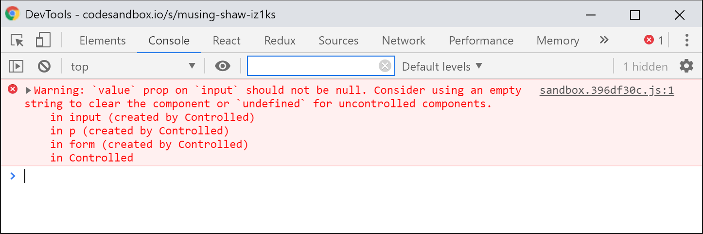

# Forms

Forms play a special role among the other DOM elements in React, and work a little different, as they have already have some sort of **state**. This state is not related to React.

The state of a text field results from the value entered, the state of a checkbox or a radio button results from being selected or not, and `<select></select>` lists hold the state of one or more `<option></option>` elements that are selected. React does not change any of these values. If you feel comfortable using the form state, you can keep using it without problem and nothing changes for the development of your components.

React calls these components **uncontrolled components** as React does not concern itself with the state management of these components. State handling is either completely independent of React or only in the direction of DOM form state to React state, but **never the other way round**. A form element does not know about updates in React state and will keep showing the same value or status \(in the case of checkboxes, selects and radio buttons\) as before.

**Controlled components**, in contrast, are deeply linked to React State. An update in the React state will have an effect on the value or the status of the form element and vice versa. While **controlled components** are harder to implement, they are "safer" to use as it is less likely that both states differ from each other.

## Uncontrolled Components

**Uncontrolled components** can take two different forms. First, plain form elements can be rendered which are processed server-side and do not interact with React at any time. The form is completely static so to say. React does **not intervene** if this is what is wanted, and allows the developer to **freely** choose an approach.

But uncontrolled components could also still interact with React, which is the second form of an **uncontrolled component**. This variation of an uncontrolled component writes changes of the form element **into React state** either to validate data in the background or to render the data in a different place. Changes that have been made to the state in React in different parts of the application do not directly influence the form fields.

An example for an controlled component:

```jsx
class Uncontrolled extends React.Component {
  state = {
    username: '',
    isValid: false,
  };

  changeUsername = e => {
    const { value } = e.target;
    this.setState(() => ({
      username: value,
      isValid: value.length > 3,
    }));
  };

  submitForm = e => {
    e.preventDefault();
    alert(`Hello ${this.state.username}`);
  };

  render() {
    return (
      <form method="post" onSubmit={this.submitForm}>
        <p>Your username: {this.state.username}</p>
        <p>
          <input 
            type="text" 
            name="username" 
            onChange={this.changeUsername} />
          <input type="submit" disabled={!this.state.isValid} />
        </p>
      </form>
    );
  }
}
```

The user can enter their username into a simple text field. The `uncontrolled` component is notified of a change via the `onChange` event and can process the username further if necessary. As React only reacts **passively** and is simply notified of changes in the text field, we still refer to these types of components as **uncontrolled components**.

In most cases, it is sufficient to define these type of **uncontrolled components** if forms are not overly complex. However, we have to remember that the react state and DOM state are completely **decoupled** from each other and only works **in one direction**. Once the `onChange` event has been triggered, the React state can update safely. However, the text field would not update if changes to value of the React state had been made elsewhere in the application \(for example due to a response in an asynchronous request\).

A form field is said to be **controlled** as soon as a `value` attribute is set. From this point on, React expects the developer to synchronize the React state with the form field state. If we only want to set an initial value without converting the complete component into a **controlled component**, React allows us to define a `defaultValue` attribute instead of the usual `value` attribute, the equivalent being `defaultChecked` for checkboxes and radio buttons. The element itself will stay **uncontrolled** but show an initial value or status.

## Controlled components

In order to portray state changes within form fields, as well as transferring changes made by users in form fields into state, a **controlled component** is needed. React fully takes care of the state handling of these form elements. We transfer a value to the `value` attribute which we receive from the state and also derive the changed value and pass it back to the state.

React state is seen as a **single source of truth** \(or a similar state container like Redux\). The only relevant value is the one that can be found in React state and the corresponding input in a form will constantly reflect this value in the state. 

Let's take a look at an example to illustrate this better:

```jsx
class Controlled extends React.Component {
  state = {
      username: '',
      isValid: false,
  };

  changeUsername = (e) => {
    const { value } = e.target;
    this.setState(() => ({
      username: value,
      isValid: value.length > 3
    }));
  };

  submitForm = (e) => {
    e.preventDefault();
    alert(`Hallo ${this.state.username}`);
  };

  render() {
    return (
      <form method="post" onSubmit={this.submitForm}>
        <p>{username}</p>
        <p>
          <input
            type="text"
            name="username"
            onChange={this.changeUsername}
            value={this.state.username}/>
          <input type="submit" disabled={!this.state.isValid} />
        </p>
      </form>
    );
  }
}
```

At first glance the `Controlled` component does not look very different from the `Uncontrolled` component. The defining difference that turns this component into a `controlled`one rather than `uncontrolled` lies in line 29. The `value` attribute of this `<input />` indicates to React that it should now **control** the form element and that changes to the input field should be reflected in the state. In order to pass changes to the React state, it is important to define the `onChange` handler to keep the form field and React state in sync. Failing to do that, will result in input fields that do not update and is — perhaps unsurprisingly — a mistake made relatively often.

There are a few other things to consider. The `value` attribute is only ever allowed to be a **string** but never `undefined` or `null`. 



The `select` elements that have the `multiple` attribute are an exception to the rule. The `value` attribute in this case needs to be an **array** \(rather than a string\).

Noticed anything? I spoke of a `value` attribute for a `<select>` field. But normally an `<option>` is selected by setting its`selected` attribute in HTML. React works a little different and controls the value with another `value` attribute. The same applies to the `<textarea>` element \(which usually indicates its initial value with the `textContent` attribute\).

React unifies the mechanism for changing values by enforcing a `value` attribute for the `input`, `textarea` and `select` elements \(with the exceptions of `checkbox` and `radio` inputs\). This attribute always has to be a **string** or ,in the case of a `select` with a `multiple` attribute, an **array of strings**.

Changes made to the form elements always need to be sent back to **React state**. This can become cumbersome, especially when dealing with checkboxes or radio buttons which do not only change a value but a status \(`checked`\).

The following example of a controlled component should provide an exhaustive list of all basic types of HTML form elements. Any other `input` elements  not listed like `email`, `date` and `range` work exactly the same.

```jsx
class FullyControlledComponent extends React.Component {
  state = {
    text: "",
    textarea: "",
    checkbox: false,
    singleSelect: "",
    multipleSelect: [],
  };

  changeValue = ({ target: { name, value } }) => {
    this.setState(() => ({
      [name]: value,
    }));
  };

  changeCheckbox = ({ target: { name, checked } }) => {
    this.setState(() => ({
      [name]: checked,
    }));
  };

  changeSelect = ({ target: { name, value, selectedOptions, multiple } }) => {
    if (multiple) {
      value = Array.from(selectedOptions).map((option) => option.value);
    }

    this.setState(() => ({
      [name]: value,
    }));
  };

  render() {
    return (
      <form>
        <input
          type="text"
          name="text"
          value={this.state.text}
          onChange={this.changeValue}
        />

        <textarea
          name="textarea"
          value={this.state.textarea}
          onChange={this.changeValue}
        />

        <input
          type="checkbox"
          name="checkbox"
          checked={this.state.checkbox}
          onChange={this.changeCheckbox}
        />

        <input
          type="radio"
          name="radio"
          value="1"
          checked={this.state.radio === "1"}
          onChange={this.changeValue}
        />
        <input
          type="radio"
          name="radio"
          value="2"
          checked={this.state.radio === "2"}
          onChange={this.changeValue}
        />

        <select
          name="singleSelect"
          value={this.state.singleSelect}
          onChange={this.changeValue}
        >
          <option value="">Please select</option>
          <option value="1">One</option>
          <option value="2">Two</option>
        </select>

        <select
          name="multipleSelect"
          value={this.state.multipleSelect}
          onChange={this.changeSelect}
          multiple
        >
          <option value="1">One</option>
          <option value="2">Two</option>
        </select>

        <pre>{JSON.stringify(this.state, null, 2)}</pre>
      </form>
    );
  }
}
```

The core of the form is formed by three event handlers that cater to the different types of form elements: `changeValue`, `changeCheckbox` and `changeSelect`.

These are triggered by the `onChange` events in their corresponding form elements and are passed an object of type `SyntheticEvent`. We access properties of the `target` property of the `SyntheticEvent` via **ES2015 object destructuring** in order to update React state.

For elements of type `<input type="text" />`, `<input type="radio" />`  and `<textarea />`, we pick `name` and `value`, for `<input type="checkbox" />` elements `name` and the `checked` property are important, whereas `select` elements also need to provide a `name` and whether a selection is offered to the user or a multiple select \(with `value` or `selectedOptions`\). We can find out whether we're dealing with a simple or multiple select by inspecting the `multiple` property with `e.target`.

### Changing of values

If a value is modified, as is the case with text inputs and radio buttons, the corresponding React state is set to the value provided by the user, triggered by the `onChange` event. Controlled components now mandate the following procedure:

1. When the user inputs text, the value changes.
2. The `onChange` event is triggered and processed by the event handler.
3. The event handler sets state using the new value.
4. React re-renders the user interface and sets `this.state` to the new value.
5. The user sees their newly provided value on the screen.

This is **business as usual** for the user and they will not notice that the form works differently behind the scenes and does not reflect usual browser behavior. React fully takes care of the logic in the background and painted a new "frame" in the user interface.

### Changing state in checkboxes and radio buttons

Checkboxes \(`<input type="checkbox" />`\) work in a similar fashion but their value will remain the same. Checkboxes change their state rather than their value by providing the boolean `true` or `false` in its `checked` property. If the `checked` property is controlled by React, the form field is said to be controlled. One can check whether the checkbox is activated \(`true`\) or not \(`false`\) by inspecting `e.target.checked` in the event handler which passes this information to React state. React then takes care of the re-render and showing the status of the checkbox to the user.

Radio buttons on the other hand are a kind of a hybrid element. Similarly to checkboxes, radio buttons are seen as controlled if their `checked` attribute is managed by React. However, there are often multiple radio buttons containing the same name but different values within the same document. It would not make sense to set the values of these names to either `true` or `false` as we are interested in the actual value of the selected radio button. Thus, the value of the radio button is written into state. We can check whether the selected value in the state is the same as the value of the field with `checked={this.state.radio === "1"}`. We set `checked` to true in this case if the value of the radio button `radio` is equal to 1.

### Changing state with simple or multiple selects

Let us get the start with the simple use case: a simple `<select>` list modifies its value just like a text field, then triggers a re-render and finally show the selected value in the freshly painted user interface. Multiple selects form an exception though. 

Other than their counterparts, a simple select list or a simple text input, multiple select lists do not expect a string value but an **array of strings.** Annoyingly, we have to construct this array ourselves as `e.target.value` only ever contains a single value, even if multiple options are possible. The `e.target.selectedOptions` property, an object of type `HTMLCollection`, can help us and contains a list of `<option>` elements which are currently selected. This object can easily be transformed into an array using the static array method `Array.from()` added in ES2015. Using `Array.map()` we can furthermore iterate over this array and return a new array containing all the relevant values:

```jsx
Array.from(selectedOptions).map((option) => option.value);
```

 The newly created array is then written into state as a new value. But before that we check using `e.target.multiple` whether we are actually dealing with a `<select>` with multiple choices as it is only this `<select>` which expects an array as a value.

Alternatively, we could have passed the `changeValue` method to the simple select and the `changeSelect` method to the select with multiple choices. Because each select would have received its own event handler, we could have avoided the additional check of checking for a `multiple` select. However, following the procedure I have shown above will make your code more resilient to change requests as the type can be easily changed in the future. In the end it is up to you though.

### Special cases within controlled components

I have used the `name` attribute as the key in the above example to save their value in state. This can come in handy while working with server-side React and if forms are automatically generated and processed. It is not a requirement though: theoretically neither a `name` attribute nor the exact match of the state name and the `name` attribute is needed. 

Saved values can also be nested and require to have more than one form within a component \(But **attention**: React Anti-pattern\). It is also not necessary to use React's own state to portray a **controlled component**. In practice, many developers choose to use an external state container such as **Redux, Unstated** or **MobX**.

## Summary


Forms in React can take a controlled or uncontrolled form.

**Uncontrolled components** are usually sufficient for simple forms, however it is recommended to have React control your form components to ensure a **single source of truth**. To achieve this, the `value` or `checked` attribute needs to be controlled by React while the developer needs to manually react to changes. 

In contrast to regular HTML forms, React expects the value of textareas, selects and inputs to be in a `value` attribute.


