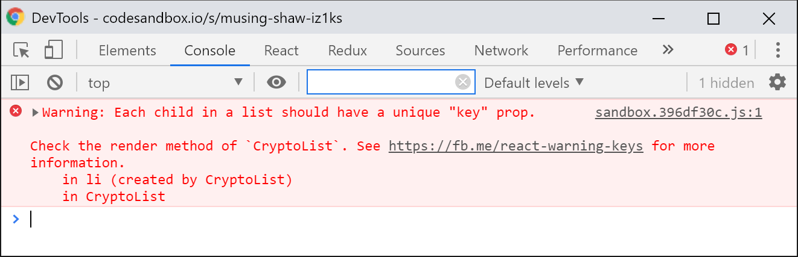

# Lists, Fragments and Conditional Rendering

So far you've learned a lot about React. You know what the **Props** are for, what the **State** is for and how it differs from the **Props**, you know how to implement a React component, what is the difference between a React**\*\* component** and a React **element** and how to use **JSX** to describe an element tree that will later be rendered in your application. \*\*Lifecycle methods help you react to changes in your data. So you already have everything together to develop a simple React application.

However, there are still some details which have not been mentioned in the previous chapters or which have been used in examples without further explanation, but which become more and more relevant as the complexity of your application increases.

In particular this concerns the work with **Lists**, arrays with data, so called **Refs**, which means references to DOM representations of React elements, **Fragments**, a special kind of component, which leaves no traces in the rendered output and **Conditional Rendering**, which means discrimination, when you render what, based on **Props** and **State**.

The topics have one thing in common: they are too important not to be mentioned in the basic part of this book, but at the same time they are not comprehensive enough to be devoted a complete chapter of their own.

## Lists

Lists here actually mean blunt JavaScript arrays, i.e. simple **data** through which iterations can be performed. They are commonplace at work \(not just with React\) and no application can do without them. **ES2015+** offers us with `Array.map()`, `Array.filter()` or `Array.find()` nice declarative methods, which we can use as expressions in JSX within curly braces `{}`.

The role of expressions in JSX and how we can use expressions in JSX have already been discussed in the chapter about JSX. Briefly refreshed: Arrays can be used as expressions in JavaScript and thus also in JSX. This means that they can be placed in curly braces and are then treated as child nodes by JSX during transpiling.

But that's not all, because `Array.map()` can return modified items which contain JSX themselves. This is convenient in that it gives us more flexibility and allows us to turn data collections into react elements.

Let's assume, for example, that we want to display a list of cryptocurrencies. Our array with the corresponding data has the following form:

```jsx
const cryptos = [
    {
        id: 1,
        name: Bitcoin,
        symbol: 'BTC',
        quotes: { EUR: { price: 7179.92084586 } }
    },
    {
        id: 2,
        name: Ethereum,
        symbol: 'ETH',
        quotes: { EUR: { price: 595.218568203 } }
    },
    {
        id: 3,
        name: 'Litecoin',
        symbol: 'LTC',
        quotes: { EUR: { price: 117.690716234 } }
    }
];
```

The data should first be displayed as a simple unordered list in simple HTML. The corresponding component could then look like this, for example:

```jsx
const CryptoList = ({ currencies }) => (
  <ul>
    {currencies.map((currency) => (
      <li>
        <h1>{currency.name} ({currency.symbol})</h1>
        <p>{currency.quotes.EUR.price.toFixed(2)} €</p>
      </li>
    ))}
  </ul>
);
```

And would be used like this:

```jsx
<CryptoList currencies={cryptos} />
```

The result is a list with the corresponding crypto currencies and their respective prices. However, we also get a direct warning from React thrown to our head:



React expects a `key` prop for all arrays and values returned by an iterator. This serves to give the **Reconciler**  \(i.e. the React comparison algorithm\) a possibility to identify list elements and finally to compare them. The **Reconciler** recognizes which array elements have been added, removed or modified. The `key` prop takes the function of a unique ID and must be **unique within this array**. In practice, the ID of a data set is typically used here.

In our case we have such an ID, so the top element returned from the `map()` method would look correct:

```jsx
const CryptoList = ({ currencies }) => (
    <ul>
        {currencies.map((currency) => (
            <li key={currency.id}>
                <h1>{currency.name} ({currency.symbol})</h1>
                <p>{currency.quotes.EUR.price.toFixed(2)} €</p>
            </li>
        ))}
    </ul>
);
```

The key only has to be unique **within an array/Iterator in the middle of its sibling elements, not within the component!** This means that we could use the same `CryptoList` component with the same keys elsewhere, even in the same component, a second time. Just not inside that one loop.

If there are no unique keys for a list of records, the **Index** of the array element can be used as a last resort. However, this is **recommended**, as it can lead to performance problems and unpredictable behavior when rendering the user interface.

It is also important that the `key` prop must always be **directly present in the** Toplevel component **returned by the Iterator function** or the **Array element**, not in the JSX returned by that component.

To better illustrate exactly what this means, we make our above list element into its own little `CryptoListItem` component:

```jsx
const CryptoListItem = ({ name, symbol, quotes }) => (
  <li>
    <h1>{name} ({symbol})</h1>
    <p>{quotes.EUR.price.toFixed(2)} €</p>
  </li>
);
```

What stands out? Correct: the `key` prop we added before is no longer there. Our `map()` call would change as follows:

```jsx
const CryptoList = ({ currencies }) => (
  <ul>
    {currencies.map((currency) => (
      <CryptoListItem
        key={currency.id}
        name={currency.name}
        symbol={currency.symbol}
        quotes={currency.quotes}
      />
    ))}
  </ul>
);
```

Although it is the `<li></li>` element that is ultimately rendered, the `<CryptoListItem />` component must still get the `key` prop, since it is it that is returned by `Array.map()` at the appropriate location in the JSX.

Offtopic: the `CryptoList` component could be further simplified by using the **Object spread syntax**:

```jsx
const CryptoList = ({ currencies }) => (
  <ul>
    {currencies.map((currency) => <CryptoListItem key={currency.id} {...currency} />)}
  </ul>
);
```

In this way, all properties of the `currency` object are transferred to the `CryptoListItem` component as props of the same name.

When working directly with arrays, without an iterator like `Array.map()` this would look the same:

```jsx
const MyList = () => (
  <ul>
  {[
    <li key="1">One</li>,
    <li key="2">Two</li>,
    <li key="3">Three</li>
  ]}
  </ul>
);
```

## Fragments

Fragments are a kind of special component and serve alternatively to create valid JSX without leaving visible traces in the rendered output. Valid JSX in the sense that the `render()` method can only return one top-level element at a time. Like:

```jsx
render() {
  return (
    <ul>
      <li>Bullet Point 1</li>
      <li>Bullet Point 2</li>
      <li>Bullet Point 3</li>
    </ul>
  );
}
```

But not something like that:

```jsx
render() {
  return (
    <li>Bullet Point 1</li>
    <li>Bullet Point 2</li>
    <li>Bullet Point 3</li>
  );
}
```

Here we return several `li` elements from the `render()` method directly and without an enclosing parent element, which leads to an error message. Sometimes this is necessary, e.g. if the enclosing element is located in a parent component, but the child elements are to be created by a separate component.

Within some elements \(`table`, `ul`, `ol`, `dl`, ...\) it is not allowed to use e.g. a `div` element as an intermediate level in order to fulfill the rule and only return a single root element from a component. In this case, the **fragment** comes into play and, applied to the above example, would mean the following change to create valid JSX:

```jsx
render() {
  return (
    <React.Fragment>
      <li>Bullet Point 1</li>
      <li>Bullet Point 2</li>
      <li>Bullet Point 3</li>
    </React.Fragment>
  );
}
```

Here, too, the rule applies that an iterative, i.e. looped output must have a `key` prop. This is possible with the `Fragment` component. Let's look at another example that is somewhat more comprehensive and practical:

```jsx
import React from 'react';
import ReactDOM from 'react-dom';

const TicketMeta = ({ metaData }) => (
  <dl>
    {Object.entries(metaData).map(([property, value]) => (
      <React.Fragment key={property}>
        <dt>{property}</dt>
        <dd>{value}</dd>
      </React.Fragment>
    ))}
  </dl>
);

ReactDOM.render(
  <TicketMeta
    metaData={{
      createdAt: '2018-06-09',
      author: 'Manuel Bieh',
      category: 'General',
    }}
  />,
  document.getElementById('root')
);
```

The output generated in this way would be the following:

```markup
<dl>
  <dt>createdAt</dt>
  <dd>2018-06-09</dd>
  <dt>author</dt>
  <dd>Manuel Bieh</dd>
  <dt>category</dt>
  <dd>General</dd>
</dl>
```

For example, it would not be possible to wrap a `div` or `span` or any other element around `<dt><dt>` and `<dd></dd>`. This would result in the following output:

```markup
<dl>
  <div>
    <dt>createdAt</dt>
    <dd>2018-06-09</dd>
  </div>
  <div>
    <dt>author</dt>
    <dd>Manuel Bieh</dd>
  </div>
  <div>
    <dt>category</dt>
    <dd>General</dd>
  </div>
</dl>
```

... and would be invalid HTML, because a `dl` element only allows `dt` and `dd` as child elements. The **Fragment** helps us to create valid JSX without invalidating the HTML at the same time. This was a problem in React until the introduction of Fragments in version 16.3, and led to components being unnecessarily complicated to implement in order not to violate either JSX or HTML rules.

The fragment component can also be imported as a named import directly from React:

```javascript
import React, { Fragment } from 'react';
```

When used, `<Fragment>` can be written instead of `<React.Fragment>`. This can save some typing, especially if many `fragment` elements are used.

If you want it a little shorter, you should use Babel 7 to transpose the code. A short form of the fragment syntax is also possible here. For this only an _empty_ element is created:

```jsx
<>fragment in short form syntax</>
```

A comfortable way to save yourself a little more paperwork. But beware: the use of the fragment short form in a loop is not possible here, because the short form syntax of `fragment` cannot have props, but all elements used in a loop must have a `key` prop. In this case you have to use `<React.Fragment>` again.

## Conditional rendering

**Conditional rendering**, i.e. the rendering of components on the basis of different conditions, is a central concept in React. Because React components under the hood are just a composition of JavaScript functions, objects, and classes, conditions here work and behave exactly as they do in traditional JavaScript.

A React component renders **states** of a **User interface** based on its **props** and its **current state**, optimally **free of page effects.** So in order to react correctly to these different parameters, we take advantage of rendering functions that are tied to different conditions. If my parameter is A, render this; if my parameter is B, render this. If I have a list of data, display the data in an HTML list. If I don't have any data, display a placeholder instead.

What sounds so simple is basically simple. But you should know the right ways, especially in JSX. The `render()` function of components, i.e. of both **Class Components** and **Stateless Functional Components** can return a **React element** \(of course also in the form of JSX\), a **String**, a **Number**, `null` \(in case nothing is to be rendered\) or a **Array** of the aforementioned types.

In addition, there are several ways to keep the `render()` methods clear in the components. I will introduce these possibilities to you here.

### if/else

Probably the simplest and probably most common form of **Conditional Rendering** is a classic `if`/`else` construct.

```jsx
const NotificationList = ({ items }) => {
  if (items.length) {
    return (
      <ul>
        {items.map((notification) => (
          <li>{notification.title}</li>
        ))}
      </ul>
    );
  }
  return <p>No new notifications </p>
};
```

Simple application. We have a `NotificationList` component that accepts a list of items in the form of a prop. If this list contains entries, these are output as a simple unordered list. If the list is empty, we let our component display the message that there are no new notifications instead.

Another example with a more complex case. We have a value and want to make it editable. Our component has two different modes: `edit` and `view`. Depending on whether we are in **View mode** or **Edit mode**, we only want to display the text or a prefilled text field with the respective last current value.

```jsx
import React from 'react';
import { render } from 'react-dom';

class EditableText extends React.Component {
  state = {
    value: zero,
  };

  static getDerivedStateFromProps(nextProps, prevState) {
    if (prevState.value === null) {
      return {
        value: nextProps.initialValue || '',
      };
    }
    return zero;
  }

  handleChange = (e) => {
    const { value } = e.target;
    this.setState(() => ({
      value,
    }));
  }

  setMode = (mode) => () => {
    this.setState(() => ({
      fashion,
    }));
  }

  render() {
    if (this.state.mode === 'edit') {
      return (
        <div>
          <input 
            type="text" 
            value={this.state.value} 
            onChange={this.handleChange} />
          <br />
          <button onClick={this.setMode('view')}>Done</button>
        </div>
      );
    }

    return (
      <div>
        {this.state.value}
        <br />
        <button onClick={this.setMode('edit')}>Edit</button>
      </div>
    )
  }
}

render(
  <EditableText initialValue='Example' />, 
  document.getElementById('root')
);
```

The part relevant to this chapter takes place within the `render()` method of the component. We check here for the value of the state property `mode`: If this is `edit`, we directly return the input field \("early return"\). If this is not `edit`, we assume that the "standard case" occurs, which in this case would be the view mode \(`view`\). The `else` part of the condition is not necessary here and would only add unnecessary complexity. The text is rendered, once editable as `value` of an `input` field, once only as a text node and a button to switch the state property `mode` of the component between `view` and `edit`.

Such `if`, `if`/`else` or `if`/`else if`/`else` constructs are in different variants, which I'll discuss here in a moment, a common form when it comes to creating an output based on **State** and **Props** within a component.

### zero

No, the headline's not a mistake. Returning `null` is probably the simplest case for **Conditional Rendering.** If the `render()` method of a component returns `null`, it is not rendered and therefore does not appear in the DOM. This can sometimes be useful, e.g. if an error component is only to be displayed if an error has occurred.

```jsx
render() {
  if (!this.state.error) {
    return zero;
  }

  return (
    <div className="error-message">{this.state.error.message}</div>
  );
}
```

This checks whether an error property is set in the state of the component. If this is not the case, `null` is returned and nothing is rendered. If, on the other hand, the property exists, the corresponding error message is output in a `div`, for which we again use conditional rendering with a simple `if`.

### Ternary Operator

These were examples of conditions that output relatively fundamental differences in their components. But often you only want to output small differences, like adding a CSS class when a certain state is set. This is where the Ternary Operator comes in. Short refresh: the **Ternary Operator** is an expression and has the form `Condition ? Fulfilled : Not fulfilled`. Like: \`isLoggedIn ? 'Logout' : 'Login';\`\`

This would also be our first example of using the **Ternary Operator** within JSX. It can be used both within props and simply to render different elements depending on the condition. A concrete use case for the above example would be the output of text dependent on a condition:

```jsx
render() {
  const { isLoggedIn } = this.props;
  return (
    <button type="submit">{ isLoggedIn ? 'Logout' : 'Login' }</button>
  );
}
```

In this case we would always output a button, but depending on its `isLoggedIn` prop it would have either the label **Logout** or **Login**.

The **Ternary Operator** can be used in props in exactly the same form. Suppose we want to print a list of users, some of whom have been disabled. In this case we want to set a class to be able to mark it with CSS. A corresponding markup could look like this:

```jsx
render() {
  const { user } = this.props;
  return (
    <div className={user.isDisabled ? is-disabled
  );
}
```

Deactivated users would be marked with a class `is-disabled`, active users with a class `is-active`.

Even more complex JSX can be mapped using the **Ternary Operator**. All you have to do is follow the general rule that JSX that extends over several lines must be enclosed in parentheses:

```jsx
render() {
  const { country } = this.props;
  return (
    <div>
      <p>State:</p>
      {country === 'de' ? (
        <select name="state">
          <option value="bw">Baden-Württemberg</option>
          <option value="by">Bavaria</option>
          <option value="be">Berlin</option>
          <option value="bb">Brandenburg</option>
          […]
        </select>
      ) : (
        <input type="text" name="state" />
      )}
    </div>
  );
}
```

In this case we render a select list with all German states if the previously selected country is **Germany** \(`de`\). In all other cases, we only show the user a text field in which he can freely enter his corresponding state. Here, however, you should always consider whether this makes sense, because the **Ternary Operator** can quickly become confusing, especially in complex JSX.

### Logical AND \(`&&`\) and Logical OR \(`||`\)

At first glance, the **Logical Operator** is similar to the **Ternary Operator**, but with the difference that it is even shorter and more concise. Unlike the **Ternary Operator**, no "second case" is required here, i.e. a value that is used if the condition is not fulfilled. If the condition in a **Logical AND Operator** is not fulfilled, the expression is `undefined` and therefore causes no visible output in the user interface:

```jsx
render() {
  const { isMenuVisible } = this.props;
  return (
    <header>
      { isMenuVisible && <Menu /> }
    </header>
  );
}
```

In this case, a component would check if the value of the `isMenuVisible` prop is `true` **and** then display a `Menu` component. If the value is `false`, the expression returns `undefined` and the component accordingly renders no output at this point.

In conjunction with the **Logical OR Operator**, a case similar to the **Ternary Operator** can be brought about here:

```jsx
render() {
  const { isLoggedIn } = this.props;
  return (
    <button type="submit">{ isLoggedIn && 'Logout' || 'Login' }</button>
  );
}
```

In this case, the button label is **Logout** if the `isLoggedIn` **Prop** is `true`, so the user is logged in, or **Login** if the user is not logged in.

### Own `render()`-Methods

One way to increase the overview of **Conditional Rendering** is to move certain parts of the `render()` method to your own `renderXY()` methods. The `render()` method represents the core of a component, since it is responsible for deciding what a user sees on his screen later. It should therefore not become too complex, contain unnecessary logic and be readable.

It is therefore not uncommon to divide very complex and long `render()` methods into small, clear bits and implement them as separate class methods. This usually leads to an increase and a better comprehensibility of the code if the respective methods are named in a meaningful way. Usually the individual `render()` methods are still combined with `if` blocks:

```jsx
class Countdown extends React.Component {
  renderTimeLeft() {
    // […]
  }

  renderTimePassed() {
    // […]
  }

  render() {
    const { currentDate, eventDate } = this.props;
    if (currentDate < eventDate) {
      // currentDate is before eventDate so render countdown
      return this.renderTimeLeft();
    }
    // time is over so render how much time has passed since then
    return this.renderTimePassed();
  }
}
```

This **can** increase the readability of a `render()` method when used wisely, but inevitably also increases the complexity of a component \(to a lesser extent\). Many people - and I count myself one of them - therefore prefer to outsource parts of the code to their own encapsulated **Function Components** instead of using `renderXY()` methods.


As soon as you are considering implementing another `render()` method within a component, you should consider creating your own separate **Function Component** instead.


### Custom components for complex conditions

Instead of additional `render()` methods within a component, you can also create your own, new, preferably **Function Components**, as mentioned earlier. These then receive the corresponding **props** from their parent component and then take care of the display of the data transferred to them as an independent, reusable and testable component.

First and foremost, we should consider how easy it is to transfer data from the original parent component to the new\(n\) child component\(n\) and, above all, which data should be outsourced to a new component at all. It should be noted that the new components themselves should not again contain too much logic or even state.

This procedure is particularly useful if recurring elements are used in a component or if a `render()` method becomes too large and confusing.

Let's imagine a form that usually consists of very similar text fields. Each text field is in its own paragraph, has a label and of course a `type` attribute. The label also includes an id, which must also be specified for each field:

```jsx
render() {
  return (
    <form>
      <p>
        <label for="email">
          enamel
        </label>
        <br />
        <input type="email" name="email" id="email" />
      </p>
      <p>
        <label for="password">
          password
        </label>
        <br />
        <input type="password" name="password" id="password" />
      </p>
      <input type="submit" value="Send" />
    </form>
  );
}
```

In this case we only have two form fields. Often, however, it is already the case in averagely complex applications that there are significantly larger forms with significantly more fields. But already in this case it can be useful to outsource the repeating fields into own components, because we can save a lot of paperwork.

So we first create a `TextField` component and store the repeating JSX from our form component there:

```jsx
const TextField = ({ id, label, ...HTMLInputAttributes }) => (
  <p>
    <label for={id}>
      {label}
    </label>
    <br />
    <input {...HTMLInputAttributes} id={id} />
  </p>
);

export default TextField;
```

Our new component receives an `id` that we need to associate the label with the input field and a label as such. Using **Object Rest/Spread** we then add all other props passed to the component to the `input` element as attributes.

Our component from above then looks like this:

```jsx
render() {
  return (
    <form>
      <TextField name="email" label="Email" id="email" type="email" />
      <TextField name="password" label="Password" id="password" type="password" />
      <input type="submit" value="Send" />
    </form>
  );
}
```

From a long and potentially very confusing markup, we have created a clear, concise `render()` method that consists of a few components at the top level. If we also want to make a change in the future that affects all text fields, e.g. add a new class, this only has to be changed in one place - in the new `TextField` component.

