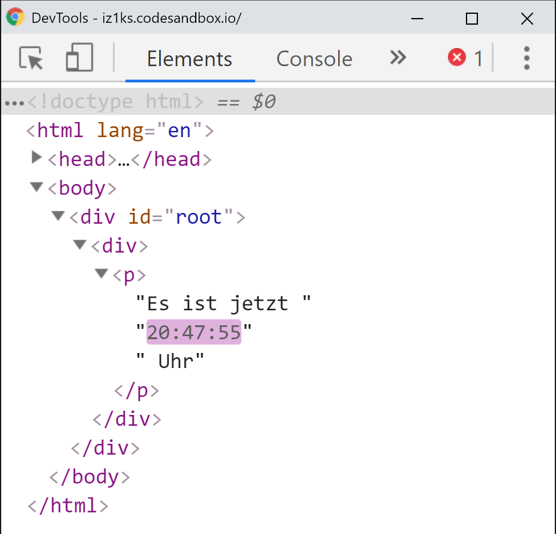

# Rendering of Elements

In the previous chapters I have used them a few times without explaining them; what are **React elements**? 

**React elements** are the smallest building blocks in a **React application**.They describe what is going to be rendered on the screen. Although they sound similar to DOM elements, they differ regarding an important point: React elements are only simple objects and thus easy to create and performant. Calling `React.createElement()` to create a **React element** does not trigger a DOM operation.


React **elements** are often confused with React **components** and used interchangeably. This is not correct though. **Elements** make up the building blocks of **components**. We are going to talk about **components** in great depths in the following chapters, but you should read and understand this chapter about **elements** first.


We already learned how we can create a **React element. JSX** allows us to save many lines of code by avoiding lengthy `React.createElement()` calls. But how do we render an element to the screen, i.e. show it in the browser?

In order to achieve this, we are making use of the `render()` method of `ReactDOM`. Additionally, we need a **root node** or a **mount node** to render a **React element**. This node works as a placeholder and informs React where the element should be rendered to. Theoretically, there can be many different root nodes in the HTML document. React controls these independently and keeps track of the different mount nodes. So instead of having one large **React application**, you could easily choose to have many smaller \(or larger\) **apps** in a single HTML document. It is most common though to only have a **single root node** for your **React application**. 

But let's get to the important parts: how to render a **React element**. Pass the **element** you want to render as the first argument to `ReactDOM.render()` and then pass the **root node** as the second argument, which is the DOM node that the **element** will be rendered into. 

Imagine that we want to render a `div` with the id `root` in the HTML document, which will work as our **root node**:

```markup
<!DOCTYPE html>
<html>
  <head>
    <title></title>
  </head>
  <body>
    <div id="root"></div>
  </body>
</html>
```

The call matching this is the following:

```jsx
const myFirstElement = <div>My first React Element</div>;
ReactDOM.render(myFirstElement, document.getElementById('root'));
```

If you execute the code in the browser, you will see `<div>My first React element</div`  **inside** of the `root` div.

**React elements** are **immutable** meaning that they do not change. Once the element has been created, it represents a particular state in the user interface. The official React documentation metaphorically speaks of a single frame in a film. If we wanted to update the user interface of our application, we would need to create a **new React element** with the updated and changed data — don't be afraid,  it sounds more complex than it actually is!

React is clever enough to figure out which parts of an application have changed and will only update those parts that have actually been updated, thanks to a clever comparison algorithm. **React elements** and their children will be compared to the previous version and only invoke a DOM operation if a change is present. If used correctly, React's **reconciliation process** can drastically improve the performance of your application as regular DOM updates are very costly and negatively impact performance. Depending on the changes in the **React element**, you might not even need to update a full DOM element every time and often only a few attributes need to change.

But let's look at that in practice:

```javascript
function showTime() {
  var time = new Date().toLocaleTimeString();
  var timeElement = (
    <div>
      <p>It is now {time} o' clock.</p>
    </div>
  );
  ReactDOM.render(timeElement, document.getElementById('root'));
}
setInterval(showTime, 1000);
```

Once again a **React element** was created. Once it is invoked in `ReactDOM.render()`, it will tell us the time. Because we only care about punctuality, we pass the element and the  `ReactDOM.render()` call into a function which is called every 1000ms.

Inspecting the elements in the **Chrome Dev Tools** reveals: which each `ReactDOM.render()` call only the time itself is updated. The remaining elements as well as the DOM nodes or even parts not impacted of the shown text remain the same:



We've just met one of the most foundational principles of React in practice: React's **declarative** way of creating user interfaces. Instead of telling our app in an **imperative** fashion to update itself every second, we **declaratively** define in the **React element** that we want to see the current time in a particular place at each re-render.

Implementing this said functionality without React might look something like the following:

```javascript
function changeTime() {
  var time = new Date().toLocaleTimeString();
  var target = document.getElementById('root');
  target.textContent = "It is now " + time  " o' clock";
}
setInterval(changeTime, 1000);
```

The main advantage of **declarative** programming is that we only **describe states** and mention how something should render instead of deciding on each and every step and how to reach our final state. Especially complex applications benefit greatly from declarative approaches and readability and simplicity are drastically improved, thus making it less error prone.



In practice, `ReactDOM.render()` is only called once. Mostly when opening a page. We have only used `render()` repeatedly in the examples to illustrate how **ReactDOM** and **React elements** work together

**Components** \(instead of elements\) trigger a re-render if their state changes or if they have been passed new props. But let's look at components in the next chapter!



