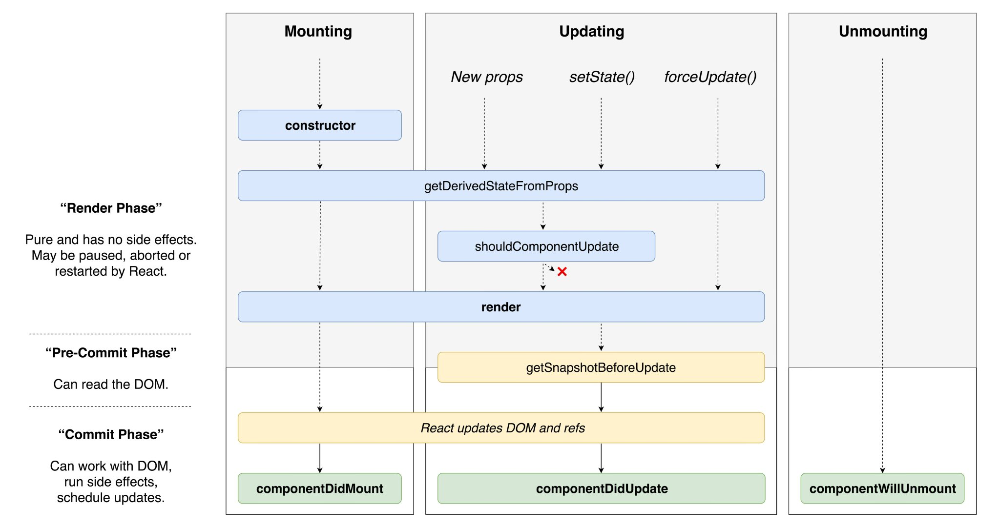

# State and Lifecycle Methods

We've mentioned it in places and now we are finally going to look at it in greater detail — **state** and the so-called **lifecycle methods**.

As mentioned in the previous chapter, components can hold their own **state**, manage and change it. But **If the state within a component changes, it always triggers a re-render of the component**. This behavior _can_ be avoided by opting for `PureComponent` as we've learned in the previous chapter which might be useful in some cases. The foundational logic remains though. A state change leads to a re-render of a component and all of its children, except from those cases in which the children are actually a `PureComponent` or its call is surrounded by a `React.memo()` call.

Relying on state to change our interface is extremely useful. It means that we do not need to rely on manually calling `ReactDOM.render()` to update our interface and that components manage their re-renders independently.

State is tightly connected to the so-called **lifecycle methods.** These comprise a number of optional methods which can be called at different times and for different uses cases in **class components**. For example, there are **lifecycle methods** for when a component is first mounted, if a component receives new props or if the state within a component changes.

Since **React 16.8.0**, **function components** can also manage their own state through the use of **hooks**. Hooks can also react to certain lifecycle events but we will not describe them in detail at this point. This chapter will focus primarily on class components and their associated lifecycle methods. Hooks on the other hand will receive their own dedicated chapter later in the book as they can still be considered a relatively new and extensive topic.

## Our first stateful component

**State** inside a class component can be accessed via the instance property `this.state`. It is encapsulated to the **component** and neither parent or child components can access it.

To define a component's initial state we can choose three ways. Two of these are relatively simple, the third is a little more advanced. We're going to cover the latter when we learn about the **lifecycle method** `getDerivedStateFromProps()`.

**Initial state** can be defined by setting `this.state`. This can either be done via the constructor of a **class component**:

```javascript
class MyComponent extends React.Component {
  constructor(props) {
    this.state = {
      counter: props.counter,
    };
  }
  render() {
    // ...
  }
}
```

... or by defining state as a **ES2017 class property**. This is much shorter but still requires the **Babel plugin** `@babel/plugin-proposal-class-properties` \(pre-Babel 7: `babel-plugin-transform-class-properties`\):

```javascript
class MyComponent extends React.Component {
  state = {
    counter: this.props.counter,
  };
  render() {
    // ...
  }
}
```

**Class Property Syntax** is supported out-of-the-box by **Create React App**. As most projects today rely completely or in part on the CRA setup, this syntax is already widely used and common to see in most projects. If you encounter a project where this is not the case, I'd urge you to install and use this Babel plugin as it reduces the length of your code and is easily set up.

Once **state** is defined, we can **read** its value via `this.state`. While it is possible to mutate `this.state` directly, it is actively discouraged.

## Changing state with this.setState\(\)

To change state within components, React offers a new method for use inside of **class components**:

```javascript
this.setState(updatedState);
```

Whenever state is supposed to change within the component, `this.setState()` should be used to achieve this. By calling `this.setState()` React knows to execute **lifecycle methods** \(for example `componentDidUpdate()`\) and thus **re-render** the component. If we were to change state directly, for example by using `this.state.counter = 1;`, nothing would happen initially as the render process would not be triggered. React would not know about its change in state.

The `this.setState()` method might look a little complex at the start. This is also due to the fact that old state is not simply replaced by new state, triggering a re-render, but because many other things take place behind the scenes. Let's take a look at it step by step.

The function itself can take **two different types of arguments**. The first being an **object** containing the new or updated state properties and the second being an **updater function** which again returns an object or `null` if nothing should change. If you happen to have the same property name in your object it will be **overridden** while all other properties will **remain the same**. To reset properties in state, their values need to be explicitly set to `null` or `undefined`. The new state that is being passed is thus **never replaced** but **merged together** with the existing state.

Let us have another look at our example above in which we defined state with a `counter` property whose initial value was `0`. Assuming that we want to change this state and add another `date` property to pass the current date, we can construct the new object like so:

```javascript
this.setState({
  date: new Date(),
});
```

If an **updater function** was used instead, our function call would look like this:

```javascript
this.setState(() => {
  return {
    date: new Date(),
  };
});
```

... or even shorter:

```javascript
this.setState(() => ({
  date: new Date(),
});
```

Finally, our component contains the new state:

```javascript
{
  counter: 0,
  date: new Date(),
}
```

To guarantee that only the most current state is always accessed, an **updater function** should be used which contains the current state as a parameter. Many developers have already made the mistake of trying to access `this.state` right after calling `setState()` only to realize that their state is still old.


React "collects" many sequential `setState()`calls and **does not immediately invoke them** to avoid an unnecessary amount of re-renders. Sequential `setState()`calls which are called right after each other are executed as a **batch process**. This is important to keep in mind as we cannot reliably access new state with `this.state` just after a `setState()`call.


Assume that we would like to increment the `state` counter three times in quick succession. Intuitively, we might feel compelled to write the following code:

```javascript
this.setState({ counter: this.state.counter + 1 });
this.setState({ counter: this.state.counter + 1 });
this.setState({ counter: this.state.counter + 1 });
```

If the first initial state was `0`, what will the new state be? What do you think? `3`? Nope. It's `1`! But why? React uses its **batching mechanism** to cluster these `setState()` calls together in order to avoid a jarring user interface which continually updates. The above code snippet could be translated into the following code if it was written in **functions**.

```javascript
this.state = Object.assign(
  this.state,
  { counter: this.state.counter + 1 },
  { counter: this.state.counter + 1 },
  { counter: this.state.counter + 1 }
);
```

The `counter` property overrides itself after each batch update but always uses `this.state.counter` as its base reference for incrementing by 1. After all state calls having executed, React calls the `render()` method again.

If an **updater function** is used instead, the current state is passed as a parameter and access is given to the state when the function is actually called:

```javascript
this.setState((state) => ({ counter: state.counter + 1 });
this.setState((state) => ({ counter: state.counter + 1 });
this.setState((state) => ({ counter: state.counter + 1 });
```

This example uses an **updater function** which always updates the current state's value. The value of `this.state.counter` is `3` in this case, as we expected, because the `state` parameter which we provide to the updater function is accessing the current state. While this is possible in theory, it is not exactly recommended. Values should be collected first and then batch processed in a single `setState()` call. This avoids unnecessary re-renders with potentially outdated state.

In some situations it might be necessary to access the value of the modified state. Luckily, React offers the possibility to provide a second parameter in the `setState()` call. This parameter is a callback function which is called **after** the state has updated so that we can safely access the state we have just modified.

```javascript
this.setState(
  {
    time: new Date().toLocaleTimeString(),
  },
  () => {
    console.log("New Time:", this.state.time);
  }
);
```

## Lifecycle Methods

React offers a number of so-called **lifecycle methods** that can be called at different times in a **component's lifecycle**. These can be implemented in React **class components**.

The lifecycle of a component starts as soon as it is **instantiated or mounted**, so when it is found in the `render()` method of a parent component being part of the returned component tree. The component's lifecycle ends if it is removed from the tree of components supposed to be rendered. Additionally, there are **lifecycle methods** that react to **updates** or \*\*\*\*errors as well as being "unmounted".

### **Overview of lifecycle methods**

The following shall be a comprehensive overview of the **lifecycle methods** that are currently available, clustered by the phases in which they occur in a component's lifecycle.

**Mount phase**

These methods are only called **once** when the component is first rendered \(or put simply: added to the DOM\).

- `constructor(props)`
- `static getDerivedStateFromProps(nextProps, prevState)`
- `componentWillMount(nextProps, nextState)` \(deprecated in React 17\)
- `render()`
- `componentDidMount()`

**Update phase**

If new props are being passed to a component, or if state changes within the component, these update methods will be called. Alternatively, an explicit `forceUpdate()` method could be invoked.

- `componentWillReceiveProps(nextProps)` \(deprecated in React 17\)
- `static getDerivedStateFromProps(nextProps, prevState)`
- `shouldComponentUpdate(nextProps, nextState)`
- `componentWillUpdate(nextProps, nextState)` \(deprecated in React 17\)
- `render()`
- `getSnapshotBeforeUpdate(prevProps, prevState)`
- `componentDidUpdate(prevProps, prevState, snapshot)`

**Unmount phase**

This phase only has one matching method which is called as soon as the component is removed from the DOM. It can be useful to tidy up event listeners and `setTimeOut()` or `setInterval()` calls which had been added during mounting of the component**:**

- `componentWillUnmount()`

**Error handling**

Another method to deal with errors has been added to React with React 16. This method can be called to catch errors that occur during the rendering process in a lifecycle method or in the constructor of a **child component**.

- `componentDidCatch()`

Components which implement `componentDidCatch()` are commonly called **error boundaries** and help to visualize an alternative to the erroneous tree of components. It could be a high-level component \(with regard to its position in the component hierarchy\) that displays an error page and asks the user to reload. But equally, it could also be a low level component which only renders a little error message next to a button, triggered by an erroneous action attached to the button.

### Lifecycle methods in practice

Let's have a look at how **lifecycle methods** behave in a simple component. The code implements a component which updates its own state every second and displays the current time. As soon as the component **mounts** an interval is started which updates the state of our component in the `componentDidMount()` method. A re-render is triggered and the current time is shown again.

```jsx
import React from "react";
import ReactDOM from "react-dom";

class Clock extends React.Component {
  state = {
    date: new Date(),
  };

  componentDidMount() {
    this.intervalId = setInterval(() => {
      this.setState(() => ({
        date: new Date(),
      }));
    }, 1000);
  }

  componentWillUnmount() {
    clearTimeout(this.intervalId);
  }

  render() {
    return <div>{this.state.date.toLocaleTimeString()}</div>;
  }
}

ReactDOM.render(<Clock />, document.getElementById("root"));
```

We see that the **lifecycle methods** `componentDidMount()` and `componentWillUnmount()` are being used in the above example. **Default state** is defined with the property `date` and holds an instance of the date object. When the component **mounts** \(`componentDidMount()`\) the `setInterval()` interval is started and its id is saved within the the instance property `this.intervalId`. As the interval invokes the `setState()` method every second, the component regularly triggers a re-render meaning the `render()` method is called again and shows the current time again.

Generally, the interval function is independent of the React component apart from the fact that it calls the `setState()` method of the component. Depending on how deeply interlinked the function and the component are, React determines if function calls should be stopped or not once the component is no longer needed. In the case of the `setInterval()` function, React does not, and we have to take care of stopping the component ourselves. Luckily React provides a methods which enables us to do just that: `componentWillUnmount()`.

This method is called just before React removes the component from the DOM and can be used to cancel any XMLHttpRequests that might still be running, to remove event listeners or to cancel a running interval — and that is just what we need here. Shortly before the component is removed, the `clearTimeOut()` is invoked and we pass the function the interval id which we previously saved in in the instance property.

If we ever forget this during development mode, React will remind us if we try to call `this.setState()` on an already removed component:


**Warning:** Can't call setState \(or forceUpdate\) on an unmounted component. This is a no-op, but it indicates a memory leak in your application. To fix, cancel all subscriptions and asynchronous tasks in the componentWillUnmount method.  
 in Clock


As opposed to previous examples, we only call `ReactDOM.render()` once. The component takes care of the rest and initiates the render process once its **state** has updated. This is the normal procedure when developing applications with React. A single `ReactDOM.render()` call is enough for the app to manage itself, allow interaction with the user and react to state changes and re-render the interface.

### The combination of state and props

We have seen a number of examples for components which process props as well **stateful** components and manage their own local state. But there is a lot more to discover. Only the combination of lots of different components make React as powerful as it is when it comes to user interface development. A component can have its own **state** and also pass it to child components via **props**. This not only enables us to strictly separate business and layout logic but also allows us to develop components which are ultimately task-based and only represent a small part of our application.

The separation of business and layout components is often referred to by two different terms: **smart** components \(business logic\) and **dumb** components \(layout\). As you can guess, **smart components** should not be tied to the layout of the user interface at all, whereas **dumb components** should be free of any logic or side effects. Dumb components should only focus on the plain display of static values.

Another example of multiple components interacting with each other:

```jsx
const ShowDate = ({ date }) => <div>Today is {date}</div>;

const ShowTime = ({ time }) => <div>It is {time}.</div>;

class DateTime extends React.Component {
  state = {
    date: new Date(),
  };

  componentDidMount() {
    this.intervalId = setInterval(() => {
      this.setState(() => ({
        date: new Date(),
      }));
    });
  }

  componentWillUnmount() {
    clearInterval(this.intervalId);
  }

  render() {
    return (
      <div>
        <ShowDate date={this.state.date.toLocaleDateString()} />
        <ShowTime time={this.state.date.toLocaleTimeString()} />
      </div>
    );
  }
}

ReactDOM.render(<DateTime />, document.getElementById("root"));
```

Arguably this example is a little bit artificial but it illustrates the point. We can see how multiple components interact with each other. The `DateTime` component is our **logic component \(smart component\)** and takes care of "getting" the time and updating it. The **layout** component on the other hand deals with the actual display of the date \(`showDate`\) and the time \(`ShowTime`\) via the props it has been passed. The layout component is implemented as a simple **function component** as a **class component** would have been unnecessarily complex and produced too much overhead.

### The role of lifecycle methods in combination with components

In the beginning I mentioned a few other **lifecycle methods** apart from `componentDidMount()` and `componentWillMount()`. React also recognises these if they have been implemented within a **class component**.

In order to understand these different **lifecycle methods** better, let us create an example component in which we include the **lifecycle method** in debug messages. this will help us to see them in the browser console. To be more precise, the example actually consists of two components - one of them being a parent component, the other being a child component which receives props from its parent component \(which it simply ignores in this case\).

```jsx
import React from "react";
import ReactDOM from "react-dom";

const log = (method, component) => {
  console.log(`[${component}]`, method);
};

class ParentComponent extends React.Component {
  state = {};

  constructor(props) {
    super(props);
    log("constructor", "parent");
  }

  static getDerivedStateFromProps() {
    log("getDerivedStateFromProps", "parent");
    return null;
  }

  componentDidMount() {
    log("componentDidMount", "parent");
    this.intervalId = setTimeout(() => {
      log("state update", "parent");
      this.setState(() => ({
        time: new Date().toLocaleTimeString(),
      }));
    }, 2000);
  }

  shouldComponentUpdate() {
    log("shouldComponentUpdate", "parent");
    return true;
  }

  getSnapshotBeforeUpdate() {
    log("getSnapshotBeforeUpdate", "parent");
    return null;
  }

  componentDidUpdate() {
    log("componentDidUpdate", "parent");
  }

  componentWillUnmount() {
    log("componentWillUnmount", "parent");
    clearInterval(this.intervalId);
  }

  render() {
    log("render", "parent");
    return <ChildComponent time={this.state.time} />;
  }
}

class ChildComponent extends React.Component {
  state = {};

  constructor(props) {
    super(props);
    log("constructor", "child");
  }

  static getDerivedStateFromProps() {
    log("getDerivedStateFromProps", "child");
    return null;
  }

  componentDidMount() {
    log("componentDidMount", "child");
  }

  shouldComponentUpdate() {
    log("shouldComponentUpdate", "child");
    return true;
  }

  getSnapshotBeforeUpdate() {
    log("getSnapshotBeforeUpdate", "child");
    return null;
  }

  componentDidUpdate() {
    log("componentDidUpdate", "child");
  }

  componentWillUnmount() {
    log("componentWillUnmount", "child");
  }

  render() {
    log("render", "child");
    return <div>{this.props.time}</div>;
  }
}

ReactDOM.render(<ParentComponent />, document.getElementById("root"));
```

Both of these components reliably lead to the following result:

```text
[parent] constructor
[parent] getDerivedStateFromProps
[parent] render
[child] constructor
[child] getDerivedStateFromProps
[child] render
[child] componentDidMount
[parent] componentDidMount
[parent] state update
[parent] shouldComponentUpdate
[parent] render
[child] getDerivedStateFromProps
[child] shouldComponentUpdate
[child] render
[child] getSnapshotBeforeUpdate
[parent] getSnapshotBeforeUpdate
[child] componentDidUpdate
[parent] componentDidUpdate
[parent] componentWillUnmount
[child] componentWillUnmount
```

Wow! There is a lot happening here right now. Let us go through this one by one, starting with the mounting phase.

#### **`constructor(props)`**

The first method to be called is the `constructor` of the `ParentComponent` component. React processes components in the tree from "the outside to the inside". The further up the component is in the component hierarchy, the earlier it will be instanciated. Afterwards, its `render()` method is called. This is necessary as React would not know otherwise which child components actually need processed and included in the component tree. React only runs the **lifecycle methods** for those components which have actually been included in the `render()` method of their parent component.

The constructor is passed the **props** of the component as a parameter and can transmit them to its parent component \(mostly `React.Component` or `React.PureComponent`\) via `super(props)`. If omitted, `this.props` in the constructor would be undefined leading to unexpected bugs and behavior.

In most cases today, it is not necessary anymore to declare the constructor. The Babel plugin **"Class properties"** can be used instead to implement instance methods as well as state as their own class properties. If it's not, the constructor is the place to define the intial state \(for example `this.state = { }`\) and bind the instance methods to their respective class instances with `.bind()` \(for example `this.handleClick = this.handleClick.bind(this)`\). This is necessary as instance methods would otherwise lose their context within the component as their event listeners are used inside JSX and `this` would not point to the instance of the component anymore.

#### `static getDerivedStateFromProps(nextProps, prevState)`

The constructor is followed by the static `getDerivedStateFromProps()` method. As can be inferred from its name, this is a **static** method and as does not have access to the component instance via `this`. Its primary goal is to calculate the **next state** of the component based on the props it has been passed and its last state and is returned as an object. If no changes need applied to the state, `null` is returned instead. The method's behavior is identical to that of `this.setState()` and only updates those parts of the state which are part of the returned object. Those properties are merged along with the **last state** into a **new state**.

The method itself has been a controversial topic, succeeding the now **deprecated lifecycle method** `componentWillReceiveProps`. Other than the previous method, it does not have access to the component instance. The React core team has explained that the former can lead to unexpected behavior in asynchronous rendering of components and has thus marked it "unsafe". The same applies to `componentWillMount()` and `componentWillUpdate()`. While the term might be associated with security breaches, it actually means something a little different. Components using this lifecycle method could lead to bugs and other side effects after React version 17.

`getDerivedStateFromProps()` should not introduce any side effects \(for example it should not trigger any XHRequests\) and only **derive** the new state of the component instance based on its current props. In contrast to the constructor, this method is is not only called during the mounting phase of the component but also if the component receives new props. In order for that to happen the props do not have to have changed their content.

#### `render()`

Once a component has been created and its state has been derived, React calls the `render()` method which describes our user interface and the child components to render. The above example only contains one child component - the `ChildComponent`.

We now rinse and repeat. The `constructor()`, `getDerivedStateFromProps()` and then the `render()` method of our child component is called just the same as was the case in the `ParentComponent`. The Child component in our example does not have any other children implying that no other elements are rendered. If it did, their lifecycle methods would also be run until React would find a component which does not return any other React components anymore. It would simply contain DOM elements like `div`, `p`, `section` and `span` etc \(and of course any combination of these\), `null` or an array which in turn would not contain any other components.

#### `componentDidMount()`

The `componentDidMount()` method enters the scene once such a component is reached. It is called as soon as a component and all of its children have been rendered. From now on, we can also access the DOM Node of the component if necessary or start intervals or timeouts or initiate network requests via XHR/fetch. The `componentDidMount()` method is the best place for these.

As opposed to the constructor, this method is called from "the inside to the outside" determining the method's way of first processing child components and then their parent components. We can see this in action in our above example. The log clearly shows that first the `componentDidMount()` of the `ChildComponent` is called and only then `ParentComponent`'s `componentDidMount()` is invoked.

In the above example, we started a `setTimeOut()` within the `ParentComponent`which modifies the state of our component every 2000 milliseconds. It demonstrates which lifecycle methods are being called during the update of a component. Any other changes on the state of the mounted component are no longer part of the mounting phase but part of the update phase. This phase is entered after the the first 2000 milliseconds once the `ParentComponent` modifies its own state via `this.setState()`.

#### `shouldComponentUpdate(nextProps, nextState)`

Whenever a component updates, whether that is due to state change within the component or because it receives new props from the outside, `shouldComponentUpdate()` is called. But beware: there is a difference depending on whether the props or the state changed: if a component receives new props from the outside, `getDerivedStateFromProps()` is called shortly beforehand.

The `shouldComponentUpdate()` method enables us to inform if a costly re-render is actually necessary. The method receives the **next props** and the **next state** as a parameter and can determine based on those whether a re-render should take place. The method either has to return `true` to trigger the re-render or `false` which will prohibit the calls of `componentDidUpdate()`, `getSnapshotBeforeUpdate()` as well as `render()`.

In many more complex applications, the update cycle is only triggered because a change has happened somewhere in the parent component which however is irrelevant for the child components. In these cases, `shouldComponentUpdate()` can be helpful as to optimize the rendering performance by preventing further re-renders.

If we were to return `false` from our `ParentComponent`'s `shouldComponent()` method, our logging output would be much shorter. Lines 14-18 would simply be missing. The component itself would not re-render, the `render()` method would not be called and the `ChildComponent` would also not re-render as well as update itself.

However, in our code example `true` is returned which in turn calls the `render()` method of the `ParentComponent`. This triggers another re-render of the `ChildComponent` which receives new props which mirror the `ParentComponent` updated state. And just like that we find ourselves in the update cycle of the `ChildComponent`.

Similar as already happened in the mount cycle, `getDerivedStateFromProps()` derives a new state based on the new props. Afterwards `shouldComponentUpdate()` is called. This is where we can check whether the component's relevant props have actually changed and if they did not, we could prohibit the re-render by returning `false` from `shouldComponentUpdate()`. If we did not do that, the obligatory call of the `render()` method would follow. Let's look at the next **lifecycle method** that would occur next in our component lifecycle.

#### `getSnapshotBeforeUpdate(prevProps, prevState)`

This method is relatively new and has only been introduced in React 16.3.0 along with `getDerivedStateFromProps()` to better deal with asynchronous rendering in React. It receives the **last props** and the **last state** and has access to the current state of the HTML DOM before React applies any modifications from the last `render()` cycle.

If we want to remember the current scroll position in a long list or table to be able to jump to the previously inspected item after an update, `getSnapshotBeforeUpdate()` can be really useful. It can return any value or `null` and its return value can be passed to `componentDidUpdate()` as a third parameter.

In my experience, `getSnapshotBeforeUpdate()` is rarely used. It might even be the least used out of all the **lifecycle methods** as we rarely need to access DOM elements directly. Most problems that used to be solved by manipulating the DOM API in an imperative fashion, can now be solved directly in the abstract component tree with JSX.

#### `componentDidUpdate(prevProps, prevState, snapshot)`

`componentDidUpdate()` forms the last method of the update cycle. It is called after `getDerivedStateFromProps()` has derived the new props, `shouldComponentUpdate()` has returned `true` and after `getSnapshotBeforeUpdate()` has created the last snapshot of the latest condition of the DOM.

The method receives the **last props** as well as the **last state** - meaning the last props and last state just before the component was updated. If the component contains a `getSnapshotBeforeUpdate()` method, its return value will be passed as a third parameter.

Similarly to `componentDidMount()`, `componentDidUpdate()` is also resolved from the "inside to the outside". First, the `componentDidMount()` methods of the child components are called, then those of the parents. `componentDidUpdate()` is the perfect place to trigger side effects, for example starting XHRs if certain properties of the components have changed. This can easily be checked with a simple comparison between the current props and the last props \(which we have received as a parameter\) or the current state and the last state.

It is safe to access the **current DOM** during this method as React will have applied all the changes resulting from modified JSX in the `render()` method.

And with `componentDidUpdate()` the **update cycle** has also come to a finish. While the **mounting cycle** is only ever run once, namely when the component **first** renders, the update cycle can be triggered an infinite amount times: as soon as the component changes its state or receives new props.

#### `componentWillUnmount()`

I admit that I have cheated in the logs of our example. `componentWillUnmount()` is only ever run if a component is completely removed from the DOM. This has not happened in our example. A components counts as "unmounted" after it has been explicitly removed by calling `ReactDOM.unmountComponentAtNode()` \(this is particularly important for mount nodes\) or if it is not implicitly returned from the `render()` method of its parent component anymore.

In those two cases, `componentWillUnmount()` will be called but of course only if it has been manually implemented. This is true for most **lifecycle methods** apart from `render()`. The `componentWillUnmount()` **lifecycle method** is an essential tool to "clean up" our application. It is the place where functions can and **should** be called to ensure that no traces are left behind. "Traces" can refer to timeouts we are still waiting on \(`setTimeout`\) or intervals which are still running \(`setInterval`\) but also DOM modifications which have taken place outside of our component JSX, as well as network requests which are still ongoing \(XHR/Fetch calls\) or simply event listeners which were added to the DOM via the API method `Element.addEventListener()`.

Event listeners are a good topic to end this chapter on. As opposed to working with the regular DOM API, the use of `addEventListener()` is almost not necessary anymore in React as React introduces its own event system to aid readability and consistency.

### Diagram of lifecycle methods


