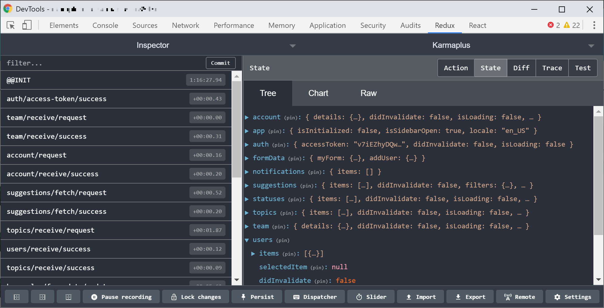

# State Management

The more an application grows in the size, the more its complexity and data grows. Managing **application state** becomes increasingly difficult and cumbersome to do. When do I pass props to which component and how? How do the props influence the state of my components and what happens if I change the state of a component?

React has introduced great tooling in the last few years to deal with this increase of complexity in application state. The **Context API** as well as the **useReducer** **hook** have been great additions to the React developer's toolbox and allow us to work more comfortably with complex data. However, in some cases it is still very difficult to keep track of all the different pieces of data and how they transform. To deal with this type of problem, external tools for **global state management** can be a great choice. The React ecosystem has seen a number of players enter this space giving us lots of libraries to choose from.

One of the more commonly known tools is **MobX** which describes itself as a tool _"Simple, scalable state management"_ solution. The other well-known tool in the industry is **Redux**. Redux was in part developed by Dan Abramov and Andrew Clark who are now part of the official React Core Team. It positions itself as _"A predictable state container for JavaScript apps"._ Redux is arguably the more dominating tool boasting with higher usage stats and downloads.

This chapter will dive deeper into **Redux.** This is due to a number of reasons: first of all, I have experience with **Redux** myself and have used in it a number of different projects. Additionally, my experience with Redux has been very pleasant. But those are not the only reasons. Redux still has around **4 million weekly installations**. Compared to **MobX** which still has a very respectable number of **200.000 installations** per week, Redux is the dominant force in the React ecosystem though.

Despite a number of voices which keep proclaiming Redux's death, the interest in **Redux** has remained steady over the years and the number of downloads is still growing. When the **Context API** was introduced with **React 16.3.0**, **Redux** was said to be obsolete. Once **React 16.8.0** introduced Hooks, more specifically the **useReducer hook**, the critics' voices were raised again. Despite all this criticism, the number of installations of Redux keep growing.

In fact, **Redux** makes use of **Context** and **Hooks** under the hood and uses these principles to optimize its own performance and simplify its API. Moreover, **Redux** has seen a great increase of custom add-ons and tools for their own ecosystem which is enhanced rather than replaced by the new functionality offered by React.

### Introduction to Redux

As mentioned earlier, **Redux** is a predictable state container. But what exactly does this mean? I want to add some back story here to answer this question properly. It's important to really understand the principles of Redux to avoid common errors and set yourself up for success.

**Redux** as a tool is based on the principles of **Flux Architecture**. This type of architecture has been developed at **Facebook** too with the aim to simplify development in client-side web applications. As is the case in **React**, **Flux** dictates a **unidirectional data flow**, meaning data is only ever flowing one way: an **action** \(could be triggered by a button click\) alters the **state**, and this **state change** will cause a re-render and thus allow further actions.

**Redux** works almost the same. However, state is managed only within one component - **globally**. In practice, this translates to all components gaining access to this state no matter where they are placed.

In order to use **Redux** in a particular project, we have to install it via the command line:

```bash
npm install redux react-redux
```

Or using Yarn:

```bash
yarn add redux react-redux
```

We have to install **two** packets: `redux` and `react-redux`. The `redux` package will install the main state management library whereas `react-redux` will install the so-called **bindings**. While the name might sound a little obscure, there is no actual magic involved. **Bindings** refer to **React components** which have been specifically optimized for usage with **Redux**, allowing us to use these out of the box.

While in theory **Redux** could be used as a stand-alone solution, we would then need to manage components rendering and data flow from the state container ourselves. While possible, it introduces a great deal of complexity which most of us do not want to deal with. `react-redux` is thus a sensible choice for most of us.

### Store, Actions and Reducers

I've just introduced another set of new terminology to you. Don't be scared if any of these sound unfamiliar to you now. We will look at all of them in turn and hopefully clear up any confusion you might have at the moment.

All data in **Redux** is managed in so-called **stores** which manage the **global state**. Theoretically, applications could have a number of different stores. In fact, **Flux architecture** even encourages the use of multiple stores. However, in most React applications using **Redux** we will only find a single store. This reduces complexity dramatically and also declares this _single_ **store** as the **single source of truth** for all of our data. The store also provides a number of methods which can be used to change \(`dispatch`\) the data currently stored in the store, read \(`getState)` the data from the store and react to changes \(`subscribe`\).  

The only way to change data in a store is to "_dispatch"_ an **action**. Once again, **Redux** has taken its inspiration from **Flux Architecture** and prescribes for these **actions** to be in **Flux Standard Action** \(FSA\) format. **FSAs** consist of a simple JavaScript object which always **has to have** a `type` property and _can_ contain a `payload`, `meta` and `error` properties. We are going to focus mostly on the `payload`. In 9 out of 10 cases, we are going to deal with a `payload` when we are _dispatching_ an **action**.

The **payload** describes the actual _content_ of an **action** and can take the form of data which is serializable in JSON format. This could include strings, booleans, numerical values or even complex arrays or objects.

Let's have a look at a typical **action** in **Redux**:

```javascript
{
  type: "SET_USER",
  payload: {
    id: "d929e553-7079-4309-8c7d-2d2db39922c6",
    name: "Manuel"
  }
}
```

Once an **action** has been _dispatched_ \(the **store** provides this `dispatch` method for us\), the current **state** as well as the **action** dispatched are passed to the **reducer**. The **reducer** is a **pure function** which we also already encountered in React. Its primary aim is to create a **new state** based on the **current state** and the action's `type` and `payload` properties. A little reminder: a **pure function** always creates the **same output**, given the **same input parameters** - no matter how many times it is being called. This behavior makes **Reducers** predictable and also easy to to test.

Example of a **reducer**:

```javascript
const reducer = (state, action) => {
  switch (action.type) {
    case "PLUS": {
      return state + action.payload;
    }
    case "MINUS": {
      return state - action.payload;
    }
    default: {
      return 0;
    }
  }
};
```

A **store** generally expects only a **single reducer**. **Redux** allows us to split the **reducer** function into many small little parts, making them more digestible and easy to read. A `combineReduers()` function then takes care of merging all these parts into one main **reducer** - the **root reducer**. When an action is _dispatched_, each **reducer** is called with the same parameters: **state** and the **action**. 

Each **reducer** reacts to the `type` property of an **action**. Due to this, a convention has emerged to extract all used types into variables with the same name which allow us to avoid typos. Why is that? Typos might be hard to spot \(e.g. `USER_ADDDED`\) without. On top of that, the JavaScript interpreter will throw an error if we tried to access a variable which is not defined, eliminating yet another source of error that's hard to track down. Thus, you often find the following code-blocks at the beginning of a file in **Redux** applications:

```javascript
const PLUS = 'PLUS';
const MINUS = 'MINUS';
```

This allow us to create some sort of coherence among the different **action types**.

### Creating a store

To create a store which will manage the global state, we habe to import the `createStore` function from the `redux` package. We can call it by passing it a **reducer** function. This function will return a store object to us which will contain all the methods necessary to interact with the store, namely `dispatch`, `getState` and `subscribe`. The latter two are not of the same importance when working with React, but I have mentioned them for the sake of completion. In React and Redux applications, the `react-redux` bindings components take care of the re-rendering of components if they are affected by a change of the **state**.

```javascript
import { createStore } from "redux";

const initialState = 0;

const counterReducer = (state = initialState, action) => {
  switch (action.type) {
    case "PLUS": {
      return state + (action.payload || 0);
    }
    case "MINUS": {
      return state - (action.payload || 0);
    }
    default: {
      return state;
    }
  }
};

const store = createStore(counterReducer);
```

We've just created our first simple store with a counter reducer. The `createStore` function only takes a single parameter in this example \(the `counterReducer`\) indicating that the initial `state` will be set to `undefined`. Thus, we have set the `initialState` as the standard parameter which equates to 0 in this example.

If we pass another parameter to the `createStore` function, this parameter would be passed as first state to our reducer function:

```javascript
const store = createStore(counterReducer, 3);
```

Instead of `undefined`, the initial value for our `state` parameter that is passed to the `counterReducer` would equate to `3`. The `initialState` would not be set and our counter would start counting at `3` instead of `0`.

The first initial **action** being _dispatched_ takes the form of `{type: '@@redux/INIT5.3.p.j.l.8'}`. Looking at our example, this means that the `default` case will get activated and that only the `state` passed will be returned \(which also equates to the `initialState`\).

This `default` case is important. If no other `case` of the `switch` statement can be fulfilled, the current `state` needs to be returned from the function to avoid unwanted side-effects. The `reducer` function is executed after **each** `dispatch` call and dictates the value of the **next state** by returning it from the function.

Calling `store.getState()` after initialization, we obtain an `initialState` of `0`:

```javascript
console.log(store.getState()); // 0
```

Let's try things out a bit and try **dispatch a few actions** to see how **state** reacts to these **actions**:

```javascript
store.dispatch({ type: "PLUS", payload: 2 });
console.log(store.getState()); // 2

store.dispatch({ type: "PLUS", payload: 1 });
console.log(store.getState()); // 3

store.dispatch({ type: "MINUS", payload: 2 });
console.log(store.getState()); // 1
```

We've _dispatched_ an **action** of `type` `PLUS` twice and of `type` `MINUS` once. A `payload` is also passed that indicates by how many numbers our last state is supposed to be incremented or decremented by. These operations result in the following **state mutations**:

```javascript
0 (initialer State) + 2 (payload) = 2 (neuer State)
2 (alter State)     + 1 (payload) = 3 (neuer State)
3 (alter State)     - 2 (payload) = 1 (neuer State)
```

This state remains relatively simple and only consists of a single value. We will look at more complex **state** consisting of different objects soon and create a number of different **reducers**.

### Action Creators vs Actions

Those who read articles or the official documentation of **Redux** will have encountered the two terms **action** and **action creators**. The difference is not completely clear in the beginning. I struggled to really understand differences myself and know many others who have felt the same. The situation is furthermore complicated by the fact that some use the terms interchangeably, although they mean different things. Let's quickly dive into how **action creators** and **actions** differ.

**Actions,** which were already introduced earlier, are simple, _serializable ****_**objects** that can be used to describe how exactly **state** should change. They always contain a `type` property and often a `payload`.

An **action creator** however describes a **function** that returns an **action**. One could also say that it is a **factory** which creates **actions** \(thus the name _Creator_\). In most situations, **action creators** are used to **encapsulate logic** that is necessary to create to an **action**. Sometimes they are also used to abstract away complex logic from the **actions** themselves. In those cases, the **action creator** function is called instead of the **action** and passed to the `dispatch` method.

Typical **action creators** might take the following form using the previous example:

```javascript
const add = (number) => {
  return { type: 'PLUS', payload: number };
};

const subtract = (number) => {
  return { type: 'MINUS', payload: number };
}
```

Or using **ES2015+ shorthand notation**:

```javascript
const add = (payload) => ({ type: 'PLUS', payload });
const subtract = (payload) => ({ type: 'MINUS', payload });
```

Consequently, the **action creators** will be called as parameters of the `dispatch` method instead of passing an **action** directly:

```javascript
store.dispatch(add(2));
store.dispatch(add(1));
store.dispatch(subtract(2));
```

By following sensible naming conventions, the readability of the overall code is greatly improved. **Action creators** are a powerful piece of functionality in Redux and can allow us to eliminate repetition. Using  **action creators** can also help to avoid common mistakes such as typos in a `type` of an action - for example `PLSU` instead of `PLUS`.

### Complex reducers

The previous examples were intended for us to form an understanding of **actions** and **reducers**. Moreover, they allowed us to understand how **actions** are used in practice and how the **reducer** mutates the **store**. Typically, most React applications will deal with much more **complicated state** than what we have seen in the examples. To understand **Redux** in context of much larger state, we will look at a more realistic example.

The example will describe a simple **To-Do** app and we will look how the **state management** for said app can be implemented. The to-do app will manage lists of to-dos and also contain a logged-in user area. The state will consist of two top level properties: `todos` \(of type array\) and `user` \(of type object\). This is reflected in our current state:

```javascript
const initialState = Object.freeze({
  user: {},
  todos: [],
});
```

To ensure that a new state object is being created instead of mutating the previous object, the initial state object is wrapped by `Object.freeze()`. If there was an attempt to directly mutate the **state object** a `TypeError` would be thrown.

Let's have a look at how a **reducer function** could be implemented that manages the todos \(adding, removing and changing the status of todos\) and sets the login area of a user:

```javascript
const rootReducer = (state = initialState, action) => {
  switch (action.type) {
    case "SET_USER": {
      return {
        user: {
          name: action.payload.name,
          accessToken: action.payload.accessToken,
        },
        todos: state.todos,
      };
    }
    case "ADD_TODO": {
      return {
        user: state.user,
        todos: state.todos.concat({
          id: action.payload.id,
          text: action.payload.text,
          done: Boolean(action.payload.done),
        }),
      };
    }
    case "REMOVE_TODO": {
      return {
        user: state.user,
        todos: state.todos.filter((todo) => todo.id !== action.payload),
      };
    }
    case "CHANGE_TODO_STATUS": {
      return {
        user: state.user,
        todos: state.todos.map((todo) => {
          if (todo.id !== action.payload.id) {
            return todo;
          }
          return {
            ...todo,
            done: action.payload.done,
          };
        }),
      };
    }
    default: {
      return state;
    }
  }
};

const store = createStore(rootReducer);
```

I do not want to go into too much detail, however a few things should be properly explained in this instead. Let's look at each `switch` block in turn in which each `case` block returns a new state object.

Let's start with `SET_USER`: the **state object** being created here changes the `user` object and sets its `name` property to `action.payload.name` as well as the `accessToken` property to `action.payload.accessToken`. One could also set `user` to `action.payload` but this would mean that the complete **payload** of the **action** would be transferred to the `user` object. Moreover, one has to ensure that the `action.payload` is an object as to not change the initial form of the `user` object. This could become problematic if other parts of the **reducer** also access this object and its type had suddenly changed. We have ignored all other properties in our example by explicitly accessing `name` and `accessToken` from the **payload** of the action.

Apart from the modified `user`, we also return a `todos` property which we set to `state.todos`. This indicates that we do not change this value and leave it as is \(initial value\). **This is important** - as the `todos` would have otherwise disappeared from the state. We would have set the user but removed all their todos from state. 

Let's continue with `ADD_TODO`: this works differently from `SET_USER` as the `user` is returned unchanged from the state tree. A new todo is added to the array of todos via the `.concat()` method. It's important to make the distinction between `push()` and `concat()`: `push()` is a _mutating_ method which means that it would change our current state instead of creating a new one. By using `state.todos.concat`, we use the current `todos` array as the basis and create a new array which contains the previous array as well as the newest todo item.

The case of `REMOVE_TODO` works in a similar fashion. The `user` is returned just as was the case in `ADD_TODO`. The `todos` array on the other hand is filtered by the entry to remove. We pass an `id` to the filter which has been provided in terms of an action as part of the  `action.payload`. The filtered array forms the new `todos` state. Again, the choice of `Array.filter()` has been made as it is non _mutating_ and creates a new array as opposed to comparable methods such as `Array.splice()` which mutate the the original array.

The last case illustrated in our example is `CHANGE_TODO_STATUS`. It allows us to set the status of our todo element from to do - `false` - to done - `true` or vice-versa. The `user` object remains unchanged and the previous state is returned. To change the status of a todo, we use a map function to iterate over the array of todos. In this map, we check whether the id of the current todo object is equal to the id of the `action.payload`. If this is not the case, we just return the unchanged todo element.

If the id of the payload is equal to the id of the current todo element, a new object is created and all properties with their respective values are copied over into the new object while overriding the `done` property with the new value from the action payload. This is achieved via the ES2015+ spread syntax \(`{...todo}`\). Creating new objects instead of mutating the existing ones helps to ensure that our **reducers** remain **pure functions**, creating a new state every single time. Using `Array.map()` ensures that a new array is created each time.

We've only dealt with two parts of the state tree: `user` and `todos` but the **reducer function's** complexity has already become apparent. If the complexity of the state grew, the function would become increasingly longer and more prone to **mistakes**. As we not only return the changed parts of the state but also the parts that have not changed, the function becomes even harder to read and manage. To combat this we can use ES2015+ **Object Spread Syntax** to create a new state from the previous state and override the the changing branch of the state tree. In terms of the `ADD_TODO` case, one could refactor to the following snippet:

```javascript
case "ADD_TODO": {
  return {
    ...state,
    todos: state.todos.concat(action.payload),
  };
}
```

This only minimizes the risk to an extent. We might still forget to return the unchanged part of the state along with the newly created state. `combineReducer()` function to the rescue! This method allows to separate the **reducer** \(or to say the **state** which they create\) into many smaller parts which only deal with a particular task. They can even be placed into their own files.

Applying this logic to our current example, `user` and `todos` can be extracted into their own **reducer functions**. Both can be placed in their own respective files while the **reducer** functions have to be exported with `default`:

```javascript
// user/reducer.js
const initialState = Object.freeze({});

export default (state = initialState, action) => {
  switch (action.type) {
    case "SET_USER": {
      return {
        name: action.payload.name,
        accessToken: action.payload.accessToken,
      };
    }
    default: {
      return state;
    }
  }
};
```

```javascript
// todos/reducer.js
const initialState = Object.freeze([]);

export default (state = initialState, action) => {
  switch (action.type) {
    case "ADD_TODO": {
      return state.concat(action.payload);
    }
    case "REMOVE_TODO": {
      return state.filter((todo) => todo.id !== action.payload);
    }
    case "CHANGE_TODO_STATUS": {
      return state.map((todo) => {
        if (todo.id !== action.payload.id) {
          return todo;
        }
        return {
          ...todo,
          done: action.payload.done,
        };
      });
    }
    default: {
      return state;
    }
  }
};
```

This way, we have not only achieved readability by creating two **reducer** functions but the functions themselves could also be simplified. Instead of returning the _unchanged_ parts of the **state tree** as well, we only return those parts of the **reducer** _which are relevant to this reducer_. For the **user reducer** we only return the **user** while in the **todos reducer** we only return **todos**.

In order to combine the _smaller_ **reducers** into a _****big_ **reducer**, we can use the aforementioned `combineReducers()` method which will create a root reducer which can then be passed to the `createStore()` method. The `combineReducers()` function expects an object whose property name matches that of the newly created state tree. The values also have to be _valid_ **reducers**.

```javascript
import { combineReducers, createStore } from "redux";
import userReducer from './store/user/reducer';
import todosReducer from './store/todos/reducer';

const rootReducer = combineReducers({
  todos: todosReducer,
  user: userReducer,
});

const store = createStore(rootReducer);
```

The `combineReducers()` function is used to put together all the reducers from the passed object into a new function, the so-called **root reducer**. This **root reducer** can now be passed to the `createStore()` function. The created function calls _each_ reducer passed when executed and creates a new state object based on all the return values. It matches the form of the initial state object to achieve this task:

```javascript
{
  "todos": [],
  "user": {}
}
```

 Another piece of advice: by using ES2015+ object shorthand notation in a clever way, we can save even more lines of code by calling the imports by the same as the properties which they will represent in state:

```javascript
import user from './store/user/reducer';
import todos from './store/todos/reducer';
```

The object which we have to then pass to `combineReducer()` reduces to the following:

```javascript
const rootReducer = combineReducers({ todos, user });
```

To use `combineReducers()`, a few formal rules have to be followed. They do not hinder us from developing code effectively but have to be followed. Each reducer function that is passed to  `combineReducers()` has to fulfill the following criteria

* For each unknown **action** \(so each **action** whose `type` argument we do not react to\) that the **reducer** receives, the first `state` that the **reducer** receives needs to be returned.
* Reducer functions used in the `combineReducer()` function can never return `undefined`. This is different to the **root reducer** which is allowed to do this. In the case of the former, the `combineReducers()` function will throw an **error** to inform us of this error. We deal with this effectively in our example by including a `default` case in the `switch` block which will simply return the `state`
* If the `state` passed in the first argument is of `type` `undefined`, the **initial state** has to be returned. It's probably easiest to use the initial state as a default value as we have done in the above example \(`state = initialState`\).

**An aside**: `combineReducer()` can be nested as many times as you like, The **reducer** functions that have been passed to `combineReducer()` can be created by other `combineReducer()` calls. While this might help to an extent, you should be cautious to not provide unnecessary granularity which will make your code harder to read when your state branches are hard to find. In my own experience, nesting is only really useful up to a _single_ layer \(meaning to `combineReducer()` calls\).

### Asynchronous actions

All **actions** in the previous examples were executed **synchronously**. This means that each **action creator** was executed whenever we wanted to modify state without having to wait for the result of an asynchronous process to finish. In many dynamic web applications, this situation is highly unlikely though. Many **React applications** have to deal with **asynchronous data flows**, network requests in particular. _Synchronous_ **action creators** do not really offer a great solution to this problem as the `dispatch` method of a **store** expects an **action** which contains a simple object containing a `type` property.

**Redux middleware** concepts, **Redux Thunk middleware** in particular, can help to deal with this problem. 

The `createStore()` function from the `redux` package can deal with up to three parameters:

* The **reducer** function: this is only **mandatory** parameter and deals with the executed **actions** of our **state** by returning a **state** for each **action** dispatched
* **Initial state**: One can pre-populate the store with data by providing a value in the initial state. This initial state is also passed to the **reducer function**.
* An **enhancer function**: This function can be used to enhance the store's capability with our own functionality: in this case we enhance it with the **middleware** mentioned above.

If the `createStore` function receives a **function** as a second parameter, the second parameter will be treated as an **enhancer function**. If the second parameter takes the form of anything different, the second parameter will be treated as **initial state** and passed to the **reducer function** as such.

**Redux middleware** is wrapped around the `dispatch` method and interrupts the usual call before it is executed. It can modify the **action** _before_ it is sent to the **reducer** and returns a new `dispatch` function. If we wanted to pass asynchronous functions \(for examples Promises\) to the `dispatch()` method, we can use the **store enhancer** to register the **middleware** that allows us to do just that. The most common piece of middleware is the so-called **thunk middleware**.

Install it via:

```bash
npm install redux-thunk
```

or using Yarn:

```bash
yarn add redux-thunk
```

Once the **thunk middleware** has been installed, it has to be _registered_ via the **Redux** `applyMiddleware()` function in the **enhancer**. We import the **middleware** and import the `applyMiddleware()` function from the `redux` package. The **middleware** we want to use has to be passed to the `applyMiddleware()` function as a parameter. In this case, we are passing `thunk`:

```javascript
import { applyMiddleware, createStore } from 'redux';
import thunk from 'redux-thunk';

// ...

const store = createStore(
  reducer, 
  applyMiddleware(thunk)
);
```

By implementing this piece of **thunk middleware**, we can now easily compose **action creators** that execute _asynchronous_ code and only _dispatch_ the **actions** once we have obtained a result. The **thunk function** is an **action creator** which returns a function whose parameters are also a `dispatch()` and a `getState()` function. We can decide ourselves when we should _dispatch_ an action in the **thunk action creator** function.

```javascript
const delayedAdd = (newTodo) => {
  return (dispatch, getState) => {
    setTimeout(() => {
      return dispatch({
        type: 'ADD_TODO',
        payload: newTodo,
      });
    }, 500);
  };
};

store.dispatch(delayedAction({
  id: 1,
  text: 'Explaining thunk actions',
  done: false,
}));
```

In this example we have created a `delayedAdd` **action creator**. It receives a new todo element and then returns a new function in the form of `(dispatch, getState) => {})`. The **thunk middleware** ensures that that this function always receives the `dispatch()` and `getState()` functions. After a delay of 500ms, we call the `dispatch()` function with the `ADD_TODO` **action** and add the new object.

To be able to _dispatch_ said action, we can use the _asynchronous_ **action creator** in the same fashion as the _synchronous_ **action creator** - by passing the called function to the `dispatch()` function to the **store**: `store.dispatch(ActionCreator)`. The thunk middleware will recognize if a **thunk** function is being used, execute it and pass it `dispatch` and `getState` as an argument.

If you are familiar with **arrow function syntax** of ES2015, you can simplify things further:

```javascript
const delayedAdd = (newTodo) => (dispatch, getState) => {
  setTimeout(() => {
    return dispatch({
      type: 'ADD_TODO',
      payload: newTodo,
    });
  }, 500);
};
```

In this example, we have used a shorter **arrow function** with an **implicit return** which can then be directly returned by the function called by the **thunk middleware**. By not having to write another `return`, we have eliminated another two lines of code. Beware however, that you do not trade readability and understanding for shorter code.

### Typical asynchronous action example

Many applications working with APIs inform the user that data is loading while is is being fetched from the API. Loading Spinners or text such as _"Loading data ..."_  are common ways to convey this information. **Thunk actions** are a great way to cover this case using a **reducer**.

Let's set up three cases in the **reducer** which react to the following three **actions**:

* `FETCH_REPOS_REQUEST`: will reset any previously failed network requests and initiate a loading status
* `FETCH_REPOS_SUCCESS`: will be called upon once a successful request has taken place. It will receive the result of the request as well the date of the last update of the data
* `FETCH_REPOS_FAILURE`: will react to any errors and potentially set an `error` flag to inform the user that the request has failed

A possible implementation could look like this:

```javascript
import { applyMiddleware, createStore } from 'redux';
import thunk from 'redux-thunk';
import axios from 'axios';

const initialState = Object.freeze({
  error: null,
  items: [],
  isFetching: false,
  lastUpdated: null,
  selectedAccount: 'manuelbieh',
});

const rootReducer = (state = initialState, action) => {
  switch (action.type) {
    case 'FETCH_REPOS_REQUEST': {
      return {
        ...state,
        isFetching: true,
        error: null,
      };
    }
    case 'FETCH_REPOS_SUCCESS': {
      return {
        ...state,
        isFetching: false,
        items: action.payload.items,
        lastUpdated: action.payload.lastUpdated,
      };
    }
    case 'FETCH_REPOS_FAILED': {
      return {
        ...state,
        isFetching: false,
        error: action.payload,
      };
    }
    default: {
      return state;
    }
  }
};

const fetchGithubRepos = () => (dispatch, getState) => {
  dispatch({ type: 'FETCH_REPOS_REQUESTED' });
  const state = getState();
  axios
    .get(`https://api.github.com/users/${state.selectedAccount}/repos`)
    .then((response) => {
      dispatch({
        type: 'FETCH_REPOS_SUCCESS',
        payload: {
          lastUpdated: new Date(),
          items: response.data,
        },
      });
    })
    .catch((error) => {
      dispatch({
        type: 'FETCH_REPOS_FAILURE',
        error: true,
        payload: error.response.data,
      });
    });
};

const store = createStore(rootReducer, applyMiddleware(thunk));

store.dispatch(fetchGithubRepos());
```

Once the `fetchGitHubRepos()` **action creator** has been _dispatched_, a few things will happen:

First of all, the **thunk middleware** will register that we do not deal with a simple **action** \(an object\) but a function, meaning that it will execute it it in the form of `Action()(dispatch, getState)`. The **action creator** receives the `dispatch` function to be able to _dispatch_ **actions** from the **action creator** function.

Inside of the **action creator**, the `FETCH_REPOS_REQUESTED` is _dispatched_. The **reducer** will react to the **action**, create a new **state object** by copying the _existing_ **state** into a new object using the **ES2015+ spread operator** and potentially reset any existing `error` to `null`. The state is informed that a request will follow via `isFetching` at the same time. But this is personal taste and I am aware that some people prefer to set the `error` property to `null` only if the subsequent request has been successful.

The request will access the _current_ **state** via `getState()` from which it will access the `selectedAccount`. Once obtained, we can use this to perform the API request for the `selectedAccount`'s GitHub repositories. The request is performed using Axios \(mainly for simplicity\). We can then react to the following two cases:

* The request was successful: This means that we obtain data from the GitHub API and can _dispatch_ the `FETCH_REPOS_SUCCESS` **action**. The current time \(which can later be used for caching or automated reloads\) as well as the array containing the repos hidden in `response.data` are both passed to the action. We also set `isFetching` to `false` as the request is no longer active.
* The request fails: Should this occur, the `FETCH_REPOS_FAILURE` **action** is _dispatched_. The error messaged provided by Axios in `error.response.data` will be provided to the **action** as a payload. `isFetching` is set to `false` as the request has been performed already \(even if it was not necessarily the desired result\).

The state now either contains a number of GitHub repositories if the request was successful \(for user in`state.selectedAccount`\) or an error if it failed. Both cases have now been dealt with effectively and their results can be used to take appropriate action in the user interface.

### Debugging using the Redux Dev Tools

We have a number of tools available to inspect what's currently in the **store**. For example, **Logger middleware** such as redux-logger from LogRocket allows us to log each dispatched **action**, its previous state and the new state into the browser console \([https://github.com/LogRocket/redux-logger](https://github.com/LogRocket/redux-logger)\).

We can also manually log these to the console using `console.log(store.getState())`. However, this can become cumbersome quickly and difficult especially when dealing with asynchronous actions.

The **Redux Devtools** are another great alternative for debugging purposes. Implemented as a browser extension for Chrome, Firefox and soon Edge as well, the **Redux Devtools** they integrate seamlessly with the existing developer tools. You can find them in the stores here:

* Chrome: [https://chrome.google.com/webstore/detail/redux-devtools/lmhkpmbekcpmknklioeibfkpmmfibljd](https://chrome.google.com/webstore/detail/redux-devtools/lmhkpmbekcpmknklioeibfkpmmfibljd)
* Firefox: [https://addons.mozilla.org/en-US/firefox/addon/reduxdevtools/](https://addons.mozilla.org/en-US/firefox/addon/reduxdevtools/)

Once installed, the browser developer tools are extended by an extra tab called **"Redux"** now easily accessible for any debugging purposes. In order to use it fully, we have to make a few modifications to our codebase though: another **enhancer** has to be ****added to the **store**.



The **Redux Devtools**  can be registered on the `window` object with two global variables: `window.REDUX_DEVTOOLS_EXTENSION` and `WINDOW.REDUX_DEVTOOLS_EXTENSION_COMPOSE`. If no own store enhancer is used \(for example not using `applyMiddleware()` to register middleware such as Thunk\), then things can be solved pretty simply: We check whether the **Redux Devtools** are installed and if they are, we pass a call of `WINDOW.REDUX_DEVTOOLS_EXTENSION` to the `createStore()` function:

```javascript
createStore(
  rootReducer,
  window.__REDUX_DEVTOOLS_EXTENSION__ &&   window.__REDUX_DEVTOOLS_EXTENSION__()
);
```

This allows us to automatically supervise any dispatched **action** in the **devtools**, see which **action** was _dispatched_ with which **payload**, or even manually _dispatch_ **actions**. Another cool feature that can be used with the **devtools** is **Time Traveling** - the ability to "travel back" and inspect previous states of the store which can be a very powerful debugging technique.

**Reducers** need to be **pure functions** so that they will always create the same **state**, even if we "travel back" through states in the **store**. Otherwise, we might not be able to reproduce bugs as every call would create a different **state**.

If we are using an enhancer function, the `window.REDUX_DEVTOOLS_EXTENSION_COMPOSE` function will be used instead. This function of type `compose` allows the bundling of _multiple_ **enhancer** functions into a _single_ one, allowing us to call each of them in turn. The principle is similar to that we have talked about in the `combineReducers()` section for **reducers**. 

Redx offers a `compose` function too which allows us to bundle multiple enhancers into a single one. It can be imported to then be used to create a custom `composeEnhancer()` function. If the Redux Devtools are installed, we will use the `REDUX_DEVTOOLS_EXTENSION_COMPOSE` function to to add the **devtools** of the **store enhancer**. If they are not installed however, Redux' own `compose()` function can be used instead to create the same signature:

```javascript
import { applyMiddleware, compose, createStore } from 'redux';
import thunk from 'thunk-middleware';

const composeEnhancers =
  typeof window === 'object' &&
  window.__REDUX_DEVTOOLS_EXTENSION_COMPOSE__ 
  ? window.__REDUX_DEVTOOLS_EXTENSION_COMPOSE__({}) 
  : compose;

// ...

const store = createStore(
  rootReducer, 
  composeEnhancers(
    applyMiddleware(thunk),
  )
);
```

If you feel a little overwhelmed by the number of different functions and the terminology introduced, I can provide a little reassurance: in most applications, it is not necessary to understand all these moving parts in great detail. I use the **Redux Devtools** in almost all of my projects but still have to check each and every time how I can set them up properly. This text should serve as an introduction as to how **redux stores** can be debugged and provide an opportunity to learn for those that want to learn more.

