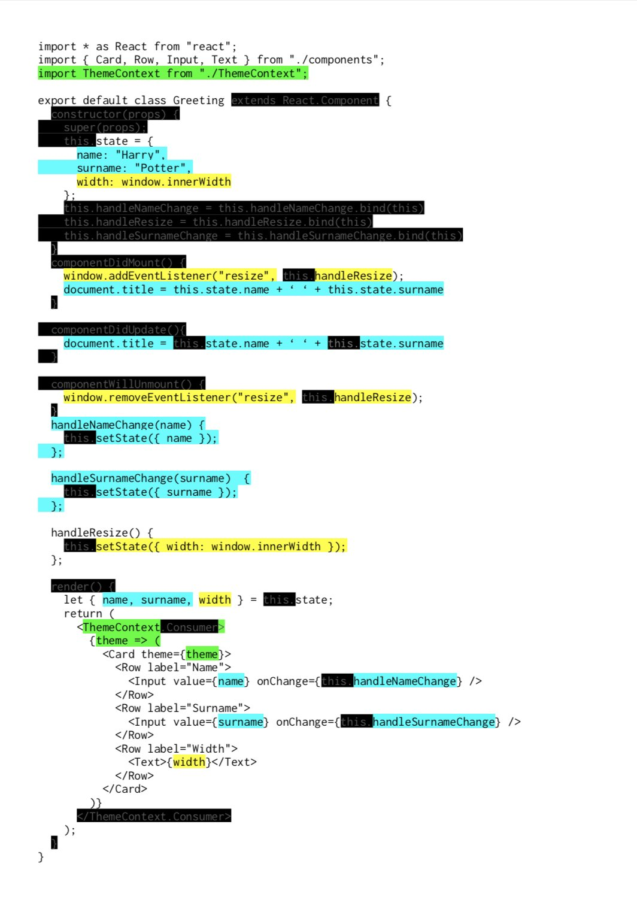

# Introduction to Hooks

**Hooks** is a completely new concept introduced in React **16.8.0**. So completely new that I would like to dedicate a separate chapter to **Hooks** in this book. Some of the React Core developers have already described it as the most exciting and fundamental change to React in recent years, and in fact **Hooks** caused a lot of excitement when they were announced at **React Conf 2018** and immediately introduced in the first Alpha version of React 16.7. In the meantime, other frameworks have also implemented their own **Hooks**. But what is it all about?

With **Hooks** it is possible for the first time to use mechanisms in **Function Components** that were previously only possible in class components. Features like `setState` or lifecycle methods, similar to `componentDidMount()` or `componentDidUpdate()`, are also possible in **Function Components** thanks to **Hooks**. **Hooks** are essentially nothing more than special functions that follow a fixed scheme. So there is the convention that **Hooks** have to start with `use`.

React itself provides a number of internal **Hooks** such as `useState`, `useEffect` or `useContext`, but also allows you to create your own hook functions, the so-called **Custom Hooks**, in which you can bundle your own logic. These also have to start with `use` by convention, furthermore the further naming is left to the developer himself, the name only has to be a valid JavaScript function name. For example `useAccountInfo` or `useDocumentInfo`.


Small personal anecdote on the side: the introduction of **Hooks** led to the fact that I had to reformulate large parts of this book and still have to reformulate further. For example, the official documentation mentioned **Stateless Functional Components** \(or **SFCs** for short\), the **Stateless** was deleted from the official documentation overnight with the introduction of **Hooks**, which I took as an opportunity to do the same in this book.


**Hooks were introduced against the background that for the first time they are intended to enable component logic to be shared between different components in a unified and React-defined form. Before** Hooks\*\* it often happened that different components implemented almost identical `componentDidMount()` or `componentDidUpdate()` methods; or that especially within a class component these two methods had an almost identical implementation, with the only difference that in `componentDidUpdate()` it was additionally checked whether certain parameters had changed. For example, whether a user ID passed via props has changed, whereupon an API request was initiated to retrieve the data for the respective user.

For this reason a new concept was introduced with the **Hooks**, with which complex logic can be written clearly more simply and without much duplicated code. In fact, once you're familiar with the way **class components** work, you'll need to rethink them. Since some processes and the structure of the components themselves change a bit, one finally only has to deal with relatively simple functions instead of complex classes with class methods, class properties, inheritance and a common `this` context. But we will come to the exact details later in this chapter.

## Are class components bad now?

The question remains to be resolved: _are class components now bad?_

This question came up again and again immediately after the announcement and introduction of **Hooks** in the React community. The React team responded that they would not recommend that an existing application that works with **class components** not be abruptly rewritten to **Function Components** with **Hooks** because **class components** will continue to be part of React.

The community didn't really care about that and so after the release of **React 16.7.0-alpha.0\*\***, the first version with **Hooks**, there were a lot of messages from developers on Twitter, who despite all warnings didn't let themselves be stopped from rewriting their applications with **Hooks** and who were mostly enthusiastic about the new simplicity of developing components without the overhead that class components brought with them.

So there's still nothing wrong with using class components, and if you like, you can still use them, since there are no plans to remove them from React at the moment. Once you have got used to using **Hooks**, however, you will find it difficult in most cases to voluntarily do without the simplicity and comprehensibility of this new form of component.

## Class components and hooks - a comparison

To illustrate how much simpler components can be by using **Hooks**, Sunil Pai, also a core developer of React, made a comparison where coherent logic was colored immediately and the parts no longer needed in the **Function Component** with **Hooks** were blackened in the Class component. The result is a very harmonious picture in which logic is bundled in one place and is not used in different places within the component:

Source: [Sunil Pai on Twitter](https://twitter.com/threepointone/status/1056594421079261185)

