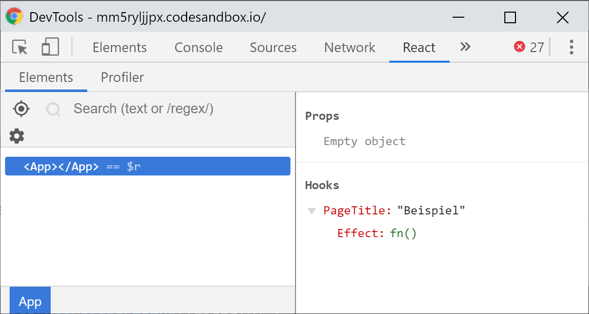

# Hooks API

In this chapter I want to summarize all the Hooks which are available to us internally and describe how and when they can be used. The official React documentation differentiates between three basic Hooks and seven additional Hooks. These additional Hooks are often used for very specific use cases \(such as performance optimizations\) or they are extensions of the basic Hooks.

The three **basic Hooks** which I mentioned briefly beforehand are:

- `useState`
- `useEffect`
- `useContext`

The **seven additional Hooks** are:

- `useReducer`
- `useCallback`
- `useMemo`
- `useRef`
- `useImperativeHandle`
- `useLayoutEffect`
- `useDebugValue`

## useState

```javascript
const [state, setState] = useState(initialState);
```

This Hook returns a **value** as well as a **function** to us, which we can use to update the **value**. During the first rendering of a component that uses this Hook, this value is equal to the `initialState` which you pass to the state. If the parameter that has been passed in is a function, it will use the return value of the function as its initial value.

When the update function is called, React ensures that the function always has the same **identity** and does not create a new function whenever the Hook is called. This is important as it reduces the number of renders and also means that we do not need to pass any other **dependencies** \(as is the case in `useEffect()` or `useCallback()`\).

`useState()` will return an **array** to us of which the first **value** always denotes the state and the second value is always a **function** which we use to update said **value**. Due to array destructuring, we are not limited in naming this value and function. However, conventions have developed that follow the pattern of `value / setValue`. For example, `user` and `setUser`. But of course you could also go for something along the lines of this: `changeUser` and `updateUserState`.

The mechanism of actually updating the state is very similar to that of `this.setState()` which we already encountered in the chapter on Class components. The function can either receive a **new value** which then replaces the current old value or we can pass an **updater function** to the the function. The updater function receives the previous value and uses the **return value** from the function as its new state.

But be careful: in contrast to `this.setState()`, objects are **not merged** with their previous state but the old state is completely **replaced** by the new state.

To illustrate this, let's have a look at the following example:

```jsx
import React, { useState, useEffect } from 'react';
import ReactDOM from 'react-dom';

class StateClass extends React.Component {
  state = { a: 1, b: 2 };

  componentDidMount() {
    this.setState({ c: 3 });
    this.setState(() => {
      return { d: 4 };
    });
  }

  render() {
    // { a: 1, b: 2, c: 3, d: 4 }
    return <pre>{JSON.stringify(this.state, null, 2)}</pre>;
  }
}

const StateHook = () => {
  const [example, setExample] = useState({ a: 1, b: 2 });

  useEffect(() => {
    setExample({ c: 3 });
    setExample(() => {
      return { d: 4 };
    });
  }, []);

  // { d: 4 }
  return <pre>{JSON.stringify(example, null, 2)}</pre>;
};

const App = () => {
  return (
    <>
      <StateClass />
      <StateHook />
    </>
  );
};

ReactDOM.render(<App />, document.getElementById('root'));
```

While `StateClass` collects and merges the data of all calls of `this.setState()`, the `setState()` function in the `StateHook` completely replaces the old value with the new one. In the **Class component,** the output returned to us will be `{a: 1, b: 2, c: 3, d: 4}` whereas the **Function component** containing the Hook will only return `{d: 4}` as this has been written into state last.

If the updater function returns the **exact same value** as the value currently in state, the state update is cancelled and no re-render or side-effects are triggered.

## useEffect

```javascript
useEffect(effectFunction, dependenciesArray);
```

This **Hook** is intended for **imperative side effects** such as API requests, timers or global event listeners. Normally, these **side effects** should be avoided in **Function components** as they can lead to unexpected behaviour or bugs that might be hard to solve for.

The `useEffect()` **Hook** combats this problem and allows for a _safe_ mechanism to use side effects within **Function components**.

The **Hook** expects a **function** as its first parameter and a **dependency array** as its second. The function is called **after** the component has rendered. If we have passed an **optional dependency array** to this Hook, the function we pass will only be executed if at least one of the values in the **dependency array** has changed. If an **empty dependency array** is passed, the function will only be run on the **first render** of the component - similar to the `componentDidMount()` lifecycle method which we learned about with Class components.

### Cleaning up side effects

Sometimes side effects leave "traces" that have to be cleaned up once a component is no longer in use. If for example you had intervals which you had started with `setInterval()`, these should be stopped with `clearTimeOut()` once the component has been removed. If left untreated, these side effects can lead to actual problems or even memory leaks.

Globally registered event listeners such as `resize` or `orientationchange` which have been added to the `window` object with `addEventListener()` should also be removed once the component unmounts by using `removeEventListener()` so they will not be executed anymore if the component itself is not even part of the component tree anymore.

In order to make this cleanup a bit more systematic and easier, we can return a **cleanup function** from the **effect function**. If an **effect function** returns a **cleanup function**, it is called before each call of the **effect function** with the exception of the very first call:

```javascript
import React, { useState, useEffect } from "react";
import ReactDOM from "react-dom";

const Clock = () => {
  const [time, setTime] = useState(new Date());

  useEffect(() => {
    const intervalId = setInterval(() => {
      setTime(new Date());
    }, 1000);
    return () => {
      clearInterval(intervalId);
    };
  }, []);

  return `${time.getHours()}:${time.getMinutes()}:${time.getSeconds()}`;
);

ReactDOM.render(<Clock />, document.getElementById("root"));
```

In the above example we have set up an interval that starts once the component **mounts**. Once the component **unmounts** we stop the timer as we would otherwise change the state of the component which is not part of the component tree anymore. If we tried to do this, React would inform us with a warning and suggest to **clean up** asynchronous tasks and subscriptions in a **cleanup function**:


Warning: We can't perform a React state update on an unmounted component. This is a no-op, but it indicates a memory leak in your application. To fix, cancel all subscriptions and asynchronous tasks in a useEffect cleanup function.


By returning a cleanup function from the **effect function** we can stop the interval with a call of `clearInterval()`. This happens before each call of the effect function, but at the very latest it would happen during unmounting.

### Conditional calls of the effect function

Normally the `useEffect()` Hook or its associated effect function is executed after each render of a component. This way, we ensure that the effect is executed each time once of its dependencies have changed. If we access state or props of a component within the effect function, the side effect should also be executed if one of the dependencies change. If we wanted to display profile data of a particular user and requested this data from an API, the API request should also be initiated if the user's profile that we want to look at changes while the component is already mounted.

However, this might lead to a lot of unnecessary calls of this function and it might even be executed if no data has actually changed since the last render \(which are relevant for the side effect\). This is why the React allows us to define a **dependency array** as a second parameter in the **effect function**. Only if one or more values in the **dependency array** have changed, the function will be called again. Let's put our previous example into a little code snippet:

```javascript
useEffect(() => {
  const user = api.getUser(props.username);
  setUser(user);
}, [props.username]);
```

In this example, we have put the username into the dependency array which we use to request data from the API.

While creating such a **dependency array**, we should take the utmost care to include all values that are present in the function and could change within the lifetime of the component. If the effect function should only be run once and perform a similar task such as `componentDidMount()`, we leave the **dependency array** empty.


In order to facilitate or automate the creation of **dependency arrays**, the `eslint-plugin-react-hooks` offers an `exhaustive-deps` rule which will automatically write dependencies used in the effect function into the **dependency array** or at least warn that they should be included. These could be run on _Format on Save_ or another similar editor configuration.

You can active it by setting `"exhaustive-deps": "warn"` in the`rules` block of the ESLint configuration.


### Sequence of operations

The **effect function** is called **asynchronously** with a little bit of delay after the **layout and paint phase** of the browser. For most side effects this should be sufficient. You might run into situations though in which it is necessary to to **synchronously** run side effects. For example, you might need to perform DOM mutations and a delay in execution would lead to an inconsistent user interface or jarring content on the screen.

To deal with these problems, React introduced the `useLayoutEffect()` Hook. It works almost identical to the `useEffect()` Hook: it expects an **effect function** which can also return a **cleanup function** and also contains a dependency array. This dependency array is identical to that of the regular `useEffect()` Hook. The difference in the two Hooks is that the `useLayoutEffect()` Hook is executed synchronously and run just after all DOM mutations have finished, as opposed to asynchronously as is the case in the regular `useEffect()` Hook.

`useLayoutEffect()` can read from the DOM and can also synchronously modify it **before** the browser will display these changes in its **paint phase**.

### Asynchronous effect functions

Even if **effect functions** can be run with delay, they are not allowed to be asynchronous by definition, and are not allowed to return a promise. If we tried to perform such an operation, React would give us the following warning:


Warning: An Effect function must not return anything besides a function, which is used for clean-up.

It looks like you wrote useEffect\(async \(\) =&gt; ...\) or returned a Promise. Instead, you may write an async function separately and then call it from inside the effect \[…\]

In the future, React will provide a more idiomatic solution for data fetching that doesn't involve writing effects manually.


In the above example, an **incorrect** `useEffect()` Hook could have looked like the following \(please don't do this\):

```javascript
useEffect(async () => {
  const response = await fetch('https://api.github.com/users/manuelbieh');
  const accountData = await response.json();
  setGitHubAccount(accountData);

  fetchGitHubAccount('manuelbieh');
}, []);
```

This is **not allowed** as the effect function is declared with the `async` keyword. So how would we go about solving this problem? There's a relatively simple solution to this problem. We move the asynchronous part of this function into its own asynchronous function **within the effect function** and then only call this function:

```jsx
import React, { useEffect, useState } from 'react';
import ReactDOM from 'react-dom';

const App = (props) => {
  const [gitHubAccount, setGitHubAccount] = useState();

  useEffect(() => {
    const fetchGitHubAccount = async () => {
      const response = await fetch(
        `https://api.github.com/users/${props.username}`
      );
      const accountData = await response.json();
      setGitHubAccount(accountData);
    };

    fetchGitHubAccount();
  }, [props.username]);

  if (!gitHubAccount) {
    return null;
  }

  return (
    <p>
      {gitHubAccount.name} has {gitHubAccount.public_repos} public repos
    </p>
  );
};

ReactDOM.render(<App username="manuelbieh" />, document.getElementById('root'));
```

In this case, the effect function itself is not asynchronous. The asynchronous functionality has been extracted into its own asynchronous function `fetchGitHubAccount()` which is defined **inside** of the `useEffect()` Hook.

The asynchronous function does not necessarily need to be defined **inside** of the effect function. But the effect function itself is not allowed to be asynchronous.

## useContext

```javascript
const myContextValue = useContext(MyContext);
```

This Hook only expects one parameter: a context type which we create by calling `React.createContext()`. It will then return the value of the next highest context provider in the component hierarchy.

The `useContext()` Hook acts like a context consumer component and causes a re-render of the **Function component** as soon as the value of the context in the provider element changes.

Using this Hook is optional and it is still possible to create Context consumers in **JSX** using **Function components**. However, the Hook is much more convenient and easier to read as no new hierarchical layer is created in the component tree.

## useReducer

```javascript
const [state, dispatch] = useReducer(reducerFunc, initialState, initFunc);
```

The `useReducer()` Hook is an alternative solution for `useState()` and allows us to manage more complex states. It is based on flux architecture in which a **reducer function** creates a new state by being passed the **last state** and a so-called **action**.

The **reducer function** is called by executing a **dispatch function** which in turn receives an **action**. The **action** is an object which always has a `type` property and often a `payload` property attached. From this **action** and the **previous state**, the **reducer function** can then create the **new state**. One could summarize this in the following form: `(oldState, action) => newState`.

Let us have a look at a simple example. We have developed a `Counter` component which can increment or decrement a counter by pressing a + and - button:

```jsx
import React, { useReducer } from 'react';
import ReactDOM from 'react-dom';

const initialState = {
  count: 0,
};

const reducerFunction = (state, action) => {
  switch (action.type) {
    case 'INCREMENT':
      return { count: state.count + 1 };
    case 'DECREMENT':
      return { count: state.count - 1 };
    default:
      throw new Error('Unknown action');
  }
};

const Counter = () => {
  const [state, dispatch] = useReducer(reducerFunction, initialState);

  return (
    <div>
      <h1>{state.count}</h1>
      <button onClick={() => dispatch({ type: 'INCREMENT' })}>+</button>
      <button onClick={() => dispatch({ type: 'DECREMENT' })}>-</button>
    </div>
  );
};

ReactDOM.render(<Counter />, document.getElementById('root'));
```

We have defined the initial State `initialState` and the reducer function `reducerFunction`. The initial state only consists of an object which holds a `count` property which is initially `0`. The reducer function on the other hand expects a `state` and an `action` which are later passed to the reducer function by calling the `dispatch` function. These two parameters will then create the **new** state. **But beware**: instead of mutating an existing state, we always have to create a new state! Otherwise mutations of the existing state will lead to side effects which are not intended and cause incorrect display of components. A **reducer** function should always be a **pure** function.

The **reducer function**, as well as the initial state, are then passed to the `useReducer()` Hook which will return a tuple. The tuple consists of two values: the first element will portray the **current state** in this particular rendering phase and the second value will be the so-called **dispatch** function.

If we want to change our current state, we call the `dispatch` function and pass this function an **action**. In our current example, we achieve this by clicking one of the two buttons which will either dispatch the `{ type: "INCREMENT" }` \(to increase the counter\) action or `{ type: "DECREMENT" }` \(to decrease the counter\) action/

If an action has been _"dispatched",_ a new state is created and React will trigger a re-render. The new state will now be accessible in the new `state` variable which was returned by the reducer function. If however the same state was returned from the **reducer**, no re-render will be triggered.

### The third parameter

Apart from the `reducer` function and `initialState` which we always need to specify, we can also pass a third optional parameter to the `useReducer()` Hook. This third parameter is called an `init` function which can be used to calculate the initial state. The function could be used to extract the value of a **reducer** in an external function which is outside of the reducer itself.

If such an `init` function has been passed to the Hook, it will be called during the **first** call. The `initialState` will be passed to it as its **initial argument**. This can be really useful if the **initial state** of your component is based on props for example. These props can be passed as the second parameter inside of the `init function` which can then create the initial state of the **reducer** based on these:

```jsx
import React, { useReducer } from 'react';
import ReactDOM from 'react-dom';

const reducerFunction = (state, action) => {
  switch (action.type) {
    case 'INCREMENT':
      return { count: state.count + 1 };
    case 'DECREMENT':
      return { count: state.count - 1 };
    default:
      throw new Error('Unknown action');
  }
};

const initFunction = (initValue) => {
  return { count: initValue };
};

const Counter = (props) => {
  const [state, dispatch] = useReducer(
    reducerFunction,
    props.startValue,
    initFunction
  );

  return (
    <div>
      <h1>{state.count}</h1>
      <button onClick={() => dispatch({ type: 'INCREMENT' })}>+</button>
      <button onClick={() => dispatch({ type: 'DECREMENT' })}>-</button>
    </div>
  );
};

ReactDOM.render(<Counter startValue={3} />, document.getElementById('root'));
```

In this example, the `useReducer()` Hook has been extended to include a third and optional parameter: the **init** function. The `initialState` is now an argument for the **init** function. The value for this argument is passed to the component via **props** — `startValue` in our case.

### Reducers in practice

The guiding principle of **reducers** should be known to those in the React community who have had exposure to **Redux**. **Redux** is a library that allows us to manage complex state in a comfortable manner and was the first point of call whenever handling local state became hard to read and cumbersome. It also created a solution for the so-called "prop drilling" which meant that previous props needed to be passed through multiple hierarchical layers.

**Redux** manages reducer functions and makes state and their dispatch functions available to those components which should read or modify the global state. The `useReducer()` Hook is React's custom solution to realize complex state management using reducer functions.

A common use case for reducers forms the management of API requests. Common conventions dictate that three actions for each API request should be defined:

- an action which informs the application that the data is loading when the request has started
- an action which resets the loading state and \(if the request has failed\) can inform the state of an error
- an action which writes the data received by the API request into state if it was successful

Let's have a look at an example using our previous account data example using the GitHub API:

```jsx
import React, { useEffect, useReducer } from 'react';
import ReactDOM from 'react-dom';

const initialState = {
  data: null,
  isLoading: false,
  isError: false,
  lastUpdated: null,
};

const accountReducer = (state, action) => {
  switch (action.type) {
    case 'REQUEST_START':
      return {
        ...state,
        isLoading: true,
      };
    case 'REQUEST_SUCCESS':
      return {
        ...state,
        data: action.payload,
        isLoading: false,
        isError: false,
        lastUpdated: action.meta.lastUpdated,
      };
    case 'REQUEST_ERROR':
      return {
        ...state,
        isLoading: false,
        isError: true,
      };
  }
};

const RepoInfo = (props) => {
  const [state, dispatch] = useReducer(accountReducer, initialState);

  useEffect(() => {
    const fetchGitHubAccount = async (username) => {
      try {
        dispatch({
          type: 'REQUEST_START',
        });
        const response = await fetch(
          `https://api.github.com/users/${username}`
        );

        const accountData = await response.json();
        dispatch({
          type: 'REQUEST_SUCCESS',
          payload: accountData,
          meta: {
            lastUpdated: new Date(),
          },
        });
      } catch (err) {
        dispatch({
          type: 'REQUEST_ERROR',
          error: true,
        });
      }
    };

    fetchGitHubAccount(props.username);
  }, [props.username]);

  if (state.isError) {
    return <p>An error occurred.</p>;
  }

  if (state.isLoading) {
    return <p>Loading...</p>;
  }

  if (!state.data) {
    return <p>No GitHub account has been loaded.</p>;
  }

  return (
    <p>
      {state.data.name} has {state.data.public_repos} public repositories.
    </p>
  );
};

ReactDOM.render(
  <RepoInfo username="manuelbieh" />,
  document.getElementById('root')
);
```

The `useReducer()` Hook is used and passed to the `accountReducer` function. In this function, we deal with the three **actions** of **type** `REQUEST_START`, `REQUEST_SUCCESS`, and `REQUEST_ERROR`.

The `initialState` consists of an object with an empty `data` property, an `isFetching` and `isError` flag and a `lastUpdated` property. The flags inform us whether the data has actually loaded or whether an error occurred whilst the `lastUpdated` property will store a timestamp of the last successful request. We can use these later to only use one request per minute or to signal to the user that they might be seeing data but that the interface has not changed for a while.

In addition, we use a `useEffect()` Hook to initiate loading the data once the GitHub username in the **props** changes. Once this has happened, we dispatch the `REQUEST_START` **action**. The reducer will then create the new state:

```diff
{
  data: null,
- isLoading: false,
+ isLoading: true,
  isError: false,
  lastUpdated: null,
}
```

As we have defined a condition a bit lower down in our component, we will now display the following:

```jsx
if (state.isLoading) {
  return <p>Loading...</p>;
}
```

This is a clear signal for the user that data is currently being loaded.

After this state, we can be left with one of the following cases: the request either fails, or data is successfully obtained from the API.

If the requests failed, the `REQUEST_ERROR` **action** would be dispatched. The state would be reflected as such:

```diff
{
  data: null,
- isLoading: true,
+ isLoading: false,
- isError: false,
+ isError: true,
  lastUpdated: null,
};
```

As no further request will be fired, the `isLoading` flag will be reset from `true` to `false` so as to not signal to the user that data might still be loading. When an error has occurred, the state of `isError` is set from `false` to `true`. The code snippet above also contains a condition to handle the state of an error, so we can display a message to the user:

```jsx
if (state.isError) {
  return <p>An error occurred.</p>;
}
```

It might be a good idea to tell the user which operation has failed and how they might be able to recover from the error. Maybe the provided username did not exist and we could offer an opportunity to the user to re-enter their username and correct their mistake. Another possibility could be that the API might not be available at the moment which could inform the user to try again at a later point of time.

If however the request was dealt with successfully and we could obtain data from the API, we dispatch the `REQUEST_SUCCESS` **action**. This not only contains a `payload` but also a `meta` property which includes the timestamp of the request.

The **new state** which is created by the **reducer** differs from the previous state in the following way:

```diff
{
- data: null,
+ data: {
+   "login": "manuelbieh",
+   "name": "Manuel Bieh",
+   "public_repos": 59,
+   [...]
+ },
- isLoading: true,
+ isLoading: false,
  isError: false,
- lastUpdated: null,
+ lastUpdated: "2019-03-19T02:29:10.756Z",
}
```

The `data` property contains the data which we have received from the API. The state of `isLoading` is set back to `false` and`lastUpdated` is updated to reflect the point in time when the data was successfully written to state. Based on this information, we can now display to the user:

```jsx
return (
  <p>
    {state.data.name} has {state.data.public_repos} public repositories.
  </p>
);
```

Apart from writing our first more complex reducer, we have also successfully learned about how `useEffect()` and `useReducer()` can be used together.

As an aside: Similar to the `useState()` Hook, the `useReducer()` Hook will not trigger another re-render if the reducer function returns the exact same state as before.

## useCallback

```javascript
const memoizedFunction = useCallback(callbackFunction, dependencyArray);
```

The `useCallback()` Hook can be used to optimize the performance of an application. It receives a function and then creates a **unique identity** of that function, which will remain active until the **dependencies** of the Hook itself change.

This is important as we need to provide the same reference to a function, when dealing with `PureComponents`, when functions implement their own `shouldComponentUpdate()` method or if they are wrapped by `React.memo()`.

`useCallback()` expects two parameters. The first being a function and the second being a dependency array \(similar to that in `useEffect()`\). It will return a **stable** reference to the function that we passed in, meaning that the reference only changes if one of its **dependencies** changed. Up to this point, references to `PureComponents` or components with `React.memo()` are the same.

But this sounds a little complicated in theory, let's look at an example:

```jsx
import React, { useState, useCallback } from 'react';
import ReactDOM from 'react-dom';

const FancyInput = React.memo(({ name, onChange }) => {
  console.log('Rendering FancyInput');
  return <input type="text" name={name} onChange={onChange} />;
});

const Form = () => {
  const [values, setValues] = useState({});

  const changeHandler = (e) => {
    const { name, value } = e.target;

    setValues((state) => {
      return {
        ...state,
        [name]: value,
      };
    });
  };

  return (
    <>
      <pre>{JSON.stringify(values, null, 2)}</pre>
      <FancyInput name="example" onChange={changeHandler} />
    </>
  );
};

ReactDOM.render(<Form />, document.getElementById('root'));
```

We have defined two components here: `FancyInput` and `Form`. The `Form` component renders a `FancyInput` component and not only passes it a `name` attribute but also a function. It will change the state of the `Form` component whenever changes are made to the input field and subsequently trigger a re-render.

The `changeHandler` function is created in the **form component** and is thus generated fresh with every render, meaning **the reference to the function changes**. We are passing the same function but not an identical one.

Thus, we cannot make use of the `React.memo()` optimization mechanism in `FancyInput.` `React.memo()` checks **before** each re-render of a component if its **props** changed compared to the previous render and will trigger a re-render if this is the case. As the `changeHandler` function is generated from scratch every time the `Form` component renders, this condition will always be true and the `FancyInput` will always re-render too.

We can use `useCallback()` to combat this. By wrapping our `changeHandler()` function in this Hook, React can create a **unique** and **stable** reference and can safely return it so it can be used in the `FancyInput` component without triggering unnecessary re-renders:

```jsx
const changeHandler = useCallback((e) => {
  const { name, value } = e.target;

  setValues((state) => {
    return {
      ...state,
      [name]: value,
    };
  });
}, []);
```

We can now use the the optimization techniques of `React.memo()` \(or in Class components: `PureComponent`\) without triggering unnecessary renders.

If the function depends on values which can change in the lifespan of the component, we can put these in the **dependency array** \(as was the case in `useEffect()`\) as the second parameter. React will then create a new function with a new reference, if one of the dependencies changes.


As was the case in the `useEffect()` Hook, the `exhaustive-deps` rule of the`eslint-plugin-react-hooks` can help us to configure **Dependency Arrays**.


## useMemo

```javascript
const memoizedValue = useMemo(valueGetterFunction, dependencyArray);
```

The other Hook that's useful for hardcore **performance optimization** is the `useMemo()` Hook. It works similarly to the `useCallback()` Hook, however it does not provide a unique identity for the function going in, but for the return value from the function which has been passed into the `useMemo()` Hook.

So this snippet of code:

```javascript
useCallback(fn, deps);
```

corresponds to this:

```javascript
useMemo(() => fn, deps);
```

While `useCallback()` returns a _memoized_ \(a "remembered"\) version of the **function that has been passed in**, `useMemo()` provides a _memoized_ version of the **return value** of the function that has been passed in. `useMemo()` can be really useful in situations where functions perform complex computational tasks that do not need to be executed in each render.

Let us have a look at a non-optimized component:

```jsx
import React, { useState, useMemo } from 'react';
import ReactDOM from 'react-dom';

const fibonacci = (num) =>
  num <= 1 ? 1 : fibonacci(num - 1) + fibonacci(num - 2);

const FibonacciNumber = ({ value }) => {
  const result = fibonacci(value);
  return (
    <p>
      {value}: {result}
    </p>
  );
};

const App = () => {
  const [values, setValues] = useState([]);

  const handleKeyUp = (e) => {
    const { key, target } = e;
    const { value } = target;
    if (key === 'Enter') {
      if (value > 40 || value < 1) {
        alert('Invalid value');
        return;
      }
      setValues((values) => values.concat(target.value));
    }
  };

  return (
    <>
      <input type="number" min={1} max={40} onKeyUp={handleKeyUp} />
      {values.map((value, i) => (
        <FibonacciNumber value={value} key={`${i}:${value}`} />
      ))}
    </>
  );
};

ReactDOM.render(<App />, document.getElementById('root'));
```

This app consists of an input field for numbers. If a number is entered and submitted with the **enter** key, the number is written into state within the `values` field. In this case, this state corresponds to an array which will hold all the numbers we have entered. The component will then iterate through all of the numbers entered and then renders a `FibonacciNumber` component which will receive each of these values.

The `FibonacciNumber` component will then calculate the corresponding Fibonacci number for the entered number and display it to the user. Depending on the number and computational power, it might take some time to calculate this number \(on my PC it took about 2-3 seconds for the 40th Fibonacci number\).

Currently, the calculation will happen **each** time **even if the number is already present** in the array. If I entered 40, I would have to wait 3 seconds to get a result. If I entered 40 again, I would need to wait 3 seconds again \(on top of the previous 3 seconds\) as the value is calculated in both components again.

We can use `useMemo()` to deal with such situations more efficiently. By changing the following line from

```javascript
const result = fibonacci(value);
```

to:

```javascript
const result = useMemo(() => fibonacci(value), [value]);
```

... we have created a _memoized_ value.

React will calculate this value during the **first render**, **remember** the value and will only re-calculate if the value of the `value` prop changes for this component. If the value or the **dependencies** do not change between the two renders, React will use the value of the previous calculation without actually performing the computation.

**But be careful**: This is all happening due to a **single** call of the `useMemo()` Hook. If I called the same function twice in two different `useMemo()` Hooks, the calculation would still be performed twice even if both functions use the same parameters. The second Hook will **not** use the result of the previous calculation.

## useRef

```javascript
const ref = useRef(initialValue);
```

`useRef()` is used to create **Refs** by using a dedicated Hook.

```jsx
import React, { useEffect, useRef } from 'react';
import ReactDOM from 'react-dom';

function App() {
  const inputRef = useRef();
  useEffect(() => {
    inputRef.current.focus();
  }, []);

  return <input ref={inputRef} />;
}

ReactDOM.render(<App />, document.getElementById('root'));
```

We are not usually doing this Hook enough justice: **refs** in **function components** also serve a different purpose: they allow us to create a **mutable reference** which will persist for the entire lifespan of the component \(meaning until it unmounts\). It can be compared to performing similar tasks as instance variables in class components.

`useRef()` takes in an optional initial value and returns an object with a `current` property which can then be accessed within the **function component**. This access is not limited to read access but also allows write access. If we wanted to provide data whose changes would not trigger a re-render but whose reference would stay the same between two rendering cycles, we can use the `useRef()` Hook.

## useLayoutEffect

I have briefly mentioned `useLayoutEffect()` when I presented `useEffect().` It follows a similar pattern as the `useEffect()` Hook but differs in the timing of its execution and its synchronous nature.

While `useEffect()` is executed with a little bit of delay **after** the **layout and paint** phase of the browser, `useLayoutEffect()` is executed **after layout** but **before paint**. This difference in timing allows `useLayoutEffect()` to read the current layout from the DOM and change it **before** it is being displayed in the browser.

This kind of behavior is similar to what was previously achieved by `componentDidMount()` or `componentDidUpdate()` in class components. Due to performance reasons however, it is advisable to use `useEffect()` in most cases and only use `useLayoutEffect()` if we know exactly what we are doing. `useLayoutEffect()` can also help if we are struggling to migrate **class components** to **function components** due to the different timings of the effects.

But be careful: neither `useEffect()` nor `useLayoutEffect()` will be executed server-side. While this does not pose a problem for `useEffect()` as it is only executed after the layout and painting phase of the browser, `useLayoutEffect()` might lead to differences in the server-side rendered markup compared to the initial client-side render. React will usually inform us of these differences and create a warning in the console. In these cases, `useEffect()` should be used instead or components using `useLayoutEffect()` should be mounted after the browser's paint phase.

```jsx
import React, { useState, useEffect } from 'react';
import ReactDOM from 'react-dom';

const App = () => {
  const [mountLayoutComp, setMountLayoutComp] = useState(false);

  useEffect(() => {
    setMountLayoutComp(true);
  }, []);

  return mountLayoutComp ? <ComponentWithLayoutEffect /> : null;
};

ReactDOM.render(<App />, document.getElementById('root'));
```

In this example, the component using `useLayoutEffect()` is only registered after the component is mounted. We achieve this by checking for the `mountLayoutComp` state after the first paint phase.

## useDebugValue

```javascript
useDebugValue(value);
```

This Hook \(`useDebugValue()`\) is purely for optimizing the developer's debugging experience. It does not create any real value in an application for the **end user**. `useDebugValue()` allows us to give custom Hooks a label which we can then inspect in the **React Dev tools**:

```jsx
import React, { useDebugValue, useEffect } from 'react';

const usePageTitle = (title) => {
  useDebugValue(title);
  useEffect(() => {
    document.title = title;
  }, [title]);
};

export default usePageTitle;
```

In this example, we have implemented a **Hook** to change the page title in the browser. In the Dev tools, we can see the following:



### Delayed formatting of the debug value

If you recall, I have just mentioned that `useDebugValue()` does not have any real positive implication for the end user. However, this does not mean that it does not influence the user experience of the user interface. Slow calculations to display the value of the debug value can indeed decrease the rendering performance of an application.

As this is not really desirable, it is possible to pass a second parameter to the `useDebugValue()` Hook: a formatting function. The formatting of the value is only executed, once the value is actually inspected in the Dev tools. Declaring the Hook could look like this:

```javascript
useDebugValue(value, (value) => formattedValue);
```

The Hook is passed a **debug value** as its first argument just as we have provided before. However, as the second argument it will not receive a function that will executed the formatting of the debug value. This function will receive the **value** from the **Hook** and will return the formatted value.

If you are looking for a clear if unrealistic example, I can provide another example using the Fibonacci function we have already seen in the `useMemo()` example. We are going to display the debug value once with, and once without the formatting function and inspect how the time to display the app changes:

```jsx
import React, { useDebugValue, useEffect } from 'react';
import ReactDOM from 'react-dom';

const fibonacci = (num) =>
  num <= 1 ? 1 : fibonacci(num - 1) + fibonacci(num - 2);

const useNumber = (number) => {
  useDebugValue(number, (number) => fibonacci(number));
  // without formatting function:
  // useDebugValue(fibonacci(number));
  useEffect(() => {});
  return number;
};

function App() {
  useNumber(41);
  return <p>Debug Value Formatting Function example</p>;
}

ReactDOM.render(<App />, document.getElementById('root'));
```

Using `useDebugValue()` without the formatting function does significantly increase the loading time of the app which affects the user experience for the end user.

## useImperativeHandle

```javascript
useImperativeHandle(ref, createHandle, [deps]);
```

I will be entirely honest with you all: I found it extremely difficult to construct a use case in which `useImperativeHandle()` will pose a useful solution to an encountered problem. Frustrated, I took to Twitter and crafted a post to ask for help. I was lucky enough to get an answer by Dan Abramov, core developer in the React team at Facebook, who informed me that I must be doing something right. This Hook should not be used and has a long name to dissuade people from using it. For matters of completion and for understanding why this Hook exists, I want to present it to you anyway.


I have spent a lot of time thinking about use cases worth of using the `useImperativeHandle()`. In most cases you should indeed explore other ways to express logic without the use of this Hook. The official React documentation also discourages anyone from using this Hook. As the name might suggest, it caters to imperative code and does not work well with the mostly declarative style that React openly advocates. However, there are situations in which one might need to work with classes and objects, especially when working with external libraries.

But be careful, examine the following example which illustrates the use of this **Hook**. We have created a `FancyForm` component which displays its **children** and offers a couple of methods which can be called in the parent component consuming them. In this example, we have implemented a method called `focusFirstInput` to be able to focus onto the first input in our `FancyForm` form. We furthermore extend the form with another method called `getFormValues` which allows us to return our data that we entered in JSON format. The form can be sent off programmatically and reset by passing the forwarded **forwardRef** the imperative methods `reset()` and `submit()` from the HTML `<form>` element.

```jsx
import React, { useImperativeHandle, useEffect, useRef } from 'react';
import ReactDOM from 'react-dom';

const FancyForm = React.forwardRef((props, forwardedRef) => {
  const formRef = useRef();

  useImperativeHandle(
    forwardedRef,
    () => ({
      focusFirstInput: () => {
        (formRef.current.querySelector('input') || {}).focus();
      },
      getFormValues: () => {
        return Array.from(new FormData(formRef.current)).reduce(
          (acc, [value, name]) => {
            acc[name] = value;
            return acc;
          },
          {}
        );
      },
      reset: () => formRef.current.reset(),
      submit: () => formRef.current.submit(),
    }),
    []
  );

  return <form ref={formRef}>{props.children}</form>;
});

const App = () => {
  const formRef = useRef();

  useEffect(() => {
    formRef.current.focusFirstInput();
  }, []);

  const submit = (e) => {
    e.preventDefault();
    console.log(formRef.current.getFormValues());
  };

  return (
    <FancyForm ref={formRef}>
      <p>
        <input type="text" name="name" placeholder="name" />
      </p>
      <p>
        <input type="email" name="email" placeholder="email" />
      </p>
      <input type="submit" onClick={submit} />
    </FancyForm>
  );
};

ReactDOM.render(<App />, document.getElementById('root'));
```
