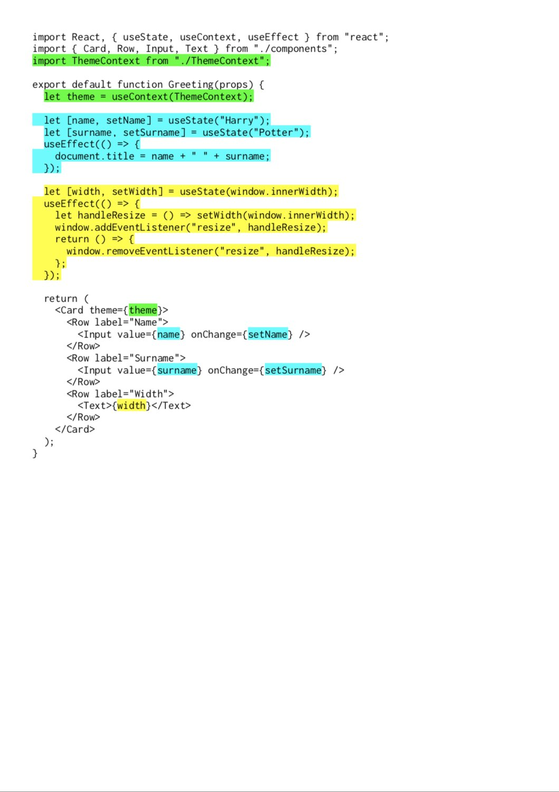

# Introduction to Hooks

**Hooks** are a completely new concept that has been introduced in React **16.8.0**. The concept of Hooks is so new and novel that I want to dedicate a full chapter to it. Many React Core Developers have already titled **Hooks** as one of the most exciting and fundamental shifts in React. Indeed, **Hooks** were making waves at **React Conf 2018** where they were first announced — before their introduction in the React 16.7 alpha release. Even other frameworks have followed suit and implemented their own version of **Hooks**. But what are Hooks exactly?

**Hooks** allow us to use certain mechanisms, that were only available to Class components in the past, in **Function components**. Features such as `setState` or lifecycle methods such as`componentDidMount()` or `componentDidUpdate()` that were reserved entirely for Class Components in the past, can now be used in **Function components** thanks to **Hooks**. Put simply, **Hooks** are nothing more than special functions that follow a pre-defined schema. One of them is the convention that the name of a **hook** has to start with `use`.

React offers a number of internal **Hooks** that are ready to use out of the box such as `useState`, `useEffect` or `useContext`. It also allows for the creation of **custom Hooks**: functions in which we can use our own logic. To follow the convention mentioned already, they also have to start with the `use` keyword but apart from that the developer can freely choose to give the hook any name they want as long as the name is also a valid JavaScript function name. Names such as `useAccountInfo` or `useDocumentInfo` are great examples.


A little personal anecdote: Since the introduction of **Hooks**, I have had to rewrite entire sections in the book and continually keep it up date to this day. In the past, the documentation has almost entirely focused on calling **Function components** - **Stateless Functional components** \(SFC for short\). This naming has disappeared immediately from the official React documentation since **Hooks** came to be, which is why I also removed this name from the book.


**Hooks** allow us to reuse component logic in a coherent manner. Before **Hooks**, many components often used identical `componentDidMount()` or `componentDidUpdate()` methods that followed the same implementation patterns with the difference of checking whether various parameters had changed during `componentDidUpdate()`. For example, whether a user ID \(which was passed via props\) had changed, which in turn initiated another API request.

**Hooks** were thus introduced with the aim to make it possible to easily share complex logic, without the need for writing a  lot of unnecessary duplicated code. But I will be honest with you, if you are comfortable with Class components and how they work, Hooks might force you to completely re-think how components can and should interact. Processes as well as the composition of the components themselves have changed. Where complex classes with class properties, inheritance and a mutual `this` context have prevailed in the past, **Hooks** replace these with relatively simple and clean functions. How this is achieved in detail, is what we are going to look at through the course of this chapter.

## Are class components still worth it?

Now we only have to answer the question: are class components still worth using?

This question came up again and again shortly after the announcement and introduction of **React Hooks**. The React Team has discouraged people from rewriting their existing applications which use classes at the moment into **Function components** using **Hooks**. Classes will remain part of React.

The community did not really take this advice to heart. Many developers started rewriting entire applications after **React 16.7.0-alpha** \(the first version containing **Hooks**\), announcing on Twitter how excited they were about the simplicity **Hooks** have introduced for their development and the reduced overhead from not having to use Class components.

Of course you can continue to use Class components for as long as they continue to be supported. There are no plans to remove them from React either. Once you have started getting used to writing components with React **Hooks** however, it will be tough to trade the simplicity and increased understanding of this new style for Class components.

## Class Components vs Hooks - a comparison

In order to demonstrate just how much simpler a component definition can be by using Hooks, Sunil Pai \(one of the React Core Team developers\) created an example in which he compares a Class component with a **Function component** using **Hooks**. Logic that is shared between the two is colored in the same color in both examples, and logic from the class component that is no longer needed has been blacked out. The result below is rather interesting, and demonstrates clearly how the information is more concise in the version using Hooks, and not as dispersed as it is in the class component:

Source: [Sunil Pai on Twitter](https://twitter.com/threepointone/status/1056594421079261185)

