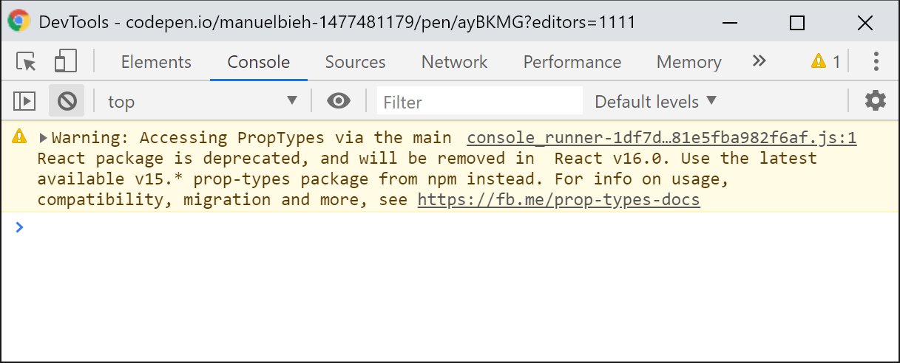

# General

## What React is and what it is not

Let's cite the React documentation at this point that has summarized it nicely:

> \[React is\] a library for building user interfaces.

Even if this explanation might seem a little short, we can deduce a few key points from it in order to understand React better. In the first instance, React is just a _library,_ not a framework. It does not boast with an abundance of in-built functions with which we can create complex web applications with ease. The second part of the sentence is equally important: _for building user interfaces._

Strictly speaking, React is just a **library** that makes it easy to develop **user interfaces**. There are no services or methods to make API calls or built-in models or ORM. React is only concerned with user interfaces. One could say, it is the view layer in our application. And that's it! In this context, we occasionally read that React can be thought of the "V" in **MVC** \(Model-View-Controller\) or **MVVM** \(Model-View-ViewModel\). This is a pretty good explanation in my eyes.

React offers a declarative way to model state, state here referring to the state of the user interface itself. Put simply, this means that we declare in our code how our user interface should look given each state of the component. Let's look at a simple example to illustrate this: If a user is logged in, show the dashboard. If they are not, show the login form.

The logic itself is found in the JavaScript part of the application \(where it should live anyway\) and not in templates, as opposed to many other web frameworks who mix the two. This sounds complicated at first, but it will become clearer soon what this means.

React is **component-based**. We write **encapsulated, Functional components** that can be composed together at will and reused at our leisure. Extending or inheriting components is possible in theory, but rather uncommon in the world of React. Rather than working with _inheritance_, React encourages _composition_, the act of combining multiple components into a "whole".

Does this mean that we cannot build complex web applications with React? No. Absolutely not. React boasts a large, high quality and very active ecosystem of libraries that, in turn is based on, extends, or complements React in such a way that it does not need to hide behind large scale frameworks like Ember or Angular. Quite the opposite actually. Once we have entered the React ecosystem and gained a first impression, we quickly find a number of really good tools and libraries with which we can build professional, super individual and highly complex applications.

## When should I use React and when is it best to avoid it?

The more React gained in popularity, the more the question arose whether jQuery's days were numbered. Should we develop everything in React now? Is it useful to use React or maybe not so much?

As mentioned previously, React is primarily a _library for building user interfaces._ User Interfaces always contain interaction which mandates the usage of state management. For example, I am pressing a button and a dropdown opens. The state of the dropdown changes from _closed_ to _open_. Or, I could enter information into a form input and receive feedback whether the data I entered is correct. If it is not valid, the state of the form input will change from _valid_ to _invalid_. React is great at modelling these changes. If I do not have a large amount of changing data or user interactions on my page \(for example if am developing a static website for a client\), I _probably_ do not need React.

In the wrong context, React can cause more harm than good. If we put more focus on the content of our page and have not pre-rendered our components on the server, search engines could have difficulty processing our page. Thankfully, React is making it easy for us to do server-side rendering with our components, so we can often neglect this concern.

If we have a large amount of interaction and changing data on our site, React will save us time and energy. The more interaction we have on our site and the more complex it is, the more we will benefit from using React. The best example here is a **Single Page Application** _\(SPA\)_ that is only visited and initialized once by the browser and where each subsequent interaction and communication with the server is processed over fetch requests or XHR \(more commonly known as "AJAX-Requests"\).

Only a little while ago, I had to build a signup form which initially seemed simple enough. I started out without using React but quickly regretted my decision as the complexity grew and more interaction was needed to increase usability. Implementing live-validation of form data and separating the signup process into two steps is no easy feat, which quickly drove me back to using React. Managing these different states and **imperative** changes of the interface manually would have been too much to handle without it.

Imperative refers to instructing the browser precisely what it should do. _Declarative_ code on the other hand \(which we write with React\) defines the end-goal based on our current state which is one of the fundamental principles of React. Instead of saying: "I am now logged in, dear browser, please proceed to hide the login form and show me the dashboard", we can define two views: "This is what the interface looks like when I am logged in" \(dashboard view\) and "this is what it looks like if I am not \(login view\)". React decides which of these views to show based on the current state of our component.

## How did React come into existence?

React was originally created at **Facebook** and open sourced under a BSD-Licence in 2013. Following some public protest though, the license was changed to MIT. Given Facebook's involvement in React's creation, it is no surprise that a large chunk of Facebook's code is also based on React. An estimated amount of around **50.000** components is currently in use in Facebook's products, a number so great that it is easy to understand that Facebook has a high interest to maintain the technology it's based upon and come up with ideas to ensure its continuous development. So for anyone worried about using React in their own projects, you need not worry about React becoming unmaintained anytime soon.

The core engineers on the React Team do a great job to get the community involved with React's development early on. A call for [React RFC](https://github.com/reactjs/rfcs) \(_"Request for Comments"_\) means that developers and interested parties can discuss changes early on in a designated GitHub repository and also enables users to bounce around ideas with the React team themselves.

While maintaining and developing React, the core engineers are ensuring that **breaking changes** follow a clear **deprecation schema**. Breaking changes in this instance refer to changes in the codebase that are **not backwards compatible**. Any methods, properties or functions that are due to be deprecated will be flagged with a visible and easy-to-notice **deprecation warning**. They furthermore provide a tool to safely amend old code with the new changes, called [React-Codemod](https://github.com/reactjs/react-codemod), which follows strict Semver conventions.

For a release, this can have a number of implications. Only _major releases_ will involve breaking changes, i.e \(`16.x.x` to `17.x.x`\) , whereas a _minor release_ will only contain new features or deprecation warnings \(for example `16.6.x` to `16.7.x`\). A minor release can safely prepare and inform developers to upgrade their existing code. Bug fixes will be dealt with in a so-called _patch release_, denoted by only bumping the version from `16.8.0` to `16.8.1.`

For the curious among us, there's the possibility to inspect soon-to-be released features for major and minor releases by checking out Alpha, Beta and RC- \(_"Release Candidate"_\) versions. However, these features are subject to changes and we should be careful when implementing them.

While this is useful for React's user base, one can assume that it is in Facebook's own interest to not cause problems by unplanned changes — given that they have a large number of React components in their own codebase. However, transparency is always a given and you can follow along on GitHub's issue tracker where all important changes are neatly summarized in so-called [Umbrella-Tickets](https://github.com/facebook/react/issues?utf8=%E2%9C%93&q=is%3Aissue%20is%3Aopen%20umbrella).

