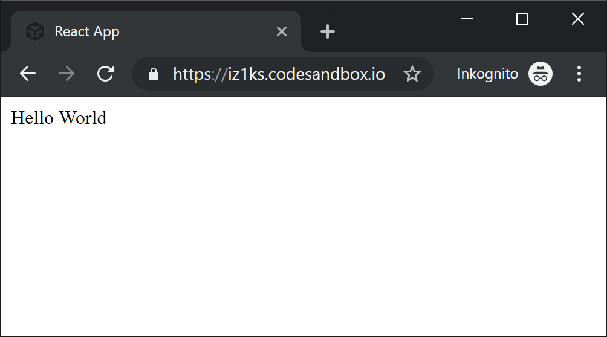
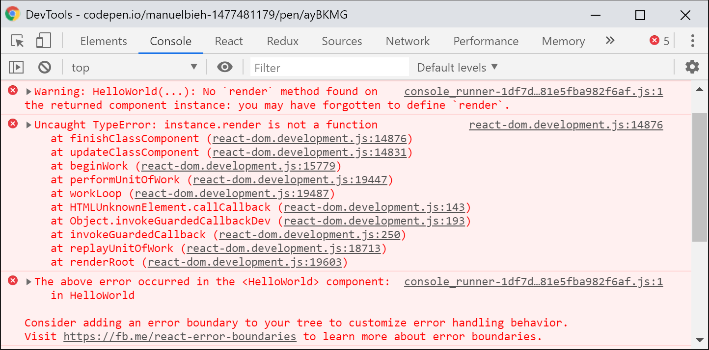
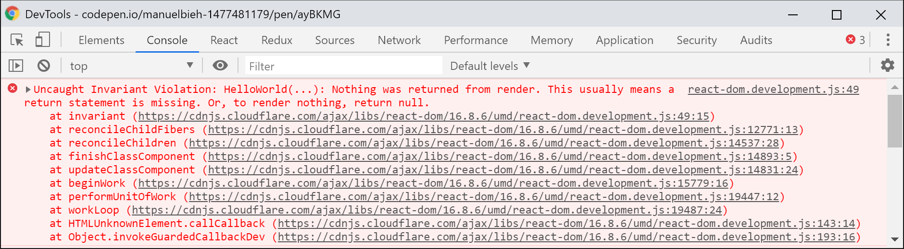

# Off to the deep end

Now we already had the "what," the "when," and the "where." So let's get to the "How" and write our first small **React component**. In addition to **React** itself we also need the package **ReactDOM,** to be able to _mount_ our application, i.e. to make it usable in the browser, for the output of our app in the browser.

A very minimalistic setup to get started quickly with React looks like this:

```markup
<!DOCTYPE html>
<html>
<head>
<meta charset="UTF-8" />
<title>Hello React!</title>
</head>
<body>
<div id="root"></div>
<script crossorigin src="_COPY9@16.8.4/umd/react.development.js"></script>
<script crossorigin src="_COPY1@16.8.4/umd/react-dom.development.js"></script>
<script>
// Placeholder for our first component
</script>
</body>
</html>
```

So we create the basic framework for an ordinary HTML document and load **React** and **ReactDOM** in the latest stable version from the unpkg-CDN, which are then available as global variables in the `window` object under `window.React` and `window.ReactDOM`. Otherwise we see here for the time being only an empty page with a \(still empty\) `<div id="root"></div>`. We use this div as a so-called **mount node** to display our first react component.


If there are several React components in the game, you usually talk about a **App**, **WebApp** or **Single Page App**. However, the boundaries from when a _component_ is called _App_ are fluid. Some developers even talk about a **App** for a single component. There is no fixed definition for this.


Let's start with the usual "Hello World" example and set the script to the place where the placeholder is at the top:

```javascript
class HelloWorld extends React.Component {
  render() {
    return React.createElement(
      div, 
      { id: 'hello-world' }, 
      Hello World.
    );
  }
}

ReactDOM.render(
  React.createElement(HelloWorld), 
  document.getElementById('root')
);
```

And so we have already implemented the first simple React component! If we now set this code in place of our placeholder from the previous code snippet, we see the following output in the browser:



Doesn't look that complicated for now, does it? Let's go through the code step by step. I have highlighted the relevant places in the code in bold.

```jsx
class HelloWorld
```

This is where we give the child his name. Our component in this case has the name **HelloWorld**. There are basically no limits to the imagination when it comes to naming, but beware: React components must always begin with a capital letter! So helloWorld would not be a valid name for a component, but HELLOWORLD would be \(although very unusual\).

The common way of naming components follows the **UpperCamelCase** form. Even longer, self-explanatory names are not uncommon. Thus, a name like **UserNotificationView** would not be exotic for a component.

```jsx
extends React.Component
```

Here we finally extend the react internal class `React.Component`, whereby our class becomes first of all a component, which we can use in React. In addition to the `React.Component` there is also the `React.PureComponent` as a component class, as well as a second form, the so-called _Function Component_. This is just a JavaScript function that follows a certain pattern. Both will be discussed in detail later on and are less important at this point for a basic understanding.

```jsx
render()
```

Our component only consists of the only mandatory component of a component, the `render()` method. This tells React how to render the component \(i.e. _"rendered"_\). A component must have a `return` value. This can either be an explicit `null` to deliberately not display anything \(but not `undefined`!\), a **React element** or from version 16 also a **String** or **Array**.

In the case of an array, this may contain strings, numbers, react elements or also `zero` as values. The `render()`-method is used to describe **deklaratively** the state of our interface. Everything we return from it via `return` shows us React as output in the browser during rendering.

Even if you are of course completely free in the design of your JavaScript classes and this is therefore not absolutely necessary, the `render()` method is usually defined as the last method of a component for the sake of clarity. For example, AirBnB's code guidelines, whose developers are very active in the React scene, specify or at least recommend it, as do many other well-known developers. From my own experience I can say that it makes daily work with React much easier to follow this recommendation**.**.





```jsx
React.createElement()
```

As mentioned, the `render()` method of a React**\*\* component** returns a React **element** in most cases. React **elements** are the smallest but at the same time the essential building blocks in a React application and describe what the user ultimately sees on his screen. Besides `React.cloneElement()` and `React.isValidElement()`, `React.createElement()` was one of only 3 top-level API methods for a long time. In the meantime, a few more have been added, but they primarily serve to optimize performance.

The `createElement()-`method expects 1-n parameters:

1st "type", that can be HTML elements as string, e.g. `'div'`, `'span'` or `'p'` but also other React components 2. so-called "props", in the basic sense these are write-protected \(_readonly_\) "property objects" of a component. Derived from the engl. _Properties_ eben. 3. as well as any number of child elements, which themselves can be react elements, arrays, functions or simple text. However, a component does not necessarily have to have child elements.

Finally, a **React element** under the hood is nothing more than an immutable \(_immutable_\) JavaScript object describing properties that tell React how something \(and what\) should be represented. React uses this description to create a virtual image of the component hierarchy. This represents a representation of the HTML tree in the form of a JavaScript object and is sometimes referred to as a Virtual DOM, even though the React team has rather refrained from using this name again. This tree is then used by React to update only those parts of an application that have actually been changed when the user interacts with the application, modifies data, or triggers events, if possible. Roughly speaking, the previous tree is compared with the current tree.

Because React does not simply rewrite the entire application into the DOM every time the state is changed, which would be very costly from a performance point of view, but compares what has been changed by means of a process called **Reconciliation** \, thus reducing write operations to a minimum, React achieves an enormous speed advantage over other frameworks and libraries that perform many unnecessary DOM mutations.

In our daily work, however, we will usually never call `React.createElement()` in this form, since **JSX**, a Facebook-developed syntax extension for JavaScript, will relieve us of this work and make it much easier. Nevertheless I consider it important to know about their existence in order to understand how **JSX** works in the background and to exclude possible sources of error.

**JSX** looks like HTML or XML/XHTML at first glance, but with a significantly extended range of functions and the possibility to use JavaScript expressions in it. JSX is an abstraction to make the way you create React elements **easier** for the developer. So our example above would be:

```jsx
React.createElement('div', {id: 'hello-world'}, 'Hello World');
```

in JSX can simply be written as follows:

```jsx
<div id="hello-world">Hello World</div>
```

What for many newcomers to React seems strange at first - I've read the beautiful term **JSX Shock** in this context - turns out to be incredibly practical after a bit of playing around and is in my opinion one of the main reasons why React has gained so much popularity in such a short time.

Back to the essential: Our component is told via the `return` value of the `render()` method that it should represent an element of type `div` with the id `hello-world` and the child element \(in this case a text node\) with the content `Hallo World`.

```jsx
ReactDOM.render(Element, Container)
```

Last but not least, the second library `ReactDOM` comes into play. **ReactDOM** is responsible for the interaction of React with the DOM \(_Document Object Model_\), i.e. superficially expressed: the **Web-Browser**. Like React itself, **ReactDOM** has very few top-level API methods. For now, we will concentrate on the `render()` method, which is the heart of **ReactDOM** in the browser.

In spite of the name equivalence, this has nothing to do directly with the method within React components, but serves only to render a **React element** into a specified **"Root-Node "**, i.e. to display it bluntly. In our case our `HelloWorld` component is rendered into the `<div id="root"></div>` here. The root node is **not replaced**, but the component is **inside the container**.

So **ReactDOM** makes sure that **dom** we can see the given component in the browser for the first time. **What** we see there we have previously described in the `render()` method of the component using the specified react element as the `return` value. When `ReactDOM.render()` is called, the **React element** specified as the first parameter is rendered into the **Container** specified as the second parameter.


When the `ReactDOM.render()` function is called for the first time, any existing content of the target container is replaced by the content determined by React. For each additional call, React uses an internal comparison algorithm for the best possible efficiency to avoid completely re-rendering the entire application!

In practice, however, this is less relevant as the function`ReactDOM.render()` is usually only executed once when creating single page apps, usually when loading a page. React never changes the target container itself, but only its contents. If the container element has its own attributes such as classes, IDs or data attributes, these are retained even after the call to `ReactDOM.render()`.


This explains the general functional principle of React, our first component is implemented and can be seen in the browser!

