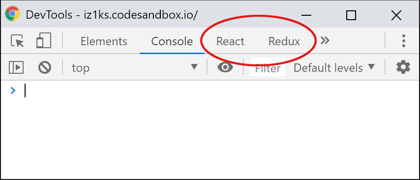

# Tools and Setup

## Tools

In order to work with React comfortably and without interruptions, a few conditions should be met. Installing these tools is not entirely necessary but it does make your development workflow much easier. My suggestion would be to install all the tools and I will assume in the following that you have done so.

### Node.js and npm

Most of you will now **Node.js** as server-side JavaScript, however this is only partly true. First of all, **Node.js** is a **JavaScript Runtime Environment** that is very well suited to write network applications, such as server. **Node.js** also comes with a package management tool though, commonly known as **npm**. It enables us to easily install new JavaScript libraries on our own machines and also lets us write and and run our own command line scripts. 

Instead of installing **Node** directly, I suggest to use [**nvm**](https://github.com/creationix/nvm) \(_"Node Version Manager"_\) for Mac or Linux and [**nvm-windows**](https://github.com/coreybutler/nvm-windows) for Windows. One of **nvm**'s advantages is that it does not require root privileges to install packages globally. Moreover, you can update your installed node version with a simple command line expression \(`nvm install [version]`\). If you want to see the list of all available versions, you can run `nvm ls-remote` \(Max/Linux\) or `nvm list available` \(Windows\). I will suggest in the rest of the book, to use the LTS \(Long Term Support\) version as its stable and will receive updates over a longer time frame.

### Yarn

While **Node** and **npm** already offer a very solid package manager, **yarn** takes it a little bit further and offers better caching, thus better performance and has easier commands. Similarly to React, **yarn** was created at Facebook to make the work with React yet a little nicer. Everything that I am going to describe in the rest of the book will also work seamlessly with **npm** but I would still suggest to install **yarn** instead. Especially in the React ecosystem, it's gaining popularity due to its ease of use and its better performance compared to **npm**. Once **Node** and **npm** have been installed, **yarn** can be added as a global package via **npm**: 

```bash
npm install --global yarn
```

Or in short:

```bash
npm i -g yarn
```

Just like that we have installed our first package. Easy! The so-called command line flags `--global` and `-g` make sure that the `yarn` executable is installed globally and can be called from the command line anywhere on your machine by typing `yarn` .

### Babel

Babel is usually only used as a dependency in React based projects, namely as a npm package. It does not need to be installed explicitly at this stage. Babel allows us to interpret and then _transpile_ JavaScript that is not or not yet conforming to standards or not supported by all modern browsers into code that can be executed without issues..


**Transpiling** __is the process of transforming the source code of one language into a functional and identical piece of code in another language. In our case, that's transforming JSX or ES2015+ into valid and executable JavaScript that is understood by all browsers.


Babel consists of a core module \(`@babel/core`\) that offers a few APIs that can then be used by p**lugins** for each respective transpilation process. Those plugins are often grouped together by so-called **presets**. Presets can in turn many **plugins** at once. In React, the most common presets are `@babel/preset-react`and `@babel/present-env`. The former is used to read and translate **JSX** and the latter which transforms modern JavaScript based on its destination environment and translates it into something that even older browsers can understand.

The `@` sign in the name indicates that the package originates from an organization within the npm registry \(the npm package registry\) and can been understood as some sort of a namespace. In the case of Babel, you can find all of its official packages in the organization that have been published there by the Babel maintainers. Before Babel version 7 was released, this organization did not exist yet and the packages were simply separated by hyphens. `@babel/preset-react` was called `babel-preset-react` and `@babel/core` was named `babel-core` and so on.

So do not be confused if you encounter `babel-core` instead of `@babel/core` in a project. In this case you simply deal with an older version of Babel \(6 or below\). However, sometimes you might come across plugins or presets that are not officially part of Babel, but the developer has still prefixed the package with `babel-`  although it works with Babel 7. In this case, you can only really check the readme of the package to understand what is going on.

The **presets** that I have used in my work with React \(and which I also suggest you should use are\):

* `@babel/preset-env`
* `@babel/preset-react`
* `@babel/plugin-proposal-object-rest-spread`
* `@babel/plugin-proposal-class-properties`
* `@babel/plugin-syntax-dynamic-import`

If you want to work with static type checking like Flow or TypeScript, you also need to install `@babel/preset-flow` and `@babel/preset-typescript` respectively. 

You can install these via:

```bash
npm install --save-dev [paket]
```

or:

```bash
yarn add --dev [paket]
```

The `--dev` flag indicates that we are only dealing with a `devDependency`, meaning that it is only relevant for our development and that it should not be included in production code.

### Webpack

**Webpack** is one of the most central tools in the React ecosystem. Without it, an efficient workflow with React is almost impossible or at least a lot harder to achieve. **Webpack** is a module-bundler that has brought module based development \(that you might know from Node.js\) to the browser. It enables us to structure our application code neatly in their own files and allows us to use their dependencies via `import` or `require()` . This way, the dependencies are loaded into their own **module scope** and this make it available within the module. In the end, only a single JavaScript file is produced \(if you want, you can tell Webpack to produce more\), avoiding to single-handedly import each and every JavaScript file in a `<script src="..."></script>` in the HTML. Without bundling, we would otherwise need to import up to 100 scripts manually.

Wow. That sounds complicated, but after a few examples it almost happens intuitively and on its own. Once you get used to it, you ask yourself how you could ever work without a module-bundler.

But **Webpack** can be used for much more than module-bundling. It can also be taught to transpile files with JSX into JavaScript with Babel, it can copy images, stylesheets and other assets into a `build` folder that can then be deployed on the server. There are a lot of other things Webpack can do, but we are going to investigate this deeper at a later point and show what such a configuration could look like.  Thus, we will not look at the Webpack command line tools at this stage.

### ESLint

ESLint is a very practical tool for static code analysis. It helps us to spot errors in our code but it can also be used to enforce consistent rules for code style or to give helpful tips on how to optimize your code during development. ESLint titles itself a "pluggable linting utility" which promises to place most value on extensibility. You can find a number of useful plugins for different tools, runtime environments and frameworks.

In most professional contexts as well as many open source projects, an ESLint config has become the de-facto standard. In React projects, you will likely see `eslint-plugin-react`, `eslint-plugin-babel` and `eslint-plugin-react-hooks` which have proven themselves to be a solid choice for the development flow.

Your editor of choice will reveal easy to spot error messages to you in those places where the code apparently does not work as intended:


### Prettier

Some love it, some hate it. The latter often only hate it for a short amount of time. Once you have seen the value this tool can bring, you do not want to miss it anymore and ask yourself how you could ever work without it. I felt the same back in the day as did my colleagues that I have worked with in the past.

**Prettier** is a tool that can automatically format your code according to pre-defined set of rules - neatly and consistently. You can either run it on the command line or you can install the **Prettier** plugin that is available for most editors and IDEs. **Prettier** does not offer many options to format on purpose. This keeps the number of unfruitful discussions on how best to format your code to a minimum and also avoids the additional discussion which **Prettier** option would be best.

In the beginning, it might feel alienating to some and you might not always agree with **Prettier** 100%. However, not having to bother about where to place a line break and which line of code should be indented reduces the cognitive overload immensely. In my eyes, this justifies the use of **Prettier** manifold.

### IDE-/Editor Plugins

All the common editors \(but many smaller ones too\) such as Webstorm, Atom, Visual Studio Code or Sublime offer plugins or natively integrated functionality to support working with **React** and **JSX**. I strongly suggest that you install these plugins as they normally lead to better syntax highlighting, code completion and boast with other nice features on top.

**Atom** offers [language-babel](https://atom.io/packages/language-babel), **VS Code** has [Babel ES6/ES7](https://marketplace.visualstudio.com/items?itemName=dzannotti.vscode-babel-coloring) and for **Sublime** users it is worth to check out ****[babel-sublime](https://github.com/babel/babel-sublime). If you are using **Webstorm**, you get automatiuc support for React syntax highlighting from version 10 onwards. The previously mentioned plugins for **ESLint** and **Prettier** are also very useful. Search the plugin manager of your editor of choice for ESLint or Prettier and select the plugin with the most installations. This plugin is usually the official ESLint or Prettier plugin.  ****

### Browser Plugins

Concerning your browser, I urge you to install the **React Dev Tools** for [Chrome](https://chrome.google.com/webstore/detail/react-developer-tools/fmkadmapgofadopljbjfkapdkoienihi) ****and [Firefox](https://addons.mozilla.org/de/firefox/addon/react-devtools/) as well as the **Redux Dev Tools** for later use \([Chrome](https://chrome.google.com/webstore/detail/redux-devtools/lmhkpmbekcpmknklioeibfkpmmfibljd), [Firefox](https://addons.mozilla.org/de/firefox/addon/remotedev/?)\). These dev tools neatly integrate with your already existing dev tools and will appear as a separate tab in the browser. They offer great advantages during your development.



Using these tools, you can manipulate state and watch it change directly in the browser. I would almost argue that efficient debugging is close to impossible without these dev tools plugins.

## Zero Config Setup

Some people have joked in the past that you can easily spend days plugging away at your setup and perfecting it before you actually write any lines of code. A solid setup is important and somewhat decides whether the quality and maintenance of your application will continue to exist in the future.

However, the React community has done a lot of work for us already. The site JavaScriptStuff contains a grand total of **198 projects** for [**React Starter Projects**](https://www.javascriptstuff.com/react-starter-projects/). Facebook itself also offers a starter, or more concretely **Dan Abramov** who is part of the React core team and creator of Redux, named **Create React App** \(or _"CRA"_ for short\). The project has surpassed 45.000 stars on GitHub and has become the standard for React projects. **Create React App** is described on GitHub as:

> Create React apps with no build configuration

And this is true. **Create React App** makes it easy to create a robust and good setup with only a single command on the command line, especially for beginners:

```bash
yarn create react-app projectname
```

If you prefer using npm, you still need to enter two commands:

```bash
npm install -g create-react-app
```

... which will install the **Create React App** executable globally and then:

```bash
create-react-app projectname
```

And just like that you have created a complete React setup with only a few little example components in your _"projectname"_ folder. I would advise you to go ahead and execute the last few steps right now because the following code examples will all assume that you have setup **Create React App** to interact with the code.


The project name has to fit the[ critiria for the `name`property](https://docs.npmjs.com/files/package.json#name) for the `package.json` format of **npm**.  This means that it is **not allowed to contain capital letters**, it can have **no spaces** and can only amount **up to 214 characters max**. The other criteria can be found in the **npm** documentation.


This setup is quite extensive and has dealt with many aspects beforehand, so we do not need to spend as much time with the setup and can dive into the code directly.

Once CRA has created the basic setup and has installed all the relevant dependencies, it will give us a prompt on the command line as to how we can work with CRA in our first React project.

```bash
$ create-react-app foobar

Creating a new React app in /home/manuel/my-react-app.

Installing packages. This might take a couple of minutes.
Installing react, react-dom, and react-scripts...

Success! Created foobar at /home/manuel/my-react-app
Inside that directory, you can run several commands:

  yarn start
    Starts the development server.

  yarn build
    Bundles the app into static files for production.

  yarn test
    Starts the test runner.

  yarn eject
    Removes this tool and copies build dependencies, configuration files
    and scripts into the app directory. If you do this, you can’t go back!

We suggest that you begin by typing:

  cd my-react-app
  yarn start

Happy hacking!
```

### yarn start

This command starts the development server, which lets us see our newly created application in the browser. The dev server is also taking care of files which are changing in the different directories and "compiles" our app and its dependencies again if we have made changes. 

### yarn build

Creates a build folder of our app which we can then deploy to a public server. Compared to the development build \(`yarn start`\), this build is optimized for performance. Due to this, running `yarn build` takes much longer than running `yarn start`. 

### yarn test

Runs tests. CRA comes pre-installed with **Jest**, another tool developed at Facebook. In comparison to other testing frameworks, it also allows for s**napshot testing**, that is creating some form of a copy of the current state of your component and compares it with future test states. This way, changes - wanted or unwanted - are detected easily right from the get go.

### yarn eject

Using `yarn eject`, we can bid our app goodbye. All the build scripts, dependencies and config files are copied to our current project directory. From this point onward, it is _our_ responsibility to ensure that everything is working as intended. While we have more responsibility, we also gain more freedom as we can now make changes to the standard configuration of CRA. When and if this step ever needs taken in the first place depends on the project. I have been working on projects where I have used the CRA standard setups for months but also worked on others where I needed to eject much earlier \(days or weeks\) as I needed to make changes to setup.


In order to understand all the code examples in the book, I strongly suggest to install **Create React App** at this stage. Most of the examples can then be copy and pasted into the `App.js` file and then transferred and run. To maximize your learning though, I would advise you to type out the examples though instead of simply copying them.

If you do not want to install CRA locally or if you are in a hurry, you can try working with [CodeSandbox](https://codesandbox.io/). It allows you to create a new[ setup with **Create React App**](https://codesandbox.io/s/new) ****in seconds and then interact with it in a browser environment.


