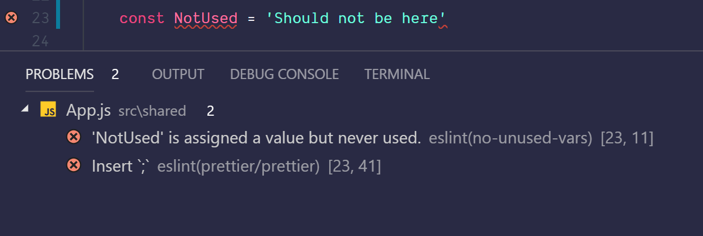

# Tools and Setup

## Tools

In order to be able to work with React smoothly and comfortably, some conditions should be fulfilled. Not all of it is **compulsively** necessary, but it makes the developer's life much easier, which is why I still **strongly** recommend it and will assume that you have installed these tools in all of the following examples:

### Node.js and npm

Most people will probably know **Node.js** as **server-side JavaScript**, but that's not the whole truth. First and foremost, **Node.js** is a **JavaScript runtime environment**, which is excellent for network applications, i.e. classic web servers. In addition, **Node.js** also comes with a package management tool, namely **npm**, with which you can easily install new JavaScript libraries on your own computer. You can also write and execute your own command line scripts.

Instead of installing **Node** directly, I recommend [**nvm**](https://github.com/creationix/nvm) \(_"Node Version Manager"_\) for Mac and Linux or [**nvm-windows**](https://github.com/coreybutler/nvm-windows) for Windows. **Nvm** has the advantage that on the one hand it does not need admin rights to install packages globally and on the other hand you can update the version installed on the system with a simple command on the command line \(`nvm install [version]`\). For a list of all available versions you can easily use `nvm ls-remote` \(Mac/Linux\) or `nvm list available` \(Windows\). I recommend in the further course of this book to use the current LTS \(Long Term Support\) version. LTS versions are stable versions, which also receive longer time updates.

### Yarn

While **Node** already has a good and solid package manager with **npm**, **yarn** goes one step further. It offers better caching, therefore also better performance, simpler commands and comes beyond that, like React, also from Facebook and was developed there, among other things, to make working with React even more pleasant. While everything described here in the rest of the book can be done with **npm**, I would still recommend installing **Yarn**. This is gaining more and more weight in the React environment, especially because of its simplicity and improved performance compared to **npm**.   
Once **Node** and **npm** are installed, **yarn** can be installed as a global package via **npm**:

```bash
npm install --global yarn
```

or just short:

```bash
npm i -g yarn
```

We also just installed our first package. Easy! The command line flag `--global` \(or `-g`\) ensures that the `yarn` executable is installed globally and can be executed from anywhere on your device on the command line by typing `yarn` on the command line.

### Babel

Babel is a tool that is usually only used as Dependency \, more precisely, as an npm package in React-based projects, and does not need to be explicitly installed at this point. Babel allows you to _transpil_ JavaScript code into interpretable and executable code that is not or not yet _standard-compliant or not yet supported by all common browsers.


**Transpiling** \(engl. _transpiling_\) is a process in which the source code of one language is converted into a corresponding functionally identical counterpart of another language. In our case, JSX or ES2015+ in valid, executable JavaScript supported by the browser.


Babel consists of a core module \(`@babel/core`\) that merely provides some APIs that are then used by **Plugins** for the corresponding **Transpiling**. These plugins are often combined to so-called **Presets**, which in turn install several **Plugins** at the same time. The most common presets in React-based projects are `@babel/preset-react` \(for reading and translating **JSX**\) and `@babel/preset-env`, which, depending on the target environment, paraphrases modern JavaScript so that older browsers also understand it.

The `@` sign in front of the name means that it is an organization within the npm registry \(the npm package directory\) and can be considered a kind of namespace. In the case of Babel, you will find the official packages published there by the Babel maintainers. Before Babel 7 was released, this organization did not exist and the packages were separated by a hyphen in the name. So `@babel/preset-react` was `babel-preset-react`, `@babel/core` was `babel-core` and so on. 

So don't get confused, you should encounter `babel-core` instead of `@babel/core` in a project. So in this case it is simply Babel 6 \(or an older version\). However, it occasionally happens that developers whose plugins or presets are not an official part of Babel prefix them with `babel-` as well, while the packages still work with Babel 7. Usually, only a look at the readme of the respective package will help here.

The **presets** I use when working with React are \(and at the same time recommend\):

* `@babel/preset-env`
* `@babel/preset-react`
* ¶ `@babel/plugin-proposal-object-rest-spread` 
* ¶ ¶@babel/plugin-proposal-class-properties ¶ 
* ¶ ¶ @babel/plugin-syntax-dynamic-import ¶ 

Who wants to work with Flow or TypeScript as static Type Checkers needs `@babel/preset-flow` for Flow or `@babel/preset-typescript` for TypeScript. 

All mentioned packages will be installed via:

```bash
npm install --save-dev [package]
```

or

```bash
yarn add --dev [package]
```

The `--dev` flag indicates that this is a `devDependency`, i.e. it is only relevant for development and should not be part of the production code.

### Webpack

**Webpack** is also one of the central tools in the React ecosystem, without which efficient working with React would hardly be possible or at least much more complicated. This is a so-called **Module-Bundler**, which brings module-based development into the browser, as some may already know it from NodeJS. This makes it possible to distribute application code clearly in individual files, which load their dependencies via `import` or `require()` into their own **Module-Scope** and thus make them available within the module. At the end only a single JavaScript file will fall out \(if desired also several\\), so that not every single one of our components, and this can quickly become over 100, has to be integrated into the HTML individually via `<script src="..."></script>`.

Wow. Wow. It sounds incredibly complicated, but after a few examples it happens almost intuitively by itself and once you get used to it, you will wonder how you could ever work without Module-Bundler.

Besides the module bundling itself **Webpack** can also be taught to transpose files with JSX through Babel into JavaScript, to copy images, stylesheets or other assets into a `build` folder that will later be deployed to a server and many other things. How such a configuration can look like will be explained later, why the Webpack command line tool does not have to be installed at this point.

### ESLint

**ESLint** is a very practical tool for static code analysis. It should primarily be used to detect errors in the program code, but can also be used to enforce consistent rules in the code style, for example, or to give the developer hints for optimization options during development. ESLint describes itself as a "pluggable linting utility", so it promises to attach particular importance to extensibility. And so there are indeed all kinds of useful plugins for various tools, runtime environments and frameworks.

In the professional environment, but also in most open source projects, an ESLint configuration is now common and indispensable. In React projects, the ESLint plugins `eslint-plugin-react`, `eslint-plugin-babel` and `eslint-plugin-react-hooks` in particular have proven to be a solid basis.

When setting up appropriate IDE plugins, clearly visible warnings appear at those points where the code apparently does not run according to the defined rules:



### Prettier

Some love it, others hate it. The latter usually only for a short moment, because once the true value of this tool has been recognized, you never want to miss it again and wonder how you could ever work without it. This is how I personally felt and how many other colleagues I have worked with in the past.

**Prettier** is a tool to automatically format code cleanly and consistently according to certain rules. It can be executed on the command line and installed as a plugin in all common editors and IDEs. The tool deliberately offers as few options as possible in order not to steer the numerous unwanted discussions about how code should be formatted in the direction of discussing which **Prettier** options should be used.

It may take some getting used to in the beginning and even if you work with **Prettier** for a longer time you won't always agree 100% with the way **Prettier** formats certain parts of the code, but it releases so much cognitive energy \(because you don't have to worry about where to make a break and which line should be indented how far to make the code more readable\) that it makes it absolutely worth it in my eyes and justifies its use.

### IDE/Editor plugins

All known editors and IDEs such as Webstorm, Atom, Visual Studio Code or Sublime \(but also pretty much any other modern editor or IDE\) offer plugins or even already natively integrated functions for better support of **React** and **JSX**. Here I strongly recommend the installation of these plugins, as they usually provide a much better syntax highlighting and partly offer code completion and other nice features. 

In **Atom** this is about [language-babel](https://atom.io/packages/language-babel), in **VS Code** there is [Babel ES6/ES7](https://marketplace.visualstudio.com/items?itemName=dzannotti.vscode-babel-coloring) and in **Sublime** it's worth looking at [babel-sublime](https://github.com/babel/babel-sublime). If you use **Webstorm**, you have native support for React syntax highlighting since version 10. Also plugins for the **ESLint** or **Prettier** mentioned above are very useful. To do this, simply search for ESLint or Prettier in the plugin manager of your IDE or editor and select the plugin with the most installations. This is usually the official ESLint or Prettier plugin.

### Browser plugins

For the browser I strongly recommend to install the **React-Devtools** for [Chrome](https://chrome.google.com/webstore/detail/react-developer-tools/fmkadmapgofadopljbjfkapdkoienihi) and [Firefox](https://addons.mozilla.org/de/firefox/addon/react-devtools/) respectively, for the later course also the **Redux-Devtools** for both browsers \([Chrome](https://chrome.google.com/webstore/detail/redux-devtools/lmhkpmbekcpmknklioeibfkpmmfibljd), [Firefox](https://addons.mozilla.org/de/firefox/addon/remotedev/?)\). The Devtools fit seamlessly into existing browser devtools as a new tab and provide tremendous value when debugging React components.


For example, the state can be manipulated directly in the browser and the effects can be observed live. I would go so far as to say that without the Devtools extensions, efficient debugging is hardly possible, if at all.

## Zero Config Setup

Some people have joked in the past that you can spend days setting up a setup before writing the first line of code. And indeed: a proper setup is important, as it also determines to a certain extent the quality and maintainability of the application, which you develop on the basis of your setup.

Here, however, the large React community has already done very good preparatory work. And so the page JavaScriptStuff aktuell lists **198 projects** in the category [**React Starter Projects**](https://www.javascriptstuff.com/react-starter-projects/). Facebook itself, or specifically **Dan Abramov**, core developer on Facebook and author of **Redux**, is also represented there with **Create React App** \(_"CRA"_\). With over 45,000 stars on GitHub, the project has become the de facto standard when it comes to React Starter projects and describes itself on GitHub itself:

> Create React apps with no build configuration

And indeed, **Create React App** makes it very easy for beginners \(but not just this\) to create a very robust and good setup with just one command on the command line:

```bash
yarn create react-app project name
```

If you prefer npm instead, you have to execute two commands at the moment:

```bash
npm install -g create-react-app
```

... to install the **Create React App** Executable globally and then

```bash
create-react-app project name
```

And already in the folder "_projectname_" a complete React-Setup with some small example components is created. I would recommend to do this directly now, because the first code examples will all be based on an ordinary CRA setup at the beginning and can be tried out quite easily.


The project name must have the [Criteria for the `name` property](https://docs.npmjs.com/files/package.json#name) of the `package.json` format of **npm**. This means, among some other criteria, that it may contain **only lower case letters**, **no spaces**, and **a maximum of 214 characters**. The complete criteria can be found in the **npm-**documentation


This setup is already very extensive and covers many topics, so we don't have to deal with the setup as much and can dive directly into the code.

After CRA has created the basic setup and installed its package dependencies \(_Dependencies_\), it gives us a short guide on how to work with CRA on our first React project.

```bash
$ create-react-app foobar

Creating a new React app in /home/manuel/my-react-app.

Installing packages. This might take a couple of minutes.
Installing react, react-dom, and react-scripts...

Success! Created foobar at /home/manuel/my-react-app
Inside that directory, you can run several commands:

  yarn start
    Starts the development server.

  yarn build
    Bundles the app into static files for production.

  yarn test
    Starts the test runner.

  yarn eject
    Removes this tool and copies build dependencies, configuration files
    and scripts into the app directory. If you do this, you can't go back!

We suggest that you begin by typing:

  cd my-react-app
  yarn start

Happy hacking!
```

### yarn start

With this we start a development server, which we can use to call our newly created app in the browser. He also takes care of monitoring all files in the folder and recompiling our app with all its dependencies as soon as we make a change to one of the files.

### yarn build

Creates a build of our app, which we can deploy to a public server. This build is optimized for performance compared to the \(`yarn start`\) development build, so running `yarn build` usually takes much longer than running `yarn start`.

### yarn test

Runs tests. As a test framework, CRA brings along the **Jest**, also developed by Facebook. From my point of view, Jest has a very decisive advantage over other testing frameworks, namely the so-called **Snapshot-Testing,** where a kind of _image_ of the current state of a component is created, which represents the status quo and is compared with future test states. So changes, both desired and unwanted, immediately catch the eye.

### yarn eject

With `yarn eject` we can say goodbye to Create React App. All build scripts, dependencies and config files are copied into the current project directory and we are responsible for ensuring that everything runs correctly. This gives us more responsibility, but also significantly more freedom, as we can now make our own changes to the standard configuration of CRA. When and whether this step will ever be necessary depends entirely on the project. I myself have been working with the CRA standard setup in projects for months, in other projects it has already occurred after a few days or weeks that changes have to be made to the setup, so that an eject was made quite early.


To follow the code examples in this book, I recommend to install **Create React App**. The vast majority of examples can then be copied and pasted into the `App.js` file from Create React App and executed. In order to increase the learning effect, I would even recommend not copying the examples, but actually typing them in.

If you don't want to install CRA or are in a hurry, [CodeSandbox](https://codesandbox.io/) is recommended. Here you can create a new setup with Create React App as base and then try it out in a browser development environment.


